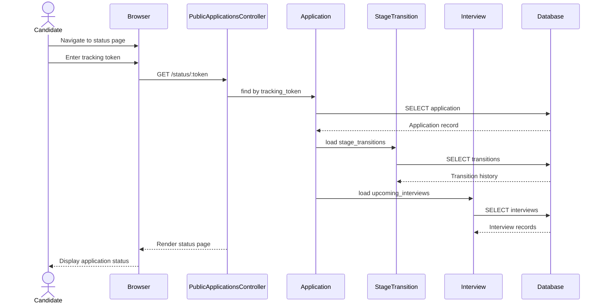

# UC-405: Check Application Status

## Metadata

| Attribute | Value |
|-----------|-------|
| **ID** | UC-405 |
| **Name** | Check Application Status |
| **Functional Area** | Career Site & Portal |
| **Primary Actor** | Candidate (ACT-07) |
| **Priority** | P1 |
| **Complexity** | Low |
| **Status** | Draft |

## Description

A candidate checks the current status of their job application(s). The system supports two access methods: (1) using a tracking token received after application submission (no login required), or (2) via the authenticated candidate portal to view all applications. The status shows the current pipeline stage and application timeline.

## Actors

| Actor | Role in Use Case |
|-------|------------------|
| Candidate (ACT-07) | Views application status and progress |

## Preconditions

- [ ] Candidate has submitted at least one application
- [ ] For token-based: Valid tracking token
- [ ] For portal-based: Authenticated CandidateAccount

## Postconditions

### Success
- [ ] Current application stage displayed
- [ ] Application timeline shown (stage transitions)
- [ ] Upcoming interviews displayed (if any)
- [ ] Job details accessible

### Failure
- [ ] Invalid token shows error message
- [ ] Expired token offers re-lookup options
- [ ] Application not found shown appropriately

## Triggers

- Candidate clicks "Check Status" link from confirmation email
- Candidate enters tracking token on status lookup page
- Candidate logs into portal and views dashboard
- Candidate clicks application from portal list

## Basic Flow



| Step | Actor | Action | System Response |
|------|-------|--------|-----------------|
| 1 | Candidate | Navigates to status lookup | Form displayed |
| 2 | Candidate | Enters tracking token | Token captured |
| 3 | Candidate | Clicks "Check Status" | Request submitted |
| 4 | System | Validates tracking token | Token format valid |
| 5 | System | Looks up application | By tracking token |
| 6 | System | Loads current stage | Stage name and info |
| 7 | System | Loads stage transitions | Timeline history |
| 8 | System | Loads upcoming interviews | If scheduled |
| 9 | System | Renders status page | Full status displayed |
| 10 | Candidate | Views application status | Sees current progress |

## Alternative Flows

### AF-1: Portal Dashboard View

**Trigger:** Candidate accesses via authenticated portal

| Step | Actor | Action | System Response |
|------|-------|--------|-----------------|
| 1a | Candidate | Logs into portal | Session authenticated |
| 1b | System | Loads dashboard | Shows all applications |
| 2a | Candidate | Clicks application | Selects specific app |
| 4a | System | Uses candidate_id | No token needed |

**Resumption:** Continues at step 5

### AF-2: Email Link Access

**Trigger:** Candidate clicks link from confirmation email

| Step | Actor | Action | System Response |
|------|-------|--------|-----------------|
| 1a | Candidate | Clicks email link | Token in URL |
| 2a | System | Extracts token from URL | Auto-filled |
| 3a | System | Automatically loads | No form submission |

**Resumption:** Continues at step 4

### AF-3: Multiple Applications

**Trigger:** Candidate has applied to multiple jobs

| Step | Actor | Action | System Response |
|------|-------|--------|-----------------|
| 1b | System | Loads all applications | List displayed |
| 1c | Candidate | Views application list | Summary cards shown |
| 1d | Candidate | Selects application | Clicks to view detail |

**Resumption:** Continues at step 5

### AF-4: Lookup by Email

**Trigger:** Candidate does not have tracking token

| Step | Actor | Action | System Response |
|------|-------|--------|-----------------|
| 2a | Candidate | Clicks "Forgot token" | Email form shown |
| 2b | Candidate | Enters email address | Email captured |
| 2c | System | Sends status email | Token link sent |
| 2d | Candidate | Clicks email link | Token-based access |

**Resumption:** Returns to step 1 with token

## Exception Flows

### EF-1: Invalid Token

**Trigger:** Token does not match any application

| Step | Actor | Action | System Response |
|------|-------|--------|-----------------|
| 5.1 | System | Token lookup fails | No match found |
| 5.2 | System | Shows error message | "Application not found" |
| 5.3 | System | Offers alternatives | Email lookup, contact info |

**Resolution:** Candidate tries alternative method

### EF-2: Malformed Token

**Trigger:** Token format is invalid

| Step | Actor | Action | System Response |
|------|-------|--------|-----------------|
| 4.1 | System | Validates token format | Invalid format |
| 4.2 | System | Shows error | "Invalid tracking code" |
| 4.3 | System | Suggests checking email | For correct token |

**Resolution:** Candidate verifies token

### EF-3: Session Expired (Portal)

**Trigger:** Portal session has timed out

| Step | Actor | Action | System Response |
|------|-------|--------|-----------------|
| 1.1 | System | Checks authentication | Session invalid |
| 1.2 | System | Redirects to login | Login form shown |
| 1.3 | Candidate | Re-authenticates | Session restored |

**Resolution:** Returns to step 1a

## Business Rules

| ID | Rule | Description |
|----|------|-------------|
| BR-405.1 | Token Access | Valid token provides read-only access |
| BR-405.2 | Portal Access | Authenticated users see all their applications |
| BR-405.3 | Stage Visibility | Only candidate-visible stages shown |
| BR-405.4 | Timeline Limited | Internal notes not shown to candidates |
| BR-405.5 | Interview Details | Only confirmed interviews shown |
| BR-405.6 | No Sensitive Data | Internal ratings/scores not exposed |

## Data Requirements

### Input Data

| Field | Type | Required | Validation |
|-------|------|----------|------------|
| tracking_token | string | Yes* | Valid token format |
| candidate_account_id | integer | Yes* | Authenticated session |

*One method required

### Output Data

| Field | Type | Description |
|-------|------|-------------|
| application.status | string | active/rejected/withdrawn/hired |
| application.current_stage | object | Stage name and position |
| application.applied_at | datetime | Application date |
| application.job | object | Job title and details |
| stage_transitions | array | Timeline of stage changes |
| interviews | array | Upcoming interview details |

## Database Transactions

### Tables Affected

| Table | Operation | Conditions |
|-------|-----------|------------|
| applications | READ | By token or candidate_id |
| stage_transitions | READ | For timeline |
| stages | READ | For stage names |
| interviews | READ | Upcoming only |
| jobs | READ | Job details |

### Query Detail

```sql
-- Token-based lookup
SELECT a.*, j.title, j.location, s.name as stage_name
FROM applications a
JOIN jobs j ON j.id = a.job_id
JOIN stages s ON s.id = a.current_stage_id
WHERE a.tracking_token = @token;

-- Load stage transitions
SELECT st.*,
       fs.name as from_stage_name,
       ts.name as to_stage_name
FROM stage_transitions st
LEFT JOIN stages fs ON fs.id = st.from_stage_id
JOIN stages ts ON ts.id = st.to_stage_id
WHERE st.application_id = @app_id
ORDER BY st.created_at ASC;

-- Load upcoming interviews
SELECT i.*, j.title as job_title
FROM interviews i
JOIN applications a ON a.id = i.application_id
JOIN jobs j ON j.id = a.job_id
WHERE a.id = @app_id
  AND i.scheduled_at > NOW()
  AND i.status IN ('scheduled', 'confirmed')
ORDER BY i.scheduled_at ASC;
```

### Rollback Scenarios

| Scenario | Rollback Action |
|----------|-----------------|
| N/A | Read-only operation, no rollback needed |

## UI/UX Requirements

### Screen/Component

- **Location:** /applications/status (lookup), /portal/applications (dashboard)
- **Entry Point:** Email link, status lookup form, portal dashboard
- **Key Elements:**
  - Current stage indicator (progress bar)
  - Application timeline
  - Job summary card
  - Upcoming interviews section
  - Status badge (active/rejected/etc.)

### Token Lookup Form

```
+----------------------------------------------------------+
| [Logo]                                                    |
+----------------------------------------------------------+
|                                                          |
|              Check Your Application Status                |
|                                                          |
| Enter your tracking code from the confirmation email.    |
|                                                          |
| Tracking Code                                             |
| [________________________]                                |
|                                                          |
| [           Check Status                                ] |
|                                                          |
| -------------------------------------------------------- |
| Don't have your tracking code?                           |
| [Look up by email] | [Sign in to portal]                |
|                                                          |
+----------------------------------------------------------+
```

### Application Status Page

```
+----------------------------------------------------------+
| [Logo]                                                    |
+----------------------------------------------------------+
| < Back to all applications (if portal)                   |
+----------------------------------------------------------+
|                                                          |
| Senior Software Engineer                                  |
| San Francisco, CA | Engineering                          |
| Applied: January 15, 2026                                |
|                                                          |
| Current Status: [ACTIVE - In Review]                     |
|                                                          |
+----------------------------------------------------------+
| Your Progress                                             |
| -------------------------------------------------------- |
| [Applied] -------- [In Review] -------- [Interview]     |
|    *                    *                    o           |
|                                                          |
| Timeline:                                                |
| Jan 15 - Application received                            |
| Jan 17 - Moved to In Review                              |
|                                                          |
+----------------------------------------------------------+
| Upcoming Interviews                                       |
| -------------------------------------------------------- |
| +----------------------------------------------------+  |
| | Technical Interview                                 |  |
| | January 25, 2026 at 2:00 PM PST                    |  |
| | Video Call via Zoom                                 |  |
| | [View Details]                                      |  |
| +----------------------------------------------------+  |
|                                                          |
+----------------------------------------------------------+
| Questions?                                                |
| Contact our recruiting team at recruiting@acme.com       |
+----------------------------------------------------------+
```

### Portal Dashboard

```
+----------------------------------------------------------+
| [Logo]                    [Profile] [Sign Out]            |
+----------------------------------------------------------+
| Welcome back, John!                                       |
+----------------------------------------------------------+
| Your Applications (2)                                     |
| -------------------------------------------------------- |
| +------------------------------------------------------+ |
| | Senior Software Engineer                   [ACTIVE]  | |
| | ACME Corp | San Francisco | Applied Jan 15           | |
| | Current Stage: In Review                             | |
| | [View Details]                                       | |
| +------------------------------------------------------+ |
| +------------------------------------------------------+ |
| | Product Manager                          [REJECTED]  | |
| | ACME Corp | Remote | Applied Jan 10                 | |
| | Status: Not selected                                 | |
| | [View Details]                                       | |
| +------------------------------------------------------+ |
|                                                          |
| Upcoming Interviews                                       |
| -------------------------------------------------------- |
| Technical Interview | Jan 25 at 2:00 PM | [Prepare]      |
|                                                          |
+----------------------------------------------------------+
```

## Non-Functional Requirements

| Requirement | Target |
|-------------|--------|
| Page Load Time | < 2 seconds |
| Token Lookup Time | < 500ms |
| Mobile Support | Fully responsive |
| Accessibility | WCAG 2.1 AA |

## Security Considerations

- [x] Token provides limited read-only access
- [x] No sensitive internal data exposed
- [x] Rate limiting on token lookups
- [x] Portal requires authentication
- [x] Session management for portal
- [ ] Token rotation not required (one-time use acceptable)

## Related Use Cases

| Use Case | Relationship |
|----------|--------------|
| UC-403 Apply for Job | Generates tracking token |
| UC-404 Create Candidate Account | Enables portal access |
| UC-406 Update Profile | Available from portal |
| UC-407 Upload Documents | Available from portal |

---

## Data Model References

> Cross-references to [DATA_MODEL.md](../DATA_MODEL.md) and [CRUD_MATRIX.md](../CRUD_MATRIX.md)

### Subject Areas

| Subject Area | ID | Relationship |
|--------------|-----|--------------|
| Career Site | SA-12 | Primary |
| Application Pipeline | SA-05 | Primary |
| Interview | SA-06 | Reference |

### Entities CRUD

| Entity | C | R | U | D | Notes |
|--------|---|---|---|---|-------|
| Application | | X | | | Read status and details |
| StageTransition | | X | | | Read for timeline |
| Stage | | X | | | Read stage names |
| Interview | | X | | | Read upcoming interviews |
| Job | | X | | | Read job details |
| Candidate | | X | | | Read for portal display |

**Legend:** C = Create, R = Read, U = Update, D = Delete

---

## Process Model References

> Cross-references to [PROCESS_MODEL.md](../PROCESS_MODEL.md) and [PROCESS_CRUD_MATRIX.md](../PROCESS_CRUD_MATRIX.md)

| Attribute | Value | Link |
|-----------|-------|------|
| **Elementary Business Process** | EP-1146: Check Application Status | [PROCESS_MODEL.md#ep-1146](../PROCESS_MODEL.md#ep-1146-check-application-status) |
| **Business Process** | BP-604: Career Site Management | [PROCESS_MODEL.md#bp-604](../PROCESS_MODEL.md#bp-604-career-site-management) |
| **Business Function** | BF-06: System Administration | [PROCESS_MODEL.md#bf-06](../PROCESS_MODEL.md#bf-06-system-administration) |

### EBP Details

| Attribute | Value |
|-----------|-------|
| **Trigger** | Candidate accesses status via token or portal |
| **Input** | Tracking token or authenticated session |
| **Output** | Application status, timeline, and upcoming activities |
| **Business Rules** | BR-405.1 through BR-405.6 (see Business Rules section) |

---

## Traceability Matrix

> Complete artifact mapping for requirements traceability

| Artifact Type | ID | Name | Link |
|---------------|-----|------|------|
| **Use Case** | UC-405 | Check Application Status | *(this document)* |
| **Elementary Process** | EP-1146 | Check Application Status | [PROCESS_MODEL.md](../PROCESS_MODEL.md#ep-1146-check-application-status) |
| **Business Process** | BP-604 | Career Site Management | [PROCESS_MODEL.md](../PROCESS_MODEL.md#bp-604-career-site-management) |
| **Business Function** | BF-06 | System Administration | [PROCESS_MODEL.md](../PROCESS_MODEL.md#bf-06-system-administration) |
| **Primary Actor** | ACT-07 | Candidate | [ACTORS.md](../ACTORS.md#act-07-candidate) |
| **Subject Area (Primary)** | SA-12 | Career Site | [DATA_MODEL.md](../DATA_MODEL.md#sa-12-career-site) |
| **Subject Area (Secondary)** | SA-05 | Application Pipeline | [DATA_MODEL.md](../DATA_MODEL.md#sa-05-application-pipeline) |
| **CRUD Matrix Row** | UC-405 | - | [CRUD_MATRIX.md](../CRUD_MATRIX.md#uc-405) |
| **Process CRUD Row** | EP-1146 | - | [PROCESS_CRUD_MATRIX.md](../PROCESS_CRUD_MATRIX.md#ep-1146) |

### Implementation Artifacts

| Artifact Type | Path/Reference | Status |
|---------------|----------------|--------|
| Controller | `app/controllers/public_applications_controller.rb` | Implemented |
| Controller | `app/controllers/candidate_portal_controller.rb` | Implemented |
| Action | `PublicApplicationsController#status` | Implemented |
| Action | `CandidatePortalController#applications` | Implemented |
| View | `app/views/public_applications/status.html.erb` | Implemented |
| View | `app/views/candidate_portal/applications.html.erb` | Implemented |

---

## Open Questions

1. Should we send status change notifications to candidates?
2. Should we show estimated time to next stage?
3. Should rejected candidates see detailed feedback (if provided)?

## Change History

| Version | Date | Author | Changes |
|---------|------|--------|---------|
| 0.1 | 2026-01-25 | System | Initial draft |
