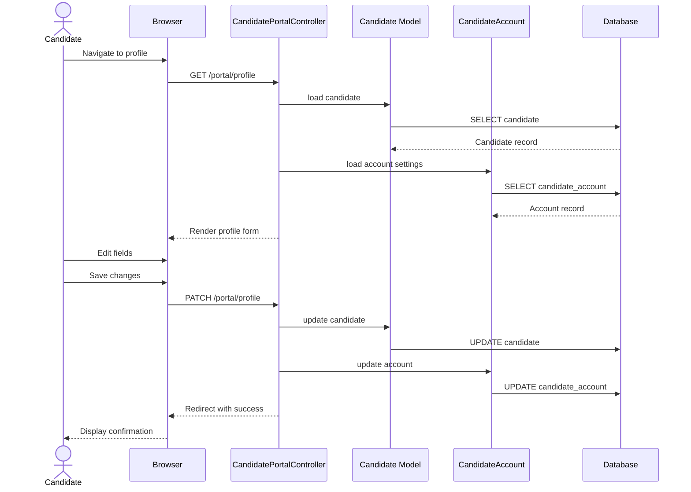

# UC-406: Update Profile

## Metadata

| Attribute | Value |
|-----------|-------|
| **ID** | UC-406 |
| **Name** | Update Profile |
| **Functional Area** | Career Site & Portal |
| **Primary Actor** | Candidate (ACT-07) |
| **Priority** | P2 |
| **Complexity** | Low |
| **Status** | Draft |

## Description

A candidate updates their profile information through the candidate portal. This includes personal details (name, phone, location), professional information (LinkedIn, portfolio URLs), and account settings (email notifications, job alerts). Profile updates apply to the candidate record and affect future applications.

## Actors

| Actor | Role in Use Case |
|-------|------------------|
| Candidate (ACT-07) | Updates personal and professional information |

## Preconditions

- [ ] Candidate has a CandidateAccount (UC-404)
- [ ] Candidate is authenticated (logged in)
- [ ] Candidate portal is accessible

## Postconditions

### Success
- [ ] Candidate record updated with new information
- [ ] CandidateAccount preferences updated
- [ ] Success confirmation displayed
- [ ] Changes reflected in portal immediately

### Failure
- [ ] Validation errors displayed
- [ ] Original values preserved
- [ ] Candidate can retry

## Triggers

- Candidate clicks "Edit Profile" in portal
- Candidate navigates to profile settings page
- Candidate clicks profile icon and selects settings

## Basic Flow



| Step | Actor | Action | System Response |
|------|-------|--------|-----------------|
| 1 | Candidate | Navigates to profile page | Profile form displayed |
| 2 | System | Loads current candidate data | Pre-fills form |
| 3 | System | Loads account settings | Pre-fills preferences |
| 4 | Candidate | Modifies first name | Field updated |
| 5 | Candidate | Modifies last name | Field updated |
| 6 | Candidate | Modifies phone | Field updated |
| 7 | Candidate | Modifies location | Field updated |
| 8 | Candidate | Modifies LinkedIn URL | Field updated |
| 9 | Candidate | Modifies portfolio URL | Field updated |
| 10 | Candidate | Updates notification prefs | Checkboxes updated |
| 11 | Candidate | Clicks "Save Changes" | Form submitted |
| 12 | System | Validates all fields | Validation passes |
| 13 | System | Updates candidate record | Database updated |
| 14 | System | Updates account settings | Preferences saved |
| 15 | System | Displays success message | "Profile updated" |

## Alternative Flows

### AF-1: Update Email Address

**Trigger:** Candidate wants to change email

| Step | Actor | Action | System Response |
|------|-------|--------|-----------------|
| 4a | Candidate | Clicks "Change Email" | Email form shown |
| 4b | Candidate | Enters new email | Email captured |
| 4c | Candidate | Enters current password | Password verified |
| 4d | System | Sends confirmation to new email | Verification required |
| 4e | Candidate | Confirms new email | Email updated |

**Resumption:** Returns to profile page

### AF-2: Update Password

**Trigger:** Candidate wants to change password

| Step | Actor | Action | System Response |
|------|-------|--------|-----------------|
| 4a | Candidate | Clicks "Change Password" | Password form shown |
| 4b | Candidate | Enters current password | Verified |
| 4c | Candidate | Enters new password | Password captured |
| 4d | Candidate | Confirms new password | Passwords match |
| 4e | System | Updates password | Encrypted and saved |
| 4f | System | Invalidates other sessions | Security measure |

**Resumption:** Returns to profile page

### AF-3: Configure Job Alerts

**Trigger:** Candidate updates job alert preferences

| Step | Actor | Action | System Response |
|------|-------|--------|-----------------|
| 10a | Candidate | Navigates to Job Alerts | Alert form shown |
| 10b | Candidate | Enables/disables alerts | Toggle updated |
| 10c | Candidate | Selects departments | Criteria saved |
| 10d | Candidate | Selects locations | Criteria saved |
| 10e | Candidate | Selects job types | Criteria saved |
| 10f | System | Saves alert criteria | JSON stored |

**Resumption:** Continues at step 11

### AF-4: No Changes Made

**Trigger:** Candidate submits without changes

| Step | Actor | Action | System Response |
|------|-------|--------|-----------------|
| 11a | System | Detects no changes | Nothing to update |
| 11b | System | Skips database update | No write performed |
| 12a | System | Shows neutral message | "No changes made" |

**Resumption:** Use case ends

## Exception Flows

### EF-1: Invalid Phone Format

**Trigger:** Phone number fails validation

| Step | Actor | Action | System Response |
|------|-------|--------|-----------------|
| 12.1 | System | Validates phone | Invalid format |
| 12.2 | System | Shows error | "Enter valid phone number" |
| 12.3 | Candidate | Corrects phone | Re-enters |

**Resolution:** Returns to step 6

### EF-2: Invalid URL Format

**Trigger:** LinkedIn or portfolio URL is malformed

| Step | Actor | Action | System Response |
|------|-------|--------|-----------------|
| 12.1 | System | Validates URL | Invalid format |
| 12.2 | System | Shows error | "Enter valid URL" |
| 12.3 | Candidate | Corrects URL | Re-enters |

**Resolution:** Returns to step 8 or 9

### EF-3: Session Expired

**Trigger:** Session times out during edit

| Step | Actor | Action | System Response |
|------|-------|--------|-----------------|
| 11.1 | System | Checks authentication | Session invalid |
| 11.2 | System | Preserves form data | Stored temporarily |
| 11.3 | System | Redirects to login | Login form shown |
| 11.4 | Candidate | Re-authenticates | Session restored |
| 11.5 | System | Restores form data | Edits preserved |

**Resolution:** Continues at step 11

### EF-4: Current Password Wrong

**Trigger:** Password verification fails for email/password change

| Step | Actor | Action | System Response |
|------|-------|--------|-----------------|
| 4c.1 | System | Verifies password | Does not match |
| 4c.2 | System | Shows error | "Incorrect password" |
| 4c.3 | Candidate | Retries | Re-enters password |

**Resolution:** Returns to step 4b

## Business Rules

| ID | Rule | Description |
|----|------|-------------|
| BR-406.1 | Auth Required | Must be logged in to update profile |
| BR-406.2 | Own Profile Only | Can only edit own candidate record |
| BR-406.3 | Email Change Verification | Email changes require confirmation |
| BR-406.4 | Password for Sensitive | Password required for email/password change |
| BR-406.5 | URL Validation | URLs must be valid format |
| BR-406.6 | Alert Criteria | Job alert criteria stored as JSON |

## Data Requirements

### Input Data

| Field | Type | Required | Validation |
|-------|------|----------|------------|
| first_name | string | Yes | Max 100 chars |
| last_name | string | Yes | Max 100 chars |
| phone | string | No | Valid phone format |
| location | string | No | Max 255 chars |
| linkedin_url | string | No | Valid LinkedIn URL |
| portfolio_url | string | No | Valid URL |
| email_notifications | boolean | No | true/false |
| job_alerts | boolean | No | true/false |
| job_alert_criteria | json | No | Valid criteria object |

### Output Data

| Field | Type | Description |
|-------|------|-------------|
| success | boolean | Update succeeded |
| message | string | Confirmation message |
| candidate | object | Updated candidate data |

## Database Transactions

### Tables Affected

| Table | Operation | Conditions |
|-------|-----------|------------|
| candidates | UPDATE | Update personal info |
| candidate_accounts | UPDATE | Update preferences |

### Transaction Detail

```sql
BEGIN TRANSACTION;

-- Update candidate
UPDATE candidates
SET first_name = @first_name,
    last_name = @last_name,
    phone = @phone,
    location = @location,
    linkedin_url = @linkedin_url,
    portfolio_url = @portfolio_url,
    updated_at = NOW()
WHERE id = @candidate_id;

-- Update account preferences
UPDATE candidate_accounts
SET email_notifications = @email_notifications,
    job_alerts = @job_alerts,
    job_alert_criteria = @job_alert_criteria,
    updated_at = NOW()
WHERE id = @account_id;

COMMIT;
```

### Rollback Scenarios

| Scenario | Rollback Action |
|----------|-----------------|
| Validation failure | No transaction started |
| Partial update failure | Full rollback |

## UI/UX Requirements

### Screen/Component

- **Location:** /portal/profile
- **Entry Point:** Portal navigation, profile icon
- **Key Elements:**
  - Personal information section
  - Professional links section
  - Notification preferences section
  - Save button
  - Cancel link

### Profile Form Layout

```
+----------------------------------------------------------+
| [Logo]                    [Profile] [Sign Out]            |
+----------------------------------------------------------+
| Profile Settings                                          |
+----------------------------------------------------------+
|                                                          |
| Personal Information                                      |
| -------------------------------------------------------- |
|                                                          |
| First Name *                Last Name *                  |
| [____________]              [____________]                |
|                                                          |
| Phone                                                     |
| [________________________]                                |
|                                                          |
| Location                                                  |
| [________________________]                                |
|                                                          |
| -------------------------------------------------------- |
| Professional Links                                        |
| -------------------------------------------------------- |
|                                                          |
| LinkedIn Profile                                          |
| [https://linkedin.com/in/______________]                 |
|                                                          |
| Portfolio / Website                                       |
| [________________________]                                |
|                                                          |
| -------------------------------------------------------- |
| Account Settings                                          |
| -------------------------------------------------------- |
|                                                          |
| Email: john.doe@example.com [Change Email]               |
| Password: ******** [Change Password]                     |
|                                                          |
| -------------------------------------------------------- |
| Notification Preferences                                  |
| -------------------------------------------------------- |
|                                                          |
| [x] Email me about application status updates            |
| [x] Email me about interview reminders                   |
| [ ] Email me about new job opportunities                 |
|                                                          |
| -------------------------------------------------------- |
| Job Alerts                                                |
| -------------------------------------------------------- |
|                                                          |
| [x] Enable job alerts                                    |
|                                                          |
| Departments: [Engineering] [Product] [x]                 |
| Locations: [San Francisco] [Remote] [x]                  |
| Job Types: [Full-time] [Contract] [x]                    |
| Keywords: [________________________]                     |
|                                                          |
| -------------------------------------------------------- |
|                                                          |
| [Cancel]                     [Save Changes]              |
|                                                          |
+----------------------------------------------------------+
```

## Non-Functional Requirements

| Requirement | Target |
|-------------|--------|
| Page Load Time | < 2 seconds |
| Save Response | < 1 second |
| Form Validation | Client-side for UX |
| Mobile Support | Fully responsive |

## Security Considerations

- [x] Authentication required
- [x] Own profile only (authorization)
- [x] Password required for sensitive changes
- [x] Email verification for email change
- [x] Session invalidation on password change
- [x] CSRF protection on form

## Related Use Cases

| Use Case | Relationship |
|----------|--------------|
| UC-404 Create Candidate Account | Creates the account |
| UC-405 Check Application Status | Uses profile data |
| UC-407 Upload Documents | Manages documents |

---

## Data Model References

> Cross-references to [DATA_MODEL.md](../DATA_MODEL.md) and [CRUD_MATRIX.md](../CRUD_MATRIX.md)

### Subject Areas

| Subject Area | ID | Relationship |
|--------------|-----|--------------|
| Career Site | SA-12 | Primary |
| Candidate | SA-04 | Primary |

### Entities CRUD

| Entity | C | R | U | D | Notes |
|--------|---|---|---|---|-------|
| Candidate | | X | X | | Read and update profile |
| CandidateAccount | | X | X | | Read and update settings |

**Legend:** C = Create, R = Read, U = Update, D = Delete

---

## Process Model References

> Cross-references to [PROCESS_MODEL.md](../PROCESS_MODEL.md) and [PROCESS_CRUD_MATRIX.md](../PROCESS_CRUD_MATRIX.md)

| Attribute | Value | Link |
|-----------|-------|------|
| **Elementary Business Process** | EP-1147: Update Profile | [PROCESS_MODEL.md#ep-1147](../PROCESS_MODEL.md#ep-1147-update-profile) |
| **Business Process** | BP-604: Career Site Management | [PROCESS_MODEL.md#bp-604](../PROCESS_MODEL.md#bp-604-career-site-management) |
| **Business Function** | BF-06: System Administration | [PROCESS_MODEL.md#bf-06](../PROCESS_MODEL.md#bf-06-system-administration) |

### EBP Details

| Attribute | Value |
|-----------|-------|
| **Trigger** | Candidate initiates profile edit in portal |
| **Input** | Updated personal info, preferences, links |
| **Output** | Updated candidate record and account settings |
| **Business Rules** | BR-406.1 through BR-406.6 (see Business Rules section) |

---

## Traceability Matrix

> Complete artifact mapping for requirements traceability

| Artifact Type | ID | Name | Link |
|---------------|-----|------|------|
| **Use Case** | UC-406 | Update Profile | *(this document)* |
| **Elementary Process** | EP-1147 | Update Profile | [PROCESS_MODEL.md](../PROCESS_MODEL.md#ep-1147-update-profile) |
| **Business Process** | BP-604 | Career Site Management | [PROCESS_MODEL.md](../PROCESS_MODEL.md#bp-604-career-site-management) |
| **Business Function** | BF-06 | System Administration | [PROCESS_MODEL.md](../PROCESS_MODEL.md#bf-06-system-administration) |
| **Primary Actor** | ACT-07 | Candidate | [ACTORS.md](../ACTORS.md#act-07-candidate) |
| **Subject Area (Primary)** | SA-12 | Career Site | [DATA_MODEL.md](../DATA_MODEL.md#sa-12-career-site) |
| **Subject Area (Secondary)** | SA-04 | Candidate | [DATA_MODEL.md](../DATA_MODEL.md#sa-04-candidate) |
| **CRUD Matrix Row** | UC-406 | - | [CRUD_MATRIX.md](../CRUD_MATRIX.md#uc-406) |
| **Process CRUD Row** | EP-1147 | - | [PROCESS_CRUD_MATRIX.md](../PROCESS_CRUD_MATRIX.md#ep-1147) |

### Implementation Artifacts

| Artifact Type | Path/Reference | Status |
|---------------|----------------|--------|
| Controller | `app/controllers/candidate_portal_controller.rb` | Implemented |
| Action | `CandidatePortalController#profile` | Implemented |
| Action | `CandidatePortalController#update_profile` | Implemented |
| Action | `CandidatePortalController#job_alerts` | Implemented |
| Model | `app/models/candidate.rb` | Implemented |
| Model | `app/models/candidate_account.rb` | Implemented |
| View | `app/views/candidate_portal/profile.html.erb` | Implemented |

---

## Open Questions

1. Should we allow profile photo upload?
2. Should we track profile completion percentage?
3. Should profile changes trigger notifications to recruiters?

## Change History

| Version | Date | Author | Changes |
|---------|------|--------|---------|
| 0.1 | 2026-01-25 | System | Initial draft |
