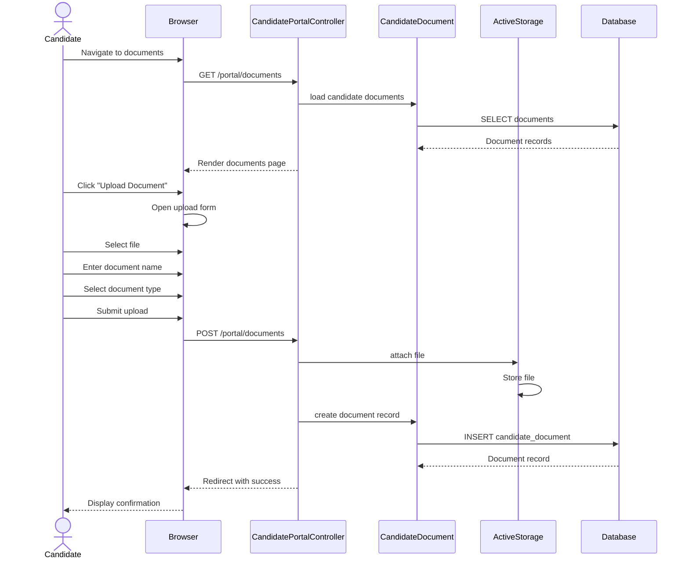

# UC-407: Upload Documents

## Metadata

| Attribute | Value |
|-----------|-------|
| **ID** | UC-407 |
| **Name** | Upload Documents |
| **Functional Area** | Career Site & Portal |
| **Primary Actor** | Candidate (ACT-07) |
| **Priority** | P2 |
| **Complexity** | Medium |
| **Status** | Draft |

## Description

A candidate uploads documents to their profile through the candidate portal. Documents can include resumes, cover letters, portfolios, transcripts, certifications, and references. Documents are stored securely and can be attached to specific applications or kept in a general document library for future use. Candidates can manage document visibility to employers.

## Actors

| Actor | Role in Use Case |
|-------|------------------|
| Candidate (ACT-07) | Uploads and manages documents |

## Preconditions

- [ ] Candidate has a CandidateAccount (UC-404)
- [ ] Candidate is authenticated (logged in)
- [ ] Candidate portal is accessible

## Postconditions

### Success
- [ ] CandidateDocument record created
- [ ] File stored via Active Storage
- [ ] Document metadata captured
- [ ] Document visible in candidate's library
- [ ] Optionally linked to application

### Failure
- [ ] Validation errors displayed
- [ ] File not stored
- [ ] Candidate can retry

## Triggers

- Candidate clicks "Upload Document" in portal
- Candidate adds document during application
- Candidate navigates to documents section

## Basic Flow



| Step | Actor | Action | System Response |
|------|-------|--------|-----------------|
| 1 | Candidate | Navigates to documents | Document list displayed |
| 2 | System | Loads existing documents | Document cards shown |
| 3 | Candidate | Clicks "Upload Document" | Upload form displayed |
| 4 | Candidate | Selects file | File selected |
| 5 | Candidate | Enters document name | Name captured |
| 6 | Candidate | Selects document type | Type selected |
| 7 | Candidate | Adds description (optional) | Description captured |
| 8 | Candidate | Clicks "Upload" | File upload starts |
| 9 | System | Validates file | Type and size checked |
| 10 | System | Stores file | Active Storage saves |
| 11 | System | Captures metadata | Size, type, filename |
| 12 | System | Creates document record | Database entry |
| 13 | System | Displays confirmation | Success message |
| 14 | Candidate | Views updated list | New document shown |

## Alternative Flows

### AF-1: Drag and Drop Upload

**Trigger:** Candidate uses drag and drop

| Step | Actor | Action | System Response |
|------|-------|--------|-----------------|
| 4a | Candidate | Drags file to drop zone | File received |
| 4b | System | Validates file | Immediate feedback |
| 4c | System | Shows file preview | Filename displayed |

**Resumption:** Continues at step 5

### AF-2: Multiple File Upload

**Trigger:** Candidate uploads multiple files

| Step | Actor | Action | System Response |
|------|-------|--------|-----------------|
| 4a | Candidate | Selects multiple files | Files queued |
| 4b | System | Shows file list | Each file editable |
| 5a | Candidate | Names each document | Per-file names |
| 6a | Candidate | Sets types per file | Per-file types |
| 8a | System | Uploads sequentially | Progress shown |

**Resumption:** Continues at step 9 for each file

### AF-3: Link to Application

**Trigger:** Candidate links document to specific application

| Step | Actor | Action | System Response |
|------|-------|--------|-----------------|
| 7a | Candidate | Selects application | Dropdown selection |
| 12a | System | Links to application | application_id set |
| 12b | System | Notifies recruiter | Optional notification |

**Resumption:** Continues at step 13

### AF-4: Replace Existing Document

**Trigger:** Candidate updates an existing document

| Step | Actor | Action | System Response |
|------|-------|--------|-----------------|
| 2a | Candidate | Clicks document | Document details shown |
| 2b | Candidate | Clicks "Replace File" | Upload form shown |
| 4a | Candidate | Selects new file | File selected |
| 10a | System | Replaces old file | Old file purged |

**Resumption:** Continues at step 11

## Exception Flows

### EF-1: Invalid File Type

**Trigger:** File type not allowed

| Step | Actor | Action | System Response |
|------|-------|--------|-----------------|
| 9.1 | System | Validates content type | Not in allowed list |
| 9.2 | System | Shows error | "File type not allowed" |
| 9.3 | System | Lists allowed types | PDF, DOC, DOCX, etc. |
| 9.4 | Candidate | Selects valid file | Retries |

**Resolution:** Returns to step 4

### EF-2: File Too Large

**Trigger:** File exceeds 10MB limit

| Step | Actor | Action | System Response |
|------|-------|--------|-----------------|
| 9.1 | System | Checks file size | Exceeds 10MB |
| 9.2 | System | Shows error | "File must be under 10MB" |
| 9.3 | Candidate | Compresses or selects smaller file | Retries |

**Resolution:** Returns to step 4

### EF-3: Upload Interrupted

**Trigger:** Network failure during upload

| Step | Actor | Action | System Response |
|------|-------|--------|-----------------|
| 10.1 | System | Detects upload failure | Connection lost |
| 10.2 | System | Shows error | "Upload failed" |
| 10.3 | System | Offers retry | Retry button shown |
| 10.4 | Candidate | Clicks retry | Re-uploads file |

**Resolution:** Returns to step 8

### EF-4: Storage Quota Exceeded

**Trigger:** Candidate has too many documents

| Step | Actor | Action | System Response |
|------|-------|--------|-----------------|
| 9.1 | System | Checks document count | Exceeds limit |
| 9.2 | System | Shows error | "Storage limit reached" |
| 9.3 | System | Suggests deletion | Links to existing docs |
| 9.4 | Candidate | Deletes old documents | Space freed |

**Resolution:** Returns to step 3

## Business Rules

| ID | Rule | Description |
|----|------|-------------|
| BR-407.1 | Auth Required | Must be logged in to upload |
| BR-407.2 | Own Documents Only | Can only manage own documents |
| BR-407.3 | File Types | PDF, DOC, DOCX, XLS, XLSX, JPG, PNG, GIF, TXT |
| BR-407.4 | File Size | Maximum 10MB per file |
| BR-407.5 | Document Types | resume, cover_letter, portfolio, transcript, certification, reference, other |
| BR-407.6 | Visibility Default | Visible to employer by default |
| BR-407.7 | Name Required | Document name is required |

## Data Requirements

### Input Data

| Field | Type | Required | Validation |
|-------|------|----------|------------|
| file | file | Yes | Valid type, <10MB |
| name | string | Yes | Max 255 chars |
| document_type | string | Yes | From DOCUMENT_TYPES |
| description | text | No | Max 1000 chars |
| application_id | integer | No | Valid application ID |
| visible_to_employer | boolean | No | Default true |

### Output Data

| Field | Type | Description |
|-------|------|-------------|
| document_id | integer | New document ID |
| original_filename | string | Original file name |
| content_type | string | MIME type |
| file_size | integer | Size in bytes |
| file_size_formatted | string | Human-readable size |

## Database Transactions

### Tables Affected

| Table | Operation | Conditions |
|-------|-----------|------------|
| candidate_documents | CREATE | New document |
| active_storage_blobs | CREATE | File metadata |
| active_storage_attachments | CREATE | File link |

### Transaction Detail

```sql
BEGIN TRANSACTION;

-- Step 1: Create Active Storage blob
INSERT INTO active_storage_blobs (
    key, filename, content_type, byte_size,
    checksum, created_at
) VALUES (
    @storage_key, @filename, @content_type, @byte_size,
    @checksum, NOW()
);

SET @blob_id = LAST_INSERT_ID();

-- Step 2: Create document record
INSERT INTO candidate_documents (
    candidate_id,
    application_id,
    name,
    document_type,
    description,
    original_filename,
    content_type,
    file_size,
    visible_to_employer,
    created_at,
    updated_at
) VALUES (
    @candidate_id,
    @application_id,
    @name,
    @document_type,
    @description,
    @filename,
    @content_type,
    @byte_size,
    @visible,
    NOW(),
    NOW()
);

SET @document_id = LAST_INSERT_ID();

-- Step 3: Link attachment
INSERT INTO active_storage_attachments (
    name, record_type, record_id, blob_id, created_at
) VALUES (
    'file', 'CandidateDocument', @document_id, @blob_id, NOW()
);

COMMIT;
```

### Rollback Scenarios

| Scenario | Rollback Action |
|----------|-----------------|
| File validation failure | No transaction started |
| Storage failure | Rollback, clean up blob |
| Database error | Full rollback |

## UI/UX Requirements

### Screen/Component

- **Location:** /portal/documents
- **Entry Point:** Portal navigation
- **Key Elements:**
  - Document list/grid
  - Upload button
  - Drag-drop zone
  - Document type filter
  - Document cards with actions

### Documents Page Layout

```
+----------------------------------------------------------+
| [Logo]                    [Profile] [Sign Out]            |
+----------------------------------------------------------+
| My Documents                         [Upload Document]    |
+----------------------------------------------------------+
|                                                          |
| +------------------------------------------------------+ |
| | +--------------------------------------------------+ | |
| | |  Drop files here to upload                       | | |
| | |  or click to browse                              | | |
| | +--------------------------------------------------+ | |
| +------------------------------------------------------+ |
|                                                          |
| Filter: [All Types v]                                    |
|                                                          |
| +------------------------------------------------------+ |
| | [PDF] Resume_2026.pdf                    Resume     | |
| |       Uploaded Jan 15, 2026 | 245 KB                | |
| |       [Download] [Replace] [Delete] [Show/Hide]     | |
| +------------------------------------------------------+ |
| +------------------------------------------------------+ |
| | [DOC] Cover_Letter.docx              Cover Letter   | |
| |       Uploaded Jan 10, 2026 | 52 KB                 | |
| |       [Download] [Replace] [Delete] [Show/Hide]     | |
| +------------------------------------------------------+ |
| +------------------------------------------------------+ |
| | [PDF] Portfolio.pdf                      Portfolio  | |
| |       Uploaded Jan 5, 2026 | 2.3 MB                 | |
| |       [Download] [Replace] [Delete] [Show/Hide]     | |
| +------------------------------------------------------+ |
|                                                          |
+----------------------------------------------------------+
```

### Upload Modal

```
+----------------------------------------------------------+
|                    Upload Document                        |
+----------------------------------------------------------+
|                                                          |
| File                                                      |
| +------------------------------------------------------+ |
| | Resume_2026.pdf                              [x]     | |
| +------------------------------------------------------+ |
|                                                          |
| Document Name *                                           |
| [My Resume 2026_______________]                          |
|                                                          |
| Document Type *                                           |
| [Resume                              v]                  |
|                                                          |
| Description (optional)                                    |
| +------------------------------------------------------+ |
| | My latest resume with recent experience              | |
| +------------------------------------------------------+ |
|                                                          |
| Link to Application (optional)                            |
| [No specific application              v]                 |
|                                                          |
| [x] Visible to employers                                 |
|                                                          |
| [Cancel]                            [Upload Document]    |
|                                                          |
+----------------------------------------------------------+
```

## Non-Functional Requirements

| Requirement | Target |
|-------------|--------|
| Upload Speed | Support 10MB in <30s |
| Page Load Time | < 2 seconds |
| Progress Indicator | Show upload progress |
| Mobile Support | Fully responsive |
| Resume Capability | Support interrupted uploads |

## Security Considerations

- [x] Authentication required
- [x] Own documents only
- [x] File type validation (server-side)
- [x] File size limits enforced
- [x] Malware scanning (optional)
- [x] Secure file storage (encrypted at rest)
- [x] Download via signed URLs

## Related Use Cases

| Use Case | Relationship |
|----------|--------------|
| UC-403 Apply for Job | Can upload during application |
| UC-404 Create Candidate Account | Enables document upload |
| UC-406 Update Profile | Profile info may reference docs |

---

## Data Model References

> Cross-references to [DATA_MODEL.md](../DATA_MODEL.md) and [CRUD_MATRIX.md](../CRUD_MATRIX.md)

### Subject Areas

| Subject Area | ID | Relationship |
|--------------|-----|--------------|
| Career Site | SA-12 | Primary |
| Candidate | SA-04 | Primary |

### Entities CRUD

| Entity | C | R | U | D | Notes |
|--------|---|---|---|---|-------|
| CandidateDocument | X | X | X | X | Full CRUD for documents |
| Candidate | | X | | | Read for ownership check |
| Application | | X | | | Read for linking (optional) |

**Legend:** C = Create, R = Read, U = Update, D = Delete

---

## Process Model References

> Cross-references to [PROCESS_MODEL.md](../PROCESS_MODEL.md) and [PROCESS_CRUD_MATRIX.md](../PROCESS_CRUD_MATRIX.md)

| Attribute | Value | Link |
|-----------|-------|------|
| **Elementary Business Process** | EP-1148: Upload Documents | [PROCESS_MODEL.md#ep-1148](../PROCESS_MODEL.md#ep-1148-upload-documents) |
| **Business Process** | BP-604: Career Site Management | [PROCESS_MODEL.md#bp-604](../PROCESS_MODEL.md#bp-604-career-site-management) |
| **Business Function** | BF-06: System Administration | [PROCESS_MODEL.md#bf-06](../PROCESS_MODEL.md#bf-06-system-administration) |

### EBP Details

| Attribute | Value |
|-----------|-------|
| **Trigger** | Candidate initiates document upload |
| **Input** | File, name, type, optional description |
| **Output** | Stored document accessible in portal |
| **Business Rules** | BR-407.1 through BR-407.7 (see Business Rules section) |

---

## Traceability Matrix

> Complete artifact mapping for requirements traceability

| Artifact Type | ID | Name | Link |
|---------------|-----|------|------|
| **Use Case** | UC-407 | Upload Documents | *(this document)* |
| **Elementary Process** | EP-1148 | Upload Documents | [PROCESS_MODEL.md](../PROCESS_MODEL.md#ep-1148-upload-documents) |
| **Business Process** | BP-604 | Career Site Management | [PROCESS_MODEL.md](../PROCESS_MODEL.md#bp-604-career-site-management) |
| **Business Function** | BF-06 | System Administration | [PROCESS_MODEL.md](../PROCESS_MODEL.md#bf-06-system-administration) |
| **Primary Actor** | ACT-07 | Candidate | [ACTORS.md](../ACTORS.md#act-07-candidate) |
| **Subject Area (Primary)** | SA-12 | Career Site | [DATA_MODEL.md](../DATA_MODEL.md#sa-12-career-site) |
| **Subject Area (Secondary)** | SA-04 | Candidate | [DATA_MODEL.md](../DATA_MODEL.md#sa-04-candidate) |
| **CRUD Matrix Row** | UC-407 | - | [CRUD_MATRIX.md](../CRUD_MATRIX.md#uc-407) |
| **Process CRUD Row** | EP-1148 | - | [PROCESS_CRUD_MATRIX.md](../PROCESS_CRUD_MATRIX.md#ep-1148) |

### Implementation Artifacts

| Artifact Type | Path/Reference | Status |
|---------------|----------------|--------|
| Model | `app/models/candidate_document.rb` | Implemented |
| Controller | `app/controllers/candidate_portal_controller.rb` | Implemented |
| Controller | `app/controllers/candidate_documents_controller.rb` | Implemented |
| Action | `CandidatePortalController#documents` | Implemented |
| Action | `CandidatePortalController#upload_document` | Implemented |
| Policy | `app/policies/candidate_document_policy.rb` | Implemented |
| View | `app/views/candidate_portal/documents.html.erb` | Implemented |
| Test | `test/models/candidate_document_test.rb` | Implemented |

---

## Open Questions

1. Should we implement virus scanning for uploads?
2. Should we support document versioning?
3. Should we offer document templates (resume, cover letter)?

## Change History

| Version | Date | Author | Changes |
|---------|------|--------|---------|
| 0.1 | 2026-01-25 | System | Initial draft |
