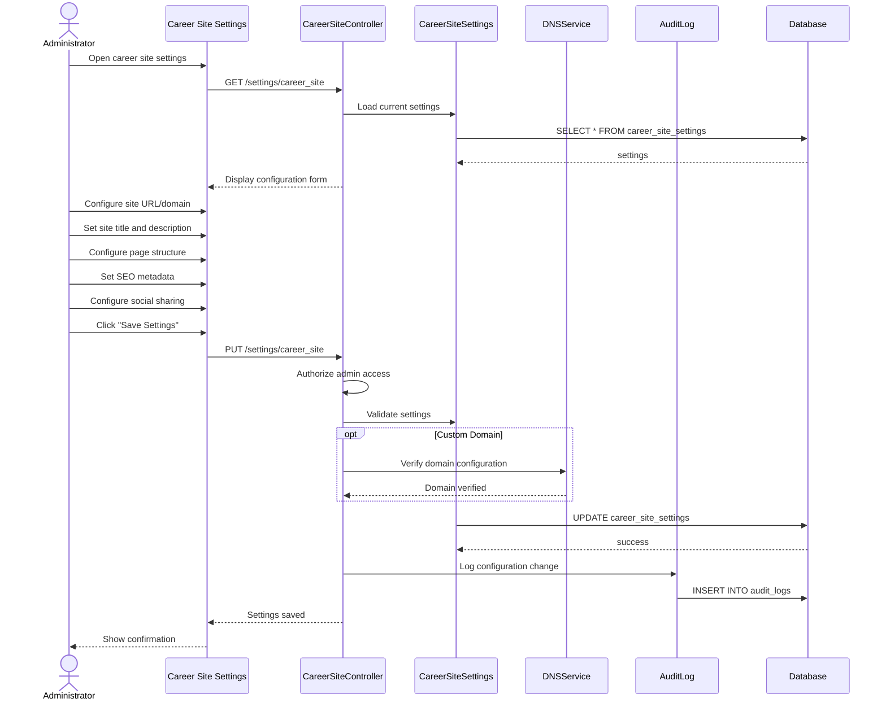

# UC-408: Configure Career Site

## Metadata

| Attribute | Value |
|-----------|-------|
| **ID** | UC-408 |
| **Name** | Configure Career Site |
| **Functional Area** | Career Site & Candidate Portal |
| **Primary Actor** | System Administrator (ACT-01) |
| **Priority** | P2 |
| **Complexity** | Medium |
| **Status** | Draft |

## Description

An administrator configures the organization's public career site settings, including site structure, page layouts, SEO settings, domain configuration, and general appearance. This establishes the framework for the employer brand and candidate experience before detailed branding is applied.

## Actors

| Actor | Role in Use Case |
|-------|------------------|
| System Administrator (ACT-01) | Configures site settings |
| Recruiter (ACT-02) | May configure job-specific settings |

## Preconditions

- [ ] User is authenticated and has Admin role
- [ ] Organization exists
- [ ] Career site feature is enabled for organization

## Postconditions

### Success
- [ ] Career site settings saved
- [ ] Site accessible at configured URL
- [ ] SEO settings applied
- [ ] Layout preferences stored
- [ ] Audit log entry created

### Failure
- [ ] Settings not saved
- [ ] Validation errors displayed

## Triggers

- Admin navigates to career site settings
- Initial organization setup
- Domain configuration change

## Basic Flow



| Step | Actor | Action | System Response |
|------|-------|--------|-----------------|
| 1 | Administrator | Opens career site settings | Current config displayed |
| 2 | Administrator | Configures site URL | URL/subdomain set |
| 3 | Administrator | Sets site title | Title saved |
| 4 | Administrator | Sets site description | Description saved |
| 5 | Administrator | Configures page layout | Layout options set |
| 6 | Administrator | Sets SEO metadata | Meta tags configured |
| 7 | Administrator | Configures social sharing | OG tags set |
| 8 | Administrator | Clicks "Save Settings" | Form submitted |
| 9 | System | Validates configuration | Validation passes |
| 10 | System | Verifies domain (if custom) | Domain confirmed |
| 11 | System | Saves settings | Config stored |
| 12 | System | Creates audit log | Change logged |
| 13 | System | Shows confirmation | Success message |

## Alternative Flows

### AF-1: Custom Domain Setup

**Trigger:** Admin configures custom domain

| Step | Actor | Action | System Response |
|------|-------|--------|-----------------|
| 2.1 | Administrator | Enters custom domain | Domain field populated |
| 2.2 | System | Provides DNS instructions | CNAME record shown |
| 2.3 | Administrator | Configures DNS externally | - |
| 2.4 | Administrator | Clicks "Verify Domain" | Verification initiated |
| 2.5 | System | Checks DNS records | Domain verified |
| 2.6 | System | Provisions SSL certificate | HTTPS enabled |

**Resumption:** Returns to step 8

### AF-2: Preview Changes

**Trigger:** Admin wants to preview before saving

| Step | Actor | Action | System Response |
|------|-------|--------|-----------------|
| 7.1 | Administrator | Clicks "Preview" | Preview window opens |
| 7.2 | System | Renders career site with changes | Preview displayed |
| 7.3 | Administrator | Reviews and adjusts | - |

**Resumption:** Returns to step 8 or continues editing

## Exception Flows

### EF-1: Domain Verification Failed

**Trigger:** DNS not configured correctly

| Step | Actor | Action | System Response |
|------|-------|--------|-----------------|
| E.1 | System | Checks DNS records | Records not found |
| E.2 | System | Displays error | Instructions shown |
| E.3 | Administrator | Corrects DNS or uses subdomain | - |

**Resolution:** DNS corrected or fallback to subdomain

### EF-2: URL Already Taken

**Trigger:** Subdomain already in use

| Step | Actor | Action | System Response |
|------|-------|--------|-----------------|
| E.1 | System | Checks URL availability | Already taken |
| E.2 | System | Displays error | Suggestions offered |
| E.3 | Administrator | Chooses different URL | - |

**Resolution:** User selects available URL

## Business Rules

| ID | Rule | Description |
|----|------|-------------|
| BR-1 | Unique URL | Each organization must have unique career site URL |
| BR-2 | Valid Domain | Custom domains must be verified before use |
| BR-3 | SSL Required | All career sites must use HTTPS |
| BR-4 | SEO Limits | Meta descriptions max 160 characters |
| BR-5 | Title Limits | Page titles max 60 characters for SEO |

## Data Requirements

### Input Data

| Field | Type | Required | Validation |
|-------|------|----------|------------|
| site_url | string | Yes | Valid URL/subdomain |
| custom_domain | string | No | Valid domain format |
| site_title | string | Yes | Max 60 chars |
| site_description | text | Yes | Max 160 chars |
| meta_keywords | array | No | Max 10 keywords |
| og_image | file | No | Image file |
| layout_type | enum | Yes | grid/list |
| jobs_per_page | integer | Yes | 10-50 |
| enable_search | boolean | No | Default true |
| enable_filters | boolean | No | Default true |

### Output Data

| Field | Type | Description |
|-------|------|-------------|
| settings_id | integer | Settings record ID |
| site_url | string | Final career site URL |
| ssl_enabled | boolean | HTTPS status |
| domain_verified | boolean | Custom domain status |

## Database Transactions

### Tables Affected

| Table | Operation | Conditions |
|-------|-----------|------------|
| career_site_settings | CREATE/UPDATE | Configuration |
| domain_verifications | CREATE/UPDATE | If custom domain |
| audit_logs | CREATE | Change logging |

### Transaction Detail

```sql
BEGIN TRANSACTION;

-- Create or update career site settings
INSERT INTO career_site_settings (
    organization_id, site_url, custom_domain,
    site_title, site_description, meta_keywords,
    layout_type, jobs_per_page, enable_search,
    enable_filters, created_at, updated_at
)
VALUES (
    @org_id, @site_url, @custom_domain,
    @site_title, @site_description, @meta_keywords,
    @layout_type, @jobs_per_page, @enable_search,
    @enable_filters, NOW(), NOW()
)
ON CONFLICT (organization_id) DO UPDATE SET
    site_url = @site_url,
    custom_domain = @custom_domain,
    site_title = @site_title,
    site_description = @site_description,
    meta_keywords = @meta_keywords,
    layout_type = @layout_type,
    jobs_per_page = @jobs_per_page,
    enable_search = @enable_search,
    enable_filters = @enable_filters,
    updated_at = NOW();

-- Log configuration change
INSERT INTO audit_logs (
    action, auditable_type, auditable_id,
    user_id, metadata, created_at
)
VALUES (
    'career_site_configured', 'Organization', @org_id, @user_id,
    '{"changes": {...}}', NOW()
);

COMMIT;
```

### Rollback Scenarios

| Scenario | Rollback Action |
|----------|-----------------|
| Validation failure | No changes saved |
| Domain verification fails | Save partial settings, flag domain |

## UI/UX Requirements

### Screen/Component

- **Location:** Settings > Career Site
- **Entry Point:** Settings menu
- **Key Elements:**
  - URL/subdomain configuration
  - Custom domain setup with instructions
  - Site title and description inputs
  - SEO metadata fields
  - Layout options with preview
  - Social sharing image upload
  - Preview button
  - Save/Cancel buttons

### Wireframe Reference

`/designs/wireframes/UC-408-career-site-config.png`

## Non-Functional Requirements

| Requirement | Target |
|-------------|--------|
| Response Time | < 2 seconds |
| Domain Verification | < 30 seconds |
| SSL Provisioning | < 5 minutes |

## Security Considerations

- [x] Authentication required
- [x] Authorization check: Admin only
- [x] SSL/HTTPS required for all sites
- [x] Domain verification prevents hijacking
- [x] Audit logging of all changes

## Related Use Cases

| Use Case | Relationship |
|----------|--------------|
| UC-409 Customize Branding | Applies visual branding |
| UC-400 Browse Jobs | Uses configured site |
| UC-403 Apply for Job | Application on configured site |

---

## Data Model References

### Subject Areas

| Subject Area | ID | Relationship |
|--------------|-----|--------------|
| Career Site | SA-12 | Primary |
| Organization | SA-02 | Secondary |

### Entities CRUD

| Entity | C | R | U | D | Notes |
|--------|---|---|---|---|-------|
| CareerSiteSettings | ✓ | ✓ | ✓ | | Configuration |
| DomainVerification | ✓ | ✓ | ✓ | | Custom domain tracking |
| Organization | | ✓ | | | Read for context |
| AuditLog | ✓ | | | | Immutable entry |

---

## Process Model References

| Attribute | Value | Link |
|-----------|-------|------|
| **Elementary Business Process** | EP-1208: Configure Career Site Structure | [PROCESS_MODEL.md](../PROCESS_MODEL.md) |
| **Business Process** | BP-604: Career Site Management | [PROCESS_MODEL.md](../PROCESS_MODEL.md) |
| **Business Function** | BF-06: System Administration | [PROCESS_MODEL.md](../PROCESS_MODEL.md) |

### EBP Details

| Attribute | Value |
|-----------|-------|
| **Trigger** | Admin accesses career site settings |
| **Input** | Site configuration parameters |
| **Output** | Configured and accessible career site |
| **Business Rules** | BR-1 through BR-5 |

---

## Traceability Matrix

| Artifact Type | ID | Name | Link |
|---------------|-----|------|------|
| **Use Case** | UC-408 | Configure Career Site | *(this document)* |
| **Elementary Process** | EP-1208 | Configure Career Site | [PROCESS_MODEL.md](../PROCESS_MODEL.md) |
| **Business Process** | BP-604 | Career Site Management | [PROCESS_MODEL.md](../PROCESS_MODEL.md) |
| **Business Function** | BF-06 | System Administration | [PROCESS_MODEL.md](../PROCESS_MODEL.md) |
| **Primary Actor** | ACT-01 | System Administrator | [ACTORS.md](../ACTORS.md) |
| **Subject Area (Primary)** | SA-12 | Career Site | [DATA_MODEL.md](../DATA_MODEL.md) |

### Implementation Artifacts

| Artifact Type | Path/Reference | Status |
|---------------|----------------|--------|
| Controller | `app/controllers/admin/career_site_settings_controller.rb` | Implemented |
| Model | `app/models/career_site_setting.rb` | Implemented |

---

## Open Questions

1. Support for multiple career site languages?
2. A/B testing for different layouts?

## Change History

| Version | Date | Author | Changes |
|---------|------|--------|---------|
| 0.1 | 2026-01-25 | System | Initial draft |
