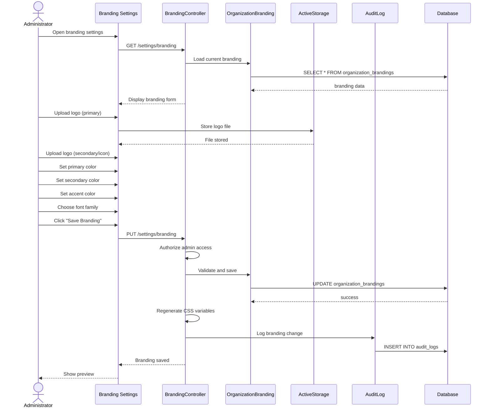

# UC-409: Customize Branding

## Metadata

| Attribute | Value |
|-----------|-------|
| **ID** | UC-409 |
| **Name** | Customize Branding |
| **Functional Area** | Career Site & Candidate Portal |
| **Primary Actor** | System Administrator (ACT-01) |
| **Priority** | P2 |
| **Complexity** | Medium |
| **Status** | Draft |

## Description

An administrator customizes the organization's visual branding for the career site and candidate-facing communications. This includes uploading logos, setting colors, configuring fonts, and customizing the visual appearance to match the company's brand identity.

## Actors

| Actor | Role in Use Case |
|-------|------------------|
| System Administrator (ACT-01) | Configures branding settings |
| Recruiter (ACT-02) | May have limited branding access |

## Preconditions

- [ ] User is authenticated and has Admin role
- [ ] Organization exists
- [ ] Career site is configured (UC-408)

## Postconditions

### Success
- [ ] Branding settings saved
- [ ] Logo files stored
- [ ] Colors applied to career site
- [ ] Fonts configured
- [ ] Email templates reflect branding
- [ ] Audit log entry created

### Failure
- [ ] Branding not saved
- [ ] Validation errors displayed (e.g., invalid color format)

## Triggers

- Admin navigates to branding settings
- Initial organization setup
- Brand refresh or rebranding initiative

## Basic Flow



| Step | Actor | Action | System Response |
|------|-------|--------|-----------------|
| 1 | Administrator | Opens branding settings | Current branding displayed |
| 2 | Administrator | Uploads primary logo | Logo stored |
| 3 | Administrator | Uploads favicon/icon | Icon stored |
| 4 | Administrator | Sets primary color | Color picker used |
| 5 | Administrator | Sets secondary color | Color saved |
| 6 | Administrator | Sets accent color | Color saved |
| 7 | Administrator | Selects font family | Font choice stored |
| 8 | Administrator | Sets button styles | Style options configured |
| 9 | Administrator | Clicks "Save Branding" | Form submitted |
| 10 | System | Validates inputs | Colors, images validated |
| 11 | System | Saves branding | Config stored |
| 12 | System | Generates CSS | Custom styles created |
| 13 | System | Creates audit log | Change logged |
| 14 | System | Shows live preview | Updated site shown |

## Alternative Flows

### AF-1: Use Brand Template

**Trigger:** Admin selects a pre-built template

| Step | Actor | Action | System Response |
|------|-------|--------|-----------------|
| 1.1 | Administrator | Clicks "Use Template" | Templates displayed |
| 1.2 | Administrator | Selects template | Colors pre-filled |
| 1.3 | Administrator | Customizes as needed | - |

**Resumption:** Returns to step 9

### AF-2: Reset to Default

**Trigger:** Admin wants to restore default branding

| Step | Actor | Action | System Response |
|------|-------|--------|-----------------|
| 9.1 | Administrator | Clicks "Reset to Default" | Confirmation shown |
| 9.2 | Administrator | Confirms reset | Default values restored |

**Resumption:** Returns to step 9 to save

## Exception Flows

### EF-1: Invalid Image Format

**Trigger:** Uploaded file is not valid image

| Step | Actor | Action | System Response |
|------|-------|--------|-----------------|
| E.1 | System | Validates file type | Invalid format |
| E.2 | System | Displays error | Supported formats listed |
| E.3 | Administrator | Uploads valid image | - |

**Resolution:** User uploads supported format

### EF-2: Color Contrast Issue

**Trigger:** Colors don't meet accessibility standards

| Step | Actor | Action | System Response |
|------|-------|--------|-----------------|
| E.1 | System | Checks color contrast | Below WCAG AA |
| E.2 | System | Displays warning | Accessibility issue noted |
| E.3 | Administrator | Adjusts colors or proceeds | - |

**Resolution:** Colors adjusted or warning acknowledged

## Business Rules

| ID | Rule | Description |
|----|------|-------------|
| BR-1 | Logo Format | Logos must be PNG, JPG, SVG (max 2MB) |
| BR-2 | Color Format | Colors must be valid hex codes |
| BR-3 | Favicon Size | Favicon should be 32x32 or 64x64 |
| BR-4 | Accessibility | Warn if contrast ratio below 4.5:1 |
| BR-5 | Font Availability | Only web-safe or Google Fonts supported |

## Data Requirements

### Input Data

| Field | Type | Required | Validation |
|-------|------|----------|------------|
| logo_primary | file | No | PNG/JPG/SVG, max 2MB |
| logo_secondary | file | No | PNG/JPG/SVG, max 2MB |
| favicon | file | No | ICO/PNG, 32x32 or 64x64 |
| primary_color | string | Yes | Valid hex code |
| secondary_color | string | No | Valid hex code |
| accent_color | string | No | Valid hex code |
| text_color | string | No | Valid hex code |
| background_color | string | No | Valid hex code |
| font_family | string | Yes | Supported font name |
| button_radius | integer | No | 0-20 pixels |
| header_style | enum | No | solid/gradient/transparent |

### Output Data

| Field | Type | Description |
|-------|------|-------------|
| branding_id | integer | Branding record ID |
| css_variables | text | Generated CSS custom properties |
| logo_urls | object | CDN URLs for logos |

## Database Transactions

### Tables Affected

| Table | Operation | Conditions |
|-------|-----------|------------|
| organization_brandings | CREATE/UPDATE | Branding config |
| active_storage_attachments | CREATE | Logo files |
| audit_logs | CREATE | Change logging |

### Transaction Detail

```sql
BEGIN TRANSACTION;

-- Create or update branding
INSERT INTO organization_brandings (
    organization_id, primary_color, secondary_color,
    accent_color, text_color, background_color,
    font_family, button_radius, header_style,
    created_at, updated_at
)
VALUES (
    @org_id, @primary_color, @secondary_color,
    @accent_color, @text_color, @background_color,
    @font_family, @button_radius, @header_style,
    NOW(), NOW()
)
ON CONFLICT (organization_id) DO UPDATE SET
    primary_color = @primary_color,
    secondary_color = @secondary_color,
    accent_color = @accent_color,
    text_color = @text_color,
    background_color = @background_color,
    font_family = @font_family,
    button_radius = @button_radius,
    header_style = @header_style,
    updated_at = NOW()
RETURNING id INTO @branding_id;

-- Log branding change
INSERT INTO audit_logs (
    action, auditable_type, auditable_id,
    user_id, metadata, created_at
)
VALUES (
    'branding_updated', 'OrganizationBranding', @branding_id, @user_id,
    '{"changes": {...}}', NOW()
);

COMMIT;
```

### Rollback Scenarios

| Scenario | Rollback Action |
|----------|-----------------|
| Image upload fails | Transaction rolled back |
| Validation error | No changes saved |

## UI/UX Requirements

### Screen/Component

- **Location:** Settings > Branding
- **Entry Point:** Settings menu
- **Key Elements:**
  - Logo upload areas with preview
  - Color pickers with hex input
  - Font family dropdown
  - Button style options
  - Live preview panel
  - Accessibility contrast checker
  - Save/Reset buttons

### Wireframe Reference

`/designs/wireframes/UC-409-branding.png`

## Non-Functional Requirements

| Requirement | Target |
|-------------|--------|
| Response Time | < 3 seconds |
| Image Processing | < 5 seconds |
| Preview Update | Real-time |

## Security Considerations

- [x] Authentication required
- [x] Authorization check: Admin only
- [x] File validation: Prevent malicious uploads
- [x] Audit logging: All changes logged

## Related Use Cases

| Use Case | Relationship |
|----------|--------------|
| UC-408 Configure Career Site | Site structure for branding |
| UC-400 Browse Jobs | Displays branded site |
| UC-507 Configure Email Templates | Emails use branding |

---

## Data Model References

### Subject Areas

| Subject Area | ID | Relationship |
|--------------|-----|--------------|
| Career Site | SA-12 | Primary |
| Organization | SA-02 | Secondary |

### Entities CRUD

| Entity | C | R | U | D | Notes |
|--------|---|---|---|---|-------|
| OrganizationBranding | ✓ | ✓ | ✓ | | Branding configuration |
| Organization | | ✓ | | | Read for context |
| AuditLog | ✓ | | | | Immutable entry |

---

## Process Model References

| Attribute | Value | Link |
|-----------|-------|------|
| **Elementary Business Process** | EP-1209: Customize Career Site Branding | [PROCESS_MODEL.md](../PROCESS_MODEL.md) |
| **Business Process** | BP-604: Career Site Management | [PROCESS_MODEL.md](../PROCESS_MODEL.md) |
| **Business Function** | BF-06: System Administration | [PROCESS_MODEL.md](../PROCESS_MODEL.md) |

### EBP Details

| Attribute | Value |
|-----------|-------|
| **Trigger** | Admin accesses branding settings |
| **Input** | Logos, colors, fonts, styles |
| **Output** | Branded career site and emails |
| **Business Rules** | BR-1 through BR-5 |

---

## Traceability Matrix

| Artifact Type | ID | Name | Link |
|---------------|-----|------|------|
| **Use Case** | UC-409 | Customize Branding | *(this document)* |
| **Elementary Process** | EP-1209 | Customize Branding | [PROCESS_MODEL.md](../PROCESS_MODEL.md) |
| **Business Process** | BP-604 | Career Site Management | [PROCESS_MODEL.md](../PROCESS_MODEL.md) |
| **Business Function** | BF-06 | System Administration | [PROCESS_MODEL.md](../PROCESS_MODEL.md) |
| **Primary Actor** | ACT-01 | System Administrator | [ACTORS.md](../ACTORS.md) |
| **Subject Area (Primary)** | SA-12 | Career Site | [DATA_MODEL.md](../DATA_MODEL.md) |

### Implementation Artifacts

| Artifact Type | Path/Reference | Status |
|---------------|----------------|--------|
| Controller | `app/controllers/admin/brandings_controller.rb` | Implemented |
| Model | `app/models/organization_branding.rb` | Implemented |

---

## Open Questions

1. Support for dark mode branding variant?
2. CSS export for external sites?

## Change History

| Version | Date | Author | Changes |
|---------|------|--------|---------|
| 0.1 | 2026-01-25 | System | Initial draft |
