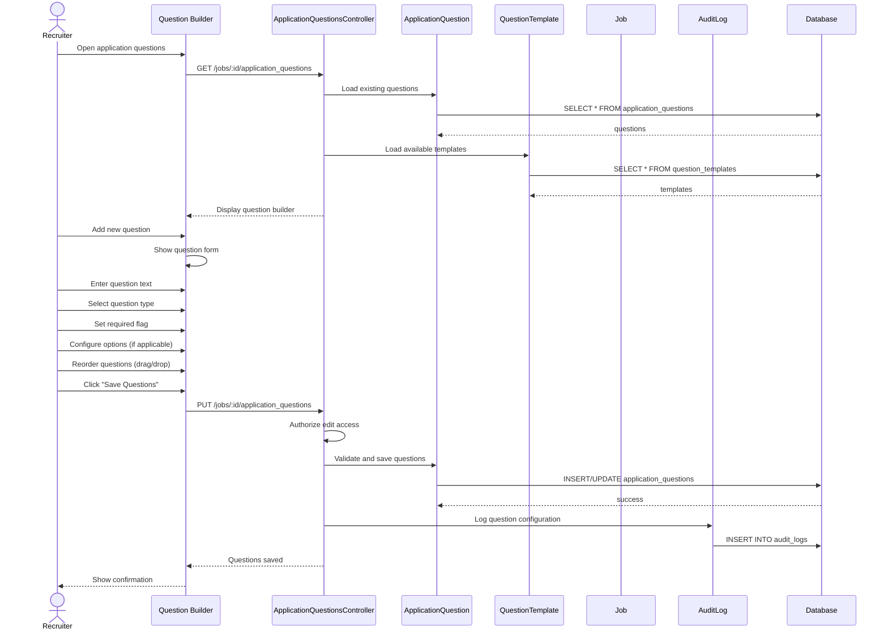

# UC-410: Set Application Questions

## Metadata

| Attribute | Value |
|-----------|-------|
| **ID** | UC-410 |
| **Name** | Set Application Questions |
| **Functional Area** | Career Site & Candidate Portal |
| **Primary Actor** | Recruiter (ACT-02) |
| **Priority** | P2 |
| **Complexity** | Medium |
| **Status** | Draft |

## Description

A recruiter configures custom application questions for a specific job requisition. These questions appear on the job application form and capture additional information beyond the standard fields. Questions can be required or optional, and can include various input types (text, multiple choice, file upload, etc.).

## Actors

| Actor | Role in Use Case |
|-------|------------------|
| Recruiter (ACT-02) | Configures job-specific questions |
| System Administrator (ACT-01) | Creates global question templates |
| Hiring Manager (ACT-03) | May suggest questions for their jobs |

## Preconditions

- [ ] User is authenticated and has Recruiter or Admin role
- [ ] Job requisition exists
- [ ] User has edit access to the job

## Postconditions

### Success
- [ ] ApplicationQuestion records created for job
- [ ] Questions ordered by specified sequence
- [ ] Question types and validations configured
- [ ] Questions appear on job application form
- [ ] Audit log entry created

### Failure
- [ ] Questions not saved
- [ ] Validation errors displayed

## Triggers

- Recruiter edits job requisition
- Recruiter clicks "Configure Questions" from job detail
- Job creation wizard reaches questions step

## Basic Flow



| Step | Actor | Action | System Response |
|------|-------|--------|-----------------|
| 1 | Recruiter | Opens application questions | Question builder displayed |
| 2 | System | Loads existing questions | Current questions shown |
| 3 | System | Loads question templates | Templates available |
| 4 | Recruiter | Adds new question | Question form shown |
| 5 | Recruiter | Enters question text | Text captured |
| 6 | Recruiter | Selects question type | Type options shown |
| 7 | Recruiter | Configures options (if MC) | Options added |
| 8 | Recruiter | Sets required flag | Requirement set |
| 9 | Recruiter | Reorders questions | Drag/drop sequence |
| 10 | Recruiter | Saves questions | Form submitted |
| 11 | System | Validates configuration | Validation passes |
| 12 | System | Saves questions | Records stored |
| 13 | System | Creates audit log | Change logged |
| 14 | System | Shows confirmation | Success message |

## Alternative Flows

### AF-1: Add from Template

**Trigger:** Recruiter uses a question template

| Step | Actor | Action | System Response |
|------|-------|--------|-----------------|
| 4.1 | Recruiter | Clicks "Add from Template" | Template list shown |
| 4.2 | Recruiter | Selects template | Question pre-filled |
| 4.3 | Recruiter | Customizes if needed | Text editable |

**Resumption:** Returns to step 8

### AF-2: Copy from Another Job

**Trigger:** Recruiter wants to reuse questions

| Step | Actor | Action | System Response |
|------|-------|--------|-----------------|
| 1.1 | Recruiter | Clicks "Copy from Job" | Job selector shown |
| 1.2 | Recruiter | Selects source job | Questions loaded |
| 1.3 | System | Copies questions to draft | Ready for edit |

**Resumption:** Returns to step 4 for customization

### AF-3: Delete Question

**Trigger:** Recruiter removes a question

| Step | Actor | Action | System Response |
|------|-------|--------|-----------------|
| 4.1 | Recruiter | Clicks delete on question | Confirmation shown |
| 4.2 | Recruiter | Confirms deletion | Question marked for removal |

**Resumption:** Question removed on save (step 10)

## Exception Flows

### EF-1: Question Has Responses

**Trigger:** Trying to modify/delete question with existing answers

| Step | Actor | Action | System Response |
|------|-------|--------|-----------------|
| E.1 | System | Detects existing responses | Answers exist |
| E.2 | System | Warns about impact | Warning displayed |
| E.3 | Recruiter | Proceeds or cancels | Decision made |

**Resolution:** Soft delete preserves historical data

### EF-2: Duplicate Question Text

**Trigger:** Same question text already exists

| Step | Actor | Action | System Response |
|------|-------|--------|-----------------|
| E.1 | System | Detects duplicate | Already exists |
| E.2 | System | Displays warning | Duplicate noted |
| E.3 | Recruiter | Modifies or proceeds | - |

**Resolution:** User edits or accepts duplicate

## Business Rules

| ID | Rule | Description |
|----|------|-------------|
| BR-1 | Question Limit | Max 20 custom questions per job |
| BR-2 | Required Limit | Max 5 required questions recommended |
| BR-3 | Option Limit | Multiple choice max 10 options |
| BR-4 | Text Limits | Question text max 500 characters |
| BR-5 | Historical Data | Cannot delete questions with responses |
| BR-6 | Unique Order | Each question must have unique position |

## Data Requirements

### Input Data

| Field | Type | Required | Validation |
|-------|------|----------|------------|
| job_id | integer | Yes | Valid job ID |
| text | string | Yes | Max 500 chars |
| question_type | enum | Yes | text/textarea/select/multiselect/checkbox/file |
| required | boolean | Yes | Default false |
| options | array | If select | Max 10 options |
| position | integer | Yes | Unique per job |
| help_text | string | No | Max 200 chars |
| validation_regex | string | No | Valid regex |

### Output Data

| Field | Type | Description |
|-------|------|-------------|
| question_id | integer | Question record ID |
| position | integer | Display order |
| created_at | datetime | Creation timestamp |

## Database Transactions

### Tables Affected

| Table | Operation | Conditions |
|-------|-----------|------------|
| application_questions | CREATE/UPDATE/DELETE | Question records |
| jobs | UPDATE | Updated_at timestamp |
| audit_logs | CREATE | Change logging |

### Transaction Detail

```sql
BEGIN TRANSACTION;

-- Delete removed questions (soft delete if has responses)
UPDATE application_questions
SET deleted_at = NOW()
WHERE job_id = @job_id
  AND id NOT IN (@kept_question_ids)
  AND id IN (SELECT DISTINCT question_id FROM application_answers);

DELETE FROM application_questions
WHERE job_id = @job_id
  AND id NOT IN (@kept_question_ids)
  AND id NOT IN (SELECT DISTINCT question_id FROM application_answers);

-- Insert new questions
INSERT INTO application_questions (
    job_id, text, question_type, required,
    options, position, help_text, validation_regex,
    organization_id, created_at, updated_at
)
SELECT @job_id, text, question_type, required,
       options, position, help_text, validation_regex,
       @org_id, NOW(), NOW()
FROM unnest(@new_questions) AS q;

-- Update existing questions
UPDATE application_questions
SET text = q.text,
    required = q.required,
    options = q.options,
    position = q.position,
    help_text = q.help_text,
    updated_at = NOW()
FROM unnest(@updated_questions) AS q
WHERE application_questions.id = q.id;

-- Log configuration change
INSERT INTO audit_logs (
    action, auditable_type, auditable_id,
    user_id, metadata, created_at
)
VALUES (
    'application_questions_updated', 'Job', @job_id, @user_id,
    '{"added": X, "updated": Y, "removed": Z}', NOW()
);

COMMIT;
```

### Rollback Scenarios

| Scenario | Rollback Action |
|----------|-----------------|
| Validation error | No changes saved |
| Database error | Full rollback |

## UI/UX Requirements

### Screen/Component

- **Location:** Job edit > Application Questions tab
- **Entry Point:** Job detail actions or edit wizard
- **Key Elements:**
  - Question list with drag-drop reordering
  - Add question button
  - Template selector dropdown
  - Question type selector
  - Options builder (for multiple choice)
  - Required checkbox
  - Help text input
  - Preview pane
  - Save/Cancel buttons

### Wireframe Reference

`/designs/wireframes/UC-410-application-questions.png`

## Non-Functional Requirements

| Requirement | Target |
|-------------|--------|
| Response Time | < 2 seconds |
| Drag/Drop | Real-time reorder |
| Autosave | Optional draft save |

## Security Considerations

- [x] Authentication required
- [x] Authorization check: Edit access to job
- [x] Input validation: Prevent XSS in question text
- [x] Audit logging: All changes logged

## Related Use Cases

| Use Case | Relationship |
|----------|--------------|
| UC-001 Create Job Requisition | May include question setup |
| UC-100 Apply for Job | Displays questions to candidate |
| UC-403 Apply for Job | Career site application |

---

## Data Model References

### Subject Areas

| Subject Area | ID | Relationship |
|--------------|-----|--------------|
| Career Site | SA-12 | Primary |
| Job Requisition | SA-03 | Secondary |

### Entities CRUD

| Entity | C | R | U | D | Notes |
|--------|---|---|---|---|-------|
| ApplicationQuestion | ✓ | ✓ | ✓ | ✓ | Full CRUD |
| QuestionTemplate | | ✓ | | | Read for templates |
| Job | | ✓ | ✓ | | Read and timestamp |
| AuditLog | ✓ | | | | Immutable entry |

---

## Process Model References

| Attribute | Value | Link |
|-----------|-------|------|
| **Elementary Business Process** | EP-1210: Configure Application Questions | [PROCESS_MODEL.md](../PROCESS_MODEL.md) |
| **Business Process** | BP-604: Career Site Management | [PROCESS_MODEL.md](../PROCESS_MODEL.md) |
| **Business Function** | BF-06: System Administration | [PROCESS_MODEL.md](../PROCESS_MODEL.md) |

### EBP Details

| Attribute | Value |
|-----------|-------|
| **Trigger** | Recruiter configures job questions |
| **Input** | Question definitions and options |
| **Output** | Configured application form |
| **Business Rules** | BR-1 through BR-6 |

---

## Traceability Matrix

| Artifact Type | ID | Name | Link |
|---------------|-----|------|------|
| **Use Case** | UC-410 | Set Application Questions | *(this document)* |
| **Elementary Process** | EP-1210 | Configure Application Questions | [PROCESS_MODEL.md](../PROCESS_MODEL.md) |
| **Business Process** | BP-604 | Career Site Management | [PROCESS_MODEL.md](../PROCESS_MODEL.md) |
| **Business Function** | BF-06 | System Administration | [PROCESS_MODEL.md](../PROCESS_MODEL.md) |
| **Primary Actor** | ACT-02 | Recruiter | [ACTORS.md](../ACTORS.md) |
| **Subject Area (Primary)** | SA-12 | Career Site | [DATA_MODEL.md](../DATA_MODEL.md) |

### Implementation Artifacts

| Artifact Type | Path/Reference | Status |
|---------------|----------------|--------|
| Controller | `app/controllers/admin/application_questions_controller.rb` | Implemented |
| Model | `app/models/application_question.rb` | Implemented |
| Policy | `app/policies/application_question_policy.rb` | Implemented |

---

## Open Questions

1. Support for conditional questions (show based on previous answer)?
2. Question scoring/knockout functionality?

## Change History

| Version | Date | Author | Changes |
|---------|------|--------|---------|
| 0.1 | 2026-01-25 | System | Initial draft |
