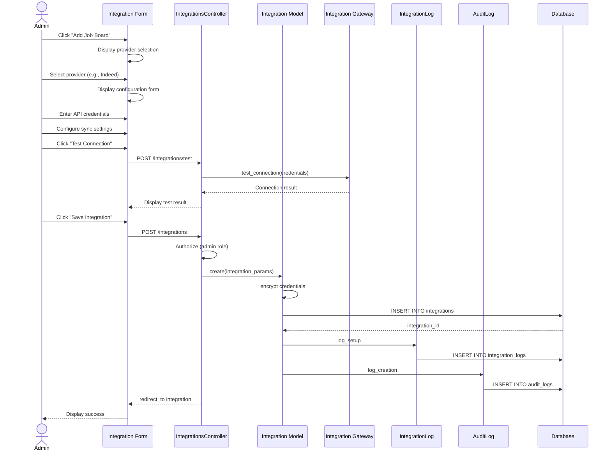

# UC-450: Configure Job Board Integration

## Metadata

| Attribute | Value |
|-----------|-------|
| **ID** | UC-450 |
| **Name** | Configure Job Board Integration |
| **Functional Area** | Integrations |
| **Primary Actor** | System Administrator (ACT-01) |
| **Priority** | P1 |
| **Complexity** | Medium |
| **Status** | Draft |

## Description

A system administrator configures a connection to an external job board (Indeed, LinkedIn, ZipRecruiter, Glassdoor) to enable automated job posting and application import. This includes providing API credentials, configuring sync settings, and testing the connection.

## Actors

| Actor | Role in Use Case |
|-------|------------------|
| System Administrator (ACT-01) | Configures and manages the integration |
| Integration Gateway (ACT-12) | Validates credentials and tests connectivity |

## Preconditions

- [ ] User is authenticated with System Administrator role
- [ ] Organization has an active subscription with integration features enabled
- [ ] Job board API credentials are available (obtained from provider)

## Postconditions

### Success
- [ ] New Integration record created with type='job_board'
- [ ] API credentials securely stored (encrypted)
- [ ] Connection test passed and status='active'
- [ ] IntegrationLog entry created for setup
- [ ] Audit log entry created

### Failure
- [ ] Integration record may be created with status='pending' or 'error'
- [ ] Error message displayed to administrator
- [ ] IntegrationLog entry records failure details

## Triggers

- Administrator navigates to Settings > Integrations > Job Boards
- Administrator clicks "Add Job Board" or "Connect" on a specific provider

## Basic Flow



| Step | Actor | Action | System Response |
|------|-------|--------|-----------------|
| 1 | Administrator | Clicks "Add Job Board" | System displays provider selection |
| 2 | Administrator | Selects job board provider | System displays configuration form |
| 3 | Administrator | Enters integration name | Name field populated |
| 4 | Administrator | Enters API key | API key captured (masked) |
| 5 | Administrator | Enters API secret (if required) | API secret captured (masked) |
| 6 | Administrator | Selects sync frequency | Frequency set (realtime/hourly/daily) |
| 7 | Administrator | Enables/disables auto-sync | Auto-sync preference saved |
| 8 | Administrator | Clicks "Test Connection" | System tests API connectivity |
| 9 | System | Validates credentials with provider | Returns success/failure |
| 10 | Administrator | Clicks "Save Integration" | System validates all fields |
| 11 | System | Encrypts sensitive credentials | Credentials secured |
| 12 | System | Creates Integration record | Integration saved with status='active' |
| 13 | System | Creates IntegrationLog entry | Setup logged |
| 14 | System | Creates audit log entry | Audit record saved |
| 15 | System | Redirects to integration detail | Success message displayed |

## Alternative Flows

### AF-1: OAuth-Based Authentication

**Trigger:** Provider requires OAuth authentication (e.g., LinkedIn)

| Step | Actor | Action | System Response |
|------|-------|--------|-----------------|
| 4a | Administrator | Clicks "Connect with LinkedIn" | System redirects to OAuth provider |
| 5a | System | OAuth provider displays consent | Administrator grants access |
| 6a | Provider | Redirects back with auth code | System exchanges for tokens |
| 7a | System | Stores access/refresh tokens | Tokens encrypted and saved |

**Resumption:** Returns to step 10 of basic flow

### AF-2: Save Without Testing

**Trigger:** Administrator skips connection test at step 8

| Step | Actor | Action | System Response |
|------|-------|--------|-----------------|
| 8a | Administrator | Clicks "Save Integration" directly | System proceeds without test |
| 9a | System | Creates Integration with status='pending' | Marked for later validation |

**Resumption:** Use case ends; connection tested on first sync

### AF-3: Edit Existing Integration

**Trigger:** Administrator modifies an existing job board integration

| Step | Actor | Action | System Response |
|------|-------|--------|-----------------|
| 1a | Administrator | Clicks "Edit" on existing integration | System displays form with current values |
| 2a | Administrator | Modifies settings | Fields updated |
| 3a | Administrator | Clicks "Update Integration" | System validates and saves changes |

**Resumption:** Use case ends

## Exception Flows

### EF-1: Invalid Credentials

**Trigger:** Connection test fails at step 9

| Step | Actor | Action | System Response |
|------|-------|--------|-----------------|
| 9.1 | System | Detects authentication failure | Displays error message |
| 9.2 | System | Logs failure in IntegrationLog | Failure recorded |
| 9.3 | Administrator | Verifies and re-enters credentials | Fields updated |
| 9.4 | Administrator | Retests connection | System re-validates |

**Resolution:** Returns to step 9, continues if valid

### EF-2: Provider Unavailable

**Trigger:** Job board API is unreachable during test

| Step | Actor | Action | System Response |
|------|-------|--------|-----------------|
| 9.1 | System | Connection timeout | Displays timeout error |
| 9.2 | System | Suggests retry later | Offers "Save as Pending" option |
| 9.3 | Administrator | Saves as pending | Integration created with status='pending' |

**Resolution:** Integration saved for manual activation later

### EF-3: Duplicate Integration

**Trigger:** Integration for same provider already exists

| Step | Actor | Action | System Response |
|------|-------|--------|-----------------|
| 10.1 | System | Detects duplicate | Displays warning |
| 10.2 | Administrator | Chooses to replace or cancel | System proceeds accordingly |

**Resolution:** Existing integration updated or action cancelled

## Business Rules

| ID | Rule | Description |
|----|------|-------------|
| BR-450.1 | Unique Provider | Only one active integration per provider per organization |
| BR-450.2 | Credential Encryption | API keys and secrets must be encrypted at rest |
| BR-450.3 | Valid Provider | Provider must be in allowed list: indeed, linkedin, ziprecruiter, glassdoor |
| BR-450.4 | Test Required for Active | Integration cannot be activated without successful connection test |
| BR-450.5 | Token Refresh | OAuth tokens must be refreshed before expiration |

## Data Requirements

### Input Data

| Field | Type | Required | Validation |
|-------|------|----------|------------|
| name | string | Yes | Max 255 chars, not blank |
| provider | enum | Yes | indeed, linkedin, ziprecruiter, glassdoor |
| api_key | string | Yes | Encrypted storage |
| api_secret | string | Conditional | Required for some providers, encrypted |
| sync_frequency | enum | No | realtime, hourly, daily, weekly, manual |
| auto_sync | boolean | No | Default true |
| settings | json | No | Provider-specific configuration |

### Output Data

| Field | Type | Description |
|-------|------|-------------|
| id | integer | Unique integration identifier |
| integration_type | string | 'job_board' |
| status | enum | pending, active, error, disabled |
| created_at | datetime | Timestamp of creation |
| last_sync_at | datetime | Last successful sync timestamp |

## Database Transactions

### Tables Affected

| Table | Operation | Conditions |
|-------|-----------|------------|
| integrations | CREATE | New integration |
| integration_logs | CREATE | Log setup activity |
| audit_logs | CREATE | Always |

### Transaction Detail

```sql
-- Configure Job Board Integration Transaction
BEGIN TRANSACTION;

-- Step 1: Insert integration record
INSERT INTO integrations (
    organization_id,
    created_by_id,
    integration_type,
    provider,
    name,
    api_key,
    api_secret,
    sync_frequency,
    auto_sync,
    settings,
    status,
    created_at,
    updated_at
) VALUES (
    @organization_id,
    @current_user_id,
    'job_board',
    @provider,
    @name,
    @encrypted_api_key,
    @encrypted_api_secret,
    @sync_frequency,
    @auto_sync,
    @settings,
    'active',
    NOW(),
    NOW()
);

SET @integration_id = LAST_INSERT_ID();

-- Step 2: Create integration log entry
INSERT INTO integration_logs (
    organization_id,
    integration_id,
    action,
    direction,
    status,
    started_at,
    completed_at,
    created_at,
    updated_at
) VALUES (
    @organization_id,
    @integration_id,
    'test_connection',
    'outbound',
    'success',
    NOW(),
    NOW(),
    NOW(),
    NOW()
);

-- Step 3: Create audit log entry
INSERT INTO audit_logs (
    organization_id,
    user_id,
    action,
    auditable_type,
    auditable_id,
    metadata,
    ip_address,
    user_agent,
    created_at
) VALUES (
    @organization_id,
    @current_user_id,
    'integration.created',
    'Integration',
    @integration_id,
    JSON_OBJECT(
        'provider', @provider,
        'integration_type', 'job_board',
        'status', 'active'
    ),
    @ip_address,
    @user_agent,
    NOW()
);

COMMIT;
```

### Rollback Scenarios

| Scenario | Rollback Action |
|----------|-----------------|
| Validation failure | No transaction started, return errors |
| Connection test failure | Integration saved with status='error' |
| Database error | Full rollback, display error |

## UI/UX Requirements

### Screen/Component

- **Location:** /admin/integrations/job_boards/new
- **Entry Point:**
  - Settings > Integrations > Job Boards > "Add Job Board"
  - Integration dashboard "Connect" card
- **Key Elements:**
  - Provider selection cards with logos
  - Credential input fields (masked)
  - Sync frequency dropdown
  - Auto-sync toggle
  - "Test Connection" button
  - Status indicator
  - Action buttons: "Save", "Cancel"

### Form Layout

```
+-------------------------------------------------------------+
| Configure Job Board Integration                              |
+-------------------------------------------------------------+
| Select Provider                                              |
| +------------+  +------------+  +------------+  +----------+ |
| | [Indeed]   |  | [LinkedIn] |  |[ZipRecruiter]| |[Glassdoor]| |
| +------------+  +------------+  +------------+  +----------+ |
|                                                              |
| Integration Name *                                           |
| +----------------------------------------------------------+ |
| | Indeed Job Board Integration                             | |
| +----------------------------------------------------------+ |
|                                                              |
| API Key *                                                    |
| +----------------------------------------------------------+ |
| | ****************************                             | |
| +----------------------------------------------------------+ |
|                                                              |
| API Secret                                                   |
| +----------------------------------------------------------+ |
| | ****************************                             | |
| +----------------------------------------------------------+ |
|                                                              |
| Sync Frequency              [v] Auto-sync enabled            |
| +------------------+                                         |
| | Hourly         v |                                         |
| +------------------+                                         |
|                                                              |
| Connection Status: [Test Connection]                         |
| ( ) Not tested  ( ) Connected  ( ) Failed                    |
|                                                              |
+-------------------------------------------------------------+
| [Cancel]                              [Save Integration]     |
+-------------------------------------------------------------+
```

## Non-Functional Requirements

| Requirement | Target |
|-------------|--------|
| Response Time | Form load < 1s, connection test < 10s |
| Availability | 99.9% |
| Credential Security | AES-256 encryption at rest |

## Security Considerations

- [x] Authentication required
- [x] Authorization check: User must have admin role
- [x] Data encryption: API keys and secrets encrypted using Rails encrypts
- [x] Audit logging: All integration changes logged
- [x] Credential masking: Secrets never displayed in plain text after save

## Related Use Cases

| Use Case | Relationship |
|----------|--------------|
| UC-451 Sync Jobs to Boards | Follows to push job postings |
| UC-452 Import Applications from Boards | Follows to pull applications |
| UC-460 View Integration Logs | Can follow to monitor activity |

---

## Data Model References

> Cross-references to [DATA_MODEL.md](../DATA_MODEL.md) and [CRUD_MATRIX.md](../CRUD_MATRIX.md)

### Subject Areas

| Subject Area | ID | Relationship |
|--------------|-----|--------------|
| Integration | SA-11 | Primary |
| Identity & Access | SA-01 | Secondary |
| Compliance & Audit | SA-09 | Reference |

### Entities CRUD

| Entity | C | R | U | D | Notes |
|--------|---|---|---|---|-------|
| Integration | ✓ | | | | Created in step 12 |
| IntegrationLog | ✓ | | | | Created in step 13 |
| AuditLog | ✓ | | | | Created in step 14 |
| User | | ✓ | | | Read for created_by association |

**Legend:** C = Create, R = Read, U = Update, D = Delete

---

## Process Model References

> Cross-references to [PROCESS_MODEL.md](../PROCESS_MODEL.md) and [PROCESS_CRUD_MATRIX.md](../PROCESS_CRUD_MATRIX.md)

| Attribute | Value | Link |
|-----------|-------|------|
| **Elementary Business Process** | EP-1121: Configure Job Board Integration | [PROCESS_MODEL.md#ep-1121](../PROCESS_MODEL.md#bp-603-integration-management) |
| **Business Process** | BP-603: Integration Management | [PROCESS_MODEL.md#bp-603](../PROCESS_MODEL.md#bp-603-integration-management) |
| **Business Function** | BF-06: System Administration | [PROCESS_MODEL.md#bf-06](../PROCESS_MODEL.md#bf-06-system-administration) |

### EBP Details

| Attribute | Value |
|-----------|-------|
| **Trigger** | Administrator initiates job board connection from settings |
| **Input** | Provider selection, API credentials, sync configuration |
| **Output** | Active Integration record with encrypted credentials |
| **Business Rules** | BR-450.1 through BR-450.5 (see Business Rules section) |

---

## Traceability Matrix

> Complete artifact mapping for requirements traceability

| Artifact Type | ID | Name | Link |
|---------------|-----|------|------|
| **Use Case** | UC-450 | Configure Job Board Integration | *(this document)* |
| **Elementary Process** | EP-1121 | Configure Job Board Integration | [PROCESS_MODEL.md](../PROCESS_MODEL.md#bp-603-integration-management) |
| **Business Process** | BP-603 | Integration Management | [PROCESS_MODEL.md](../PROCESS_MODEL.md#bp-603-integration-management) |
| **Business Function** | BF-06 | System Administration | [PROCESS_MODEL.md](../PROCESS_MODEL.md#bf-06-system-administration) |
| **Primary Actor** | ACT-01 | System Administrator | [ACTORS.md](../ACTORS.md#act-01-system-administrator) |
| **Subject Area (Primary)** | SA-11 | Integration | [DATA_MODEL.md](../DATA_MODEL.md#sa-11-integration) |
| **Subject Area (Secondary)** | SA-01 | Identity & Access | [DATA_MODEL.md](../DATA_MODEL.md#sa-01-identity--access) |
| **CRUD Matrix Row** | UC-450 | - | [CRUD_MATRIX.md](../CRUD_MATRIX.md#uc-450) |
| **Process CRUD Row** | EP-1121 | - | [PROCESS_CRUD_MATRIX.md](../PROCESS_CRUD_MATRIX.md#ep-1121) |

### Implementation Artifacts

| Artifact Type | Path/Reference | Status |
|---------------|----------------|--------|
| Controller | `app/controllers/admin/integrations_controller.rb` | Implemented |
| Model | `app/models/integration.rb` | Implemented |
| Model | `app/models/integration_log.rb` | Implemented |
| Service | `app/services/integrations/job_board_service.rb` | Planned |
| Policy | `app/policies/integration_policy.rb` | Implemented |
| View | `app/views/admin/integrations/job_boards/new.html.erb` | Planned |
| Test | `test/controllers/admin/integrations_controller_test.rb` | Implemented |

---

## Open Questions

1. Should we support multiple integrations per provider for different employer accounts?
2. What is the retry strategy for failed OAuth token refreshes?
3. Should integration setup trigger an initial sync automatically?

## Change History

| Version | Date | Author | Changes |
|---------|------|--------|---------|
| 0.1 | 2026-01-25 | System | Initial draft |
