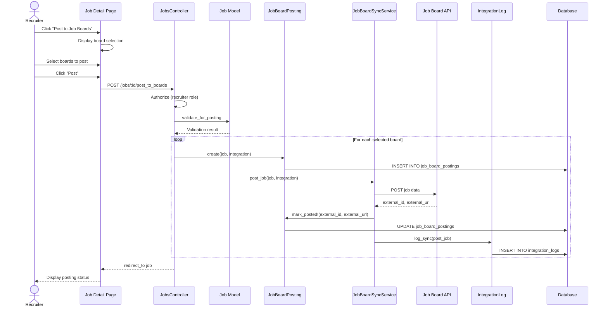

# UC-451: Sync Jobs to Boards

## Metadata

| Attribute | Value |
|-----------|-------|
| **ID** | UC-451 |
| **Name** | Sync Jobs to Boards |
| **Functional Area** | Integrations |
| **Primary Actor** | Recruiter (ACT-02) |
| **Priority** | P1 |
| **Complexity** | Medium |
| **Status** | Draft |

## Description

A recruiter publishes open job requisitions to configured external job boards. The system pushes job details to the selected boards, tracks posting status, and monitors performance metrics (views, clicks, applications). Jobs can be posted individually or in bulk.

## Actors

| Actor | Role in Use Case |
|-------|------------------|
| Recruiter (ACT-02) | Initiates job posting to boards |
| Integration Gateway (ACT-12) | Handles API communication with job boards |
| Scheduler (ACT-11) | Manages scheduled/automated sync operations |

## Preconditions

- [ ] User is authenticated with Recruiter or Admin role
- [ ] At least one job board integration is configured and active (UC-450)
- [ ] Job requisition exists and has status='open'
- [ ] Job has required fields populated (title, description, location)

## Postconditions

### Success
- [ ] JobBoardPosting records created for each board
- [ ] External job posting created on job board
- [ ] External ID and URL stored for tracking
- [ ] IntegrationLog entry created
- [ ] Job posting statistics tracking enabled

### Failure
- [ ] JobBoardPosting record created with status='error'
- [ ] Error message stored in last_error field
- [ ] IntegrationLog entry records failure details
- [ ] Recruiter notified of posting failure

## Triggers

- Recruiter clicks "Post to Job Boards" on job detail page
- Recruiter enables auto-post when opening a job
- Scheduler runs scheduled sync (if auto-sync enabled)
- Recruiter performs bulk post action from jobs list

## Basic Flow



| Step | Actor | Action | System Response |
|------|-------|--------|-----------------|
| 1 | Recruiter | Clicks "Post to Job Boards" | System displays board selection modal |
| 2 | Recruiter | Selects target job boards | Selected boards highlighted |
| 3 | Recruiter | Reviews posting preview | Preview shown for selected boards |
| 4 | Recruiter | Clicks "Post" | System validates job data |
| 5 | System | Validates job has required fields | Validation passes |
| 6 | System | Creates JobBoardPosting record (pending) | Posting record created |
| 7 | System | Sends job data to board API | API request initiated |
| 8 | System | Receives external posting ID | ID stored in posting record |
| 9 | System | Updates posting status to 'posted' | Status updated |
| 10 | System | Creates IntegrationLog entry | Sync activity logged |
| 11 | System | Repeats for each selected board | All boards processed |
| 12 | System | Displays posting summary | Success/failure per board shown |

## Alternative Flows

### AF-1: Bulk Post Multiple Jobs

**Trigger:** Recruiter selects multiple jobs from jobs list and clicks "Post to Boards"

| Step | Actor | Action | System Response |
|------|-------|--------|-----------------|
| 1a | Recruiter | Selects multiple jobs | Jobs highlighted |
| 2a | Recruiter | Clicks "Post to Boards" | System displays board selection |
| 3a | Recruiter | Selects boards, clicks "Post" | System queues all jobs for posting |
| 4a | System | Processes jobs asynchronously | Background job created |
| 5a | System | Notifies when complete | Summary notification sent |

**Resumption:** Use case ends

### AF-2: Auto-Post on Job Open

**Trigger:** Job has auto_post_to_boards enabled when opened

| Step | Actor | Action | System Response |
|------|-------|--------|-----------------|
| 1a | Scheduler | Detects job status changed to open | Job opened |
| 2a | System | Checks auto-post settings | Auto-post enabled |
| 3a | System | Retrieves configured boards | Active integrations found |
| 4a | System | Posts to all configured boards | Postings created |

**Resumption:** Use case ends

### AF-3: Update Existing Posting

**Trigger:** Job details changed after posting, recruiter clicks "Sync Updates"

| Step | Actor | Action | System Response |
|------|-------|--------|-----------------|
| 1a | Recruiter | Clicks "Sync Updates" | System identifies changed fields |
| 2a | System | Sends update to board API | PUT request to external API |
| 3a | System | Updates posting status to 'updated' | Status changed |

**Resumption:** Use case ends

## Exception Flows

### EF-1: API Rate Limit Exceeded

**Trigger:** Job board API returns rate limit error

| Step | Actor | Action | System Response |
|------|-------|--------|-----------------|
| 7.1 | System | Receives 429 Too Many Requests | Rate limit detected |
| 7.2 | System | Marks posting as 'pending' | Status set to pending |
| 7.3 | System | Schedules retry with backoff | Retry queued |
| 7.4 | System | Logs rate limit in IntegrationLog | Warning logged |

**Resolution:** Job automatically retried after backoff period

### EF-2: Invalid Job Data

**Trigger:** Job board rejects posting due to invalid data

| Step | Actor | Action | System Response |
|------|-------|--------|-----------------|
| 8.1 | System | Receives validation error | Error parsed |
| 8.2 | System | Marks posting as 'error' | Error status set |
| 8.3 | System | Stores error details | last_error populated |
| 8.4 | System | Notifies recruiter | Error notification sent |

**Resolution:** Recruiter fixes job data and retries

### EF-3: Integration Disabled

**Trigger:** Selected integration is no longer active

| Step | Actor | Action | System Response |
|------|-------|--------|-----------------|
| 5.1 | System | Detects integration inactive | Error displayed |
| 5.2 | System | Skips disabled integration | Board skipped |
| 5.3 | System | Continues with remaining boards | Other boards processed |

**Resolution:** Administrator re-activates integration if needed

## Business Rules

| ID | Rule | Description |
|----|------|-------------|
| BR-451.1 | Open Jobs Only | Only jobs with status='open' can be posted to boards |
| BR-451.2 | Required Fields | Job must have title, description, and location for posting |
| BR-451.3 | No Duplicates | Same job cannot be posted twice to same board (update instead) |
| BR-451.4 | Active Integration | Can only post to integrations with status='active' |
| BR-451.5 | Expiration Handling | Postings expire based on board-specific rules (30-60 days typical) |
| BR-451.6 | Stats Sync | Posting statistics synced at least daily when active |

## Data Requirements

### Input Data

| Field | Type | Required | Validation |
|-------|------|----------|------------|
| job_id | integer | Yes | Must exist and be open |
| integration_ids | array | Yes | At least one active integration |
| sponsored | boolean | No | Whether to create sponsored listing |
| budget | decimal | Conditional | Required if sponsored=true |

### Output Data

| Field | Type | Description |
|-------|------|-------------|
| posting_id | integer | JobBoardPosting record ID |
| external_id | string | ID assigned by job board |
| external_url | string | URL to view posting on board |
| status | enum | posted, updated, error, expired |
| expires_at | datetime | When posting will expire |

## Database Transactions

### Tables Affected

| Table | Operation | Conditions |
|-------|-----------|------------|
| job_board_postings | CREATE | New posting |
| job_board_postings | UPDATE | Status changes, stats updates |
| integration_logs | CREATE | Log sync activity |

### Transaction Detail

```sql
-- Sync Job to Board Transaction
BEGIN TRANSACTION;

-- Step 1: Create job board posting record
INSERT INTO job_board_postings (
    organization_id,
    job_id,
    integration_id,
    board_name,
    posted_by_id,
    status,
    created_at,
    updated_at
) VALUES (
    @organization_id,
    @job_id,
    @integration_id,
    @board_name,
    @current_user_id,
    'pending',
    NOW(),
    NOW()
);

SET @posting_id = LAST_INSERT_ID();

-- Step 2: After successful API call, update posting
UPDATE job_board_postings
SET
    status = 'posted',
    external_id = @external_id,
    external_url = @external_url,
    posted_at = NOW(),
    expires_at = @expires_at,
    last_synced_at = NOW()
WHERE id = @posting_id;

-- Step 3: Create integration log
INSERT INTO integration_logs (
    organization_id,
    integration_id,
    action,
    direction,
    status,
    resource_type,
    resource_id,
    started_at,
    completed_at,
    records_processed,
    records_created,
    created_at,
    updated_at
) VALUES (
    @organization_id,
    @integration_id,
    'post_job',
    'outbound',
    'success',
    'Job',
    @job_id,
    @start_time,
    NOW(),
    1,
    1,
    NOW(),
    NOW()
);

COMMIT;
```

### Rollback Scenarios

| Scenario | Rollback Action |
|----------|-----------------|
| Validation failure | No transaction started, return errors |
| API failure | Update posting status to 'error', log failure |
| Partial bulk failure | Continue with remaining jobs, report failures |

## UI/UX Requirements

### Screen/Component

- **Location:** /admin/jobs/:id (job detail page)
- **Entry Point:**
  - "Post to Job Boards" button on job detail
  - Bulk action from jobs list
  - Auto-post on job open
- **Key Elements:**
  - Board selection checkboxes with logos
  - Posting preview per board
  - Status indicators for existing postings
  - Performance metrics (views, clicks, applications)
  - Action buttons: "Post", "Sync Updates", "Remove"

### Form Layout

```
+-------------------------------------------------------------+
| Post to Job Boards                                           |
+-------------------------------------------------------------+
| Job: Senior Software Engineer                                |
+-------------------------------------------------------------+
| Select Job Boards                                            |
|                                                              |
| [x] Indeed       Status: Not posted    [Preview]             |
|     Auto-renew: [x]                                          |
|                                                              |
| [x] LinkedIn     Status: Not posted    [Preview]             |
|     Sponsored: [ ]  Budget: $___/day                         |
|                                                              |
| [ ] ZipRecruiter Status: Not posted    [Preview]             |
|                                                              |
| [ ] Glassdoor    Status: Not posted    [Preview]             |
|                                                              |
+-------------------------------------------------------------+
| Posting Summary                                              |
| - Selected: 2 boards                                         |
| - Estimated reach: 50,000+ candidates                        |
+-------------------------------------------------------------+
| [Cancel]                                      [Post to 2 Boards] |
+-------------------------------------------------------------+
```

### Posted Status View

```
+-------------------------------------------------------------+
| Job Board Postings                                           |
+-------------------------------------------------------------+
| Indeed                                                       |
| Status: [Posted]  Posted: Jan 25, 2026  Expires: Feb 24, 2026|
| Views: 1,234  Clicks: 89  Applications: 12                   |
| [View on Indeed] [Sync Updates] [Remove]                     |
+-------------------------------------------------------------+
| LinkedIn                                                     |
| Status: [Posted]  Posted: Jan 25, 2026  Expires: Mar 25, 2026|
| Views: 2,567  Clicks: 156  Applications: 23                  |
| [View on LinkedIn] [Sync Updates] [Remove]                   |
+-------------------------------------------------------------+
```

## Non-Functional Requirements

| Requirement | Target |
|-------------|--------|
| Response Time | Individual post < 5s, bulk post queued |
| Availability | 99.9% |
| Retry Policy | Exponential backoff: 1m, 5m, 15m, 1h |
| Stats Freshness | Statistics updated at least daily |

## Security Considerations

- [x] Authentication required
- [x] Authorization check: User must be recruiter on job or admin
- [x] Data validation: Job data sanitized before sending to external API
- [x] Audit logging: All posting activity logged

## Related Use Cases

| Use Case | Relationship |
|----------|--------------|
| UC-450 Configure Job Board Integration | Precedes (integration must exist) |
| UC-452 Import Applications from Boards | Follows (applications imported) |
| UC-006 Open Job | Can trigger auto-post |
| UC-012 Remove from Job Boards | Inverse operation |
| UC-460 View Integration Logs | Monitor posting activity |

---

## Data Model References

> Cross-references to [DATA_MODEL.md](../DATA_MODEL.md) and [CRUD_MATRIX.md](../CRUD_MATRIX.md)

### Subject Areas

| Subject Area | ID | Relationship |
|--------------|-----|--------------|
| Integration | SA-11 | Primary |
| Job Requisition | SA-03 | Secondary |

### Entities CRUD

| Entity | C | R | U | D | Notes |
|--------|---|---|---|---|-------|
| JobBoardPosting | ✓ | ✓ | ✓ | | Created, read, updated during sync |
| Integration | | ✓ | | | Read to get API credentials |
| IntegrationLog | ✓ | | | | Created for each sync operation |
| Job | | ✓ | | | Read to get job data for posting |

**Legend:** C = Create, R = Read, U = Update, D = Delete

---

## Process Model References

> Cross-references to [PROCESS_MODEL.md](../PROCESS_MODEL.md) and [PROCESS_CRUD_MATRIX.md](../PROCESS_CRUD_MATRIX.md)

| Attribute | Value | Link |
|-----------|-------|------|
| **Elementary Business Process** | EP-1122: Sync Jobs to Boards | [PROCESS_MODEL.md#ep-1122](../PROCESS_MODEL.md#bp-603-integration-management) |
| **Business Process** | BP-603: Integration Management | [PROCESS_MODEL.md#bp-603](../PROCESS_MODEL.md#bp-603-integration-management) |
| **Business Function** | BF-06: System Administration | [PROCESS_MODEL.md#bf-06](../PROCESS_MODEL.md#bf-06-system-administration) |

### EBP Details

| Attribute | Value |
|-----------|-------|
| **Trigger** | Recruiter initiates post or auto-sync schedule |
| **Input** | Job requisition data, target job boards |
| **Output** | External job postings with tracking IDs |
| **Business Rules** | BR-451.1 through BR-451.6 (see Business Rules section) |

---

## Traceability Matrix

> Complete artifact mapping for requirements traceability

| Artifact Type | ID | Name | Link |
|---------------|-----|------|------|
| **Use Case** | UC-451 | Sync Jobs to Boards | *(this document)* |
| **Elementary Process** | EP-1122 | Sync Jobs to Boards | [PROCESS_MODEL.md](../PROCESS_MODEL.md#bp-603-integration-management) |
| **Business Process** | BP-603 | Integration Management | [PROCESS_MODEL.md](../PROCESS_MODEL.md#bp-603-integration-management) |
| **Business Function** | BF-06 | System Administration | [PROCESS_MODEL.md](../PROCESS_MODEL.md#bf-06-system-administration) |
| **Primary Actor** | ACT-02 | Recruiter | [ACTORS.md](../ACTORS.md#act-02-recruiter) |
| **Subject Area (Primary)** | SA-11 | Integration | [DATA_MODEL.md](../DATA_MODEL.md#sa-11-integration) |
| **Subject Area (Secondary)** | SA-03 | Job Requisition | [DATA_MODEL.md](../DATA_MODEL.md#sa-03-job-requisition) |
| **CRUD Matrix Row** | UC-451 | - | [CRUD_MATRIX.md](../CRUD_MATRIX.md#uc-451) |
| **Process CRUD Row** | EP-1122 | - | [PROCESS_CRUD_MATRIX.md](../PROCESS_CRUD_MATRIX.md#ep-1122) |

### Implementation Artifacts

| Artifact Type | Path/Reference | Status |
|---------------|----------------|--------|
| Controller | `app/controllers/admin/job_board_postings_controller.rb` | Planned |
| Model | `app/models/job_board_posting.rb` | Implemented |
| Model | `app/models/integration_log.rb` | Implemented |
| Service | `app/services/integrations/job_board_sync_service.rb` | Planned |
| Job | `app/jobs/sync_job_to_boards_job.rb` | Planned |
| View | `app/views/admin/jobs/_job_board_postings.html.erb` | Planned |
| Test | `test/services/integrations/job_board_sync_service_test.rb` | Planned |

---

## Open Questions

1. Should we support board-specific job descriptions (formatted differently)?
2. What is the maximum number of jobs that can be bulk-posted at once?
3. How do we handle timezone differences for posting schedules?

## Change History

| Version | Date | Author | Changes |
|---------|------|--------|---------|
| 0.1 | 2026-01-25 | System | Initial draft |
