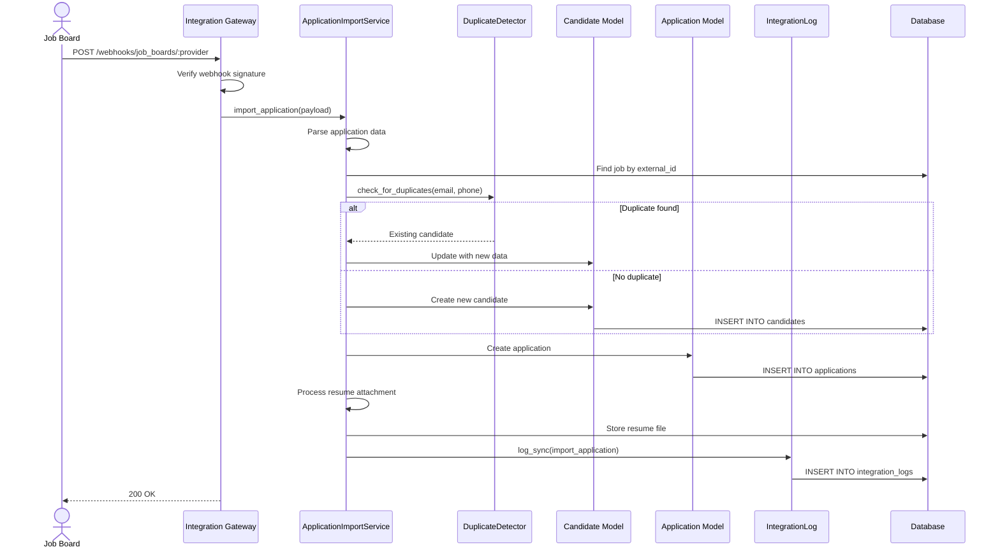

# UC-452: Import Applications from Boards

## Metadata

| Attribute | Value |
|-----------|-------|
| **ID** | UC-452 |
| **Name** | Import Applications from Boards |
| **Functional Area** | Integrations |
| **Primary Actor** | Integration Gateway (ACT-12) |
| **Priority** | P1 |
| **Complexity** | High |
| **Status** | Draft |

## Description

The system automatically imports candidate applications submitted through external job boards (Indeed, LinkedIn, ZipRecruiter, Glassdoor) into the Ledgoria pipeline. Applications are matched to the corresponding job requisition, candidates are created or merged with existing records, and applications enter the standard pipeline workflow.

## Actors

| Actor | Role in Use Case |
|-------|------------------|
| Integration Gateway (ACT-12) | Receives and processes incoming applications |
| Scheduler (ACT-11) | Triggers scheduled import operations |
| System Administrator (ACT-01) | Monitors and troubleshoots import issues |

## Preconditions

- [ ] Job board integration is configured and active (UC-450)
- [ ] Job has been posted to the board with valid external_id (UC-451)
- [ ] Sync frequency allows import (not manual-only)
- [ ] Integration has valid, non-expired credentials

## Postconditions

### Success
- [ ] Candidate record created or updated
- [ ] Application record created and linked to job
- [ ] Resume attachment stored (if provided)
- [ ] Application enters 'new' stage in pipeline
- [ ] Source attribution recorded (job board name)
- [ ] Duplicate detection performed
- [ ] IntegrationLog entry created

### Failure
- [ ] IntegrationLog entry records failure details
- [ ] Integration marked as 'error' if repeated failures
- [ ] Administrator notified for critical failures

## Triggers

- Webhook received from job board (real-time)
- Scheduled sync job runs (hourly/daily based on configuration)
- Administrator manually triggers import

## Basic Flow



| Step | Actor | Action | System Response |
|------|-------|--------|-----------------|
| 1 | Job Board | Sends application webhook | Gateway receives request |
| 2 | Gateway | Verifies webhook signature | Signature validated |
| 3 | Gateway | Parses application payload | Data extracted |
| 4 | System | Looks up job by external posting ID | Job found |
| 5 | System | Checks for duplicate candidate | Duplicate detection runs |
| 6 | System | Creates or updates candidate record | Candidate saved |
| 7 | System | Creates application record | Application linked to job |
| 8 | System | Downloads and stores resume | Resume attached |
| 9 | System | Sets application source | Source = job board name |
| 10 | System | Triggers new application notifications | Team notified |
| 11 | System | Creates IntegrationLog entry | Import logged |
| 12 | Gateway | Returns success response | 200 OK sent |

## Alternative Flows

### AF-1: Scheduled Batch Import

**Trigger:** Scheduler runs import job (for boards without webhooks)

| Step | Actor | Action | System Response |
|------|-------|--------|-----------------|
| 1a | Scheduler | Triggers import job | Job starts |
| 2a | System | Fetches new applications via API | GET request to board |
| 3a | System | Loops through applications | Each processed individually |
| 4a | System | Tracks last_sync cursor | Cursor updated |

**Resumption:** Steps 4-11 of basic flow for each application

### AF-2: Duplicate Candidate Merge

**Trigger:** Candidate with same email already exists

| Step | Actor | Action | System Response |
|------|-------|--------|-----------------|
| 6a | System | Detects existing candidate | Duplicate found |
| 6b | System | Compares data completeness | Determines merge strategy |
| 6c | System | Updates candidate with new data | Fields merged |
| 6d | System | Links new application to existing candidate | Association created |

**Resumption:** Continues at step 7

### AF-3: Resume Parsing

**Trigger:** Resume file included in application

| Step | Actor | Action | System Response |
|------|-------|--------|-----------------|
| 8a | System | Downloads resume from URL | File retrieved |
| 8b | System | Stores in Active Storage | File saved |
| 8c | System | Queues resume parsing job | Parser triggered |
| 8d | System | Extracts skills and experience | Data enriched |

**Resumption:** Continues at step 9

## Exception Flows

### EF-1: Invalid Webhook Signature

**Trigger:** Signature verification fails at step 2

| Step | Actor | Action | System Response |
|------|-------|--------|-----------------|
| 2.1 | Gateway | Detects invalid signature | Security check failed |
| 2.2 | System | Logs security warning | Warning recorded |
| 2.3 | Gateway | Returns 401 Unauthorized | Request rejected |

**Resolution:** Webhook ignored, administrator alerted for investigation

### EF-2: Job Not Found

**Trigger:** External posting ID does not match any job

| Step | Actor | Action | System Response |
|------|-------|--------|-----------------|
| 4.1 | System | No job matches external_id | Job lookup fails |
| 4.2 | System | Logs orphan application | Warning logged |
| 4.3 | System | Queues for manual review | Held for admin |

**Resolution:** Administrator manually assigns to job or discards

### EF-3: Resume Download Failure

**Trigger:** Cannot download resume from provided URL

| Step | Actor | Action | System Response |
|------|-------|--------|-----------------|
| 8.1 | System | Resume URL returns error | Download failed |
| 8.2 | System | Creates application without resume | Application saved |
| 8.3 | System | Logs missing resume | Warning logged |
| 8.4 | System | Schedules retry | Retry queued |

**Resolution:** Application created; resume retried later

### EF-4: Rate Limit During Batch Import

**Trigger:** Job board API returns rate limit error during batch sync

| Step | Actor | Action | System Response |
|------|-------|--------|-----------------|
| 2.1 | System | Receives 429 response | Rate limit hit |
| 2.2 | System | Records import progress cursor | State saved |
| 2.3 | System | Schedules retry with backoff | Retry queued |

**Resolution:** Import continues from last position after backoff

## Business Rules

| ID | Rule | Description |
|----|------|-------------|
| BR-452.1 | Signature Verification | All webhooks must have valid HMAC signature |
| BR-452.2 | Job Matching | Application must match an active job posting |
| BR-452.3 | Duplicate Handling | Existing candidate by email takes precedence |
| BR-452.4 | Source Attribution | Application source must reflect originating board |
| BR-452.5 | Resume Size Limit | Resume files limited to 10MB |
| BR-452.6 | Data Retention | Raw webhook payloads retained for 30 days |

## Data Requirements

### Input Data (Webhook Payload)

| Field | Type | Required | Validation |
|-------|------|----------|------------|
| external_application_id | string | Yes | Unique from source |
| external_job_id | string | Yes | Must match posting |
| candidate_email | string | Yes | Valid email format |
| candidate_first_name | string | Yes | Not blank |
| candidate_last_name | string | Yes | Not blank |
| candidate_phone | string | No | Phone format |
| resume_url | string | No | Valid HTTPS URL |
| cover_letter | text | No | Max 50,000 chars |
| applied_at | datetime | Yes | ISO 8601 format |
| custom_answers | json | No | Question responses |

### Output Data

| Field | Type | Description |
|-------|------|-------------|
| candidate_id | integer | Created/updated candidate |
| application_id | integer | New application record |
| source | string | Job board attribution |
| imported_at | datetime | Import timestamp |

## Database Transactions

### Tables Affected

| Table | Operation | Conditions |
|-------|-----------|------------|
| candidates | CREATE/UPDATE | New or existing candidate |
| applications | CREATE | New application |
| resumes | CREATE | If resume provided |
| integration_logs | CREATE | Log import activity |

### Transaction Detail

```sql
-- Import Application from Board Transaction
BEGIN TRANSACTION;

-- Step 1: Find or create candidate
INSERT INTO candidates (
    organization_id,
    email,
    first_name,
    last_name,
    phone,
    source,
    source_detail,
    created_at,
    updated_at
) VALUES (
    @organization_id,
    @candidate_email,
    @first_name,
    @last_name,
    @phone,
    'job_board',
    @board_name,
    NOW(),
    NOW()
)
ON CONFLICT (organization_id, email) DO UPDATE SET
    phone = COALESCE(candidates.phone, EXCLUDED.phone),
    updated_at = NOW();

SET @candidate_id = (
    SELECT id FROM candidates
    WHERE organization_id = @organization_id AND email = @candidate_email
);

-- Step 2: Create application
INSERT INTO applications (
    organization_id,
    candidate_id,
    job_id,
    source,
    source_detail,
    external_id,
    status,
    stage_id,
    applied_at,
    created_at,
    updated_at
) VALUES (
    @organization_id,
    @candidate_id,
    @job_id,
    'job_board',
    @board_name,
    @external_application_id,
    'active',
    @initial_stage_id,
    @applied_at,
    NOW(),
    NOW()
);

SET @application_id = LAST_INSERT_ID();

-- Step 3: Create integration log
INSERT INTO integration_logs (
    organization_id,
    integration_id,
    action,
    direction,
    status,
    resource_type,
    resource_id,
    started_at,
    completed_at,
    records_processed,
    records_created,
    created_at,
    updated_at
) VALUES (
    @organization_id,
    @integration_id,
    'import_application',
    'inbound',
    'success',
    'Application',
    @application_id,
    @start_time,
    NOW(),
    1,
    1,
    NOW(),
    NOW()
);

COMMIT;
```

### Rollback Scenarios

| Scenario | Rollback Action |
|----------|-----------------|
| Invalid signature | No transaction, reject webhook |
| Job not found | Partial save to orphan queue |
| Candidate creation fails | Full rollback |
| Resume download fails | Create without resume, log warning |

## UI/UX Requirements

### Screen/Component

- **Location:** /admin/integrations/:id/logs (integration log view)
- **Entry Point:**
  - Integration detail page > "View Import History"
  - Candidate profile > "Source" badge links to import details
- **Key Elements:**
  - Import activity timeline
  - Success/failure counts
  - Pending applications queue
  - Manual retry button for failed imports

### Import Dashboard

```
+-------------------------------------------------------------+
| Application Import Dashboard                                 |
+-------------------------------------------------------------+
| Today's Imports                                              |
| +---------------+  +---------------+  +---------------+      |
| | Indeed        |  | LinkedIn      |  | ZipRecruiter  |      |
| | 45 imported   |  | 23 imported   |  | 12 imported   |      |
| | 2 failed      |  | 0 failed      |  | 1 failed      |      |
| +---------------+  +---------------+  +---------------+      |
|                                                              |
| Failed Imports (3)                                [Retry All]|
| +----------------------------------------------------------+|
| | Indeed - Jan 25, 10:34 AM                                ||
| | Error: Job posting not found (external_id: abc123)       ||
| | [View Details] [Retry] [Discard]                         ||
| +----------------------------------------------------------+|
| | ZipRecruiter - Jan 25, 9:15 AM                           ||
| | Error: Resume download timeout                            ||
| | [View Details] [Retry] [Discard]                         ||
| +----------------------------------------------------------+|
|                                                              |
| Recent Successful Imports                          [View All]|
| - John Smith (Indeed) -> Senior Developer - 10:45 AM        |
| - Jane Doe (LinkedIn) -> Product Manager - 10:32 AM         |
| - Bob Wilson (Indeed) -> Software Engineer - 10:28 AM       |
+-------------------------------------------------------------+
```

## Non-Functional Requirements

| Requirement | Target |
|-------------|--------|
| Response Time | Webhook response < 2s |
| Throughput | 100 applications/minute |
| Availability | 99.9% |
| Data Freshness | Real-time via webhooks, < 1 hour for scheduled |

## Security Considerations

- [x] Webhook signature verification required
- [x] HTTPS only for all external communications
- [x] PII encryption: Candidate email and phone encrypted at rest
- [x] Rate limiting on webhook endpoints
- [x] Audit logging: All imports logged with source details

## Related Use Cases

| Use Case | Relationship |
|----------|--------------|
| UC-450 Configure Job Board Integration | Precedes (integration must exist) |
| UC-451 Sync Jobs to Boards | Precedes (job must be posted) |
| UC-100 Apply for Job | Similar output (application created) |
| UC-059 Detect Duplicates | Invoked during import |
| UC-460 View Integration Logs | Monitor import activity |

---

## Data Model References

> Cross-references to [DATA_MODEL.md](../DATA_MODEL.md) and [CRUD_MATRIX.md](../CRUD_MATRIX.md)

### Subject Areas

| Subject Area | ID | Relationship |
|--------------|-----|--------------|
| Integration | SA-11 | Primary |
| Candidate | SA-04 | Secondary |
| Application Pipeline | SA-05 | Secondary |

### Entities CRUD

| Entity | C | R | U | D | Notes |
|--------|---|---|---|---|-------|
| Candidate | ✓ | ✓ | ✓ | | Created or updated from import |
| Application | ✓ | | | | Created from imported data |
| Resume | ✓ | | | | Created if resume attached |
| Integration | | ✓ | ✓ | | Read config, update sync status |
| IntegrationLog | ✓ | | | | Log each import |
| JobBoardPosting | | ✓ | | | Read to match external_id |

**Legend:** C = Create, R = Read, U = Update, D = Delete

---

## Process Model References

> Cross-references to [PROCESS_MODEL.md](../PROCESS_MODEL.md) and [PROCESS_CRUD_MATRIX.md](../PROCESS_CRUD_MATRIX.md)

| Attribute | Value | Link |
|-----------|-------|------|
| **Elementary Business Process** | EP-1123: Import Applications from Boards | [PROCESS_MODEL.md#ep-1123](../PROCESS_MODEL.md#bp-603-integration-management) |
| **Business Process** | BP-603: Integration Management | [PROCESS_MODEL.md#bp-603](../PROCESS_MODEL.md#bp-603-integration-management) |
| **Business Function** | BF-06: System Administration | [PROCESS_MODEL.md#bf-06](../PROCESS_MODEL.md#bf-06-system-administration) |

### EBP Details

| Attribute | Value |
|-----------|-------|
| **Trigger** | Webhook received or scheduled sync job |
| **Input** | Application data from job board |
| **Output** | Candidate and Application records in system |
| **Business Rules** | BR-452.1 through BR-452.6 (see Business Rules section) |

---

## Traceability Matrix

> Complete artifact mapping for requirements traceability

| Artifact Type | ID | Name | Link |
|---------------|-----|------|------|
| **Use Case** | UC-452 | Import Applications from Boards | *(this document)* |
| **Elementary Process** | EP-1123 | Import Applications from Boards | [PROCESS_MODEL.md](../PROCESS_MODEL.md#bp-603-integration-management) |
| **Business Process** | BP-603 | Integration Management | [PROCESS_MODEL.md](../PROCESS_MODEL.md#bp-603-integration-management) |
| **Business Function** | BF-06 | System Administration | [PROCESS_MODEL.md](../PROCESS_MODEL.md#bf-06-system-administration) |
| **Primary Actor** | ACT-12 | Integration Gateway | [ACTORS.md](../ACTORS.md#act-12-integration-gateway) |
| **Subject Area (Primary)** | SA-11 | Integration | [DATA_MODEL.md](../DATA_MODEL.md#sa-11-integration) |
| **Subject Area (Secondary)** | SA-04 | Candidate | [DATA_MODEL.md](../DATA_MODEL.md#sa-04-candidate) |
| **CRUD Matrix Row** | UC-452 | - | [CRUD_MATRIX.md](../CRUD_MATRIX.md#uc-452) |
| **Process CRUD Row** | EP-1123 | - | [PROCESS_CRUD_MATRIX.md](../PROCESS_CRUD_MATRIX.md#ep-1123) |

### Implementation Artifacts

| Artifact Type | Path/Reference | Status |
|---------------|----------------|--------|
| Controller | `app/controllers/webhooks/job_boards_controller.rb` | Planned |
| Service | `app/services/integrations/application_import_service.rb` | Planned |
| Job | `app/jobs/import_applications_job.rb` | Planned |
| Model | `app/models/integration.rb` | Implemented |
| Model | `app/models/integration_log.rb` | Implemented |
| Test | `test/services/integrations/application_import_service_test.rb` | Planned |

---

## Open Questions

1. How do we handle applications for jobs that have been closed?
2. Should we support custom field mapping per job board?
3. What is the retention period for orphaned applications?

## Change History

| Version | Date | Author | Changes |
|---------|------|--------|---------|
| 0.1 | 2026-01-25 | System | Initial draft |
