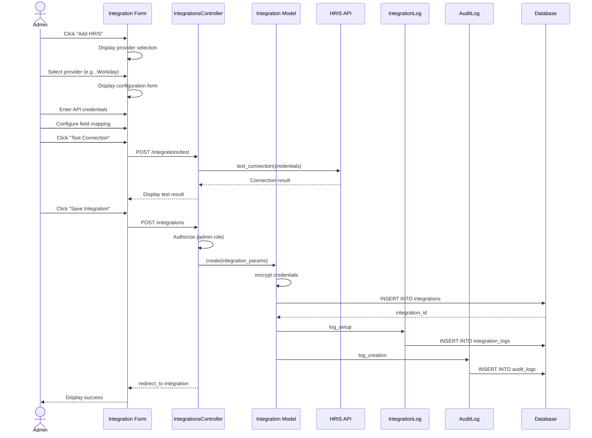

# UC-453: Configure HRIS Integration

## Metadata

| Attribute | Value |
|-----------|-------|
| **ID** | UC-453 |
| **Name** | Configure HRIS Integration |
| **Functional Area** | Integrations |
| **Primary Actor** | System Administrator (ACT-01) |
| **Priority** | P1 |
| **Complexity** | Medium |
| **Status** | Draft |

## Description

A system administrator configures a connection to an external HRIS (Human Resource Information System) such as Workday, BambooHR, ADP, or Paychex. This enables automated export of hired candidates to the HRIS for onboarding. Configuration includes API credentials, field mappings between Ledgoria and HRIS fields, and export preferences.

## Actors

| Actor | Role in Use Case |
|-------|------------------|
| System Administrator (ACT-01) | Configures and manages the HRIS integration |
| Integration Gateway (ACT-12) | Validates credentials and tests connectivity |

## Preconditions

- [ ] User is authenticated with System Administrator role
- [ ] Organization has an active subscription with integration features enabled
- [ ] HRIS API credentials are available (obtained from HRIS provider)
- [ ] HRIS account has appropriate permissions for employee creation

## Postconditions

### Success
- [ ] New Integration record created with type='hris'
- [ ] API credentials securely stored (encrypted)
- [ ] Field mapping configured for data export
- [ ] Connection test passed and status='active'
- [ ] IntegrationLog entry created for setup
- [ ] Audit log entry created

### Failure
- [ ] Integration record may be created with status='pending' or 'error'
- [ ] Error message displayed to administrator
- [ ] IntegrationLog entry records failure details

## Triggers

- Administrator navigates to Settings > Integrations > HRIS
- Administrator clicks "Add HRIS" or "Connect" on a specific provider

## Basic Flow



| Step | Actor | Action | System Response |
|------|-------|--------|-----------------|
| 1 | Administrator | Clicks "Add HRIS" | System displays provider selection |
| 2 | Administrator | Selects HRIS provider | System displays configuration form |
| 3 | Administrator | Enters integration name | Name field populated |
| 4 | Administrator | Enters API endpoint URL | Endpoint captured |
| 5 | Administrator | Enters API key/credentials | Credentials captured (masked) |
| 6 | Administrator | Configures field mapping | Mapping UI displayed |
| 7 | Administrator | Maps Ledgoria fields to HRIS fields | Mappings saved |
| 8 | Administrator | Clicks "Test Connection" | System tests API connectivity |
| 9 | System | Validates credentials with HRIS | Returns success/failure |
| 10 | Administrator | Clicks "Save Integration" | System validates all fields |
| 11 | System | Encrypts sensitive credentials | Credentials secured |
| 12 | System | Creates Integration record | Integration saved with status='active' |
| 13 | System | Creates IntegrationLog entry | Setup logged |
| 14 | System | Creates audit log entry | Audit record saved |
| 15 | System | Redirects to integration detail | Success message displayed |

## Alternative Flows

### AF-1: OAuth-Based Authentication

**Trigger:** Provider requires OAuth authentication (e.g., Workday)

| Step | Actor | Action | System Response |
|------|-------|--------|-----------------|
| 5a | Administrator | Clicks "Connect with Workday" | System redirects to OAuth provider |
| 6a | System | OAuth provider displays consent | Administrator grants access |
| 7a | Provider | Redirects back with auth code | System exchanges for tokens |
| 8a | System | Stores access/refresh tokens | Tokens encrypted and saved |

**Resumption:** Returns to step 6 (field mapping) of basic flow

### AF-2: Use Default Field Mapping

**Trigger:** Administrator chooses to use provider's default mapping

| Step | Actor | Action | System Response |
|------|-------|--------|-----------------|
| 6a | Administrator | Clicks "Use Default Mapping" | System loads predefined mapping |
| 7a | System | Displays default field mapping | Standard mappings shown |
| 8a | Administrator | Reviews and accepts defaults | Mappings confirmed |

**Resumption:** Returns to step 8 (test connection) of basic flow

### AF-3: Edit Existing Integration

**Trigger:** Administrator modifies an existing HRIS integration

| Step | Actor | Action | System Response |
|------|-------|--------|-----------------|
| 1a | Administrator | Clicks "Edit" on existing integration | System displays form with current values |
| 2a | Administrator | Modifies settings or mapping | Fields updated |
| 3a | Administrator | Clicks "Update Integration" | System validates and saves changes |

**Resumption:** Use case ends

## Exception Flows

### EF-1: Invalid Credentials

**Trigger:** Connection test fails at step 9

| Step | Actor | Action | System Response |
|------|-------|--------|-----------------|
| 9.1 | System | Detects authentication failure | Displays error message |
| 9.2 | System | Logs failure in IntegrationLog | Failure recorded |
| 9.3 | Administrator | Verifies and re-enters credentials | Fields updated |
| 9.4 | Administrator | Retests connection | System re-validates |

**Resolution:** Returns to step 9, continues if valid

### EF-2: HRIS API Unavailable

**Trigger:** HRIS API is unreachable during test

| Step | Actor | Action | System Response |
|------|-------|--------|-----------------|
| 9.1 | System | Connection timeout | Displays timeout error |
| 9.2 | System | Suggests retry later | Offers "Save as Pending" option |
| 9.3 | Administrator | Saves as pending | Integration created with status='pending' |

**Resolution:** Integration saved for manual activation later

### EF-3: Invalid Field Mapping

**Trigger:** Required HRIS field not mapped

| Step | Actor | Action | System Response |
|------|-------|--------|-----------------|
| 7.1 | System | Detects unmapped required field | Warning displayed |
| 7.2 | Administrator | Maps required field | Mapping completed |

**Resolution:** Continues when all required fields mapped

## Business Rules

| ID | Rule | Description |
|----|------|-------------|
| BR-453.1 | Unique Provider | Only one active integration per HRIS provider per organization |
| BR-453.2 | Credential Encryption | API keys, secrets, and tokens must be encrypted at rest |
| BR-453.3 | Valid Provider | Provider must be in allowed list: workday, bamboo_hr, adp, paychex |
| BR-453.4 | Required Mapping | Employee ID, first name, last name, email, start date must be mapped |
| BR-453.5 | Test Required | Integration cannot be activated without successful connection test |
| BR-453.6 | Token Refresh | OAuth tokens must be refreshed before expiration |

## Data Requirements

### Input Data

| Field | Type | Required | Validation |
|-------|------|----------|------------|
| name | string | Yes | Max 255 chars, not blank |
| provider | enum | Yes | workday, bamboo_hr, adp, paychex |
| api_endpoint | string | Yes | Valid HTTPS URL |
| api_key | string | Conditional | Required for API key auth |
| api_secret | string | Conditional | Required for some providers |
| client_id | string | Conditional | Required for OAuth |
| client_secret | string | Conditional | Required for OAuth |
| field_mapping | json | Yes | Maps Ledgoria to HRIS fields |
| settings | json | No | Provider-specific configuration |

### Field Mapping Structure

| Ledgoria Field | HRIS Field | Required | Notes |
|----------------|------------|----------|-------|
| candidate.first_name | employee.first_name | Yes | Direct mapping |
| candidate.last_name | employee.last_name | Yes | Direct mapping |
| candidate.email | employee.work_email | Yes | Direct mapping |
| candidate.phone | employee.phone | No | Optional |
| offer.start_date | employee.hire_date | Yes | Date format conversion |
| offer.salary | employee.base_salary | No | Currency handling |
| job.title | employee.job_title | No | May require lookup |
| job.department_id | employee.department_id | No | Requires mapping table |

### Output Data

| Field | Type | Description |
|-------|------|-------------|
| id | integer | Unique integration identifier |
| integration_type | string | 'hris' |
| status | enum | pending, active, error, disabled |
| created_at | datetime | Timestamp of creation |
| last_sync_at | datetime | Last successful export timestamp |

## Database Transactions

### Tables Affected

| Table | Operation | Conditions |
|-------|-----------|------------|
| integrations | CREATE | New integration |
| integration_logs | CREATE | Log setup activity |
| audit_logs | CREATE | Always |

### Transaction Detail

```sql
-- Configure HRIS Integration Transaction
BEGIN TRANSACTION;

-- Step 1: Insert integration record
INSERT INTO integrations (
    organization_id,
    created_by_id,
    integration_type,
    provider,
    name,
    api_key,
    api_secret,
    access_token,
    refresh_token,
    token_expires_at,
    settings,
    status,
    created_at,
    updated_at
) VALUES (
    @organization_id,
    @current_user_id,
    'hris',
    @provider,
    @name,
    @encrypted_api_key,
    @encrypted_api_secret,
    @encrypted_access_token,
    @encrypted_refresh_token,
    @token_expires_at,
    JSON_OBJECT(
        'api_endpoint', @api_endpoint,
        'field_mapping', @field_mapping,
        'auto_export', @auto_export
    ),
    'active',
    NOW(),
    NOW()
);

SET @integration_id = LAST_INSERT_ID();

-- Step 2: Create integration log entry
INSERT INTO integration_logs (
    organization_id,
    integration_id,
    action,
    direction,
    status,
    started_at,
    completed_at,
    created_at,
    updated_at
) VALUES (
    @organization_id,
    @integration_id,
    'test_connection',
    'outbound',
    'success',
    NOW(),
    NOW(),
    NOW(),
    NOW()
);

-- Step 3: Create audit log entry
INSERT INTO audit_logs (
    organization_id,
    user_id,
    action,
    auditable_type,
    auditable_id,
    metadata,
    ip_address,
    user_agent,
    created_at
) VALUES (
    @organization_id,
    @current_user_id,
    'integration.created',
    'Integration',
    @integration_id,
    JSON_OBJECT(
        'provider', @provider,
        'integration_type', 'hris',
        'status', 'active'
    ),
    @ip_address,
    @user_agent,
    NOW()
);

COMMIT;
```

### Rollback Scenarios

| Scenario | Rollback Action |
|----------|-----------------|
| Validation failure | No transaction started, return errors |
| Connection test failure | Integration saved with status='error' |
| Database error | Full rollback, display error |

## UI/UX Requirements

### Screen/Component

- **Location:** /admin/integrations/hris/new
- **Entry Point:**
  - Settings > Integrations > HRIS > "Add HRIS"
  - Integration dashboard "Connect" card
- **Key Elements:**
  - Provider selection cards with logos
  - Credential input fields (masked)
  - API endpoint input
  - Field mapping interface
  - "Test Connection" button
  - Status indicator
  - Action buttons: "Save", "Cancel"

### Form Layout

```
+-------------------------------------------------------------+
| Configure HRIS Integration                                   |
+-------------------------------------------------------------+
| Select Provider                                              |
| +------------+  +------------+  +--------+  +---------+      |
| | [Workday]  |  | [BambooHR] |  | [ADP]  |  | [Paychex] |    |
| +------------+  +------------+  +--------+  +---------+      |
|                                                              |
| Integration Name *                                           |
| +----------------------------------------------------------+ |
| | Workday HRIS Integration                                 | |
| +----------------------------------------------------------+ |
|                                                              |
| API Endpoint *                                               |
| +----------------------------------------------------------+ |
| | https://wd5-impl.workday.com/ccx/service/tenant/Human_R  | |
| +----------------------------------------------------------+ |
|                                                              |
| Authentication                                               |
| +----------------------------------------------------------+ |
| | API Key:    ************************                     | |
| | API Secret: ************************                     | |
| +----------------------------------------------------------+ |
|                                                              |
| Field Mapping                              [Use Defaults]    |
| +----------------------------------------------------------+ |
| | Ledgoria Field          | HRIS Field                     | |
| |-------------------------|--------------------------------| |
| | First Name *            | employee.first_name        [v] | |
| | Last Name *             | employee.last_name         [v] | |
| | Email *                 | employee.work_email        [v] | |
| | Phone                   | employee.phone             [v] | |
| | Start Date *            | employee.hire_date         [v] | |
| | Salary                  | employee.base_salary       [v] | |
| | Job Title               | position.title             [v] | |
| | Department              | (requires mapping)         [>] | |
| +----------------------------------------------------------+ |
|                                                              |
| [x] Auto-export on hire                                      |
|                                                              |
| Connection Status: [Test Connection]                         |
| ( ) Not tested  ( ) Connected  ( ) Failed                    |
|                                                              |
+-------------------------------------------------------------+
| [Cancel]                              [Save Integration]     |
+-------------------------------------------------------------+
```

## Non-Functional Requirements

| Requirement | Target |
|-------------|--------|
| Response Time | Form load < 1s, connection test < 10s |
| Availability | 99.9% |
| Credential Security | AES-256 encryption at rest |

## Security Considerations

- [x] Authentication required
- [x] Authorization check: User must have admin role
- [x] Data encryption: API keys, secrets, and tokens encrypted using Rails encrypts
- [x] Audit logging: All integration changes logged
- [x] Credential masking: Secrets never displayed in plain text after save
- [x] PII handling: Employee data encrypted in transit (HTTPS required)

## Related Use Cases

| Use Case | Relationship |
|----------|--------------|
| UC-454 Export Hire to HRIS | Follows to export hired candidates |
| UC-259 Mark as Hired | Can trigger auto-export |
| UC-460 View Integration Logs | Can follow to monitor activity |

---

## Data Model References

> Cross-references to [DATA_MODEL.md](../DATA_MODEL.md) and [CRUD_MATRIX.md](../CRUD_MATRIX.md)

### Subject Areas

| Subject Area | ID | Relationship |
|--------------|-----|--------------|
| Integration | SA-11 | Primary |
| Identity & Access | SA-01 | Secondary |
| Compliance & Audit | SA-09 | Reference |

### Entities CRUD

| Entity | C | R | U | D | Notes |
|--------|---|---|---|---|-------|
| Integration | ✓ | | | | Created in step 12 |
| IntegrationLog | ✓ | | | | Created in step 13 |
| AuditLog | ✓ | | | | Created in step 14 |
| User | | ✓ | | | Read for created_by association |

**Legend:** C = Create, R = Read, U = Update, D = Delete

---

## Process Model References

> Cross-references to [PROCESS_MODEL.md](../PROCESS_MODEL.md) and [PROCESS_CRUD_MATRIX.md](../PROCESS_CRUD_MATRIX.md)

| Attribute | Value | Link |
|-----------|-------|------|
| **Elementary Business Process** | EP-1124: Configure HRIS Integration | [PROCESS_MODEL.md#ep-1124](../PROCESS_MODEL.md#bp-603-integration-management) |
| **Business Process** | BP-603: Integration Management | [PROCESS_MODEL.md#bp-603](../PROCESS_MODEL.md#bp-603-integration-management) |
| **Business Function** | BF-06: System Administration | [PROCESS_MODEL.md#bf-06](../PROCESS_MODEL.md#bf-06-system-administration) |

### EBP Details

| Attribute | Value |
|-----------|-------|
| **Trigger** | Administrator initiates HRIS connection from settings |
| **Input** | Provider selection, API credentials, field mapping |
| **Output** | Active Integration record with encrypted credentials and mapping |
| **Business Rules** | BR-453.1 through BR-453.6 (see Business Rules section) |

---

## Traceability Matrix

> Complete artifact mapping for requirements traceability

| Artifact Type | ID | Name | Link |
|---------------|-----|------|------|
| **Use Case** | UC-453 | Configure HRIS Integration | *(this document)* |
| **Elementary Process** | EP-1124 | Configure HRIS Integration | [PROCESS_MODEL.md](../PROCESS_MODEL.md#bp-603-integration-management) |
| **Business Process** | BP-603 | Integration Management | [PROCESS_MODEL.md](../PROCESS_MODEL.md#bp-603-integration-management) |
| **Business Function** | BF-06 | System Administration | [PROCESS_MODEL.md](../PROCESS_MODEL.md#bf-06-system-administration) |
| **Primary Actor** | ACT-01 | System Administrator | [ACTORS.md](../ACTORS.md#act-01-system-administrator) |
| **Subject Area (Primary)** | SA-11 | Integration | [DATA_MODEL.md](../DATA_MODEL.md#sa-11-integration) |
| **Subject Area (Secondary)** | SA-01 | Identity & Access | [DATA_MODEL.md](../DATA_MODEL.md#sa-01-identity--access) |
| **CRUD Matrix Row** | UC-453 | - | [CRUD_MATRIX.md](../CRUD_MATRIX.md#uc-453) |
| **Process CRUD Row** | EP-1124 | - | [PROCESS_CRUD_MATRIX.md](../PROCESS_CRUD_MATRIX.md#ep-1124) |

### Implementation Artifacts

| Artifact Type | Path/Reference | Status |
|---------------|----------------|--------|
| Controller | `app/controllers/admin/integrations_controller.rb` | Implemented |
| Model | `app/models/integration.rb` | Implemented |
| Model | `app/models/integration_log.rb` | Implemented |
| Service | `app/services/integrations/hris_service.rb` | Planned |
| Policy | `app/policies/integration_policy.rb` | Implemented |
| View | `app/views/admin/integrations/hris/new.html.erb` | Planned |
| Test | `test/controllers/admin/integrations_controller_test.rb` | Implemented |

---

## Open Questions

1. How do we handle department mapping when HRIS uses different department IDs?
2. Should we support custom field mapping for provider-specific fields?
3. What is the fallback behavior when a required HRIS field has no value?

## Change History

| Version | Date | Author | Changes |
|---------|------|--------|---------|
| 0.1 | 2026-01-25 | System | Initial draft |
