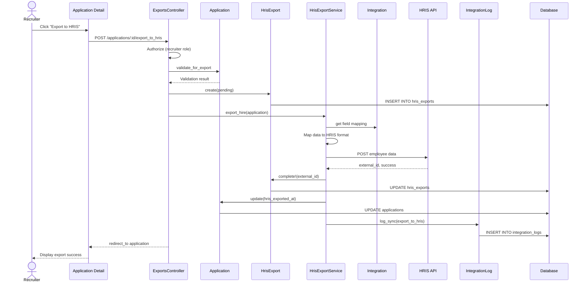

# UC-454: Export Hire to HRIS

## Metadata

| Attribute | Value |
|-----------|-------|
| **ID** | UC-454 |
| **Name** | Export Hire to HRIS |
| **Functional Area** | Integrations |
| **Primary Actor** | Recruiter (ACT-02) |
| **Priority** | P1 |
| **Complexity** | Medium |
| **Status** | Draft |

## Description

When a candidate accepts an offer and is marked as hired, the recruiter exports the new hire's data to the organization's HRIS (Human Resource Information System). The system maps Ledgoria data to HRIS fields, creates an employee record in the HRIS, and tracks the export status. This can be triggered manually or automatically based on integration settings.

## Actors

| Actor | Role in Use Case |
|-------|------------------|
| Recruiter (ACT-02) | Initiates export or monitors auto-export |
| Integration Gateway (ACT-12) | Handles API communication with HRIS |
| Scheduler (ACT-11) | Triggers auto-export on hire |

## Preconditions

- [ ] User is authenticated with Recruiter or Admin role
- [ ] HRIS integration is configured and active (UC-453)
- [ ] Candidate has accepted offer and application status is 'hired'
- [ ] Required fields for HRIS export are populated (per field mapping)
- [ ] No existing successful export for this hire

## Postconditions

### Success
- [ ] HrisExport record created with status='completed'
- [ ] Employee record created in HRIS
- [ ] External employee ID stored for reference
- [ ] IntegrationLog entry created
- [ ] Application record updated with hris_exported_at timestamp

### Failure
- [ ] HrisExport record created with status='failed'
- [ ] Error message stored in HrisExport record
- [ ] IntegrationLog entry records failure details
- [ ] Recruiter notified of export failure

## Triggers

- Recruiter clicks "Export to HRIS" on hired candidate
- Auto-export triggered when candidate marked as hired (if enabled)
- Recruiter retries failed export

## Basic Flow



| Step | Actor | Action | System Response |
|------|-------|--------|-----------------|
| 1 | Recruiter | Clicks "Export to HRIS" | System validates hire status |
| 2 | System | Verifies application is hired | Validation passes |
| 3 | System | Creates HrisExport record (pending) | Export record created |
| 4 | System | Retrieves field mapping from integration | Mapping loaded |
| 5 | System | Maps Ledgoria data to HRIS format | Data transformed |
| 6 | System | Sends employee data to HRIS API | API request initiated |
| 7 | HRIS | Creates employee record | Returns employee ID |
| 8 | System | Updates HrisExport with external_id | Export marked complete |
| 9 | System | Updates application with export timestamp | Timestamp recorded |
| 10 | System | Creates IntegrationLog entry | Activity logged |
| 11 | System | Displays success message | Export confirmed |

## Alternative Flows

### AF-1: Auto-Export on Hire

**Trigger:** Integration has auto_export enabled, candidate marked as hired

| Step | Actor | Action | System Response |
|------|-------|--------|-----------------|
| 1a | Scheduler | Detects new hire status | Hire event triggered |
| 2a | System | Checks integration settings | Auto-export enabled |
| 3a | System | Validates required fields | All fields present |
| 4a | System | Creates HrisExport record | Export initiated |

**Resumption:** Continues at step 4 of basic flow

### AF-2: Preview Before Export

**Trigger:** Recruiter clicks "Preview Export" before confirming

| Step | Actor | Action | System Response |
|------|-------|--------|-----------------|
| 1a | Recruiter | Clicks "Preview Export" | System shows preview modal |
| 2a | System | Displays mapped field values | Preview shown |
| 3a | Recruiter | Reviews and confirms | Clicks "Export" |

**Resumption:** Continues at step 3 of basic flow

### AF-3: Retry Failed Export

**Trigger:** Previous export failed, recruiter clicks "Retry"

| Step | Actor | Action | System Response |
|------|-------|--------|-----------------|
| 1a | Recruiter | Clicks "Retry Export" | System loads failed export |
| 2a | System | Resets HrisExport status to pending | Status updated |
| 3a | System | Retries API call | New attempt initiated |

**Resumption:** Continues at step 4 of basic flow

## Exception Flows

### EF-1: HRIS API Error

**Trigger:** HRIS API returns error response

| Step | Actor | Action | System Response |
|------|-------|--------|-----------------|
| 7.1 | System | Receives error from HRIS | Error parsed |
| 7.2 | System | Updates HrisExport with error | Status set to 'failed' |
| 7.3 | System | Stores error message and response | Details captured |
| 7.4 | System | Logs failure in IntegrationLog | Failure logged |
| 7.5 | System | Notifies recruiter | Error displayed |

**Resolution:** Recruiter reviews error, fixes data if needed, retries

### EF-2: Missing Required Fields

**Trigger:** Required HRIS fields not populated

| Step | Actor | Action | System Response |
|------|-------|--------|-----------------|
| 5.1 | System | Detects missing required fields | Validation fails |
| 5.2 | System | Displays list of missing fields | Error shown |
| 5.3 | Recruiter | Updates candidate/offer data | Data completed |
| 5.4 | Recruiter | Retries export | Export re-initiated |

**Resolution:** Export succeeds after data completion

### EF-3: Duplicate Employee

**Trigger:** HRIS reports employee already exists

| Step | Actor | Action | System Response |
|------|-------|--------|-----------------|
| 7.1 | System | Receives duplicate error | Conflict detected |
| 7.2 | System | Offers to update existing | Option presented |
| 7.3 | Recruiter | Chooses update or skip | Action selected |
| 7.4 | System | Processes choice | Export updated or skipped |

**Resolution:** Based on recruiter's choice

### EF-4: HRIS Unavailable

**Trigger:** HRIS API is unreachable

| Step | Actor | Action | System Response |
|------|-------|--------|-----------------|
| 6.1 | System | Connection timeout | Timeout detected |
| 6.2 | System | Marks export as 'failed' | Status updated |
| 6.3 | System | Schedules automatic retry | Retry queued |
| 6.4 | System | Notifies recruiter | Warning displayed |

**Resolution:** System retries automatically; recruiter can manual retry

## Business Rules

| ID | Rule | Description |
|----|------|-------------|
| BR-454.1 | Hired Status Required | Only applications with status='hired' can be exported |
| BR-454.2 | Single Export | Each application can only have one successful HRIS export |
| BR-454.3 | Required Fields | Start date, first name, last name, email required for all exports |
| BR-454.4 | Active Integration | Can only export to integrations with status='active' |
| BR-454.5 | Field Mapping | All HRIS required fields must have Ledgoria source mapped |
| BR-454.6 | Retry Limit | Failed exports can be retried up to 5 times |

## Data Requirements

### Input Data (Mapped from Ledgoria)

| Ledgoria Source | HRIS Field | Required | Notes |
|-----------------|------------|----------|-------|
| candidate.first_name | employee.first_name | Yes | Direct mapping |
| candidate.last_name | employee.last_name | Yes | Direct mapping |
| candidate.email | employee.work_email | Yes | Direct mapping |
| candidate.phone | employee.phone | No | Optional |
| offer.start_date | employee.hire_date | Yes | Date format conversion |
| offer.salary | employee.base_salary | No | Currency/format handling |
| offer.salary_currency | employee.salary_currency | No | ISO currency code |
| job.title | employee.job_title | No | May require lookup |
| job.department.name | employee.department | No | Text or ID mapping |
| candidate.address | employee.address | No | Address components |

### Output Data

| Field | Type | Description |
|-------|------|-------------|
| hris_export_id | integer | HrisExport record ID |
| external_id | string | Employee ID in HRIS |
| external_url | string | Link to employee in HRIS |
| status | enum | pending, exporting, completed, failed |
| exported_at | datetime | Successful export timestamp |

## Database Transactions

### Tables Affected

| Table | Operation | Conditions |
|-------|-----------|------------|
| hris_exports | CREATE | New export record |
| hris_exports | UPDATE | Status changes |
| applications | UPDATE | Set hris_exported_at |
| integration_logs | CREATE | Log export activity |

### Transaction Detail

```sql
-- Export Hire to HRIS Transaction
BEGIN TRANSACTION;

-- Step 1: Create HRIS export record
INSERT INTO hris_exports (
    organization_id,
    integration_id,
    application_id,
    candidate_id,
    exported_by_id,
    status,
    created_at,
    updated_at
) VALUES (
    @organization_id,
    @integration_id,
    @application_id,
    @candidate_id,
    @current_user_id,
    'pending',
    NOW(),
    NOW()
);

SET @export_id = LAST_INSERT_ID();

-- Step 2: After successful API call, update export
UPDATE hris_exports
SET
    status = 'completed',
    external_id = @external_id,
    external_url = @external_url,
    export_data = @export_data,
    response_data = @response_data,
    exported_at = NOW(),
    confirmed_at = NOW()
WHERE id = @export_id;

-- Step 3: Update application
UPDATE applications
SET
    hris_exported_at = NOW(),
    updated_at = NOW()
WHERE id = @application_id;

-- Step 4: Create integration log
INSERT INTO integration_logs (
    organization_id,
    integration_id,
    action,
    direction,
    status,
    resource_type,
    resource_id,
    started_at,
    completed_at,
    records_processed,
    records_created,
    created_at,
    updated_at
) VALUES (
    @organization_id,
    @integration_id,
    'export_to_hris',
    'outbound',
    'success',
    'Application',
    @application_id,
    @start_time,
    NOW(),
    1,
    1,
    NOW(),
    NOW()
);

COMMIT;
```

### Rollback Scenarios

| Scenario | Rollback Action |
|----------|-----------------|
| Validation failure | No transaction started, return errors |
| API failure | Update export status to 'failed', log error |
| Partial failure | Export failed, application unchanged |

## UI/UX Requirements

### Screen/Component

- **Location:** /admin/applications/:id (application detail page)
- **Entry Point:**
  - "Export to HRIS" button on hired application
  - Bulk action from hired candidates list
- **Key Elements:**
  - Export status indicator
  - Preview modal with mapped fields
  - Error details for failed exports
  - Retry button for failed exports
  - Link to employee in HRIS (after success)

### Export Button States

```
+-------------------------------------------------------------+
| Hired Candidate: John Smith                                  |
+-------------------------------------------------------------+
| HRIS Export Status                                           |
|                                                              |
| Not Exported:                                                |
| [Preview Export] [Export to Workday]                         |
|                                                              |
| --- OR ---                                                   |
|                                                              |
| Exported Successfully:                                       |
| [check] Exported to Workday on Jan 25, 2026                  |
| Employee ID: WD-123456 [View in Workday]                     |
|                                                              |
| --- OR ---                                                   |
|                                                              |
| Export Failed:                                               |
| [!] Export failed: Invalid department ID                     |
| Attempted: Jan 25, 2026 at 10:30 AM                          |
| [View Details] [Retry Export]                                |
+-------------------------------------------------------------+
```

### Preview Modal

```
+-------------------------------------------------------------+
| Preview HRIS Export                                          |
+-------------------------------------------------------------+
| The following data will be sent to Workday:                  |
|                                                              |
| +---------------------------+------------------------------+ |
| | HRIS Field                | Value                        | |
| +---------------------------+------------------------------+ |
| | First Name                | John                         | |
| | Last Name                 | Smith                        | |
| | Work Email                | john.smith@example.com       | |
| | Phone                     | (555) 123-4567               | |
| | Hire Date                 | February 1, 2026             | |
| | Job Title                 | Senior Software Engineer     | |
| | Department                | Engineering                  | |
| | Base Salary               | $150,000.00 USD              | |
| +---------------------------+------------------------------+ |
|                                                              |
| [!] Missing optional field: Address                          |
|                                                              |
+-------------------------------------------------------------+
| [Cancel]                              [Confirm Export]       |
+-------------------------------------------------------------+
```

## Non-Functional Requirements

| Requirement | Target |
|-------------|--------|
| Response Time | Export initiation < 2s, API call < 30s |
| Availability | 99.9% |
| Retry Policy | Exponential backoff: 1m, 5m, 15m, 1h, 4h |
| Data Integrity | All exports logged for audit |

## Security Considerations

- [x] Authentication required
- [x] Authorization check: User must be recruiter on job or admin
- [x] PII handling: Sensitive data encrypted in transit (HTTPS required)
- [x] Audit logging: All export attempts logged
- [x] Data minimization: Only required fields exported

## Related Use Cases

| Use Case | Relationship |
|----------|--------------|
| UC-453 Configure HRIS Integration | Precedes (integration must exist) |
| UC-259 Mark as Hired | Triggers auto-export (if enabled) |
| UC-255 Candidate Accept Offer | Precedes (offer must be accepted) |
| UC-460 View Integration Logs | Monitor export activity |

---

## Data Model References

> Cross-references to [DATA_MODEL.md](../DATA_MODEL.md) and [CRUD_MATRIX.md](../CRUD_MATRIX.md)

### Subject Areas

| Subject Area | ID | Relationship |
|--------------|-----|--------------|
| Integration | SA-11 | Primary |
| Offer Management | SA-08 | Secondary |
| Candidate | SA-04 | Reference |

### Entities CRUD

| Entity | C | R | U | D | Notes |
|--------|---|---|---|---|-------|
| HrisExport | ✓ | ✓ | ✓ | | Created, read, updated during export |
| Application | | ✓ | ✓ | | Read for data, update export timestamp |
| Candidate | | ✓ | | | Read for employee data |
| Offer | | ✓ | | | Read for salary, start date |
| Integration | | ✓ | | | Read for API credentials and mapping |
| IntegrationLog | ✓ | | | | Log each export attempt |

**Legend:** C = Create, R = Read, U = Update, D = Delete

---

## Process Model References

> Cross-references to [PROCESS_MODEL.md](../PROCESS_MODEL.md) and [PROCESS_CRUD_MATRIX.md](../PROCESS_CRUD_MATRIX.md)

| Attribute | Value | Link |
|-----------|-------|------|
| **Elementary Business Process** | EP-1125: Export Hire to HRIS | [PROCESS_MODEL.md#ep-1125](../PROCESS_MODEL.md#bp-603-integration-management) |
| **Business Process** | BP-603: Integration Management | [PROCESS_MODEL.md#bp-603](../PROCESS_MODEL.md#bp-603-integration-management) |
| **Business Function** | BF-06: System Administration | [PROCESS_MODEL.md#bf-06](../PROCESS_MODEL.md#bf-06-system-administration) |

### EBP Details

| Attribute | Value |
|-----------|-------|
| **Trigger** | Recruiter initiates export or auto-export on hire |
| **Input** | Hired candidate data, offer details |
| **Output** | Employee record in HRIS, export confirmation |
| **Business Rules** | BR-454.1 through BR-454.6 (see Business Rules section) |

---

## Traceability Matrix

> Complete artifact mapping for requirements traceability

| Artifact Type | ID | Name | Link |
|---------------|-----|------|------|
| **Use Case** | UC-454 | Export Hire to HRIS | *(this document)* |
| **Elementary Process** | EP-1125 | Export Hire to HRIS | [PROCESS_MODEL.md](../PROCESS_MODEL.md#bp-603-integration-management) |
| **Business Process** | BP-603 | Integration Management | [PROCESS_MODEL.md](../PROCESS_MODEL.md#bp-603-integration-management) |
| **Business Function** | BF-06 | System Administration | [PROCESS_MODEL.md](../PROCESS_MODEL.md#bf-06-system-administration) |
| **Primary Actor** | ACT-02 | Recruiter | [ACTORS.md](../ACTORS.md#act-02-recruiter) |
| **Subject Area (Primary)** | SA-11 | Integration | [DATA_MODEL.md](../DATA_MODEL.md#sa-11-integration) |
| **Subject Area (Secondary)** | SA-08 | Offer Management | [DATA_MODEL.md](../DATA_MODEL.md#sa-08-offer-management) |
| **CRUD Matrix Row** | UC-454 | - | [CRUD_MATRIX.md](../CRUD_MATRIX.md#uc-454) |
| **Process CRUD Row** | EP-1125 | - | [PROCESS_CRUD_MATRIX.md](../PROCESS_CRUD_MATRIX.md#ep-1125) |

### Implementation Artifacts

| Artifact Type | Path/Reference | Status |
|---------------|----------------|--------|
| Controller | `app/controllers/admin/hris_exports_controller.rb` | Planned |
| Model | `app/models/hris_export.rb` | Implemented |
| Model | `app/models/integration.rb` | Implemented |
| Service | `app/services/integrations/hris_export_service.rb` | Planned |
| Job | `app/jobs/export_to_hris_job.rb` | Planned |
| View | `app/views/admin/applications/_hris_export.html.erb` | Planned |
| Test | `test/services/integrations/hris_export_service_test.rb` | Planned |

---

## Open Questions

1. Should we support partial exports (only some fields)?
2. How do we handle updates to employee data after initial export?
3. Should we support bulk HRIS export for multiple hires?

## Change History

| Version | Date | Author | Changes |
|---------|------|--------|---------|
| 0.1 | 2026-01-25 | System | Initial draft |
