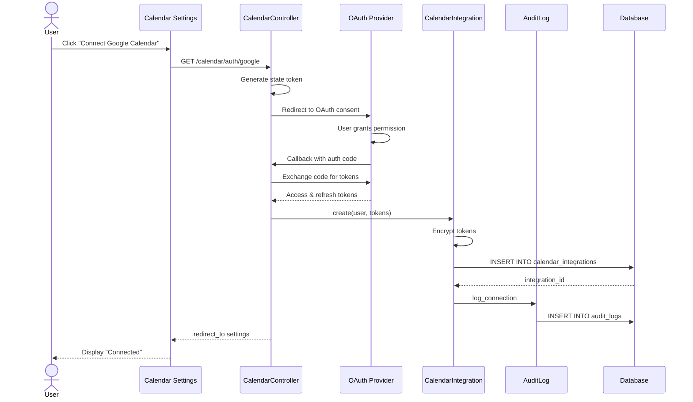

# UC-455: Configure Calendar Integration

## Metadata

| Attribute | Value |
|-----------|-------|
| **ID** | UC-455 |
| **Name** | Configure Calendar Integration |
| **Functional Area** | Integrations |
| **Primary Actor** | System Administrator (ACT-01) |
| **Priority** | P2 |
| **Complexity** | Medium |
| **Status** | Draft |

## Description

A system administrator or individual user configures a connection to an external calendar provider (Google Calendar, Microsoft Outlook, Apple Calendar) to enable interview scheduling synchronization. Once connected, the system can read interviewer availability and create calendar events for scheduled interviews.

## Actors

| Actor | Role in Use Case |
|-------|------------------|
| System Administrator (ACT-01) | Configures organization-wide calendar settings |
| Interviewer (ACT-04) | Connects personal calendar for availability |
| Integration Gateway (ACT-12) | Handles OAuth flow and API communication |

## Preconditions

- [ ] User is authenticated
- [ ] For org-level config: User has System Administrator role
- [ ] For personal calendar: User is an active interviewer
- [ ] Calendar provider account exists (Google, Microsoft, Apple)

## Postconditions

### Success
- [ ] CalendarIntegration record created for user
- [ ] OAuth tokens securely stored (encrypted)
- [ ] Calendar access validated and status='active'
- [ ] User's availability can be queried
- [ ] Audit log entry created

### Failure
- [ ] CalendarIntegration may be created with inactive status
- [ ] Error message displayed to user
- [ ] OAuth flow can be retried

## Triggers

- User navigates to Settings > Integrations > Calendar
- User clicks "Connect Calendar" from availability settings
- System prompts during interview scheduling when no calendar connected

## Basic Flow



| Step | Actor | Action | System Response |
|------|-------|--------|-----------------|
| 1 | User | Clicks "Connect Calendar" | System displays provider options |
| 2 | User | Selects calendar provider | System initiates OAuth flow |
| 3 | System | Generates secure state token | CSRF protection enabled |
| 4 | System | Redirects to OAuth provider | Provider consent screen shown |
| 5 | User | Grants calendar access | Permission granted |
| 6 | Provider | Redirects with authorization code | Code received |
| 7 | System | Exchanges code for tokens | Tokens obtained |
| 8 | System | Encrypts and stores tokens | Tokens secured |
| 9 | System | Creates CalendarIntegration record | Integration saved |
| 10 | System | Validates calendar access | Test read successful |
| 11 | System | Updates status to 'active' | Connection confirmed |
| 12 | System | Creates audit log entry | Activity logged |
| 13 | System | Displays success message | User informed |

## Alternative Flows

### AF-1: Reconnect After Token Expiry

**Trigger:** User's calendar token has expired and refresh failed

| Step | Actor | Action | System Response |
|------|-------|--------|-----------------|
| 1a | System | Detects expired token during sync | Token refresh attempted |
| 2a | System | Refresh fails | User notified |
| 3a | User | Clicks "Reconnect" | OAuth flow initiated |

**Resumption:** Continues at step 2 of basic flow

### AF-2: Disconnect Calendar

**Trigger:** User clicks "Disconnect" on connected calendar

| Step | Actor | Action | System Response |
|------|-------|--------|-----------------|
| 1a | User | Clicks "Disconnect" | Confirmation modal shown |
| 2a | User | Confirms disconnection | System processes |
| 3a | System | Revokes OAuth tokens | Provider tokens invalidated |
| 4a | System | Deactivates CalendarIntegration | Status set to inactive |
| 5a | System | Creates audit log | Disconnection logged |

**Resumption:** Use case ends

### AF-3: Switch Calendar Provider

**Trigger:** User wants to switch from one provider to another

| Step | Actor | Action | System Response |
|------|-------|--------|-----------------|
| 1a | User | Clicks "Connect" on different provider | Warning shown |
| 2a | System | Displays switch confirmation | User informed |
| 3a | User | Confirms switch | Old integration deactivated |

**Resumption:** Continues at step 2 of basic flow

## Exception Flows

### EF-1: OAuth Permission Denied

**Trigger:** User denies access during OAuth consent

| Step | Actor | Action | System Response |
|------|-------|--------|-----------------|
| 5.1 | User | Clicks "Deny" on OAuth screen | Access denied |
| 5.2 | Provider | Redirects with error | Error code received |
| 5.3 | System | Displays "Access Denied" message | User informed |
| 5.4 | System | Returns to calendar settings | Settings page shown |

**Resolution:** User can retry by clicking "Connect" again

### EF-2: Invalid OAuth State

**Trigger:** State token mismatch (potential CSRF attack)

| Step | Actor | Action | System Response |
|------|-------|--------|-----------------|
| 6.1 | System | Detects state mismatch | Security check failed |
| 6.2 | System | Logs security warning | Warning recorded |
| 6.3 | System | Displays error message | User informed |
| 6.4 | System | Requires restart of flow | Fresh OAuth initiated |

**Resolution:** User restarts OAuth flow with new state token

### EF-3: Calendar API Unavailable

**Trigger:** Calendar provider API returns error during validation

| Step | Actor | Action | System Response |
|------|-------|--------|-----------------|
| 10.1 | System | Calendar API error | Validation failed |
| 10.2 | System | Stores tokens anyway | Integration created |
| 10.3 | System | Sets status to 'error' | Error status set |
| 10.4 | System | Schedules retry | Retry queued |

**Resolution:** System retries validation; user can manually retry

## Business Rules

| ID | Rule | Description |
|----|------|-------------|
| BR-455.1 | Single Provider | User can only have one active calendar integration at a time |
| BR-455.2 | Token Encryption | OAuth tokens must be encrypted at rest |
| BR-455.3 | Valid Providers | Provider must be: google, outlook, or apple |
| BR-455.4 | Scope Requirements | Must request read and write access for events |
| BR-455.5 | Token Refresh | Tokens must be refreshed before expiration |
| BR-455.6 | Revocation on Disconnect | Tokens must be revoked with provider on disconnect |

## Data Requirements

### Input Data

| Field | Type | Required | Validation |
|-------|------|----------|------------|
| provider | enum | Yes | google, outlook, apple |
| oauth_code | string | Yes | From OAuth callback |
| state | string | Yes | Must match session state |

### OAuth Token Data (Stored)

| Field | Type | Required | Validation |
|-------|------|----------|------------|
| access_token | string | Yes | Encrypted |
| refresh_token | string | Yes | Encrypted |
| token_expires_at | datetime | Yes | Future timestamp |
| calendar_id | string | No | Primary calendar ID |

### Output Data

| Field | Type | Description |
|-------|------|-------------|
| id | integer | CalendarIntegration record ID |
| provider | string | Calendar provider name |
| status | enum | connected, inactive, expired, error |
| connected_at | datetime | When connected |
| last_synced_at | datetime | Last successful sync |

## Database Transactions

### Tables Affected

| Table | Operation | Conditions |
|-------|-----------|------------|
| calendar_integrations | CREATE/UPDATE | New or reconnect |
| audit_logs | CREATE | Always |

### Transaction Detail

```sql
-- Configure Calendar Integration Transaction
BEGIN TRANSACTION;

-- Step 1: Deactivate any existing integration for user/provider
UPDATE calendar_integrations
SET active = false, updated_at = NOW()
WHERE user_id = @user_id AND provider = @provider;

-- Step 2: Insert new calendar integration
INSERT INTO calendar_integrations (
    user_id,
    provider,
    access_token_encrypted,
    refresh_token_encrypted,
    token_expires_at,
    calendar_id,
    active,
    created_at,
    updated_at
) VALUES (
    @user_id,
    @provider,
    @encrypted_access_token,
    @encrypted_refresh_token,
    @token_expires_at,
    @calendar_id,
    true,
    NOW(),
    NOW()
);

SET @integration_id = LAST_INSERT_ID();

-- Step 3: Create audit log entry
INSERT INTO audit_logs (
    organization_id,
    user_id,
    action,
    auditable_type,
    auditable_id,
    metadata,
    ip_address,
    user_agent,
    created_at
) VALUES (
    @organization_id,
    @user_id,
    'calendar_integration.connected',
    'CalendarIntegration',
    @integration_id,
    JSON_OBJECT(
        'provider', @provider
    ),
    @ip_address,
    @user_agent,
    NOW()
);

COMMIT;
```

### Rollback Scenarios

| Scenario | Rollback Action |
|----------|-----------------|
| OAuth failure | No database changes, return to settings |
| Token exchange failure | Log error, prompt retry |
| Database error | Full rollback, display error |

## UI/UX Requirements

### Screen/Component

- **Location:** /settings/calendar or /admin/integrations/calendar
- **Entry Point:**
  - User Settings > Calendar
  - Interview scheduling prompt
  - Admin > Integrations > Calendar
- **Key Elements:**
  - Provider selection cards with logos
  - Connection status indicator
  - Last sync timestamp
  - Disconnect button
  - Sync settings (which calendars to read)

### Form Layout

```
+-------------------------------------------------------------+
| Calendar Integration                                         |
+-------------------------------------------------------------+
| Connect your calendar to enable:                             |
| - Automatic availability detection                           |
| - Interview event creation                                   |
| - Calendar conflict prevention                               |
|                                                              |
| Select Calendar Provider                                     |
| +----------------+  +----------------+  +----------------+   |
| | [G] Google     |  | [M] Outlook    |  | [A] Apple      |   |
| |    Calendar    |  |    Calendar    |  |    Calendar    |   |
| |   [Connect]    |  |   [Connect]    |  |   [Connect]    |   |
| +----------------+  +----------------+  +----------------+   |
|                                                              |
+-------------------------------------------------------------+
```

### Connected State

```
+-------------------------------------------------------------+
| Calendar Integration                                         |
+-------------------------------------------------------------+
| [check] Connected to Google Calendar                         |
| john.smith@company.com                                       |
|                                                              |
| Status: Connected                                            |
| Last synced: 5 minutes ago                                   |
|                                                              |
| Settings                                                     |
| [x] Sync primary calendar                                    |
| [x] Sync "Work" calendar                                     |
| [ ] Sync "Personal" calendar                                 |
|                                                              |
| [Sync Now]  [Reconnect]  [Disconnect]                        |
+-------------------------------------------------------------+
```

## Non-Functional Requirements

| Requirement | Target |
|-------------|--------|
| Response Time | OAuth redirect < 1s, token exchange < 5s |
| Availability | 99.9% |
| Token Security | AES-256 encryption at rest |
| Token Refresh | Automatic refresh 5 minutes before expiry |

## Security Considerations

- [x] Authentication required
- [x] CSRF protection: State token validated in OAuth callback
- [x] Token encryption: Access and refresh tokens encrypted using Rails encrypts
- [x] Secure transport: HTTPS required for all OAuth communication
- [x] Audit logging: Connection and disconnection events logged
- [x] Scope minimization: Request only required calendar permissions

## Related Use Cases

| Use Case | Relationship |
|----------|--------------|
| UC-456 Sync Calendar Events | Follows to sync interview events |
| UC-150 Schedule Interview | Uses calendar for availability |
| UC-153 Candidate Self-Schedule | Uses calendar for slot generation |

---

## Data Model References

> Cross-references to [DATA_MODEL.md](../DATA_MODEL.md) and [CRUD_MATRIX.md](../CRUD_MATRIX.md)

### Subject Areas

| Subject Area | ID | Relationship |
|--------------|-----|--------------|
| Integration | SA-11 | Primary |
| Identity & Access | SA-01 | Secondary |
| Interview | SA-06 | Reference |

### Entities CRUD

| Entity | C | R | U | D | Notes |
|--------|---|---|---|---|-------|
| CalendarIntegration | ✓ | ✓ | ✓ | | Created, read, updated |
| AuditLog | ✓ | | | | Log connection events |
| User | | ✓ | | | Read for user association |

**Legend:** C = Create, R = Read, U = Update, D = Delete

---

## Process Model References

> Cross-references to [PROCESS_MODEL.md](../PROCESS_MODEL.md) and [PROCESS_CRUD_MATRIX.md](../PROCESS_CRUD_MATRIX.md)

| Attribute | Value | Link |
|-----------|-------|------|
| **Elementary Business Process** | EP-1126: Configure Calendar Integration | [PROCESS_MODEL.md#ep-1126](../PROCESS_MODEL.md#bp-603-integration-management) |
| **Business Process** | BP-603: Integration Management | [PROCESS_MODEL.md#bp-603](../PROCESS_MODEL.md#bp-603-integration-management) |
| **Business Function** | BF-06: System Administration | [PROCESS_MODEL.md#bf-06](../PROCESS_MODEL.md#bf-06-system-administration) |

### EBP Details

| Attribute | Value |
|-----------|-------|
| **Trigger** | User initiates calendar connection from settings |
| **Input** | Provider selection, OAuth authorization |
| **Output** | Active CalendarIntegration with encrypted tokens |
| **Business Rules** | BR-455.1 through BR-455.6 (see Business Rules section) |

---

## Traceability Matrix

> Complete artifact mapping for requirements traceability

| Artifact Type | ID | Name | Link |
|---------------|-----|------|------|
| **Use Case** | UC-455 | Configure Calendar Integration | *(this document)* |
| **Elementary Process** | EP-1126 | Configure Calendar Integration | [PROCESS_MODEL.md](../PROCESS_MODEL.md#bp-603-integration-management) |
| **Business Process** | BP-603 | Integration Management | [PROCESS_MODEL.md](../PROCESS_MODEL.md#bp-603-integration-management) |
| **Business Function** | BF-06 | System Administration | [PROCESS_MODEL.md](../PROCESS_MODEL.md#bf-06-system-administration) |
| **Primary Actor** | ACT-01 | System Administrator | [ACTORS.md](../ACTORS.md#act-01-system-administrator) |
| **Subject Area (Primary)** | SA-11 | Integration | [DATA_MODEL.md](../DATA_MODEL.md#sa-11-integration) |
| **Subject Area (Secondary)** | SA-01 | Identity & Access | [DATA_MODEL.md](../DATA_MODEL.md#sa-01-identity--access) |
| **CRUD Matrix Row** | UC-455 | - | [CRUD_MATRIX.md](../CRUD_MATRIX.md#uc-455) |
| **Process CRUD Row** | EP-1126 | - | [PROCESS_CRUD_MATRIX.md](../PROCESS_CRUD_MATRIX.md#ep-1126) |

### Implementation Artifacts

| Artifact Type | Path/Reference | Status |
|---------------|----------------|--------|
| Controller | `app/controllers/calendar_integrations_controller.rb` | Planned |
| Model | `app/models/calendar_integration.rb` | Implemented |
| Service | `app/services/calendar/oauth_service.rb` | Planned |
| View | `app/views/calendar_integrations/index.html.erb` | Planned |
| Test | `test/controllers/calendar_integrations_controller_test.rb` | Planned |

---

## Open Questions

1. Should we support multiple calendars from the same provider?
2. How do we handle calendar accounts that are shared/delegated?
3. What is the grace period before flagging expired tokens?

## Change History

| Version | Date | Author | Changes |
|---------|------|--------|---------|
| 0.1 | 2026-01-25 | System | Initial draft |
