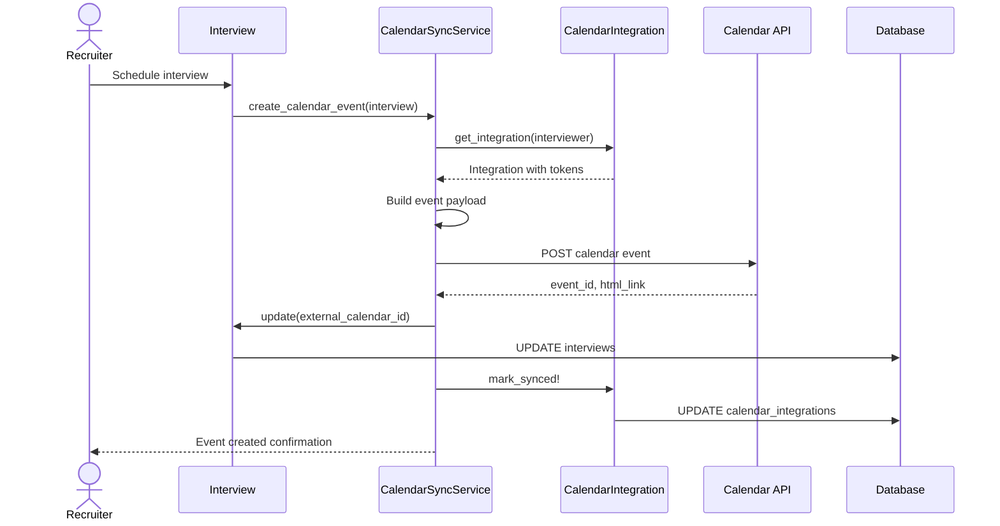

# UC-456: Sync Calendar Events

## Metadata

| Attribute | Value |
|-----------|-------|
| **ID** | UC-456 |
| **Name** | Sync Calendar Events |
| **Functional Area** | Integrations |
| **Primary Actor** | Integration Gateway (ACT-12) |
| **Priority** | P2 |
| **Complexity** | Medium |
| **Status** | Draft |

## Description

The system synchronizes interview events between Ledgoria and connected external calendars (Google Calendar, Microsoft Outlook, Apple Calendar). This includes creating calendar events when interviews are scheduled, updating events when interviews are rescheduled, and canceling events when interviews are cancelled. The sync also reads external calendar events to determine interviewer availability.

## Actors

| Actor | Role in Use Case |
|-------|------------------|
| Integration Gateway (ACT-12) | Handles bidirectional calendar sync |
| Scheduler (ACT-11) | Triggers periodic availability sync |
| Recruiter (ACT-02) | Schedules interviews that trigger event creation |

## Preconditions

- [ ] User has connected calendar integration (UC-455)
- [ ] CalendarIntegration has valid, non-expired OAuth tokens
- [ ] Calendar API is accessible

## Postconditions

### Success (Outbound - Event Creation)
- [ ] Calendar event created in external calendar
- [ ] External event ID stored in Interview record
- [ ] All participants receive calendar invites
- [ ] CalendarIntegration last_synced_at updated

### Success (Inbound - Availability Sync)
- [ ] Busy times retrieved from external calendar
- [ ] Availability cache updated
- [ ] CalendarIntegration last_synced_at updated

### Failure
- [ ] Sync error logged in CalendarIntegration
- [ ] Retry scheduled (if transient error)
- [ ] User notified (if persistent error)

## Triggers

- Interview scheduled (creates calendar event)
- Interview rescheduled (updates calendar event)
- Interview cancelled (deletes calendar event)
- Scheduler runs availability sync (every 15 minutes)
- User requests manual sync

## Basic Flow (Interview Event Creation)



| Step | Actor | Action | System Response |
|------|-------|--------|-----------------|
| 1 | Recruiter | Schedules interview | Interview record created |
| 2 | System | Retrieves participant calendar integrations | Integrations loaded |
| 3 | System | Checks token validity | Refresh if needed |
| 4 | System | Builds calendar event payload | Event data prepared |
| 5 | System | Sends event to calendar API | POST request |
| 6 | Calendar API | Creates event, sends invites | Event ID returned |
| 7 | System | Stores external event ID | Interview updated |
| 8 | System | Updates sync timestamp | Integration marked synced |
| 9 | System | Notifies recruiter | Success confirmed |

## Alternative Flows

### AF-1: Availability Sync (Inbound)

**Trigger:** Scheduler runs periodic availability sync

| Step | Actor | Action | System Response |
|------|-------|--------|-----------------|
| 1a | Scheduler | Triggers availability sync job | Job starts |
| 2a | System | Retrieves active calendar integrations | Integrations loaded |
| 3a | System | For each integration, queries free/busy | API requests |
| 4a | Calendar API | Returns busy time blocks | Events retrieved |
| 5a | System | Updates availability cache | Cache refreshed |
| 6a | System | Updates last_synced_at | Timestamp updated |

**Resumption:** Use case ends

### AF-2: Update Existing Event (Reschedule)

**Trigger:** Interview is rescheduled

| Step | Actor | Action | System Response |
|------|-------|--------|-----------------|
| 1a | Recruiter | Reschedules interview | New time set |
| 2a | System | Retrieves external_calendar_id | Event ID found |
| 3a | System | Builds updated event payload | New times prepared |
| 4a | System | Sends update to calendar API | PATCH request |
| 5a | Calendar API | Updates event | Participants notified |

**Resumption:** Continues at step 7 of basic flow

### AF-3: Delete Event (Cancellation)

**Trigger:** Interview is cancelled

| Step | Actor | Action | System Response |
|------|-------|--------|-----------------|
| 1a | Recruiter | Cancels interview | Interview cancelled |
| 2a | System | Retrieves external_calendar_id | Event ID found |
| 3a | System | Sends delete to calendar API | DELETE request |
| 4a | Calendar API | Removes event | Participants notified |
| 5a | System | Clears external_calendar_id | Interview updated |

**Resumption:** Use case ends

### AF-4: Multi-Participant Sync

**Trigger:** Interview has multiple interviewers with different calendar providers

| Step | Actor | Action | System Response |
|------|-------|--------|-----------------|
| 1a | System | Identifies all participants | Interviewers listed |
| 2a | System | Groups by calendar provider | Grouped by provider |
| 3a | System | Creates event in organizer's calendar | Primary event created |
| 4a | System | Adds attendees from other calendars | Invites sent |

**Resumption:** Continues at step 7 of basic flow

## Exception Flows

### EF-1: Token Expired

**Trigger:** OAuth token has expired during sync

| Step | Actor | Action | System Response |
|------|-------|--------|-----------------|
| 3.1 | System | Detects expired token | Refresh attempted |
| 3.2 | System | Calls token refresh endpoint | New tokens requested |
| 3.3a | (Success) | New tokens received | Tokens updated |
| 3.3b | (Failure) | Refresh fails | User notification |

**Resolution:** If refresh succeeds, continues; otherwise user must reconnect

### EF-2: Calendar API Error

**Trigger:** Calendar API returns error

| Step | Actor | Action | System Response |
|------|-------|--------|-----------------|
| 5.1 | System | Receives API error | Error parsed |
| 5.2 | System | Logs error in sync_error | Error stored |
| 5.3 | System | Schedules retry | Retry queued |
| 5.4 | System | Notifies if persistent | User alerted |

**Resolution:** System retries with exponential backoff

### EF-3: Event Not Found (Update/Delete)

**Trigger:** External event ID no longer exists in calendar

| Step | Actor | Action | System Response |
|------|-------|--------|-----------------|
| 2.1 | System | Event lookup returns 404 | Event missing |
| 2.2 | System | Clears external_calendar_id | Reference removed |
| 2.3 | System | Creates new event (if update) | Fresh event created |

**Resolution:** Event recreated or reference cleared

### EF-4: Rate Limit Exceeded

**Trigger:** Calendar API rate limit hit

| Step | Actor | Action | System Response |
|------|-------|--------|-----------------|
| 5.1 | System | Receives 429 response | Rate limit detected |
| 5.2 | System | Extracts retry-after header | Delay calculated |
| 5.3 | System | Queues retry after delay | Job rescheduled |

**Resolution:** Sync continues after rate limit window

## Business Rules

| ID | Rule | Description |
|----|------|-------------|
| BR-456.1 | Token Validity | Tokens refreshed 5 minutes before expiration |
| BR-456.2 | Retry Policy | Failed syncs retry up to 3 times with exponential backoff |
| BR-456.3 | Availability Window | Free/busy queries span 2 weeks from today |
| BR-456.4 | Event Ownership | Events created in organizer's calendar with attendees invited |
| BR-456.5 | Sync Frequency | Availability synced every 15 minutes minimum |
| BR-456.6 | Conflict Detection | Cannot schedule over existing busy blocks |

## Data Requirements

### Calendar Event Payload (Outbound)

| Field | Type | Required | Source |
|-------|------|----------|--------|
| summary | string | Yes | Interview title |
| description | text | No | Interview details, links |
| start.dateTime | datetime | Yes | Interview start time |
| end.dateTime | datetime | Yes | Interview end time |
| attendees | array | Yes | Candidate + interviewers |
| location | string | No | Meeting room or video link |
| conferenceData | object | No | Video meeting details |

### Availability Query (Inbound)

| Field | Type | Required | Notes |
|-------|------|----------|-------|
| timeMin | datetime | Yes | Start of query range |
| timeMax | datetime | Yes | End of query range |
| items | array | Yes | Calendar IDs to query |

### Output Data

| Field | Type | Description |
|-------|------|-------------|
| external_calendar_id | string | Event ID from calendar provider |
| html_link | string | URL to view event in calendar |
| busy_times | array | List of busy time blocks |

## Database Transactions

### Tables Affected

| Table | Operation | Conditions |
|-------|-----------|------------|
| interviews | UPDATE | Store external calendar ID |
| calendar_integrations | UPDATE | Sync timestamps, error status |

### Transaction Detail

```sql
-- Sync Calendar Event Transaction
BEGIN TRANSACTION;

-- Step 1: Update interview with external ID
UPDATE interviews
SET
    external_calendar_id = @event_id,
    external_calendar_link = @html_link,
    updated_at = NOW()
WHERE id = @interview_id;

-- Step 2: Update calendar integration sync status
UPDATE calendar_integrations
SET
    last_synced_at = NOW(),
    sync_error = NULL,
    updated_at = NOW()
WHERE id = @calendar_integration_id;

COMMIT;
```

### Failure Transaction

```sql
-- Log Sync Error
UPDATE calendar_integrations
SET
    sync_error = @error_message,
    updated_at = NOW()
WHERE id = @calendar_integration_id;
```

### Rollback Scenarios

| Scenario | Rollback Action |
|----------|-----------------|
| Token refresh failure | Mark integration for reconnection |
| API error | Log error, schedule retry |
| Event creation failure | Interview created without calendar link |

## UI/UX Requirements

### Screen/Component

- **Location:** Interview detail, Calendar settings
- **Entry Point:**
  - Interview scheduling triggers automatic sync
  - Calendar settings shows sync status
- **Key Elements:**
  - Sync status indicator
  - Last sync timestamp
  - Manual sync button
  - Error messages with resolution actions

### Interview Calendar Status

```
+-------------------------------------------------------------+
| Interview: Technical Screen                                  |
| Jan 28, 2026 at 2:00 PM - 3:00 PM                           |
+-------------------------------------------------------------+
| Calendar Sync                                                |
|                                                              |
| [check] Google Calendar                                      |
|         Event created - View in Google Calendar              |
|         Invite sent to: jane.doe@candidate.com               |
|                         john.smith@company.com               |
|                                                              |
| [!] Outlook Calendar (Bob Wilson)                            |
|     Sync failed: Token expired                               |
|     [Reconnect Calendar]                                     |
+-------------------------------------------------------------+
```

### Availability View

```
+-------------------------------------------------------------+
| Interviewer Availability                                     |
| John Smith - Week of Jan 27, 2026                           |
+-------------------------------------------------------------+
| Mon 27   Tue 28   Wed 29   Thu 30   Fri 31                  |
|                                                              |
| [====]   [====]   [    ]   [====]   [    ]  9:00 AM         |
| [====]   [    ]   [    ]   [====]   [    ]  10:00 AM        |
| [    ]   [    ]   [====]   [    ]   [====]  11:00 AM        |
| [====]   [====]   [====]   [====]   [====]  12:00 PM (Lunch)|
| [    ]   [====]   [    ]   [    ]   [    ]  1:00 PM         |
| [    ]   [    ]   [    ]   [====]   [    ]  2:00 PM         |
| [====]   [    ]   [====]   [    ]   [====]  3:00 PM         |
| [====]   [====]   [    ]   [    ]   [    ]  4:00 PM         |
|                                                              |
| Legend: [====] = Busy  [    ] = Available                    |
| Last synced: 5 minutes ago  [Sync Now]                       |
+-------------------------------------------------------------+
```

## Non-Functional Requirements

| Requirement | Target |
|-------------|--------|
| Response Time | Event creation < 5s |
| Sync Latency | Availability updated within 15 minutes |
| Availability | 99.9% |
| Retry Policy | 3 retries with 1m, 5m, 15m backoff |

## Security Considerations

- [x] Authentication: Valid OAuth tokens required
- [x] Token security: Tokens encrypted at rest
- [x] Minimal data: Only necessary event details shared
- [x] Audit logging: Sync activities logged
- [x] Error handling: Sensitive errors not exposed to users

## Related Use Cases

| Use Case | Relationship |
|----------|--------------|
| UC-455 Configure Calendar Integration | Precedes (integration must exist) |
| UC-150 Schedule Interview | Triggers event creation |
| UC-154 Reschedule Interview | Triggers event update |
| UC-155 Cancel Interview | Triggers event deletion |
| UC-153 Candidate Self-Schedule | Uses availability data |

---

## Data Model References

> Cross-references to [DATA_MODEL.md](../DATA_MODEL.md) and [CRUD_MATRIX.md](../CRUD_MATRIX.md)

### Subject Areas

| Subject Area | ID | Relationship |
|--------------|-----|--------------|
| Integration | SA-11 | Primary |
| Interview | SA-06 | Secondary |

### Entities CRUD

| Entity | C | R | U | D | Notes |
|--------|---|---|---|---|-------|
| CalendarIntegration | | ✓ | ✓ | | Read tokens, update sync status |
| Interview | | ✓ | ✓ | | Store external calendar ID |
| InterviewParticipant | | ✓ | | | Read for attendee list |

**Legend:** C = Create, R = Read, U = Update, D = Delete

---

## Process Model References

> Cross-references to [PROCESS_MODEL.md](../PROCESS_MODEL.md) and [PROCESS_CRUD_MATRIX.md](../PROCESS_CRUD_MATRIX.md)

| Attribute | Value | Link |
|-----------|-------|------|
| **Elementary Business Process** | EP-1127: Sync Calendar Events | [PROCESS_MODEL.md#ep-1127](../PROCESS_MODEL.md#bp-603-integration-management) |
| **Business Process** | BP-603: Integration Management | [PROCESS_MODEL.md#bp-603](../PROCESS_MODEL.md#bp-603-integration-management) |
| **Business Function** | BF-06: System Administration | [PROCESS_MODEL.md#bf-06](../PROCESS_MODEL.md#bf-06-system-administration) |

### EBP Details

| Attribute | Value |
|-----------|-------|
| **Trigger** | Interview scheduled/updated/cancelled or scheduled sync |
| **Input** | Interview details, calendar OAuth tokens |
| **Output** | Calendar events created/updated/deleted, availability data |
| **Business Rules** | BR-456.1 through BR-456.6 (see Business Rules section) |

---

## Traceability Matrix

> Complete artifact mapping for requirements traceability

| Artifact Type | ID | Name | Link |
|---------------|-----|------|------|
| **Use Case** | UC-456 | Sync Calendar Events | *(this document)* |
| **Elementary Process** | EP-1127 | Sync Calendar Events | [PROCESS_MODEL.md](../PROCESS_MODEL.md#bp-603-integration-management) |
| **Business Process** | BP-603 | Integration Management | [PROCESS_MODEL.md](../PROCESS_MODEL.md#bp-603-integration-management) |
| **Business Function** | BF-06 | System Administration | [PROCESS_MODEL.md](../PROCESS_MODEL.md#bf-06-system-administration) |
| **Primary Actor** | ACT-12 | Integration Gateway | [ACTORS.md](../ACTORS.md#act-12-integration-gateway) |
| **Subject Area (Primary)** | SA-11 | Integration | [DATA_MODEL.md](../DATA_MODEL.md#sa-11-integration) |
| **Subject Area (Secondary)** | SA-06 | Interview | [DATA_MODEL.md](../DATA_MODEL.md#sa-06-interview) |
| **CRUD Matrix Row** | UC-456 | - | [CRUD_MATRIX.md](../CRUD_MATRIX.md#uc-456) |
| **Process CRUD Row** | EP-1127 | - | [PROCESS_CRUD_MATRIX.md](../PROCESS_CRUD_MATRIX.md#ep-1127) |

### Implementation Artifacts

| Artifact Type | Path/Reference | Status |
|---------------|----------------|--------|
| Service | `app/services/calendar/sync_service.rb` | Planned |
| Job | `app/jobs/sync_calendar_availability_job.rb` | Planned |
| Model | `app/models/calendar_integration.rb` | Implemented |
| Model | `app/models/interview.rb` | Implemented |
| Test | `test/services/calendar/sync_service_test.rb` | Planned |

---

## Open Questions

1. How do we handle all-day events vs. time-specific busy blocks?
2. Should we support creating recurring interview events?
3. What is the behavior when candidate has no email (phone-only)?

## Change History

| Version | Date | Author | Changes |
|---------|------|--------|---------|
| 0.1 | 2026-01-25 | System | Initial draft |
