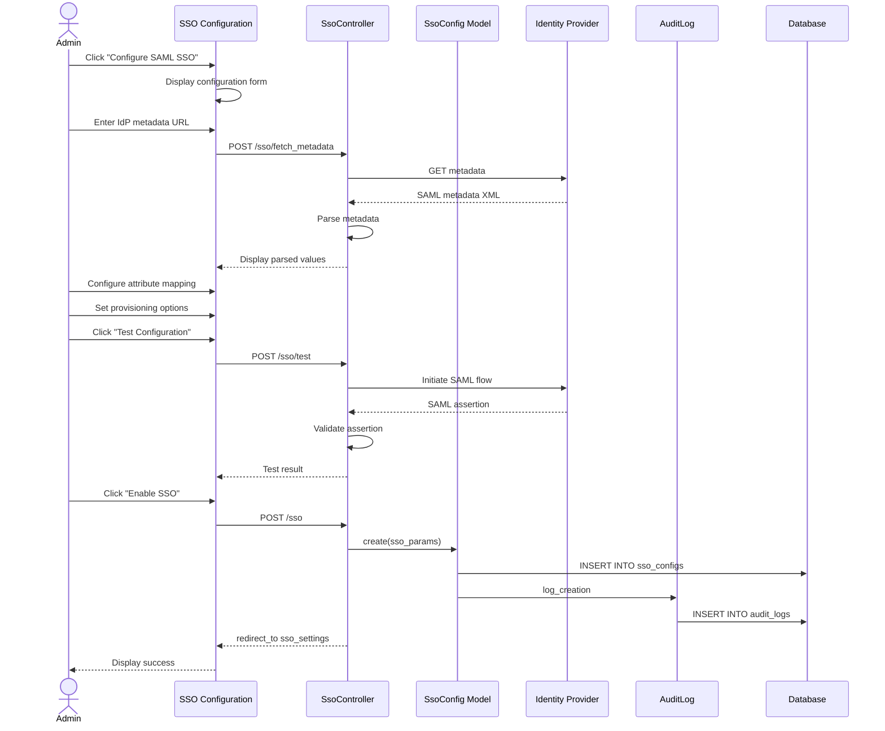

# UC-457: Configure SSO

## Metadata

| Attribute | Value |
|-----------|-------|
| **ID** | UC-457 |
| **Name** | Configure SSO |
| **Functional Area** | Integrations |
| **Primary Actor** | System Administrator (ACT-01) |
| **Priority** | P1 |
| **Complexity** | High |
| **Status** | Draft |

## Description

A system administrator configures Single Sign-On (SSO) authentication for their organization using SAML 2.0 or OpenID Connect (OIDC). This enables employees to authenticate using their corporate identity provider (IdP) such as Okta, Azure AD, or Google Workspace, eliminating the need for separate Ledgoria credentials.

## Actors

| Actor | Role in Use Case |
|-------|------------------|
| System Administrator (ACT-01) | Configures SSO settings |
| Integration Gateway (ACT-12) | Handles SAML/OIDC protocol flows |

## Preconditions

- [ ] User is authenticated with System Administrator role
- [ ] Organization has an active subscription with SSO feature enabled
- [ ] Identity Provider (IdP) is configured and accessible
- [ ] IdP metadata or OIDC discovery URL is available

## Postconditions

### Success
- [ ] SsoConfig record created with enabled=true
- [ ] IdP metadata/endpoints configured
- [ ] SAML certificate or OIDC secrets stored (encrypted)
- [ ] Attribute mapping configured
- [ ] Test authentication successful
- [ ] Audit log entry created

### Failure
- [ ] SsoConfig may be created with enabled=false
- [ ] Error message displayed to administrator
- [ ] Existing authentication method remains active

## Triggers

- Administrator navigates to Settings > Security > SSO
- Administrator clicks "Configure SSO" or "Add Identity Provider"

## Basic Flow (SAML 2.0)



| Step | Actor | Action | System Response |
|------|-------|--------|-----------------|
| 1 | Administrator | Clicks "Configure SSO" | System displays protocol selection |
| 2 | Administrator | Selects SAML 2.0 | SAML configuration form shown |
| 3 | Administrator | Enters IdP metadata URL | URL captured |
| 4 | System | Fetches and parses metadata | IdP settings extracted |
| 5 | Administrator | Reviews parsed settings | Entity ID, SSO URL displayed |
| 6 | Administrator | Uploads IdP certificate (if manual) | Certificate stored |
| 7 | Administrator | Configures attribute mapping | Mappings saved |
| 8 | Administrator | Sets user provisioning options | Auto-provision enabled/disabled |
| 9 | Administrator | Clicks "Test Configuration" | Test login initiated |
| 10 | System | Performs test SAML authentication | Flow completed |
| 11 | System | Validates assertion and attributes | Validation passes |
| 12 | Administrator | Clicks "Enable SSO" | SSO activated |
| 13 | System | Creates SsoConfig record | Config saved |
| 14 | System | Creates audit log entry | Activity logged |
| 15 | System | Displays success message | SSO enabled |

## Alternative Flows

### AF-1: OIDC Configuration

**Trigger:** Administrator selects OpenID Connect instead of SAML

| Step | Actor | Action | System Response |
|------|-------|--------|-----------------|
| 2a | Administrator | Selects OIDC | OIDC configuration form shown |
| 3a | Administrator | Enters discovery URL | URL captured |
| 4a | System | Fetches .well-known/openid-configuration | Endpoints discovered |
| 5a | Administrator | Enters client ID | Client ID captured |
| 6a | Administrator | Enters client secret | Secret encrypted and stored |
| 7a | Administrator | Configures scopes | Scopes saved |

**Resumption:** Continues at step 7 of basic flow (attribute mapping)

### AF-2: Manual SAML Configuration

**Trigger:** IdP does not provide metadata URL

| Step | Actor | Action | System Response |
|------|-------|--------|-----------------|
| 3a | Administrator | Clicks "Manual Configuration" | Manual form shown |
| 4a | Administrator | Enters Entity ID | Entity ID captured |
| 5a | Administrator | Enters SSO URL | SSO URL captured |
| 6a | Administrator | Uploads X.509 certificate | Certificate stored |
| 7a | Administrator | Enters SLO URL (optional) | Logout URL captured |

**Resumption:** Continues at step 7 of basic flow

### AF-3: Enable Auto-Provisioning

**Trigger:** Administrator enables automatic user creation

| Step | Actor | Action | System Response |
|------|-------|--------|-----------------|
| 8a | Administrator | Enables "Auto-provision users" | Option enabled |
| 8b | Administrator | Selects default role | Role assigned |
| 8c | Administrator | Enters allowed domains | Domains configured |

**Resumption:** Continues at step 9 of basic flow

## Exception Flows

### EF-1: Metadata Fetch Failure

**Trigger:** Cannot retrieve IdP metadata at step 4

| Step | Actor | Action | System Response |
|------|-------|--------|-----------------|
| 4.1 | System | Metadata request fails | Error displayed |
| 4.2 | System | Suggests manual configuration | Alternative offered |
| 4.3 | Administrator | Switches to manual config | Manual form shown |

**Resolution:** Administrator uses manual configuration

### EF-2: Test Authentication Failure

**Trigger:** Test SAML/OIDC flow fails at step 10

| Step | Actor | Action | System Response |
|------|-------|--------|-----------------|
| 10.1 | System | Authentication fails | Error message shown |
| 10.2 | System | Displays failure details | Debug info provided |
| 10.3 | Administrator | Reviews and corrects config | Settings adjusted |
| 10.4 | Administrator | Retests | Test re-initiated |

**Resolution:** Administrator fixes configuration and retests

### EF-3: Invalid Certificate

**Trigger:** SAML certificate validation fails

| Step | Actor | Action | System Response |
|------|-------|--------|-----------------|
| 11.1 | System | Certificate validation fails | Error displayed |
| 11.2 | System | Shows certificate details | Expiry, issuer shown |
| 11.3 | Administrator | Uploads correct certificate | New cert saved |

**Resolution:** Valid certificate uploaded

### EF-4: Attribute Mapping Error

**Trigger:** Required user attributes not present in assertion

| Step | Actor | Action | System Response |
|------|-------|--------|-----------------|
| 11.1 | System | Missing required attribute | Error displayed |
| 11.2 | System | Shows received attributes | Available attrs listed |
| 11.3 | Administrator | Adjusts attribute mapping | Mapping updated |

**Resolution:** Correct attributes mapped

## Business Rules

| ID | Rule | Description |
|----|------|-------------|
| BR-457.1 | Single SSO Config | Only one active SSO configuration per organization |
| BR-457.2 | Protocol Support | Must use SAML 2.0 or OIDC; other protocols not supported |
| BR-457.3 | Certificate Security | SAML certificates must be encrypted at rest |
| BR-457.4 | Test Required | SSO cannot be enabled without successful test |
| BR-457.5 | Fallback Login | Password login remains available for admins even with SSO |
| BR-457.6 | Domain Restriction | Auto-provisioned users must have email from allowed domains |

## Data Requirements

### SAML Configuration

| Field | Type | Required | Validation |
|-------|------|----------|------------|
| saml_entity_id | string | Yes | Valid URI |
| saml_sso_url | string | Yes | Valid HTTPS URL |
| saml_slo_url | string | No | Valid HTTPS URL |
| saml_certificate | text | Yes | Valid X.509 PEM |
| saml_fingerprint | string | No | SHA-256 fingerprint |
| saml_fingerprint_algorithm | enum | No | sha1, sha256, sha384, sha512 |

### OIDC Configuration

| Field | Type | Required | Validation |
|-------|------|----------|------------|
| oidc_discovery_url | string | Conditional | Valid HTTPS URL |
| oidc_authorization_endpoint | string | Conditional | Valid HTTPS URL |
| oidc_token_endpoint | string | Conditional | Valid HTTPS URL |
| oidc_userinfo_endpoint | string | No | Valid HTTPS URL |
| client_id | string | Yes | Not blank |
| client_secret | string | Yes | Encrypted storage |

### Common Configuration

| Field | Type | Required | Validation |
|-------|------|----------|------------|
| provider | enum | Yes | saml, oidc |
| enabled | boolean | Yes | Default false |
| attribute_mapping | json | No | Key-value pairs |
| auto_provision_users | boolean | No | Default false |
| default_role_id | integer | Conditional | Required if auto-provision |
| allowed_domains | array | No | Valid domain names |

### Output Data

| Field | Type | Description |
|-------|------|-------------|
| id | integer | SsoConfig record ID |
| sp_entity_id | string | Ledgoria's SAML entity ID |
| acs_url | string | Assertion Consumer Service URL |
| sp_metadata_url | string | URL to download SP metadata |

## Database Transactions

### Tables Affected

| Table | Operation | Conditions |
|-------|-----------|------------|
| sso_configs | CREATE | New SSO configuration |
| sso_configs | UPDATE | Enable/disable or modify |
| audit_logs | CREATE | Always |

### Transaction Detail

```sql
-- Configure SSO Transaction
BEGIN TRANSACTION;

-- Step 1: Disable any existing SSO config
UPDATE sso_configs
SET enabled = false, updated_at = NOW()
WHERE organization_id = @organization_id AND enabled = true;

-- Step 2: Insert new SSO configuration
INSERT INTO sso_configs (
    organization_id,
    provider,
    saml_entity_id,
    saml_sso_url,
    saml_slo_url,
    saml_certificate,
    saml_fingerprint,
    saml_fingerprint_algorithm,
    client_id,
    client_secret,
    oidc_discovery_url,
    oidc_authorization_endpoint,
    oidc_token_endpoint,
    oidc_userinfo_endpoint,
    attribute_mapping,
    auto_provision_users,
    default_role_id,
    allowed_domains,
    enabled,
    debug_mode,
    created_at,
    updated_at
) VALUES (
    @organization_id,
    @provider,
    @saml_entity_id,
    @saml_sso_url,
    @saml_slo_url,
    @encrypted_certificate,
    @saml_fingerprint,
    @fingerprint_algorithm,
    @client_id,
    @encrypted_client_secret,
    @oidc_discovery_url,
    @oidc_authorization_endpoint,
    @oidc_token_endpoint,
    @oidc_userinfo_endpoint,
    @attribute_mapping,
    @auto_provision_users,
    @default_role_id,
    @allowed_domains,
    true,
    false,
    NOW(),
    NOW()
);

SET @sso_config_id = LAST_INSERT_ID();

-- Step 3: Create audit log entry
INSERT INTO audit_logs (
    organization_id,
    user_id,
    action,
    auditable_type,
    auditable_id,
    metadata,
    ip_address,
    user_agent,
    created_at
) VALUES (
    @organization_id,
    @current_user_id,
    'sso.configured',
    'SsoConfig',
    @sso_config_id,
    JSON_OBJECT(
        'provider', @provider,
        'auto_provision', @auto_provision_users
    ),
    @ip_address,
    @user_agent,
    NOW()
);

COMMIT;
```

### Rollback Scenarios

| Scenario | Rollback Action |
|----------|-----------------|
| Metadata parse failure | No transaction, return error |
| Test authentication failure | Config saved but not enabled |
| Database error | Full rollback, display error |

## UI/UX Requirements

### Screen/Component

- **Location:** /admin/sso
- **Entry Point:**
  - Settings > Security > SSO
  - Organization settings
- **Key Elements:**
  - Protocol selection (SAML/OIDC)
  - Metadata URL input with fetch button
  - Manual configuration form
  - Attribute mapping editor
  - User provisioning settings
  - Test authentication button
  - Enable/disable toggle
  - SP metadata download

### Form Layout

```
+-------------------------------------------------------------+
| Single Sign-On (SSO) Configuration                          |
+-------------------------------------------------------------+
| Select Protocol                                              |
| ( ) SAML 2.0        (x) OpenID Connect (OIDC)               |
|                                                              |
+-------------------------------------------------------------+
| Identity Provider Configuration                              |
+-------------------------------------------------------------+
| Discovery URL                                                |
| +----------------------------------------------------------+ |
| | https://login.microsoftonline.com/tenant/.well-known/... | |
| +----------------------------------------------------------+ |
| [Fetch Configuration]                                        |
|                                                              |
| --- OR Manual Configuration ---                              |
|                                                              |
| Authorization Endpoint *                                     |
| +----------------------------------------------------------+ |
| | https://login.microsoftonline.com/tenant/oauth2/v2.0/... | |
| +----------------------------------------------------------+ |
|                                                              |
| Token Endpoint *                                             |
| +----------------------------------------------------------+ |
| | https://login.microsoftonline.com/tenant/oauth2/v2.0/... | |
| +----------------------------------------------------------+ |
|                                                              |
| Client ID *                                                  |
| +----------------------------------------------------------+ |
| | a1b2c3d4-e5f6-7890-abcd-ef1234567890                     | |
| +----------------------------------------------------------+ |
|                                                              |
| Client Secret *                                              |
| +----------------------------------------------------------+ |
| | ****************************************                  | |
| +----------------------------------------------------------+ |
|                                                              |
+-------------------------------------------------------------+
| Attribute Mapping                                            |
+-------------------------------------------------------------+
| | Ledgoria Field    | IdP Attribute                       | |
| |-------------------|-------------------------------------| |
| | Email *           | preferred_username              [v] | |
| | First Name        | given_name                      [v] | |
| | Last Name         | family_name                     [v] | |
+-------------------------------------------------------------+
|                                                              |
| User Provisioning                                            |
| [x] Auto-provision new users                                 |
|     Default Role: [ Recruiter          v]                    |
|     Allowed Domains: company.com, subsidiary.com             |
|                                                              |
+-------------------------------------------------------------+
| [Test Configuration]                                         |
|                                                              |
| Test Result: (pending)                                       |
+-------------------------------------------------------------+
| [Cancel]                              [Enable SSO]           |
+-------------------------------------------------------------+
```

### Service Provider Info

```
+-------------------------------------------------------------+
| Your Ledgoria SP Information (for IdP configuration)         |
+-------------------------------------------------------------+
| Entity ID (Issuer):                                          |
| https://app.ledgoria.com/saml/metadata/abc123               |
|                                                              |
| ACS URL (Reply URL):                                         |
| https://app.ledgoria.com/saml/acs/abc123                    |
|                                                              |
| [Download SP Metadata XML]                                   |
+-------------------------------------------------------------+
```

## Non-Functional Requirements

| Requirement | Target |
|-------------|--------|
| Response Time | Metadata fetch < 5s, test auth < 10s |
| Availability | 99.9% |
| Security | Certificate and secrets encrypted at rest |
| Compliance | SOC 2, GDPR compatible |

## Security Considerations

- [x] Authentication required: Admin role only
- [x] Encryption: Certificates and secrets encrypted using Rails encrypts
- [x] HTTPS required: All SSO endpoints must use HTTPS
- [x] Certificate validation: SAML certificates validated on use
- [x] Audit logging: Configuration changes logged
- [x] Fallback access: Admin password login remains available
- [x] Domain restriction: Auto-provisioned users limited to allowed domains

## Related Use Cases

| Use Case | Relationship |
|----------|--------------|
| UC-500 Create User | SSO can auto-provision users |
| UC-458 Manage API Keys | API auth separate from SSO |

---

## Data Model References

> Cross-references to [DATA_MODEL.md](../DATA_MODEL.md) and [CRUD_MATRIX.md](../CRUD_MATRIX.md)

### Subject Areas

| Subject Area | ID | Relationship |
|--------------|-----|--------------|
| Identity & Access | SA-01 | Primary |
| Integration | SA-11 | Secondary |
| Compliance & Audit | SA-09 | Reference |

### Entities CRUD

| Entity | C | R | U | D | Notes |
|--------|---|---|---|---|-------|
| SsoConfig | ✓ | ✓ | ✓ | | Created, read, updated |
| SsoIdentity | ✓ | | | | Created on first SSO login |
| Role | | ✓ | | | Read for default role |
| AuditLog | ✓ | | | | Log configuration changes |

**Legend:** C = Create, R = Read, U = Update, D = Delete

---

## Process Model References

> Cross-references to [PROCESS_MODEL.md](../PROCESS_MODEL.md) and [PROCESS_CRUD_MATRIX.md](../PROCESS_CRUD_MATRIX.md)

| Attribute | Value | Link |
|-----------|-------|------|
| **Elementary Business Process** | EP-1128: Configure SSO | [PROCESS_MODEL.md#ep-1128](../PROCESS_MODEL.md#bp-603-integration-management) |
| **Business Process** | BP-603: Integration Management | [PROCESS_MODEL.md#bp-603](../PROCESS_MODEL.md#bp-603-integration-management) |
| **Business Function** | BF-06: System Administration | [PROCESS_MODEL.md#bf-06](../PROCESS_MODEL.md#bf-06-system-administration) |

### EBP Details

| Attribute | Value |
|-----------|-------|
| **Trigger** | Administrator initiates SSO setup from security settings |
| **Input** | IdP metadata/endpoints, credentials, attribute mapping |
| **Output** | Active SsoConfig enabling SSO authentication |
| **Business Rules** | BR-457.1 through BR-457.6 (see Business Rules section) |

---

## Traceability Matrix

> Complete artifact mapping for requirements traceability

| Artifact Type | ID | Name | Link |
|---------------|-----|------|------|
| **Use Case** | UC-457 | Configure SSO | *(this document)* |
| **Elementary Process** | EP-1128 | Configure SSO | [PROCESS_MODEL.md](../PROCESS_MODEL.md#bp-603-integration-management) |
| **Business Process** | BP-603 | Integration Management | [PROCESS_MODEL.md](../PROCESS_MODEL.md#bp-603-integration-management) |
| **Business Function** | BF-06 | System Administration | [PROCESS_MODEL.md](../PROCESS_MODEL.md#bf-06-system-administration) |
| **Primary Actor** | ACT-01 | System Administrator | [ACTORS.md](../ACTORS.md#act-01-system-administrator) |
| **Subject Area (Primary)** | SA-01 | Identity & Access | [DATA_MODEL.md](../DATA_MODEL.md#sa-01-identity--access) |
| **Subject Area (Secondary)** | SA-11 | Integration | [DATA_MODEL.md](../DATA_MODEL.md#sa-11-integration) |
| **CRUD Matrix Row** | UC-457 | - | [CRUD_MATRIX.md](../CRUD_MATRIX.md#uc-457) |
| **Process CRUD Row** | EP-1128 | - | [PROCESS_CRUD_MATRIX.md](../PROCESS_CRUD_MATRIX.md#ep-1128) |

### Implementation Artifacts

| Artifact Type | Path/Reference | Status |
|---------------|----------------|--------|
| Controller | `app/controllers/admin/sso_configs_controller.rb` | Planned |
| Model | `app/models/sso_config.rb` | Implemented |
| Model | `app/models/sso_identity.rb` | Planned |
| Service | `app/services/sso/saml_service.rb` | Planned |
| Service | `app/services/sso/oidc_service.rb` | Planned |
| View | `app/views/admin/sso_configs/new.html.erb` | Planned |
| Test | `test/controllers/admin/sso_configs_controller_test.rb` | Planned |

---

## Open Questions

1. Should we support multiple IdPs for different user groups?
2. How do we handle SSO users who need to access multiple organizations?
3. What is the grace period before enforcing SSO-only login?

## Change History

| Version | Date | Author | Changes |
|---------|------|--------|---------|
| 0.1 | 2026-01-25 | System | Initial draft |
