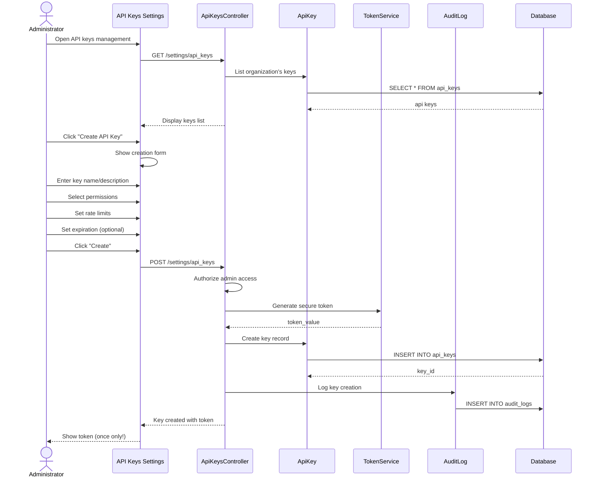

# UC-458: Manage API Keys

## Metadata

| Attribute | Value |
|-----------|-------|
| **ID** | UC-458 |
| **Name** | Manage API Keys |
| **Functional Area** | Integrations |
| **Primary Actor** | System Administrator (ACT-01) |
| **Priority** | P2 |
| **Complexity** | Medium |
| **Status** | Draft |

## Description

An administrator creates, manages, and revokes API keys that allow external systems to access the ATS via the REST API. Each key has configurable permissions, rate limits, and expiration. Keys enable integration with third-party tools, custom reporting solutions, and automated workflows.

## Actors

| Actor | Role in Use Case |
|-------|------------------|
| System Administrator (ACT-01) | Creates and manages API keys |
| Integration Gateway (ACT-11) | Validates keys on API requests |

## Preconditions

- [ ] User is authenticated and has Admin role
- [ ] API access is enabled for organization
- [ ] Organization has not exceeded key limit

## Postconditions

### Success
- [ ] ApiKey record created/updated/revoked
- [ ] Key token generated securely (shown once)
- [ ] Permissions and rate limits configured
- [ ] Key usable for API authentication
- [ ] Audit log entry created

### Failure
- [ ] Key not created/modified
- [ ] Validation errors displayed

## Triggers

- Admin navigates to API settings
- Integration setup requires API access
- Security audit requires key rotation

## Basic Flow



| Step | Actor | Action | System Response |
|------|-------|--------|-----------------|
| 1 | Administrator | Opens API keys settings | Key list displayed |
| 2 | System | Loads existing keys | Keys shown (masked) |
| 3 | Administrator | Clicks "Create API Key" | Creation form shown |
| 4 | Administrator | Enters key name | Name captured |
| 5 | Administrator | Adds description | Description stored |
| 6 | Administrator | Selects permissions | Scopes configured |
| 7 | Administrator | Sets rate limits | Limits defined |
| 8 | Administrator | Sets expiration (optional) | Date set |
| 9 | Administrator | Clicks "Create" | Form submitted |
| 10 | System | Generates secure token | Random token created |
| 11 | System | Stores hashed token | Hash saved |
| 12 | System | Creates audit log | Creation logged |
| 13 | System | Shows token ONCE | Copy prompt shown |

## Alternative Flows

### AF-1: Revoke API Key

**Trigger:** Admin revokes an existing key

| Step | Actor | Action | System Response |
|------|-------|--------|-----------------|
| 2.1 | Administrator | Clicks "Revoke" on key | Confirmation shown |
| 2.2 | Administrator | Confirms revocation | - |
| 2.3 | System | Marks key as revoked | Status updated |
| 2.4 | System | Logs revocation | Audit entry |

**Resumption:** Key immediately invalid

### AF-2: Regenerate Token

**Trigger:** Admin needs to rotate a key

| Step | Actor | Action | System Response |
|------|-------|--------|-----------------|
| 2.1 | Administrator | Clicks "Regenerate" | Warning shown |
| 2.2 | Administrator | Confirms action | - |
| 2.3 | System | Generates new token | New value created |
| 2.4 | System | Invalidates old token | Old hash replaced |
| 2.5 | System | Shows new token once | Copy prompt |

**Resumption:** Old integrations need updating

### AF-3: Edit Key Settings

**Trigger:** Admin modifies key permissions/limits

| Step | Actor | Action | System Response |
|------|-------|--------|-----------------|
| 2.1 | Administrator | Clicks "Edit" on key | Edit form shown |
| 2.2 | Administrator | Modifies settings | Changes captured |
| 2.3 | Administrator | Saves changes | Key updated |

**Resumption:** Token unchanged, settings effective immediately

## Exception Flows

### EF-1: Key Limit Reached

**Trigger:** Organization at maximum keys

| Step | Actor | Action | System Response |
|------|-------|--------|-----------------|
| E.1 | System | Checks key count | Limit reached |
| E.2 | System | Displays limit message | Max keys shown |
| E.3 | Administrator | Revokes unused key or upgrades | - |

**Resolution:** Key revoked or plan upgraded

### EF-2: Invalid Permissions

**Trigger:** Conflicting permissions selected

| Step | Actor | Action | System Response |
|------|-------|--------|-----------------|
| E.1 | System | Validates permissions | Conflict found |
| E.2 | System | Shows error | Explanation provided |
| E.3 | Administrator | Adjusts permissions | - |

**Resolution:** Valid permissions selected

## Business Rules

| ID | Rule | Description |
|----|------|-------------|
| BR-1 | Token Once | Full token shown only at creation |
| BR-2 | Secure Storage | Tokens stored as salted hashes |
| BR-3 | Key Limit | Max 10 active keys per organization |
| BR-4 | Rate Limits | Enforced per-key: minute/hour/day |
| BR-5 | Immediate Revoke | Revoked keys fail instantly |
| BR-6 | Expiration | Expired keys automatically fail |

## Data Requirements

### Input Data

| Field | Type | Required | Validation |
|-------|------|----------|------------|
| name | string | Yes | Max 100 chars, unique |
| description | text | No | Max 500 chars |
| permissions | array | Yes | Valid permission scopes |
| rate_limit_per_minute | integer | No | 1-1000 |
| rate_limit_per_hour | integer | No | 1-10000 |
| rate_limit_per_day | integer | No | 1-100000 |
| expires_at | datetime | No | Future date |

### Output Data

| Field | Type | Description |
|-------|------|-------------|
| key_id | integer | API key record ID |
| token | string | Full token (shown once) |
| key_prefix | string | First 8 chars for display |
| created_at | datetime | Creation timestamp |

## Database Transactions

### Tables Affected

| Table | Operation | Conditions |
|-------|-----------|------------|
| api_keys | CREATE/UPDATE | Key management |
| audit_logs | CREATE | All key operations |

### Transaction Detail

```sql
BEGIN TRANSACTION;

-- Create API key
INSERT INTO api_keys (
    organization_id, name, description,
    token_hash, key_prefix, permissions,
    rate_limit_per_minute, rate_limit_per_hour, rate_limit_per_day,
    expires_at, created_by_id, created_at, updated_at
)
VALUES (
    @org_id, @name, @description,
    @token_hash, @key_prefix, @permissions,
    @rpm, @rph, @rpd,
    @expires_at, @user_id, NOW(), NOW()
)
RETURNING id INTO @key_id;

-- Log creation
INSERT INTO audit_logs (
    action, auditable_type, auditable_id,
    user_id, metadata, created_at
)
VALUES (
    'api_key_created', 'ApiKey', @key_id, @user_id,
    '{"name": "...", "permissions": [...]}', NOW()
);

COMMIT;
```

### Rollback Scenarios

| Scenario | Rollback Action |
|----------|-----------------|
| Duplicate name | No key created |
| Invalid permissions | No key created |

## UI/UX Requirements

### Screen/Component

- **Location:** Settings > API Keys
- **Entry Point:** Settings menu
- **Key Elements:**
  - Active keys list with name, prefix, last used
  - Create key button
  - Permission checkboxes grouped by category
  - Rate limit inputs with defaults
  - Expiration date picker
  - Token display modal (one-time)
  - Copy to clipboard button
  - Revoke confirmation dialog

### Wireframe Reference

`/designs/wireframes/UC-458-api-keys.png`

## Non-Functional Requirements

| Requirement | Target |
|-------------|--------|
| Response Time | < 2 seconds |
| Token Security | 256-bit random |
| Hash Algorithm | bcrypt with salt |

## Security Considerations

- [x] Authentication required
- [x] Authorization check: Admin only
- [x] Token shown once: Cannot be retrieved
- [x] Secure generation: Cryptographically random
- [x] Hashed storage: Bcrypt with salt
- [x] Audit logging: All operations logged

## Related Use Cases

| Use Case | Relationship |
|----------|--------------|
| UC-459 Configure Webhooks | Webhooks use API keys |
| UC-460 View Integration Logs | Shows API key usage |
| UC-457 Configure SSO | Alternative auth method |

---

## Data Model References

### Subject Areas

| Subject Area | ID | Relationship |
|--------------|-----|--------------|
| Integration | SA-11 | Primary |
| IAM | SA-01 | Secondary |

### Entities CRUD

| Entity | C | R | U | D | Notes |
|--------|---|---|---|---|-------|
| ApiKey | ✓ | ✓ | ✓ | | Soft delete via revoke |
| AuditLog | ✓ | | | | Immutable entry |

---

## Process Model References

| Attribute | Value | Link |
|-----------|-------|------|
| **Elementary Business Process** | EP-1108: Manage API Keys | [PROCESS_MODEL.md](../PROCESS_MODEL.md) |
| **Business Process** | BP-603: Integration Management | [PROCESS_MODEL.md](../PROCESS_MODEL.md) |
| **Business Function** | BF-06: System Administration | [PROCESS_MODEL.md](../PROCESS_MODEL.md) |

### EBP Details

| Attribute | Value |
|-----------|-------|
| **Trigger** | Admin accesses API key management |
| **Input** | Key name, permissions, limits |
| **Output** | Functional API key |
| **Business Rules** | BR-1 through BR-6 |

---

## Traceability Matrix

| Artifact Type | ID | Name | Link |
|---------------|-----|------|------|
| **Use Case** | UC-458 | Manage API Keys | *(this document)* |
| **Elementary Process** | EP-1108 | Manage API Keys | [PROCESS_MODEL.md](../PROCESS_MODEL.md) |
| **Business Process** | BP-603 | Integration Management | [PROCESS_MODEL.md](../PROCESS_MODEL.md) |
| **Business Function** | BF-06 | System Administration | [PROCESS_MODEL.md](../PROCESS_MODEL.md) |
| **Primary Actor** | ACT-01 | System Administrator | [ACTORS.md](../ACTORS.md) |
| **Subject Area (Primary)** | SA-11 | Integration | [DATA_MODEL.md](../DATA_MODEL.md) |

### Implementation Artifacts

| Artifact Type | Path/Reference | Status |
|---------------|----------------|--------|
| Controller | `app/controllers/admin/api_keys_controller.rb` | Implemented |
| Model | `app/models/api_key.rb` | Implemented |
| Middleware | `app/middleware/api_key_authentication.rb` | Implemented |

---

## Open Questions

1. IP allowlist per key?
2. Usage quotas in addition to rate limits?

## Change History

| Version | Date | Author | Changes |
|---------|------|--------|---------|
| 0.1 | 2026-01-25 | System | Initial draft |
