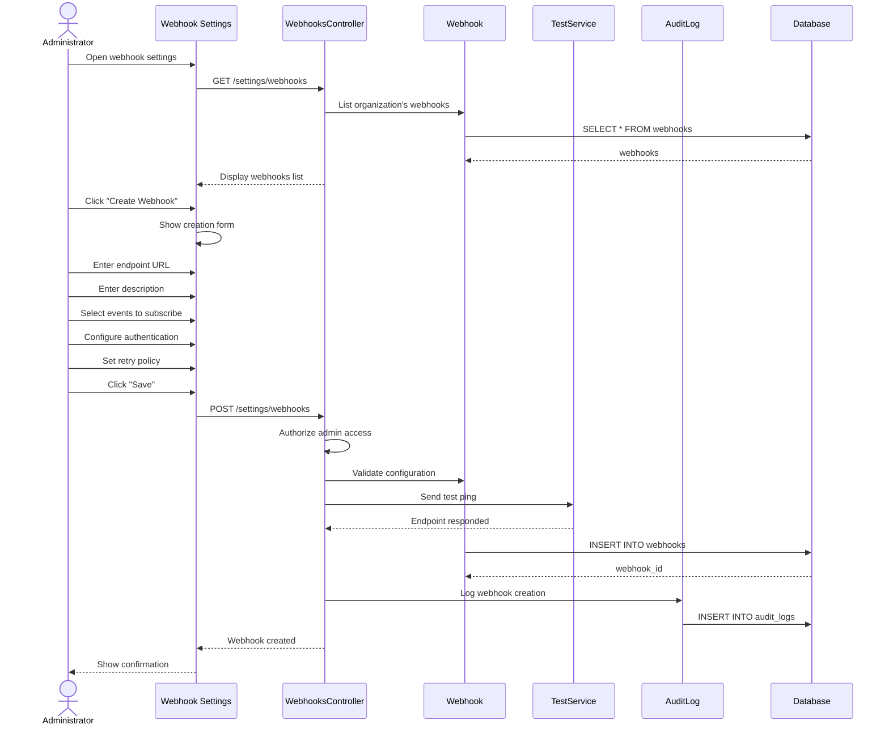

# UC-459: Configure Webhooks

## Metadata

| Attribute | Value |
|-----------|-------|
| **ID** | UC-459 |
| **Name** | Configure Webhooks |
| **Functional Area** | Integrations |
| **Primary Actor** | System Administrator (ACT-01) |
| **Priority** | P2 |
| **Complexity** | Medium |
| **Status** | Draft |

## Description

An administrator configures outbound webhooks to notify external systems when events occur in the ATS. Webhooks enable real-time integration with third-party tools, custom workflows, and data synchronization. Configuration includes endpoint URL, events to subscribe, authentication, and retry settings.

## Actors

| Actor | Role in Use Case |
|-------|------------------|
| System Administrator (ACT-01) | Configures webhook endpoints |
| Integration Gateway (ACT-11) | Delivers webhook payloads |

## Preconditions

- [ ] User is authenticated and has Admin role
- [ ] Webhooks feature is enabled for organization
- [ ] Organization has not exceeded webhook limit

## Postconditions

### Success
- [ ] Webhook record created/updated
- [ ] Endpoint URL validated
- [ ] Event subscriptions configured
- [ ] Authentication settings stored
- [ ] Webhook active and receiving events
- [ ] Audit log entry created

### Failure
- [ ] Webhook not created/modified
- [ ] Validation errors displayed

## Triggers

- Admin navigates to webhook settings
- Integration requires real-time event notification
- External system setup

## Basic Flow



| Step | Actor | Action | System Response |
|------|-------|--------|-----------------|
| 1 | Administrator | Opens webhook settings | Webhook list displayed |
| 2 | System | Loads existing webhooks | Webhooks shown |
| 3 | Administrator | Clicks "Create Webhook" | Creation form shown |
| 4 | Administrator | Enters endpoint URL | URL captured |
| 5 | Administrator | Adds description | Description stored |
| 6 | Administrator | Selects events | Subscriptions configured |
| 7 | Administrator | Configures authentication | Auth method set |
| 8 | Administrator | Sets retry policy | Retry settings saved |
| 9 | Administrator | Clicks "Save" | Form submitted |
| 10 | System | Validates endpoint | URL reachable |
| 11 | System | Sends test ping | Endpoint verified |
| 12 | System | Creates webhook record | Config stored |
| 13 | System | Creates audit log | Creation logged |
| 14 | System | Shows confirmation | Success message |

## Alternative Flows

### AF-1: Edit Webhook

**Trigger:** Admin modifies existing webhook

| Step | Actor | Action | System Response |
|------|-------|--------|-----------------|
| 2.1 | Administrator | Clicks "Edit" on webhook | Edit form shown |
| 2.2 | Administrator | Modifies settings | Changes captured |
| 2.3 | Administrator | Saves changes | Webhook updated |

**Resumption:** Changes effective immediately

### AF-2: Disable Webhook

**Trigger:** Admin temporarily disables webhook

| Step | Actor | Action | System Response |
|------|-------|--------|-----------------|
| 2.1 | Administrator | Clicks "Disable" | Confirmation shown |
| 2.2 | Administrator | Confirms | Status updated |
| 2.3 | System | Stops event delivery | Webhook paused |

**Resumption:** Can be re-enabled later

### AF-3: Test Webhook

**Trigger:** Admin sends test event

| Step | Actor | Action | System Response |
|------|-------|--------|-----------------|
| 2.1 | Administrator | Clicks "Send Test" | Test dialog shown |
| 2.2 | Administrator | Selects event type | Sample event chosen |
| 2.3 | System | Sends test payload | Request made |
| 2.4 | System | Shows response | Success/failure shown |

**Resumption:** User decides to save or adjust

## Exception Flows

### EF-1: Endpoint Unreachable

**Trigger:** Test ping fails

| Step | Actor | Action | System Response |
|------|-------|--------|-----------------|
| E.1 | System | Attempts connection | Connection failed |
| E.2 | System | Displays error | Timeout/error shown |
| E.3 | Administrator | Corrects URL or proceeds | - |

**Resolution:** URL corrected or warning acknowledged

### EF-2: Invalid Authentication

**Trigger:** Auth credentials invalid

| Step | Actor | Action | System Response |
|------|-------|--------|-----------------|
| E.1 | System | Validates auth config | Invalid format |
| E.2 | System | Shows validation error | Details provided |
| E.3 | Administrator | Corrects auth settings | - |

**Resolution:** Valid authentication provided

## Business Rules

| ID | Rule | Description |
|----|------|-------------|
| BR-1 | HTTPS Required | Endpoint URL must use HTTPS |
| BR-2 | Webhook Limit | Max 20 webhooks per organization |
| BR-3 | Retry Policy | Max 5 retries with exponential backoff |
| BR-4 | Timeout | 30 second timeout per delivery |
| BR-5 | Payload Size | Max 1MB payload per event |
| BR-6 | Signature | All payloads signed with HMAC |

## Data Requirements

### Input Data

| Field | Type | Required | Validation |
|-------|------|----------|------------|
| url | string | Yes | Valid HTTPS URL |
| description | text | No | Max 500 chars |
| events | array | Yes | At least one event |
| auth_type | enum | No | none/basic/bearer/hmac |
| auth_credentials | object | If auth_type | Based on type |
| retry_count | integer | No | 0-5, default 3 |
| retry_delay | integer | No | Seconds, default 60 |
| enabled | boolean | No | Default true |

### Output Data

| Field | Type | Description |
|-------|------|-------------|
| webhook_id | integer | Webhook record ID |
| secret | string | HMAC signing secret |
| status | string | active/disabled/failing |
| last_triggered_at | datetime | Most recent event |

## Database Transactions

### Tables Affected

| Table | Operation | Conditions |
|-------|-----------|------------|
| webhooks | CREATE/UPDATE | Webhook config |
| webhook_secrets | CREATE | HMAC signing key |
| audit_logs | CREATE | Configuration logging |

### Transaction Detail

```sql
BEGIN TRANSACTION;

-- Generate HMAC secret
SELECT encode(gen_random_bytes(32), 'hex') INTO @signing_secret;

-- Create webhook
INSERT INTO webhooks (
    organization_id, url, description,
    events, auth_type, auth_credentials,
    retry_count, retry_delay, signing_secret,
    enabled, created_by_id, created_at, updated_at
)
VALUES (
    @org_id, @url, @description,
    @events, @auth_type, @auth_credentials,
    @retry_count, @retry_delay, @signing_secret,
    true, @user_id, NOW(), NOW()
)
RETURNING id INTO @webhook_id;

-- Log creation
INSERT INTO audit_logs (
    action, auditable_type, auditable_id,
    user_id, metadata, created_at
)
VALUES (
    'webhook_created', 'Webhook', @webhook_id, @user_id,
    '{"url": "...", "events": [...]}', NOW()
);

COMMIT;
```

### Rollback Scenarios

| Scenario | Rollback Action |
|----------|-----------------|
| Invalid URL | No webhook created |
| Duplicate URL/events | Error returned |

## UI/UX Requirements

### Screen/Component

- **Location:** Settings > Webhooks
- **Entry Point:** Settings menu
- **Key Elements:**
  - Webhook list with status indicators
  - Create webhook button
  - URL input with HTTPS validation
  - Event type checkboxes (grouped)
  - Authentication type selector
  - Credentials inputs (conditional)
  - Retry settings
  - Test webhook button
  - Delivery log viewer

### Wireframe Reference

`/designs/wireframes/UC-459-webhooks.png`

## Non-Functional Requirements

| Requirement | Target |
|-------------|--------|
| Delivery Time | < 5 seconds from event |
| Retry Timing | Exponential backoff |
| Signature Algorithm | HMAC-SHA256 |
| Max Payload | 1MB |

## Security Considerations

- [x] Authentication required
- [x] Authorization check: Admin only
- [x] HTTPS required: No HTTP endpoints
- [x] Payload signing: HMAC-SHA256 signature
- [x] Credential encryption: Auth stored encrypted
- [x] Audit logging: All changes logged

## Related Use Cases

| Use Case | Relationship |
|----------|--------------|
| UC-458 Manage API Keys | API access for inbound |
| UC-460 View Integration Logs | Shows webhook deliveries |
| UC-453 Configure HRIS Integration | May use webhooks |

---

## Data Model References

### Subject Areas

| Subject Area | ID | Relationship |
|--------------|-----|--------------|
| Integration | SA-11 | Primary |

### Entities CRUD

| Entity | C | R | U | D | Notes |
|--------|---|---|---|---|-------|
| Webhook | ✓ | ✓ | ✓ | ✓ | Full CRUD |
| WebhookDelivery | | ✓ | | | Read delivery logs |
| AuditLog | ✓ | | | | Immutable entry |

---

## Process Model References

| Attribute | Value | Link |
|-----------|-------|------|
| **Elementary Business Process** | EP-1109: Configure Outbound Webhooks | [PROCESS_MODEL.md](../PROCESS_MODEL.md) |
| **Business Process** | BP-603: Integration Management | [PROCESS_MODEL.md](../PROCESS_MODEL.md) |
| **Business Function** | BF-06: System Administration | [PROCESS_MODEL.md](../PROCESS_MODEL.md) |

### EBP Details

| Attribute | Value |
|-----------|-------|
| **Trigger** | Admin accesses webhook settings |
| **Input** | Endpoint URL, events, auth config |
| **Output** | Active webhook subscription |
| **Business Rules** | BR-1 through BR-6 |

---

## Traceability Matrix

| Artifact Type | ID | Name | Link |
|---------------|-----|------|------|
| **Use Case** | UC-459 | Configure Webhooks | *(this document)* |
| **Elementary Process** | EP-1109 | Configure Webhooks | [PROCESS_MODEL.md](../PROCESS_MODEL.md) |
| **Business Process** | BP-603 | Integration Management | [PROCESS_MODEL.md](../PROCESS_MODEL.md) |
| **Business Function** | BF-06 | System Administration | [PROCESS_MODEL.md](../PROCESS_MODEL.md) |
| **Primary Actor** | ACT-01 | System Administrator | [ACTORS.md](../ACTORS.md) |
| **Subject Area (Primary)** | SA-11 | Integration | [DATA_MODEL.md](../DATA_MODEL.md) |

### Implementation Artifacts

| Artifact Type | Path/Reference | Status |
|---------------|----------------|--------|
| Controller | `app/controllers/admin/webhooks_controller.rb` | Implemented |
| Model | `app/models/webhook.rb` | Implemented |
| Job | `app/jobs/webhook_delivery_job.rb` | Implemented |
| Service | `app/services/webhook_delivery_service.rb` | Implemented |

---

## Open Questions

1. Support for webhook batching (multiple events)?
2. Dead letter queue for failed deliveries?

## Change History

| Version | Date | Author | Changes |
|---------|------|--------|---------|
| 0.1 | 2026-01-25 | System | Initial draft |
