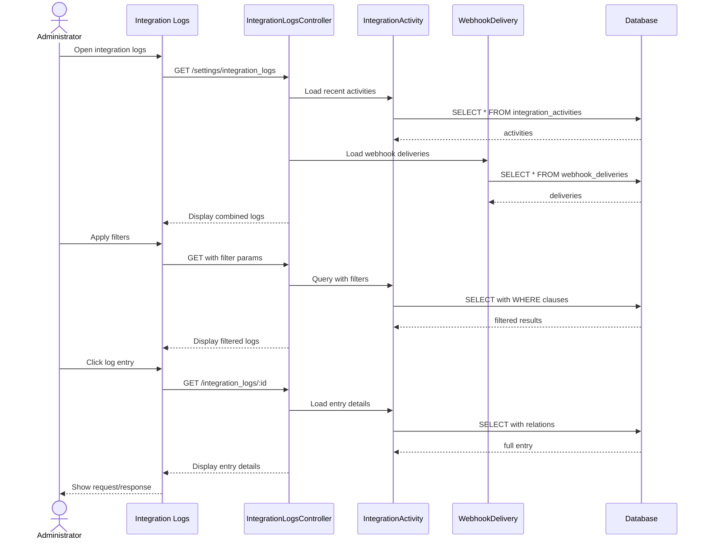

# UC-460: View Integration Logs

## Metadata

| Attribute | Value |
|-----------|-------|
| **ID** | UC-460 |
| **Name** | View Integration Logs |
| **Functional Area** | Integrations |
| **Primary Actor** | System Administrator (ACT-01) |
| **Priority** | P2 |
| **Complexity** | Low |
| **Status** | Draft |

## Description

An administrator views integration activity logs to monitor API requests, webhook deliveries, and external service interactions. The logs provide visibility into integration health, help troubleshoot issues, and support security auditing.

## Actors

| Actor | Role in Use Case |
|-------|------------------|
| System Administrator (ACT-01) | Views and analyzes logs |
| Compliance Officer (ACT-06) | Reviews for security audits |

## Preconditions

- [ ] User is authenticated and has Admin or Compliance role
- [ ] Integration logging is enabled for organization
- [ ] Log data exists (integrations have been used)

## Postconditions

### Success
- [ ] Logs displayed with filtering options
- [ ] Details accessible for individual entries
- [ ] Export available for analysis

### Failure
- [ ] Error message if logs unavailable
- [ ] Empty state if no matching logs

## Triggers

- Admin navigates to integration logs
- Integration failure notification
- Security audit requirement
- Troubleshooting integration issue

## Basic Flow



| Step | Actor | Action | System Response |
|------|-------|--------|-----------------|
| 1 | Administrator | Opens integration logs | Log viewer displayed |
| 2 | System | Loads recent activities | Latest logs shown |
| 3 | Administrator | Applies date filter | Date range set |
| 4 | Administrator | Filters by integration | Specific integration shown |
| 5 | Administrator | Filters by status | Success/error filtered |
| 6 | System | Queries filtered logs | Results displayed |
| 7 | Administrator | Clicks log entry | Entry selected |
| 8 | System | Loads entry details | Full details shown |
| 9 | Administrator | Reviews request/response | Details visible |
| 10 | Administrator | Optionally exports | Export initiated |

## Alternative Flows

### AF-1: Export Logs

**Trigger:** Admin needs logs for external analysis

| Step | Actor | Action | System Response |
|------|-------|--------|-----------------|
| 6.1 | Administrator | Clicks "Export" | Export options shown |
| 6.2 | Administrator | Selects format (CSV/JSON) | Format chosen |
| 6.3 | Administrator | Selects date range | Range confirmed |
| 6.4 | System | Generates export file | Download starts |

**Resumption:** File downloaded

### AF-2: Retry Failed Delivery

**Trigger:** Admin retries failed webhook

| Step | Actor | Action | System Response |
|------|-------|--------|-----------------|
| 8.1 | Administrator | Clicks "Retry" on failed entry | Confirmation shown |
| 8.2 | Administrator | Confirms retry | Retry queued |
| 8.3 | System | Resends webhook | New delivery attempted |
| 8.4 | System | Updates log | New entry added |

**Resumption:** Returns to log view

### AF-3: View Request Details

**Trigger:** Admin needs full request/response

| Step | Actor | Action | System Response |
|------|-------|--------|-----------------|
| 8.1 | Administrator | Clicks "Show Full Request" | Expanded view |
| 8.2 | System | Displays headers and body | Full HTTP details |
| 8.3 | Administrator | Clicks "Show Response" | Response shown |

**Resumption:** Admin continues review

## Exception Flows

### EF-1: No Logs Found

**Trigger:** Filter returns zero results

| Step | Actor | Action | System Response |
|------|-------|--------|-----------------|
| E.1 | System | Queries with filters | No matches |
| E.2 | System | Displays empty state | Message shown |
| E.3 | Administrator | Adjusts filters | - |

**Resolution:** Broader filter applied

### EF-2: Log Data Expired

**Trigger:** Requested logs past retention

| Step | Actor | Action | System Response |
|------|-------|--------|-----------------|
| E.1 | System | Checks date range | Past retention |
| E.2 | System | Shows retention notice | Policy explained |

**Resolution:** User selects valid date range

## Business Rules

| ID | Rule | Description |
|----|------|-------------|
| BR-1 | Retention Period | Logs retained for 90 days by default |
| BR-2 | PII Redaction | Sensitive data may be redacted |
| BR-3 | Export Limit | Max 10,000 rows per export |
| BR-4 | Access Control | Only admins and compliance can view |
| BR-5 | Immutable Logs | Logs cannot be modified after creation |

## Data Requirements

### Input Data

| Field | Type | Required | Validation |
|-------|------|----------|------------|
| start_date | date | No | Within retention |
| end_date | date | No | After start_date |
| integration_id | integer | No | Valid integration |
| activity_type | enum | No | api_request/webhook/sync |
| status | enum | No | success/failure/pending |
| search | string | No | Text search in details |

### Output Data

| Field | Type | Description |
|-------|------|-------------|
| id | integer | Log entry ID |
| activity_type | string | Type of activity |
| integration_name | string | Related integration |
| status | string | success/failure |
| http_status | integer | Response code |
| duration_ms | integer | Processing time |
| created_at | datetime | When occurred |
| request_payload | json | Request details |
| response_payload | json | Response details |

## Database Transactions

### Tables Affected

| Table | Operation | Conditions |
|-------|-----------|------------|
| integration_activities | READ | API requests, syncs |
| webhook_deliveries | READ | Webhook attempts |
| integrations | READ | For names/context |

### Transaction Detail

```sql
-- Read-only queries for log viewing

-- Combined log query
SELECT
    ia.id,
    ia.activity_type,
    i.name as integration_name,
    ia.status,
    ia.http_status,
    ia.duration_ms,
    ia.created_at,
    ia.request_summary,
    ia.response_summary
FROM integration_activities ia
JOIN integrations i ON i.id = ia.integration_id
WHERE ia.organization_id = @org_id
  AND ia.created_at BETWEEN @start_date AND @end_date
  AND (@integration_id IS NULL OR ia.integration_id = @integration_id)
  AND (@status IS NULL OR ia.status = @status)
ORDER BY ia.created_at DESC
LIMIT @per_page OFFSET @offset;

-- Webhook deliveries
SELECT
    wd.id,
    'webhook' as activity_type,
    w.url as integration_name,
    wd.status,
    wd.http_status,
    wd.duration_ms,
    wd.created_at,
    wd.event_type,
    wd.retry_count
FROM webhook_deliveries wd
JOIN webhooks w ON w.id = wd.webhook_id
WHERE wd.organization_id = @org_id
ORDER BY wd.created_at DESC;
```

### Rollback Scenarios

| Scenario | Rollback Action |
|----------|-----------------|
| N/A - Read only | No writes to rollback |

## UI/UX Requirements

### Screen/Component

- **Location:** Settings > Integration Logs
- **Entry Point:** Settings menu or integration dashboard
- **Key Elements:**
  - Date range picker
  - Integration filter dropdown
  - Status filter (success/failure)
  - Activity type filter
  - Search box
  - Log entries table
  - Expandable row details
  - Request/response panels
  - Export button
  - Retry button (for failures)
  - Pagination

### Wireframe Reference

`/designs/wireframes/UC-460-integration-logs.png`

## Non-Functional Requirements

| Requirement | Target |
|-------------|--------|
| Response Time | < 3 seconds |
| Max Results | 10,000 per query |
| Export Time | < 30 seconds |
| Retention | 90 days default |

## Security Considerations

- [x] Authentication required
- [x] Authorization check: Admin or Compliance only
- [x] PII redaction: Sensitive fields masked
- [x] Immutable logs: Cannot be modified
- [x] Export audit: Exports logged

## Related Use Cases

| Use Case | Relationship |
|----------|--------------|
| UC-458 Manage API Keys | API usage logged |
| UC-459 Configure Webhooks | Webhook deliveries logged |
| UC-450-457 All Integrations | Activities logged |

---

## Data Model References

### Subject Areas

| Subject Area | ID | Relationship |
|--------------|-----|--------------|
| Integration | SA-11 | Primary |
| Compliance & Audit | SA-09 | Secondary |

### Entities CRUD

| Entity | C | R | U | D | Notes |
|--------|---|---|---|---|-------|
| IntegrationActivity | | ✓ | | | Read only |
| WebhookDelivery | | ✓ | | | Read only |
| Integration | | ✓ | | | For context |

---

## Process Model References

| Attribute | Value | Link |
|-----------|-------|------|
| **Elementary Business Process** | EP-1110: View Integration Activity Logs | [PROCESS_MODEL.md](../PROCESS_MODEL.md) |
| **Business Process** | BP-603: Integration Management | [PROCESS_MODEL.md](../PROCESS_MODEL.md) |
| **Business Function** | BF-06: System Administration | [PROCESS_MODEL.md](../PROCESS_MODEL.md) |

### EBP Details

| Attribute | Value |
|-----------|-------|
| **Trigger** | Admin accesses integration logs |
| **Input** | Filter criteria, date range |
| **Output** | Filtered log entries |
| **Business Rules** | BR-1 through BR-5 |

---

## Traceability Matrix

| Artifact Type | ID | Name | Link |
|---------------|-----|------|------|
| **Use Case** | UC-460 | View Integration Logs | *(this document)* |
| **Elementary Process** | EP-1110 | View Integration Logs | [PROCESS_MODEL.md](../PROCESS_MODEL.md) |
| **Business Process** | BP-603 | Integration Management | [PROCESS_MODEL.md](../PROCESS_MODEL.md) |
| **Business Function** | BF-06 | System Administration | [PROCESS_MODEL.md](../PROCESS_MODEL.md) |
| **Primary Actor** | ACT-01 | System Administrator | [ACTORS.md](../ACTORS.md) |
| **Subject Area (Primary)** | SA-11 | Integration | [DATA_MODEL.md](../DATA_MODEL.md) |

### Implementation Artifacts

| Artifact Type | Path/Reference | Status |
|---------------|----------------|--------|
| Controller | `app/controllers/admin/integration_logs_controller.rb` | Implemented |
| Model | `app/models/integration_activity.rb` | Implemented |
| Model | `app/models/webhook_delivery.rb` | Implemented |

---

## Open Questions

1. Real-time log streaming?
2. Alerting on repeated failures?

## Change History

| Version | Date | Author | Changes |
|---------|------|--------|---------|
| 0.1 | 2026-01-25 | System | Initial draft |
