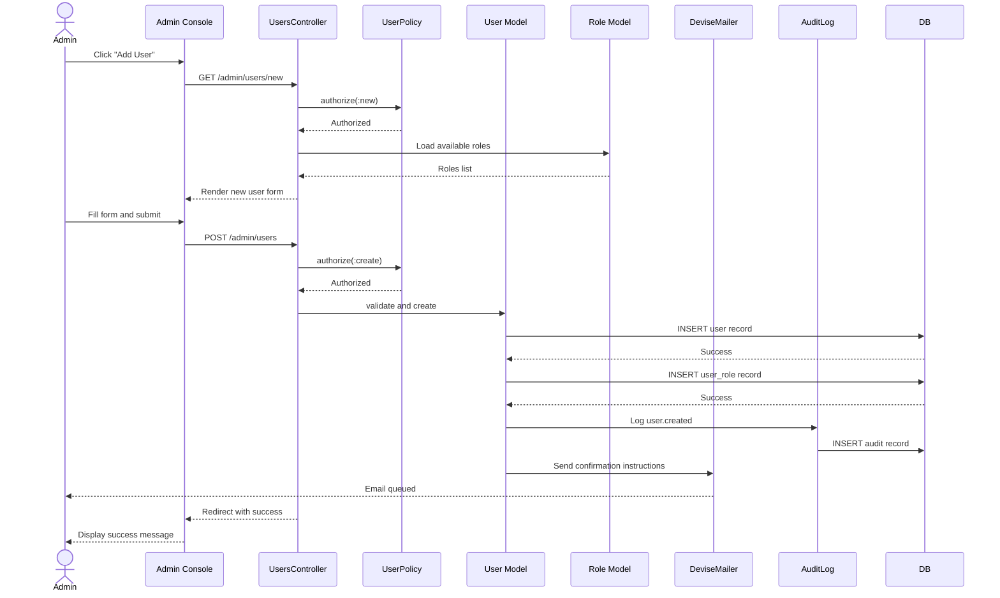

# UC-500: Create User

## Metadata

| Attribute | Value |
|-----------|-------|
| **ID** | UC-500 |
| **Name** | Create User |
| **Functional Area** | Administration |
| **Primary Actor** | System Administrator (ACT-01) |
| **Priority** | P1 |
| **Complexity** | Medium |
| **Status** | Approved |

## Description

Allows a System Administrator to create a new user account within their organization. The new user receives an email invitation to set their password and confirm their account. This is the primary method for onboarding new team members to the Ledgoria ATS.

## Actors

| Actor | Role in Use Case |
|-------|------------------|
| System Administrator (ACT-01) | Creates the user account and assigns initial role |
| Notification Engine (ACT-13) | Sends invitation email to new user |

## Preconditions

- [ ] Administrator is authenticated and has active session
- [ ] Administrator has `users:create` permission
- [ ] Organization has not exceeded user limit for current plan
- [ ] Email address is not already registered in the organization

## Postconditions

### Success
- [ ] New User record created in database
- [ ] UserRole record created linking user to assigned role
- [ ] Confirmation email sent to new user
- [ ] Audit log entry created for user creation
- [ ] Administrator redirected to user list with success message

### Failure
- [ ] No User record created
- [ ] Error message displayed to administrator
- [ ] Validation errors highlighted on form

## Triggers

- Administrator navigates to Admin > Users and clicks "Add User"
- Administrator clicks "Invite User" from team management interface

## Basic Flow



| Step | Actor | Action | System Response |
|------|-------|--------|-----------------|
| 1 | Administrator | Navigates to Admin > Users | System displays user list |
| 2 | Administrator | Clicks "Add User" button | System displays new user form with role dropdown |
| 3 | Administrator | Enters first name, last name, email | Fields validated in real-time |
| 4 | Administrator | Selects role from dropdown | Role selection stored |
| 5 | Administrator | Clicks "Create User" | System validates all fields |
| 6 | System | Creates User record with active=true | User saved to database |
| 7 | System | Creates UserRole linking user to selected role | Association created |
| 8 | System | Generates confirmation token | Token stored on user record |
| 9 | System | Sends invitation email | Email queued via Devise |
| 10 | System | Creates audit log entry | Audit trail recorded |
| 11 | System | Redirects to user list | Success message displayed |

## Alternative Flows

### AF-1: Create User with Multiple Roles

**Trigger:** Administrator wants to assign multiple roles to new user at step 4

| Step | Actor | Action | System Response |
|------|-------|--------|-----------------|
| 4.1 | Administrator | Selects multiple roles from multi-select | All selected roles stored |
| 4.2 | System | Creates UserRole for each selected role | Multiple associations created |

**Resumption:** Returns to step 5 of basic flow

### AF-2: Create User from Candidate Import

**Trigger:** Administrator imports users from CSV file

| Step | Actor | Action | System Response |
|------|-------|--------|-----------------|
| 1 | Administrator | Clicks "Import Users" | System displays import dialog |
| 2 | Administrator | Uploads CSV file | System parses file |
| 3 | System | Validates each row | Shows preview with errors |
| 4 | Administrator | Confirms import | System creates users in batch |
| 5 | System | Sends individual invitation emails | Emails queued |

**Resumption:** Ends with import summary

## Exception Flows

### EF-1: Duplicate Email Address

**Trigger:** Email already exists in organization

| Step | Actor | Action | System Response |
|------|-------|--------|-----------------|
| E.1 | System | Detects duplicate email | Displays "Email already registered" error |
| E.2 | Administrator | Enters different email | System re-validates |

**Resolution:** Administrator provides unique email address

### EF-2: User Limit Exceeded

**Trigger:** Organization has reached user limit for plan

| Step | Actor | Action | System Response |
|------|-------|--------|-----------------|
| E.1 | System | Checks user count against plan limit | Displays upgrade prompt |
| E.2 | Administrator | Either upgrades plan or cancels | Creation blocked until resolved |

**Resolution:** Administrator upgrades plan or removes inactive users

### EF-3: Invalid Email Format

**Trigger:** Email format validation fails

| Step | Actor | Action | System Response |
|------|-------|--------|-----------------|
| E.1 | System | Validates email format | Highlights field with error |
| E.2 | Administrator | Corrects email format | System re-validates |

**Resolution:** Valid email format provided

## Business Rules

| ID | Rule | Description |
|----|------|-------------|
| BR-1 | Unique Email | Email must be unique within organization (case-insensitive) |
| BR-2 | Required Fields | First name, last name, and email are required |
| BR-3 | Role Required | At least one role must be assigned to new user |
| BR-4 | Plan Limits | User count must not exceed organization plan limits |
| BR-5 | Password Policy | User sets password via email link; must meet complexity requirements |
| BR-6 | Confirmation Required | Production users must confirm email before accessing system |

## Data Requirements

### Input Data

| Field | Type | Required | Validation |
|-------|------|----------|------------|
| first_name | string | Yes | Max 100 chars, not blank |
| last_name | string | Yes | Max 100 chars, not blank |
| email | string | Yes | Valid email format, unique in org |
| role_ids | array[integer] | Yes | At least one valid role ID |

### Output Data

| Field | Type | Description |
|-------|------|-------------|
| user_id | integer | ID of created user |
| confirmation_sent | boolean | Whether invitation email was sent |
| created_at | datetime | Timestamp of creation |

## Database Transactions

### Tables Affected

| Table | Operation | Conditions |
|-------|-----------|------------|
| users | CREATE | New user record |
| user_roles | CREATE | One per assigned role |
| audit_logs | CREATE | Audit trail entry |

### Transaction Detail

```sql
-- Step 6-10: Create user and associations
BEGIN TRANSACTION;

-- Operation 1: Create user
INSERT INTO users (
    organization_id,
    email,
    first_name,
    last_name,
    active,
    confirmation_token,
    confirmation_sent_at,
    created_at,
    updated_at
)
VALUES (
    @organization_id,
    @email,
    @first_name,
    @last_name,
    true,
    @confirmation_token,
    NOW(),
    NOW(),
    NOW()
)
RETURNING id INTO @user_id;

-- Operation 2: Create user_role for each assigned role
INSERT INTO user_roles (user_id, role_id, granted_by_id, created_at)
VALUES (@user_id, @role_id, @current_user_id, NOW());

-- Operation 3: Audit log entry
INSERT INTO audit_logs (
    organization_id,
    user_id,
    action,
    auditable_type,
    auditable_id,
    metadata,
    ip_address,
    created_at
)
VALUES (
    @organization_id,
    @current_user_id,
    'user.created',
    'User',
    @user_id,
    '{"email": "@email", "roles": [@role_ids]}',
    @ip_address,
    NOW()
);

COMMIT;
```

### Rollback Scenarios

| Scenario | Rollback Action |
|----------|-----------------|
| Email delivery failure | User still created; email can be resent |
| Invalid role ID | Transaction rolled back, no records created |
| Database constraint violation | Transaction rolled back, error displayed |

## UI/UX Requirements

### Screen/Component

- **Location:** Admin Console > Users
- **Entry Point:** "Add User" button on user list page
- **Key Elements:**
  - Form with first name, last name, email inputs
  - Role selection dropdown (or multi-select for multiple roles)
  - "Create User" and "Cancel" buttons
  - Real-time validation feedback
  - Success/error toast notifications

### Wireframe Reference

`/designs/wireframes/UC-500-create-user.png`

## Non-Functional Requirements

| Requirement | Target |
|-------------|--------|
| Response Time | < 2 seconds for form submission |
| Email Delivery | < 30 seconds after user creation |
| Availability | 99.9% |

## Security Considerations

- [x] Authentication required
- [x] Authorization check: `users:create` permission required
- [x] Data encryption: Email stored; password hash generated on user confirmation
- [x] Audit logging: User creation logged with actor, timestamp, and metadata
- [x] Input sanitization: All inputs sanitized against XSS
- [x] Rate limiting: Prevent bulk user creation abuse

## Related Use Cases

| Use Case | Relationship |
|----------|--------------|
| UC-501 | Edit User - can modify user after creation |
| UC-502 | Deactivate User - can disable user access |
| UC-503 | Assign Role - can change user roles after creation |
| UC-457 | Configure SSO - alternative authentication method |

---

## Data Model References

> Cross-references to [DATA_MODEL.md](../DATA_MODEL.md) and [CRUD_MATRIX.md](../CRUD_MATRIX.md)

### Subject Areas

| Subject Area | ID | Relationship |
|--------------|-----|--------------|
| Identity & Access | SA-01 | Primary |
| Organization Management | SA-02 | Secondary |

### Entities CRUD

| Entity | C | R | U | D | Notes |
|--------|---|---|---|---|-------|
| User | X | X | | | Created in basic flow step 6 |
| UserRole | X | X | | | Created in basic flow step 7 |
| Role | | X | | | Read for role selection |
| AuditLog | X | | | | Created in basic flow step 10 |

**Legend:** C = Create, R = Read, U = Update, D = Delete

---

## Process Model References

> Cross-references to [PROCESS_MODEL.md](../PROCESS_MODEL.md) and [PROCESS_CRUD_MATRIX.md](../PROCESS_CRUD_MATRIX.md)

| Attribute | Value | Link |
|-----------|-------|------|
| **Elementary Business Process** | EP-1101: Create User | [PROCESS_MODEL.md#ep-1101](../PROCESS_MODEL.md#bp-601-user-administration) |
| **Business Process** | BP-601: User Administration | [PROCESS_MODEL.md#bp-601](../PROCESS_MODEL.md#bp-601-user-administration) |
| **Business Function** | BF-06: System Administration | [PROCESS_MODEL.md#bf-06](../PROCESS_MODEL.md#bf-06-system-administration) |

### EBP Details

| Attribute | Value |
|-----------|-------|
| **Trigger** | Admin action - need to add new team member |
| **Input** | User details (name, email), role assignment |
| **Output** | Active user account, invitation email sent |
| **Business Rules** | BR-1 through BR-6 (unique email, required fields, role required, plan limits) |

---

## Traceability Matrix

> Complete artifact mapping for requirements traceability

| Artifact Type | ID | Name | Link |
|---------------|-----|------|------|
| **Use Case** | UC-500 | Create User | *(this document)* |
| **Elementary Process** | EP-1101 | Create User | [PROCESS_MODEL.md](../PROCESS_MODEL.md#bp-601-user-administration) |
| **Business Process** | BP-601 | User Administration | [PROCESS_MODEL.md](../PROCESS_MODEL.md#bp-601-user-administration) |
| **Business Function** | BF-06 | System Administration | [PROCESS_MODEL.md](../PROCESS_MODEL.md#bf-06-system-administration) |
| **Primary Actor** | ACT-01 | System Administrator | [ACTORS.md](../ACTORS.md#act-01-system-administrator) |
| **Subject Area (Primary)** | SA-01 | Identity & Access | [DATA_MODEL.md](../DATA_MODEL.md#sa-01-identity--access) |
| **Subject Area (Secondary)** | SA-02 | Organization Management | [DATA_MODEL.md](../DATA_MODEL.md#sa-02-organization-management) |
| **CRUD Matrix Row** | UC-500 | - | [CRUD_MATRIX.md](../CRUD_MATRIX.md#uc-500) |
| **Process CRUD Row** | EP-1101 | - | [PROCESS_CRUD_MATRIX.md](../PROCESS_CRUD_MATRIX.md#ep-1101) |

### Implementation Artifacts

| Artifact Type | Path/Reference | Status |
|---------------|----------------|--------|
| Controller | `app/controllers/admin/users_controller.rb` | Implemented |
| Model | `app/models/user.rb` | Implemented |
| Model | `app/models/user_role.rb` | Implemented |
| Service | `app/services/users/create_service.rb` | Planned |
| Policy | `app/policies/user_policy.rb` | Implemented |
| View | `app/views/admin/users/new.html.erb` | Implemented |
| View | `app/views/admin/users/_form.html.erb` | Implemented |
| Test | `test/controllers/admin/users_controller_test.rb` | Implemented |

---

## Open Questions

1. Should we support bulk user creation via CSV import in the initial release?
2. Should administrators be able to pre-assign department affiliations to new users?

## Change History

| Version | Date | Author | Changes |
|---------|------|--------|---------|
| 0.1 | 2026-01-25 | System | Initial draft |
