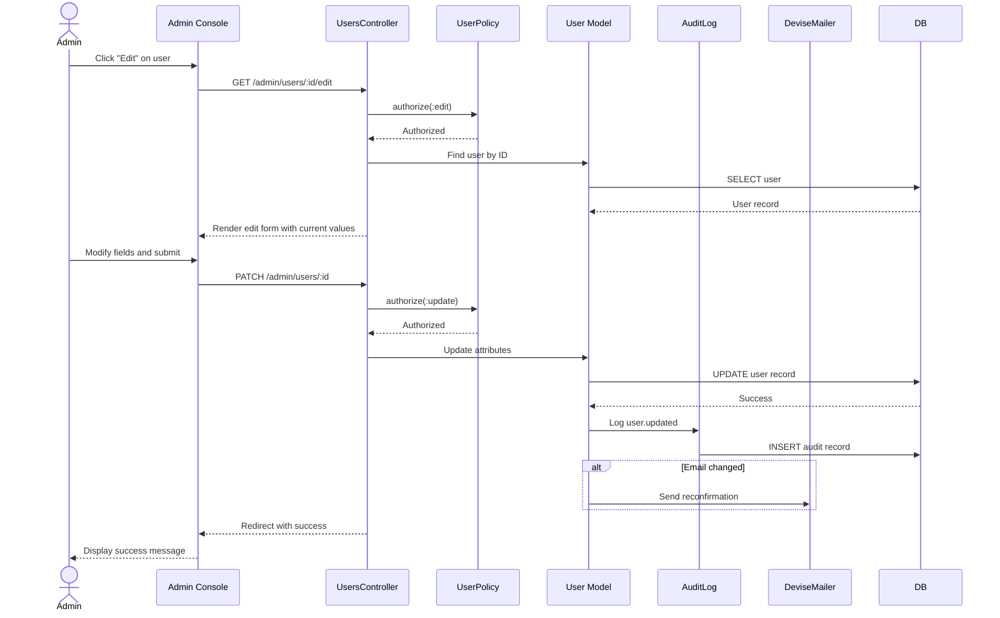

# UC-501: Edit User

## Metadata

| Attribute | Value |
|-----------|-------|
| **ID** | UC-501 |
| **Name** | Edit User |
| **Functional Area** | Administration |
| **Primary Actor** | System Administrator (ACT-01) |
| **Priority** | P1 |
| **Complexity** | Low |
| **Status** | Approved |

## Description

Allows a System Administrator to modify an existing user's profile information within their organization. This includes updating personal details such as name and email, but does not include role changes (see UC-503) or account deactivation (see UC-502).

## Actors

| Actor | Role in Use Case |
|-------|------------------|
| System Administrator (ACT-01) | Modifies user profile information |
| Target User | The user whose profile is being modified |

## Preconditions

- [ ] Administrator is authenticated and has active session
- [ ] Administrator has `users:update` permission
- [ ] Target user exists and belongs to same organization
- [ ] Target user account is not soft-deleted

## Postconditions

### Success
- [ ] User record updated with new values
- [ ] Audit log entry created for user modification
- [ ] If email changed, confirmation email sent to new address
- [ ] Administrator redirected to user detail/list with success message

### Failure
- [ ] User record unchanged
- [ ] Error message displayed to administrator
- [ ] Validation errors highlighted on form

## Triggers

- Administrator navigates to Admin > Users and clicks "Edit" on a user row
- Administrator views user detail page and clicks "Edit Profile"

## Basic Flow



| Step | Actor | Action | System Response |
|------|-------|--------|-----------------|
| 1 | Administrator | Navigates to Admin > Users | System displays user list |
| 2 | Administrator | Clicks "Edit" on target user row | System displays edit form with current values |
| 3 | Administrator | Modifies first name, last name, and/or email | Fields validated in real-time |
| 4 | Administrator | Clicks "Save Changes" | System validates all fields |
| 5 | System | Validates uniqueness of email if changed | Checks against organization users |
| 6 | System | Updates User record | Changes saved to database |
| 7 | System | Creates audit log entry with before/after values | Audit trail recorded |
| 8 | System | If email changed, sends confirmation to new email | Confirmation email queued |
| 9 | System | Redirects to user list or detail | Success message displayed |

## Alternative Flows

### AF-1: Admin Edits Own Profile

**Trigger:** Administrator is editing their own user account

| Step | Actor | Action | System Response |
|------|-------|--------|-----------------|
| 2.1 | System | Detects self-edit | Shows additional warning for email change |
| 8.1 | System | If email changed | Admin must re-authenticate after confirmation |

**Resumption:** Returns to step 9 of basic flow

### AF-2: Cancel Edit

**Trigger:** Administrator decides not to save changes at step 4

| Step | Actor | Action | System Response |
|------|-------|--------|-----------------|
| 4.1 | Administrator | Clicks "Cancel" button | Discards unsaved changes |
| 4.2 | System | Redirects to previous page | No changes made |

**Resumption:** Use case ends

## Exception Flows

### EF-1: Duplicate Email Address

**Trigger:** New email already exists for another user in organization

| Step | Actor | Action | System Response |
|------|-------|--------|-----------------|
| E.1 | System | Detects duplicate email | Displays "Email already in use" error |
| E.2 | Administrator | Enters different email | System re-validates |

**Resolution:** Administrator provides unique email address

### EF-2: User Not Found

**Trigger:** User ID in URL is invalid or user was deleted

| Step | Actor | Action | System Response |
|------|-------|--------|-----------------|
| E.1 | System | Cannot find user | Displays 404 error page |
| E.2 | Administrator | Returns to user list | Can search for correct user |

**Resolution:** Administrator locates correct user

### EF-3: Concurrent Edit Conflict

**Trigger:** Another admin modified the user while form was open

| Step | Actor | Action | System Response |
|------|-------|--------|-----------------|
| E.1 | System | Detects version conflict | Displays conflict warning |
| E.2 | Administrator | Reviews changes | Can choose to overwrite or refresh |

**Resolution:** Administrator resolves conflict

## Business Rules

| ID | Rule | Description |
|----|------|-------------|
| BR-1 | Unique Email | Email must remain unique within organization |
| BR-2 | Required Fields | First name, last name, and email are required |
| BR-3 | Same Organization | Can only edit users in own organization |
| BR-4 | Email Reconfirmation | Changing email requires confirmation of new address |
| BR-5 | Audit Trail | All changes must be logged with before/after values |
| BR-6 | Self-Edit Restrictions | Admins cannot remove their own admin role (see UC-503) |

## Data Requirements

### Input Data

| Field | Type | Required | Validation |
|-------|------|----------|------------|
| first_name | string | Yes | Max 100 chars, not blank |
| last_name | string | Yes | Max 100 chars, not blank |
| email | string | Yes | Valid email format, unique in org |

### Output Data

| Field | Type | Description |
|-------|------|-------------|
| user_id | integer | ID of updated user |
| updated_fields | array | List of fields that changed |
| email_confirmation_required | boolean | Whether email needs reconfirmation |

## Database Transactions

### Tables Affected

| Table | Operation | Conditions |
|-------|-----------|------------|
| users | UPDATE | User profile fields |
| audit_logs | CREATE | Change record |

### Transaction Detail

```sql
-- Step 6-7: Update user and log changes
BEGIN TRANSACTION;

-- Capture current values for audit
SELECT first_name, last_name, email
INTO @old_first_name, @old_last_name, @old_email
FROM users WHERE id = @user_id;

-- Operation 1: Update user
UPDATE users
SET first_name = @new_first_name,
    last_name = @new_last_name,
    email = CASE WHEN @email_changed THEN @new_email ELSE email END,
    unconfirmed_email = CASE WHEN @email_changed THEN @new_email ELSE NULL END,
    updated_at = NOW()
WHERE id = @user_id AND organization_id = @organization_id;

-- Operation 2: Audit log entry
INSERT INTO audit_logs (
    organization_id,
    user_id,
    action,
    auditable_type,
    auditable_id,
    metadata,
    changes,
    ip_address,
    created_at
)
VALUES (
    @organization_id,
    @current_user_id,
    'user.updated',
    'User',
    @user_id,
    '{"modified_by": "@current_user_id"}',
    '{"first_name": {"was": "@old_first_name", "now": "@new_first_name"}, ...}',
    @ip_address,
    NOW()
);

COMMIT;
```

### Rollback Scenarios

| Scenario | Rollback Action |
|----------|-----------------|
| Validation failure | No commit, display errors |
| Email delivery failure | User updated; email resend available |
| Concurrent modification | Transaction rolled back, refresh required |

## UI/UX Requirements

### Screen/Component

- **Location:** Admin Console > Users > Edit
- **Entry Point:** "Edit" button on user list or user detail page
- **Key Elements:**
  - Pre-populated form with current values
  - Visual indication of changed fields
  - "Save Changes" and "Cancel" buttons
  - Warning banner for email change implications
  - Success/error toast notifications

### Wireframe Reference

`/designs/wireframes/UC-501-edit-user.png`

## Non-Functional Requirements

| Requirement | Target |
|-------------|--------|
| Response Time | < 1 second for form load, < 2 seconds for save |
| Availability | 99.9% |
| Concurrent Users | Support multiple admins editing different users |

## Security Considerations

- [x] Authentication required
- [x] Authorization check: `users:update` permission required
- [x] Data encryption: Email stored (if changed)
- [x] Audit logging: All changes logged with before/after values
- [x] Same-organization check: Cannot edit users outside org
- [x] CSRF protection: Token required for form submission

## Related Use Cases

| Use Case | Relationship |
|----------|--------------|
| UC-500 | Create User - precedes this use case |
| UC-502 | Deactivate User - alternative action on user |
| UC-503 | Assign Role - separate use case for role changes |

---

## Data Model References

> Cross-references to [DATA_MODEL.md](../DATA_MODEL.md) and [CRUD_MATRIX.md](../CRUD_MATRIX.md)

### Subject Areas

| Subject Area | ID | Relationship |
|--------------|-----|--------------|
| Identity & Access | SA-01 | Primary |

### Entities CRUD

| Entity | C | R | U | D | Notes |
|--------|---|---|---|---|-------|
| User | | X | X | | Read for edit form, Update for save |
| AuditLog | X | | | | Created in basic flow step 7 |

**Legend:** C = Create, R = Read, U = Update, D = Delete

---

## Process Model References

> Cross-references to [PROCESS_MODEL.md](../PROCESS_MODEL.md) and [PROCESS_CRUD_MATRIX.md](../PROCESS_CRUD_MATRIX.md)

| Attribute | Value | Link |
|-----------|-------|------|
| **Elementary Business Process** | EP-1102: Edit User | [PROCESS_MODEL.md#ep-1102](../PROCESS_MODEL.md#bp-601-user-administration) |
| **Business Process** | BP-601: User Administration | [PROCESS_MODEL.md#bp-601](../PROCESS_MODEL.md#bp-601-user-administration) |
| **Business Function** | BF-06: System Administration | [PROCESS_MODEL.md#bf-06](../PROCESS_MODEL.md#bf-06-system-administration) |

### EBP Details

| Attribute | Value |
|-----------|-------|
| **Trigger** | Admin action - need to update user information |
| **Input** | Modified user details (name, email) |
| **Output** | Updated user record, audit trail |
| **Business Rules** | BR-1 through BR-6 (unique email, required fields, audit trail) |

---

## Traceability Matrix

> Complete artifact mapping for requirements traceability

| Artifact Type | ID | Name | Link |
|---------------|-----|------|------|
| **Use Case** | UC-501 | Edit User | *(this document)* |
| **Elementary Process** | EP-1102 | Edit User | [PROCESS_MODEL.md](../PROCESS_MODEL.md#bp-601-user-administration) |
| **Business Process** | BP-601 | User Administration | [PROCESS_MODEL.md](../PROCESS_MODEL.md#bp-601-user-administration) |
| **Business Function** | BF-06 | System Administration | [PROCESS_MODEL.md](../PROCESS_MODEL.md#bf-06-system-administration) |
| **Primary Actor** | ACT-01 | System Administrator | [ACTORS.md](../ACTORS.md#act-01-system-administrator) |
| **Subject Area (Primary)** | SA-01 | Identity & Access | [DATA_MODEL.md](../DATA_MODEL.md#sa-01-identity--access) |
| **CRUD Matrix Row** | UC-501 | - | [CRUD_MATRIX.md](../CRUD_MATRIX.md#uc-501) |
| **Process CRUD Row** | EP-1102 | - | [PROCESS_CRUD_MATRIX.md](../PROCESS_CRUD_MATRIX.md#ep-1102) |

### Implementation Artifacts

| Artifact Type | Path/Reference | Status |
|---------------|----------------|--------|
| Controller | `app/controllers/admin/users_controller.rb` | Implemented |
| Model | `app/models/user.rb` | Implemented |
| Policy | `app/policies/user_policy.rb` | Implemented |
| View | `app/views/admin/users/edit.html.erb` | Implemented |
| View | `app/views/admin/users/_form.html.erb` | Implemented |
| Test | `test/controllers/admin/users_controller_test.rb` | Implemented |

---

## Open Questions

1. Should we add a change history tab showing all modifications to a user?
2. Should email changes require current password verification?

## Change History

| Version | Date | Author | Changes |
|---------|------|--------|---------|
| 0.1 | 2026-01-25 | System | Initial draft |
