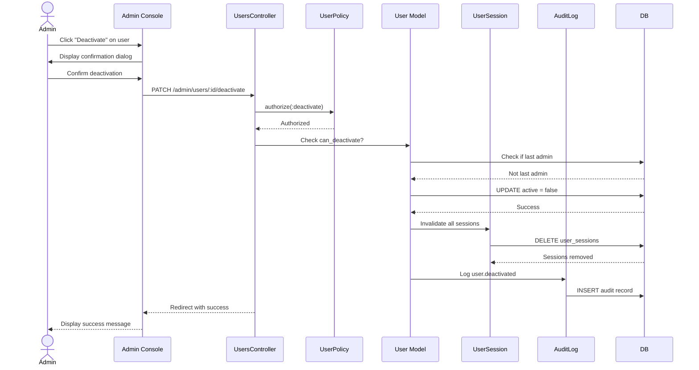

# UC-502: Deactivate User

## Metadata

| Attribute | Value |
|-----------|-------|
| **ID** | UC-502 |
| **Name** | Deactivate User |
| **Functional Area** | Administration |
| **Primary Actor** | System Administrator (ACT-01) |
| **Priority** | P1 |
| **Complexity** | Medium |
| **Status** | Approved |

## Description

Allows a System Administrator to deactivate a user account, preventing the user from logging in while preserving their historical data and audit trail. Deactivated users can be reactivated later if needed. This is used when employees leave the organization or need temporary access revocation.

## Actors

| Actor | Role in Use Case |
|-------|------------------|
| System Administrator (ACT-01) | Initiates user deactivation |
| Target User | The user being deactivated |
| Notification Engine (ACT-13) | Optionally notifies user of deactivation |

## Preconditions

- [ ] Administrator is authenticated and has active session
- [ ] Administrator has `users:deactivate` permission
- [ ] Target user exists and is currently active
- [ ] Target user is not the only administrator in organization
- [ ] Administrator is not attempting to deactivate themselves

## Postconditions

### Success
- [ ] User `active` flag set to false
- [ ] User's active sessions invalidated
- [ ] User cannot log in
- [ ] Audit log entry created for deactivation
- [ ] User's historical data preserved (jobs, applications, notes)
- [ ] Administrator redirected with success message

### Failure
- [ ] User remains active
- [ ] Error message displayed to administrator

## Triggers

- Administrator clicks "Deactivate" on user list or detail page
- Administrator selects "Deactivate" from user actions dropdown

## Basic Flow



| Step | Actor | Action | System Response |
|------|-------|--------|-----------------|
| 1 | Administrator | Navigates to Admin > Users | System displays user list |
| 2 | Administrator | Clicks "Deactivate" on target user | System displays confirmation dialog |
| 3 | System | Shows user name and warns about consequences | Dialog with "This will prevent login" message |
| 4 | Administrator | Clicks "Confirm Deactivation" | System validates deactivation is allowed |
| 5 | System | Checks user is not last administrator | Prevents orphaning organization |
| 6 | System | Sets user `active` flag to false | User marked inactive |
| 7 | System | Invalidates all active sessions | User logged out everywhere |
| 8 | System | Creates audit log entry | Deactivation recorded |
| 9 | System | Redirects to user list | Success message displayed |

## Alternative Flows

### AF-1: Reactivate User

**Trigger:** Administrator wants to restore access for deactivated user

| Step | Actor | Action | System Response |
|------|-------|--------|-----------------|
| 1 | Administrator | Views deactivated users (filter) | System shows inactive users |
| 2 | Administrator | Clicks "Reactivate" on user | Confirmation dialog displayed |
| 3 | Administrator | Confirms reactivation | System sets active = true |
| 4 | System | Creates audit log entry | user.reactivated logged |
| 5 | System | Optionally sends notification | User notified of restored access |

**Resumption:** User can log in again

### AF-2: Bulk Deactivation

**Trigger:** Administrator needs to deactivate multiple users (e.g., department closure)

| Step | Actor | Action | System Response |
|------|-------|--------|-----------------|
| 1 | Administrator | Selects multiple users | Checkboxes marked |
| 2 | Administrator | Clicks "Bulk Actions" > "Deactivate" | Confirmation shows count |
| 3 | Administrator | Confirms bulk deactivation | System processes each user |
| 4 | System | Skips protected users (last admin) | Shows partial success if needed |

**Resumption:** Ends with summary of deactivated users

### AF-3: Deactivate with Note

**Trigger:** Administrator wants to record reason for deactivation

| Step | Actor | Action | System Response |
|------|-------|--------|-----------------|
| 3.1 | System | Shows deactivation dialog with notes field | Optional reason input |
| 3.2 | Administrator | Enters reason (e.g., "Left company") | Note captured |
| 8.1 | System | Includes note in audit log | Reason preserved |

**Resumption:** Returns to step 9 of basic flow

## Exception Flows

### EF-1: Last Administrator

**Trigger:** User is the only active administrator in organization

| Step | Actor | Action | System Response |
|------|-------|--------|-----------------|
| E.1 | System | Detects last admin | Displays error "Cannot deactivate last administrator" |
| E.2 | Administrator | Must assign admin role to another user first | Directed to user list |

**Resolution:** Another user must be granted admin role before deactivation

### EF-2: Self-Deactivation Attempt

**Trigger:** Administrator tries to deactivate their own account

| Step | Actor | Action | System Response |
|------|-------|--------|-----------------|
| E.1 | System | Detects self-deactivation | Displays error "Cannot deactivate your own account" |
| E.2 | Administrator | Must ask another admin to deactivate | No action taken |

**Resolution:** Another administrator must perform the deactivation

### EF-3: User Already Inactive

**Trigger:** User is already deactivated

| Step | Actor | Action | System Response |
|------|-------|--------|-----------------|
| E.1 | System | Detects user already inactive | Shows "User is already deactivated" |
| E.2 | Administrator | Can choose to reactivate instead | Reactivation option shown |

**Resolution:** Administrator can reactivate if needed

## Business Rules

| ID | Rule | Description |
|----|------|-------------|
| BR-1 | Preserve Data | Deactivation is soft-delete; all user data preserved |
| BR-2 | Session Termination | All active sessions must be invalidated immediately |
| BR-3 | Last Admin Protection | Cannot deactivate last admin in organization |
| BR-4 | Self-Protection | Cannot deactivate own account |
| BR-5 | Reversible | Deactivation can be reversed via reactivation |
| BR-6 | Audit Required | All deactivations must be logged with actor |

## Data Requirements

### Input Data

| Field | Type | Required | Validation |
|-------|------|----------|------------|
| user_id | integer | Yes | Must exist and be active |
| reason | string | No | Max 500 chars (optional note) |

### Output Data

| Field | Type | Description |
|-------|------|-------------|
| user_id | integer | ID of deactivated user |
| deactivated_at | datetime | Timestamp of deactivation |
| sessions_terminated | integer | Count of sessions ended |

## Database Transactions

### Tables Affected

| Table | Operation | Conditions |
|-------|-----------|------------|
| users | UPDATE | Set active = false |
| user_sessions | DELETE | Remove all for user |
| audit_logs | CREATE | Deactivation record |

### Transaction Detail

```sql
-- Step 6-8: Deactivate user and clear sessions
BEGIN TRANSACTION;

-- Verify not last admin
SELECT COUNT(*) INTO @admin_count
FROM users u
JOIN user_roles ur ON u.id = ur.user_id
JOIN roles r ON ur.role_id = r.id
WHERE u.organization_id = @organization_id
  AND u.active = true
  AND r.name = 'admin';

IF @admin_count <= 1 AND @target_is_admin THEN
    ROLLBACK;
    SIGNAL SQLSTATE '45000' SET MESSAGE_TEXT = 'Cannot deactivate last admin';
END IF;

-- Operation 1: Deactivate user
UPDATE users
SET active = false,
    updated_at = NOW()
WHERE id = @user_id AND organization_id = @organization_id;

-- Operation 2: Terminate all sessions
DELETE FROM user_sessions
WHERE user_id = @user_id;

-- Operation 3: Audit log entry
INSERT INTO audit_logs (
    organization_id,
    user_id,
    action,
    auditable_type,
    auditable_id,
    metadata,
    ip_address,
    created_at
)
VALUES (
    @organization_id,
    @current_user_id,
    'user.deactivated',
    'User',
    @user_id,
    '{"reason": "@reason", "sessions_terminated": @session_count}',
    @ip_address,
    NOW()
);

COMMIT;
```

### Rollback Scenarios

| Scenario | Rollback Action |
|----------|-----------------|
| Last admin check fails | Transaction rolled back, error shown |
| Session deletion fails | Retry session cleanup, user may remain active |
| Concurrent deactivation | Detect already inactive, no changes |

## UI/UX Requirements

### Screen/Component

- **Location:** Admin Console > Users
- **Entry Point:** "Deactivate" button/link on user list or detail
- **Key Elements:**
  - Confirmation modal with user name
  - Warning about consequences (login disabled, sessions ended)
  - Optional reason/note field
  - "Confirm" and "Cancel" buttons
  - Visual distinction for inactive users in list (grayed out)
  - "Reactivate" action for inactive users

### Wireframe Reference

`/designs/wireframes/UC-502-deactivate-user.png`

## Non-Functional Requirements

| Requirement | Target |
|-------------|--------|
| Response Time | < 2 seconds for deactivation |
| Session Termination | Immediate (no grace period) |
| Availability | 99.9% |

## Security Considerations

- [x] Authentication required
- [x] Authorization check: `users:deactivate` permission required
- [x] Self-deactivation blocked: Cannot deactivate own account
- [x] Audit logging: Deactivation logged with actor and reason
- [x] Immediate session termination: User cannot continue working
- [x] Last admin protection: Organization cannot be orphaned

## Related Use Cases

| Use Case | Relationship |
|----------|--------------|
| UC-500 | Create User - precedes this use case |
| UC-501 | Edit User - alternative action |
| UC-503 | Assign Role - may need to assign admin to another user first |

---

## Data Model References

> Cross-references to [DATA_MODEL.md](../DATA_MODEL.md) and [CRUD_MATRIX.md](../CRUD_MATRIX.md)

### Subject Areas

| Subject Area | ID | Relationship |
|--------------|-----|--------------|
| Identity & Access | SA-01 | Primary |

### Entities CRUD

| Entity | C | R | U | D | Notes |
|--------|---|---|---|---|-------|
| User | | X | X | | Read for validation, Update active flag |
| UserSession | | X | | X | Read count, Delete all sessions |
| AuditLog | X | | | | Created for deactivation record |

**Legend:** C = Create, R = Read, U = Update, D = Delete

---

## Process Model References

> Cross-references to [PROCESS_MODEL.md](../PROCESS_MODEL.md) and [PROCESS_CRUD_MATRIX.md](../PROCESS_CRUD_MATRIX.md)

| Attribute | Value | Link |
|-----------|-------|------|
| **Elementary Business Process** | EP-1103: Deactivate User | [PROCESS_MODEL.md#ep-1103](../PROCESS_MODEL.md#bp-601-user-administration) |
| **Business Process** | BP-601: User Administration | [PROCESS_MODEL.md#bp-601](../PROCESS_MODEL.md#bp-601-user-administration) |
| **Business Function** | BF-06: System Administration | [PROCESS_MODEL.md#bf-06](../PROCESS_MODEL.md#bf-06-system-administration) |

### EBP Details

| Attribute | Value |
|-----------|-------|
| **Trigger** | Admin action - employee departure or access revocation |
| **Input** | User ID, optional reason |
| **Output** | Deactivated user, terminated sessions |
| **Business Rules** | BR-1 through BR-6 (preserve data, terminate sessions, protect last admin) |

---

## Traceability Matrix

> Complete artifact mapping for requirements traceability

| Artifact Type | ID | Name | Link |
|---------------|-----|------|------|
| **Use Case** | UC-502 | Deactivate User | *(this document)* |
| **Elementary Process** | EP-1103 | Deactivate User | [PROCESS_MODEL.md](../PROCESS_MODEL.md#bp-601-user-administration) |
| **Business Process** | BP-601 | User Administration | [PROCESS_MODEL.md](../PROCESS_MODEL.md#bp-601-user-administration) |
| **Business Function** | BF-06 | System Administration | [PROCESS_MODEL.md](../PROCESS_MODEL.md#bf-06-system-administration) |
| **Primary Actor** | ACT-01 | System Administrator | [ACTORS.md](../ACTORS.md#act-01-system-administrator) |
| **Subject Area (Primary)** | SA-01 | Identity & Access | [DATA_MODEL.md](../DATA_MODEL.md#sa-01-identity--access) |
| **CRUD Matrix Row** | UC-502 | - | [CRUD_MATRIX.md](../CRUD_MATRIX.md#uc-502) |
| **Process CRUD Row** | EP-1103 | - | [PROCESS_CRUD_MATRIX.md](../PROCESS_CRUD_MATRIX.md#ep-1103) |

### Implementation Artifacts

| Artifact Type | Path/Reference | Status |
|---------------|----------------|--------|
| Controller | `app/controllers/admin/users_controller.rb` | Implemented |
| Model | `app/models/user.rb` | Implemented |
| Model | `app/models/user_session.rb` | Implemented |
| Policy | `app/policies/user_policy.rb` | Implemented |
| View | `app/views/admin/users/index.html.erb` | Implemented |
| Test | `test/controllers/admin/users_controller_test.rb` | Implemented |

---

## Open Questions

1. Should deactivated users receive an email notification?
2. Should there be a "scheduled deactivation" feature for future dates?
3. Should API keys owned by deactivated users also be revoked?

## Change History

| Version | Date | Author | Changes |
|---------|------|--------|---------|
| 0.1 | 2026-01-25 | System | Initial draft |
