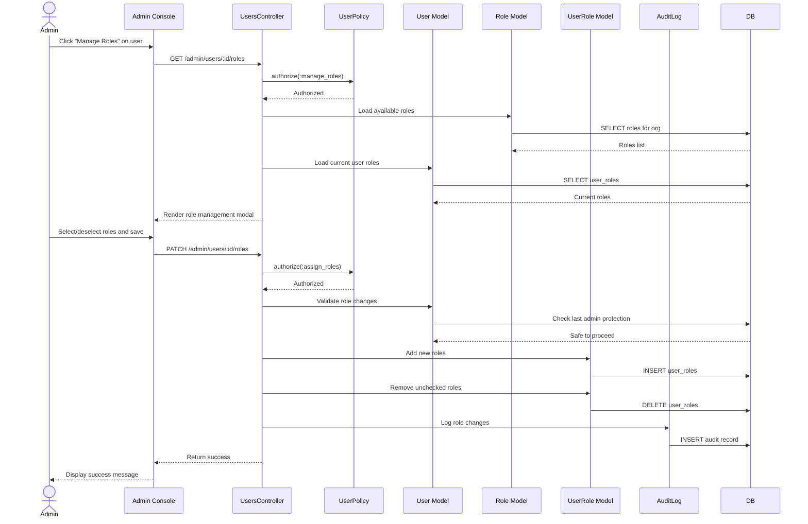

# UC-503: Assign Role

## Metadata

| Attribute | Value |
|-----------|-------|
| **ID** | UC-503 |
| **Name** | Assign Role |
| **Functional Area** | Administration |
| **Primary Actor** | System Administrator (ACT-01) |
| **Priority** | P1 |
| **Complexity** | Medium |
| **Status** | Approved |

## Description

Allows a System Administrator to assign or remove roles from a user, controlling their permissions and access levels within the organization. Roles determine what actions users can perform (e.g., admin, recruiter, hiring manager, interviewer).

## Actors

| Actor | Role in Use Case |
|-------|------------------|
| System Administrator (ACT-01) | Assigns or removes roles from users |
| Target User | User whose roles are being modified |

## Preconditions

- [ ] Administrator is authenticated and has active session
- [ ] Administrator has `roles:assign` permission
- [ ] Target user exists and belongs to same organization
- [ ] At least one role exists in the organization

## Postconditions

### Success
- [ ] UserRole records created/deleted to reflect new role assignment
- [ ] User's permissions updated immediately
- [ ] Audit log entry created for role change
- [ ] Administrator notified of successful change

### Failure
- [ ] User roles unchanged
- [ ] Error message displayed to administrator

## Triggers

- Administrator clicks "Manage Roles" on user detail page
- Administrator edits roles from user list actions menu
- Administrator modifies roles during user creation (UC-500)

## Basic Flow



| Step | Actor | Action | System Response |
|------|-------|--------|-----------------|
| 1 | Administrator | Navigates to user detail or list | System displays user information |
| 2 | Administrator | Clicks "Manage Roles" | System displays role selection modal |
| 3 | System | Shows all available roles with current assignments checked | Roles displayed with checkboxes |
| 4 | Administrator | Selects roles to add, deselects roles to remove | Selection updated |
| 5 | Administrator | Clicks "Save Roles" | System validates changes |
| 6 | System | Checks last admin protection | Prevents removing last admin |
| 7 | System | Creates UserRole records for new roles | New permissions granted |
| 8 | System | Deletes UserRole records for removed roles | Permissions revoked |
| 9 | System | Creates audit log entry | Role changes recorded |
| 10 | System | Closes modal with success message | User roles updated |

## Alternative Flows

### AF-1: Add Single Role

**Trigger:** Quick action to add a specific role

| Step | Actor | Action | System Response |
|------|-------|--------|-----------------|
| 2.1 | Administrator | Clicks "Add Role" > selects specific role | Direct role addition |
| 3.1 | System | Creates UserRole immediately | No modal needed |

**Resumption:** Returns to step 9 of basic flow

### AF-2: Remove Single Role

**Trigger:** Quick action to remove a specific role

| Step | Actor | Action | System Response |
|------|-------|--------|-----------------|
| 2.1 | Administrator | Clicks "Remove" next to role badge | Confirmation shown |
| 2.2 | Administrator | Confirms removal | Role removed |

**Resumption:** Returns to step 9 of basic flow

### AF-3: Bulk Role Assignment

**Trigger:** Administrator needs to assign same role to multiple users

| Step | Actor | Action | System Response |
|------|-------|--------|-----------------|
| 1 | Administrator | Selects multiple users from list | Checkboxes marked |
| 2 | Administrator | Clicks "Bulk Actions" > "Assign Role" | Role selection dialog |
| 3 | Administrator | Selects role to assign | Role selected |
| 4 | System | Adds role to all selected users | Bulk assignment |

**Resumption:** Ends with summary of assignments

## Exception Flows

### EF-1: Removing Last Admin Role

**Trigger:** Attempting to remove admin role from last administrator

| Step | Actor | Action | System Response |
|------|-------|--------|-----------------|
| E.1 | System | Detects last admin scenario | Displays error "Cannot remove last administrator role" |
| E.2 | Administrator | Must assign admin to another user first | Action blocked |

**Resolution:** Assign admin role to another user before removing

### EF-2: No Roles Selected

**Trigger:** Administrator deselects all roles

| Step | Actor | Action | System Response |
|------|-------|--------|-----------------|
| E.1 | System | Validates at least one role required | Displays "User must have at least one role" |
| E.2 | Administrator | Selects at least one role | Validation passes |

**Resolution:** At least one role must remain selected

### EF-3: Self-Admin Removal

**Trigger:** Administrator tries to remove their own admin role

| Step | Actor | Action | System Response |
|------|-------|--------|-----------------|
| E.1 | System | Detects self-admin removal | Displays warning "You are removing your own admin access" |
| E.2 | Administrator | Can confirm or cancel | Requires explicit confirmation |

**Resolution:** Administrator explicitly confirms or cancels

## Business Rules

| ID | Rule | Description |
|----|------|-------------|
| BR-1 | Minimum Role | User must have at least one role |
| BR-2 | Last Admin | Cannot remove admin role from last organization admin |
| BR-3 | Same Organization | Can only assign roles from same organization |
| BR-4 | System Roles | System roles (admin, recruiter, hiring_manager, interviewer) cannot be deleted |
| BR-5 | Immediate Effect | Role changes take effect immediately |
| BR-6 | Audit Required | All role changes must be logged |

## Data Requirements

### Input Data

| Field | Type | Required | Validation |
|-------|------|----------|------------|
| user_id | integer | Yes | Must exist in organization |
| role_ids | array[integer] | Yes | At least one, all must exist in org |

### Output Data

| Field | Type | Description |
|-------|------|-------------|
| user_id | integer | ID of modified user |
| roles_added | array | Roles that were added |
| roles_removed | array | Roles that were removed |

## Database Transactions

### Tables Affected

| Table | Operation | Conditions |
|-------|-----------|------------|
| user_roles | CREATE | For newly assigned roles |
| user_roles | DELETE | For removed roles |
| audit_logs | CREATE | Role change record |

### Transaction Detail

```sql
-- Step 7-9: Update user roles
BEGIN TRANSACTION;

-- Get current roles for comparison
SELECT role_id INTO @current_roles
FROM user_roles WHERE user_id = @user_id;

-- Verify last admin protection
SELECT COUNT(*) INTO @admin_count
FROM users u
JOIN user_roles ur ON u.id = ur.user_id
JOIN roles r ON ur.role_id = r.id
WHERE u.organization_id = @organization_id
  AND u.active = true
  AND r.name = 'admin';

IF @admin_count <= 1 AND @removing_admin_from_last THEN
    ROLLBACK;
    SIGNAL SQLSTATE '45000' SET MESSAGE_TEXT = 'Cannot remove last admin role';
END IF;

-- Operation 1: Remove roles not in new selection
DELETE FROM user_roles
WHERE user_id = @user_id
  AND role_id NOT IN (@new_role_ids);

-- Operation 2: Add new roles (ignore duplicates)
INSERT INTO user_roles (user_id, role_id, granted_by_id, created_at)
SELECT @user_id, role_id, @current_user_id, NOW()
FROM UNNEST(@new_role_ids) AS role_id
WHERE role_id NOT IN (SELECT role_id FROM user_roles WHERE user_id = @user_id)
ON CONFLICT DO NOTHING;

-- Operation 3: Audit log entry
INSERT INTO audit_logs (
    organization_id,
    user_id,
    action,
    auditable_type,
    auditable_id,
    metadata,
    changes,
    ip_address,
    created_at
)
VALUES (
    @organization_id,
    @current_user_id,
    'user.roles_changed',
    'User',
    @user_id,
    '{"modified_by": "@current_user_id"}',
    '{"roles_added": [@added], "roles_removed": [@removed]}',
    @ip_address,
    NOW()
);

COMMIT;
```

### Rollback Scenarios

| Scenario | Rollback Action |
|----------|-----------------|
| Last admin check fails | Transaction rolled back |
| Invalid role ID | Transaction rolled back |
| Database constraint violation | Transaction rolled back |

## UI/UX Requirements

### Screen/Component

- **Location:** Admin Console > Users > [User] > Roles
- **Entry Point:** "Manage Roles" button on user detail/list
- **Key Elements:**
  - Modal dialog with role checkboxes
  - Role descriptions shown for each option
  - Visual indication of system roles vs custom roles
  - Warning when removing own admin access
  - "Save" and "Cancel" buttons
  - Role badges displayed on user cards/rows

### Wireframe Reference

`/designs/wireframes/UC-503-assign-role.png`

## Non-Functional Requirements

| Requirement | Target |
|-------------|--------|
| Response Time | < 1 second for role changes |
| Permission Update | Immediate (no cache delay) |
| Availability | 99.9% |

## Security Considerations

- [x] Authentication required
- [x] Authorization check: `roles:assign` permission required
- [x] Same-organization validation: Cannot assign external roles
- [x] Self-admin protection: Warning when removing own admin
- [x] Last admin protection: Cannot orphan organization
- [x] Audit logging: All role changes logged with actor

## Related Use Cases

| Use Case | Relationship |
|----------|--------------|
| UC-500 | Create User - roles assigned during creation |
| UC-501 | Edit User - separate from role management |
| UC-502 | Deactivate User - may need role check first |

---

## Data Model References

> Cross-references to [DATA_MODEL.md](../DATA_MODEL.md) and [CRUD_MATRIX.md](../CRUD_MATRIX.md)

### Subject Areas

| Subject Area | ID | Relationship |
|--------------|-----|--------------|
| Identity & Access | SA-01 | Primary |

### Entities CRUD

| Entity | C | R | U | D | Notes |
|--------|---|---|---|---|-------|
| User | | X | | | Read for context |
| Role | | X | | | Read available roles |
| UserRole | X | X | | X | Create/delete role assignments |
| AuditLog | X | | | | Created for role changes |

**Legend:** C = Create, R = Read, U = Update, D = Delete

---

## Process Model References

> Cross-references to [PROCESS_MODEL.md](../PROCESS_MODEL.md) and [PROCESS_CRUD_MATRIX.md](../PROCESS_CRUD_MATRIX.md)

| Attribute | Value | Link |
|-----------|-------|------|
| **Elementary Business Process** | EP-1104: Assign Role | [PROCESS_MODEL.md#ep-1104](../PROCESS_MODEL.md#bp-601-user-administration) |
| **Business Process** | BP-601: User Administration | [PROCESS_MODEL.md#bp-601](../PROCESS_MODEL.md#bp-601-user-administration) |
| **Business Function** | BF-06: System Administration | [PROCESS_MODEL.md#bf-06](../PROCESS_MODEL.md#bf-06-system-administration) |

### EBP Details

| Attribute | Value |
|-----------|-------|
| **Trigger** | Admin action - need to change user permissions |
| **Input** | User ID, role IDs to assign |
| **Output** | Updated role assignments, audit trail |
| **Business Rules** | BR-1 through BR-6 (minimum role, last admin, immediate effect) |

---

## Traceability Matrix

> Complete artifact mapping for requirements traceability

| Artifact Type | ID | Name | Link |
|---------------|-----|------|------|
| **Use Case** | UC-503 | Assign Role | *(this document)* |
| **Elementary Process** | EP-1104 | Assign Role | [PROCESS_MODEL.md](../PROCESS_MODEL.md#bp-601-user-administration) |
| **Business Process** | BP-601 | User Administration | [PROCESS_MODEL.md](../PROCESS_MODEL.md#bp-601-user-administration) |
| **Business Function** | BF-06 | System Administration | [PROCESS_MODEL.md](../PROCESS_MODEL.md#bf-06-system-administration) |
| **Primary Actor** | ACT-01 | System Administrator | [ACTORS.md](../ACTORS.md#act-01-system-administrator) |
| **Subject Area (Primary)** | SA-01 | Identity & Access | [DATA_MODEL.md](../DATA_MODEL.md#sa-01-identity--access) |
| **CRUD Matrix Row** | UC-503 | - | [CRUD_MATRIX.md](../CRUD_MATRIX.md#uc-503) |
| **Process CRUD Row** | EP-1104 | - | [PROCESS_CRUD_MATRIX.md](../PROCESS_CRUD_MATRIX.md#ep-1104) |

### Implementation Artifacts

| Artifact Type | Path/Reference | Status |
|---------------|----------------|--------|
| Controller | `app/controllers/admin/users_controller.rb` | Implemented |
| Model | `app/models/user.rb` | Implemented |
| Model | `app/models/role.rb` | Implemented |
| Model | `app/models/user_role.rb` | Implemented |
| Policy | `app/policies/user_policy.rb` | Implemented |
| View | `app/views/admin/users/_roles_modal.html.erb` | Planned |
| Test | `test/controllers/admin/users_controller_test.rb` | Implemented |

---

## Open Questions

1. Should custom roles be creatable by admins, or only system roles?
2. Should role changes trigger notifications to affected users?
3. Should there be a role change approval workflow for sensitive roles?

## Change History

| Version | Date | Author | Changes |
|---------|------|--------|---------|
| 0.1 | 2026-01-25 | System | Initial draft |
