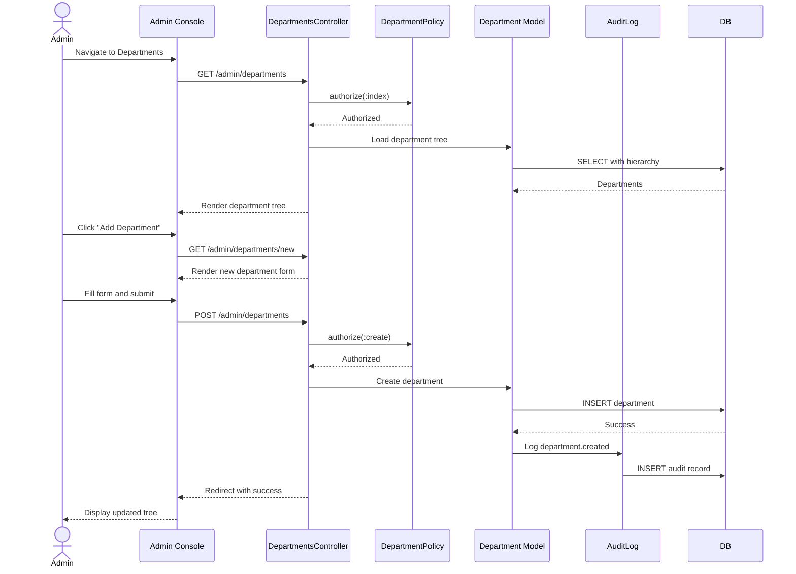

# UC-504: Manage Departments

## Metadata

| Attribute | Value |
|-----------|-------|
| **ID** | UC-504 |
| **Name** | Manage Departments |
| **Functional Area** | Administration |
| **Primary Actor** | System Administrator (ACT-01) |
| **Priority** | P2 |
| **Complexity** | Medium |
| **Status** | Approved |

## Description

Allows a System Administrator to create, edit, and organize the department hierarchy for their organization. Departments are used to categorize jobs and can have a hierarchical structure (parent/child relationships). Each department can have a default hiring manager assigned.

## Actors

| Actor | Role in Use Case |
|-------|------------------|
| System Administrator (ACT-01) | Creates, edits, and organizes departments |

## Preconditions

- [ ] Administrator is authenticated and has active session
- [ ] Administrator has `departments:manage` permission
- [ ] Organization exists and is active

## Postconditions

### Success
- [ ] Department records created/updated/deleted as requested
- [ ] Department hierarchy reflects organizational structure
- [ ] Audit log entries created for all changes
- [ ] Jobs can be assigned to departments

### Failure
- [ ] Department records unchanged
- [ ] Error message displayed to administrator

## Triggers

- Administrator navigates to Admin > Departments
- Administrator clicks "Add Department" or "Edit" on existing department
- Administrator drags department to reorganize hierarchy

## Basic Flow



| Step | Actor | Action | System Response |
|------|-------|--------|-----------------|
| 1 | Administrator | Navigates to Admin > Departments | System displays department tree |
| 2 | Administrator | Clicks "Add Department" | System displays new department form |
| 3 | Administrator | Enters name, code (optional), parent (optional) | Fields validated |
| 4 | Administrator | Selects default hiring manager (optional) | User dropdown shown |
| 5 | Administrator | Clicks "Create Department" | System validates and saves |
| 6 | System | Creates Department record | Department saved |
| 7 | System | Creates audit log entry | Change recorded |
| 8 | System | Redirects to department list | Success message displayed |

## Alternative Flows

### AF-1: Edit Department

**Trigger:** Administrator clicks "Edit" on existing department

| Step | Actor | Action | System Response |
|------|-------|--------|-----------------|
| 2.1 | Administrator | Clicks "Edit" on department | System loads edit form |
| 3.1 | Administrator | Modifies fields | Changes tracked |
| 5.1 | Administrator | Clicks "Save Changes" | System validates and updates |
| 6.1 | System | Updates Department record | Changes saved |

**Resumption:** Returns to step 7 of basic flow

### AF-2: Delete Department

**Trigger:** Administrator clicks "Delete" on department without children or jobs

| Step | Actor | Action | System Response |
|------|-------|--------|-----------------|
| 2.1 | Administrator | Clicks "Delete" on department | Confirmation dialog shown |
| 2.2 | System | Checks for children and associated jobs | Validates deletion allowed |
| 2.3 | Administrator | Confirms deletion | Department deleted |
| 2.4 | System | Creates audit log entry | Deletion recorded |

**Resumption:** Ends at updated tree

### AF-3: Reorganize Hierarchy (Drag and Drop)

**Trigger:** Administrator drags department to new location

| Step | Actor | Action | System Response |
|------|-------|--------|-----------------|
| 1 | Administrator | Drags department node | Visual indicator shown |
| 2 | Administrator | Drops on new parent (or root) | System validates move |
| 3 | System | Updates parent_id and position | Hierarchy updated |
| 4 | System | Creates audit log entry | Move recorded |

**Resumption:** Tree re-renders with new structure

### AF-4: Set Default Hiring Manager

**Trigger:** Administrator assigns default hiring manager to department

| Step | Actor | Action | System Response |
|------|-------|--------|-----------------|
| 3.1 | Administrator | Selects user from hiring manager dropdown | User selected |
| 6.1 | System | Links user as default_hiring_manager | Association created |

**Resumption:** Returns to step 7 of basic flow

## Exception Flows

### EF-1: Duplicate Department Code

**Trigger:** Department code already exists in organization

| Step | Actor | Action | System Response |
|------|-------|--------|-----------------|
| E.1 | System | Detects duplicate code | Displays "Code already in use" error |
| E.2 | Administrator | Enters different code or clears | Validation retried |

**Resolution:** Unique code provided or field cleared

### EF-2: Delete Department with Children

**Trigger:** Attempting to delete department that has child departments

| Step | Actor | Action | System Response |
|------|-------|--------|-----------------|
| E.1 | System | Detects child departments | Displays "Cannot delete: has child departments" |
| E.2 | Administrator | Must delete/move children first | Deletion blocked |

**Resolution:** Delete or reassign children first

### EF-3: Delete Department with Jobs

**Trigger:** Attempting to delete department with associated jobs

| Step | Actor | Action | System Response |
|------|-------|--------|-----------------|
| E.1 | System | Detects associated jobs | Displays "Cannot delete: has X associated jobs" |
| E.2 | Administrator | Must reassign jobs first | Deletion blocked |

**Resolution:** Reassign jobs to another department

### EF-4: Circular Reference

**Trigger:** Attempting to make a department its own ancestor

| Step | Actor | Action | System Response |
|------|-------|--------|-----------------|
| E.1 | System | Detects circular reference | Displays "Would create circular reference" |
| E.2 | Administrator | Selects different parent | Validation retried |

**Resolution:** Select valid parent or make root

## Business Rules

| ID | Rule | Description |
|----|------|-------------|
| BR-1 | Unique Code | Department code must be unique within organization (if provided) |
| BR-2 | Unique Name | Department name should be unique at same hierarchy level |
| BR-3 | No Circular | Parent cannot be self or any descendant |
| BR-4 | Same Organization | Parent must belong to same organization |
| BR-5 | Delete Constraints | Cannot delete department with children or associated jobs |
| BR-6 | Position Order | Departments ordered by position within parent |

## Data Requirements

### Input Data

| Field | Type | Required | Validation |
|-------|------|----------|------------|
| name | string | Yes | Max 255 chars, not blank |
| code | string | No | Max 50 chars, unique in org |
| parent_id | integer | No | Must exist in org if provided |
| default_hiring_manager_id | integer | No | Must be active user in org |
| position | integer | No | Auto-assigned if not provided |

### Output Data

| Field | Type | Description |
|-------|------|-------------|
| department_id | integer | ID of created/updated department |
| full_path | string | Hierarchical path (e.g., "Engineering > Backend") |
| depth | integer | Depth in hierarchy |

## Database Transactions

### Tables Affected

| Table | Operation | Conditions |
|-------|-----------|------------|
| departments | CREATE | New department |
| departments | UPDATE | Edit existing |
| departments | DELETE | Remove department |
| audit_logs | CREATE | All changes |

### Transaction Detail

```sql
-- Create department
BEGIN TRANSACTION;

-- Validate parent belongs to same org
IF @parent_id IS NOT NULL THEN
    SELECT organization_id INTO @parent_org
    FROM departments WHERE id = @parent_id;

    IF @parent_org != @organization_id THEN
        ROLLBACK;
        SIGNAL SQLSTATE '45000' SET MESSAGE_TEXT = 'Parent in different organization';
    END IF;
END IF;

-- Get next position if not specified
SELECT COALESCE(MAX(position) + 1, 0) INTO @next_position
FROM departments
WHERE organization_id = @organization_id
  AND COALESCE(parent_id, 0) = COALESCE(@parent_id, 0);

-- Operation 1: Create department
INSERT INTO departments (
    organization_id,
    parent_id,
    name,
    code,
    default_hiring_manager_id,
    position,
    created_at,
    updated_at
)
VALUES (
    @organization_id,
    @parent_id,
    @name,
    @code,
    @default_hiring_manager_id,
    COALESCE(@position, @next_position),
    NOW(),
    NOW()
)
RETURNING id INTO @department_id;

-- Operation 2: Audit log
INSERT INTO audit_logs (
    organization_id,
    user_id,
    action,
    auditable_type,
    auditable_id,
    metadata,
    created_at
)
VALUES (
    @organization_id,
    @current_user_id,
    'department.created',
    'Department',
    @department_id,
    '{"name": "@name", "parent_id": @parent_id}',
    NOW()
);

COMMIT;
```

### Rollback Scenarios

| Scenario | Rollback Action |
|----------|-----------------|
| Invalid parent reference | Transaction rolled back |
| Duplicate code | Transaction rolled back |
| Circular reference detected | Transaction rolled back |

## UI/UX Requirements

### Screen/Component

- **Location:** Admin Console > Departments
- **Entry Point:** Navigation menu or Settings
- **Key Elements:**
  - Tree view of department hierarchy with expand/collapse
  - Drag-and-drop reorganization support
  - "Add Department" button (root or under selected)
  - Edit and Delete buttons per department
  - Department count showing jobs in each
  - Default hiring manager shown if assigned
  - Breadcrumb showing current path when editing

### Wireframe Reference

`/designs/wireframes/UC-504-manage-departments.png`

## Non-Functional Requirements

| Requirement | Target |
|-------------|--------|
| Response Time | < 2 seconds for tree load |
| Max Depth | Support at least 10 levels of hierarchy |
| Max Departments | Support at least 500 departments per org |

## Security Considerations

- [x] Authentication required
- [x] Authorization check: `departments:manage` permission required
- [x] Same-organization validation: Cannot reference external parents
- [x] Audit logging: All changes logged
- [x] Input sanitization: All text inputs sanitized

## Related Use Cases

| Use Case | Relationship |
|----------|--------------|
| UC-001 | Create Job Requisition - selects department |
| UC-505 | Configure Organization Settings - overall org structure |

---

## Data Model References

> Cross-references to [DATA_MODEL.md](../DATA_MODEL.md) and [CRUD_MATRIX.md](../CRUD_MATRIX.md)

### Subject Areas

| Subject Area | ID | Relationship |
|--------------|-----|--------------|
| Organization Management | SA-02 | Primary |
| Identity & Access | SA-01 | Secondary (for hiring manager) |

### Entities CRUD

| Entity | C | R | U | D | Notes |
|--------|---|---|---|---|-------|
| Department | X | X | X | X | Full CRUD |
| User | | X | | | Read for hiring manager selection |
| Job | | X | | | Read to check delete constraints |
| AuditLog | X | | | | Created for all changes |

**Legend:** C = Create, R = Read, U = Update, D = Delete

---

## Process Model References

> Cross-references to [PROCESS_MODEL.md](../PROCESS_MODEL.md) and [PROCESS_CRUD_MATRIX.md](../PROCESS_CRUD_MATRIX.md)

| Attribute | Value | Link |
|-----------|-------|------|
| **Elementary Business Process** | EP-1111: Manage Departments | [PROCESS_MODEL.md#ep-1111](../PROCESS_MODEL.md#bp-602-organization-configuration) |
| **Business Process** | BP-602: Organization Configuration | [PROCESS_MODEL.md#bp-602](../PROCESS_MODEL.md#bp-602-organization-configuration) |
| **Business Function** | BF-06: System Administration | [PROCESS_MODEL.md#bf-06](../PROCESS_MODEL.md#bf-06-system-administration) |

### EBP Details

| Attribute | Value |
|-----------|-------|
| **Trigger** | Admin action - need to set up or modify org structure |
| **Input** | Department details (name, code, parent, hiring manager) |
| **Output** | Configured department hierarchy |
| **Business Rules** | BR-1 through BR-6 (unique code, no circular refs, delete constraints) |

---

## Traceability Matrix

> Complete artifact mapping for requirements traceability

| Artifact Type | ID | Name | Link |
|---------------|-----|------|------|
| **Use Case** | UC-504 | Manage Departments | *(this document)* |
| **Elementary Process** | EP-1111 | Manage Departments | [PROCESS_MODEL.md](../PROCESS_MODEL.md#bp-602-organization-configuration) |
| **Business Process** | BP-602 | Organization Configuration | [PROCESS_MODEL.md](../PROCESS_MODEL.md#bp-602-organization-configuration) |
| **Business Function** | BF-06 | System Administration | [PROCESS_MODEL.md](../PROCESS_MODEL.md#bf-06-system-administration) |
| **Primary Actor** | ACT-01 | System Administrator | [ACTORS.md](../ACTORS.md#act-01-system-administrator) |
| **Subject Area (Primary)** | SA-02 | Organization Management | [DATA_MODEL.md](../DATA_MODEL.md#sa-02-organization-management) |
| **CRUD Matrix Row** | UC-504 | - | [CRUD_MATRIX.md](../CRUD_MATRIX.md#uc-504) |
| **Process CRUD Row** | EP-1111 | - | [PROCESS_CRUD_MATRIX.md](../PROCESS_CRUD_MATRIX.md#ep-1111) |

### Implementation Artifacts

| Artifact Type | Path/Reference | Status |
|---------------|----------------|--------|
| Controller | `app/controllers/admin/departments_controller.rb` | Planned |
| Model | `app/models/department.rb` | Implemented |
| Policy | `app/policies/department_policy.rb` | Implemented |
| View | `app/views/admin/departments/index.html.erb` | Planned |
| Test | `test/models/department_test.rb` | Implemented |

---

## Open Questions

1. Should departments support soft-delete to preserve history?
2. Should there be a department merge feature for consolidation?
3. Should departments have cost centers or budget codes?

## Change History

| Version | Date | Author | Changes |
|---------|------|--------|---------|
| 0.1 | 2026-01-25 | System | Initial draft |
