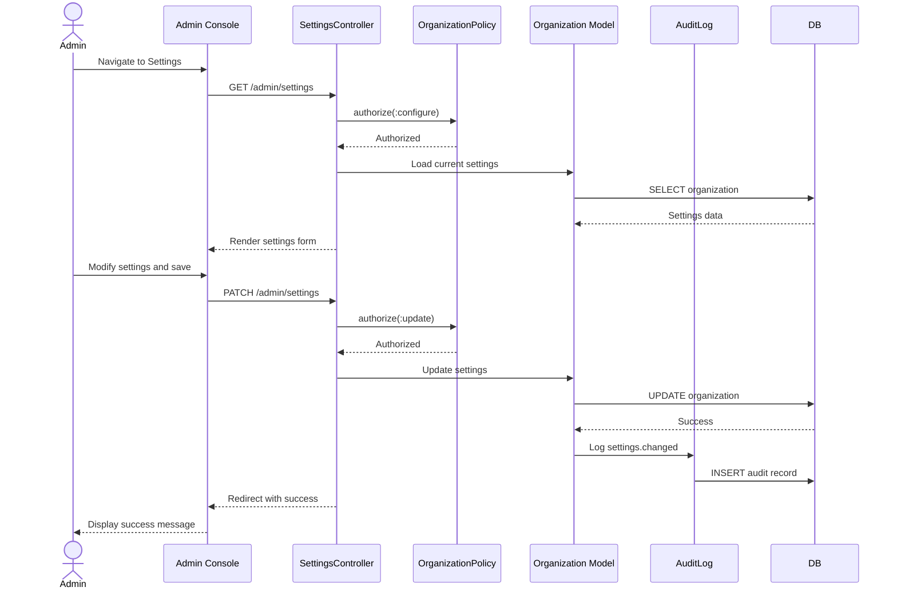

# UC-505: Configure Organization Settings

## Metadata

| Attribute | Value |
|-----------|-------|
| **ID** | UC-505 |
| **Name** | Configure Organization Settings |
| **Functional Area** | Administration |
| **Primary Actor** | System Administrator (ACT-01) |
| **Priority** | P1 |
| **Complexity** | Medium |
| **Status** | Approved |

## Description

Allows a System Administrator to configure organization-wide settings that control system behavior. This includes workflow settings (job approval, offer approval), compliance settings (EEOC collection, GDPR mode), notification preferences, and integration defaults.

## Actors

| Actor | Role in Use Case |
|-------|------------------|
| System Administrator (ACT-01) | Configures organization settings |

## Preconditions

- [ ] Administrator is authenticated and has active session
- [ ] Administrator has `organization:configure` permission
- [ ] Organization exists and is active

## Postconditions

### Success
- [ ] Organization settings updated
- [ ] Changes take effect immediately for relevant features
- [ ] Audit log entry created for settings change
- [ ] Administrator sees confirmation message

### Failure
- [ ] Settings unchanged
- [ ] Error message displayed to administrator

## Triggers

- Administrator navigates to Admin > Settings
- Administrator clicks "Organization Settings" from dashboard

## Basic Flow



| Step | Actor | Action | System Response |
|------|-------|--------|-----------------|
| 1 | Administrator | Navigates to Admin > Settings | System displays settings page |
| 2 | System | Loads current settings | Settings form populated |
| 3 | Administrator | Modifies desired settings | Changes tracked client-side |
| 4 | Administrator | Clicks "Save Settings" | System validates changes |
| 5 | System | Validates setting values | Ensures valid combinations |
| 6 | System | Updates organization settings JSON | Settings persisted |
| 7 | System | Creates audit log entry | Changes recorded with before/after |
| 8 | System | Refreshes page with new values | Success message displayed |

## Alternative Flows

### AF-1: Update Single Setting Category

**Trigger:** Administrator only modifies settings in one category

| Step | Actor | Action | System Response |
|------|-------|--------|-----------------|
| 3.1 | Administrator | Expands single category (e.g., Workflow) | Other categories collapsed |
| 3.2 | Administrator | Modifies only that category's settings | Partial update |

**Resumption:** Returns to step 4 of basic flow

### AF-2: Reset to Defaults

**Trigger:** Administrator wants to restore default settings

| Step | Actor | Action | System Response |
|------|-------|--------|-----------------|
| 3.1 | Administrator | Clicks "Reset to Defaults" | Confirmation dialog shown |
| 3.2 | Administrator | Confirms reset | All settings restored to defaults |
| 3.3 | System | Creates audit log | Reset action recorded |

**Resumption:** Returns to step 8 of basic flow

### AF-3: Export/Import Settings

**Trigger:** Administrator wants to backup or transfer settings

| Step | Actor | Action | System Response |
|------|-------|--------|-----------------|
| 1 | Administrator | Clicks "Export Settings" | Downloads JSON file |
| 2 | Administrator | Clicks "Import Settings" | File upload dialog |
| 3 | Administrator | Uploads settings JSON | System validates and applies |

**Resumption:** Ends with import summary

## Exception Flows

### EF-1: Invalid Setting Value

**Trigger:** Administrator enters invalid value for a setting

| Step | Actor | Action | System Response |
|------|-------|--------|-----------------|
| E.1 | System | Validates setting value | Displays validation error |
| E.2 | Administrator | Corrects value | System re-validates |

**Resolution:** Valid value provided

### EF-2: Conflicting Settings

**Trigger:** Selected settings combination is invalid

| Step | Actor | Action | System Response |
|------|-------|--------|-----------------|
| E.1 | System | Detects conflict | Displays "Cannot enable X while Y is disabled" |
| E.2 | Administrator | Adjusts settings | Conflict resolved |

**Resolution:** Compatible settings selected

## Business Rules

| ID | Rule | Description |
|----|------|-------------|
| BR-1 | Immediate Effect | Most settings take effect immediately |
| BR-2 | Validation | Setting values must be within allowed ranges |
| BR-3 | Dependencies | Some settings have dependencies on others |
| BR-4 | Feature Flags | Some settings require plan-level features |
| BR-5 | Audit Required | All setting changes must be logged |

## Data Requirements

### Input Data - Setting Categories

#### Workflow Settings

| Setting | Type | Default | Description |
|---------|------|---------|-------------|
| require_job_approval | boolean | true | Jobs need approval before opening |
| require_offer_approval | boolean | true | Offers need approval before sending |
| auto_reject_after_days | integer | 90 | Auto-reject applications after X days |

#### Compliance Settings

| Setting | Type | Default | Description |
|---------|------|---------|-------------|
| eeoc_collection_enabled | boolean | true | Collect EEOC demographic data |
| gdpr_mode | boolean | false | Enable GDPR compliance features |
| data_retention_days | integer | 730 | Default data retention period |
| background_check_provider | string | "ledgoria" | Default background check provider |

#### Notification Settings

| Setting | Type | Default | Description |
|---------|------|---------|-------------|
| rejection_notification_delay_hours | integer | 48 | Delay before rejection emails sent |
| candidate_portal_enabled | boolean | true | Enable candidate self-service portal |
| email_footer_text | string | "" | Custom email footer text |

#### Integration Settings

| Setting | Type | Default | Description |
|---------|------|---------|-------------|
| calendar_provider | string | "google" | Default calendar integration |
| hris_export_format | string | "json" | HRIS export file format |

### Output Data

| Field | Type | Description |
|-------|------|-------------|
| settings | json | Updated settings object |
| changed_keys | array | List of settings that changed |

## Database Transactions

### Tables Affected

| Table | Operation | Conditions |
|-------|-----------|------------|
| organizations | UPDATE | Settings JSON column |
| audit_logs | CREATE | Settings change record |

### Transaction Detail

```sql
-- Update organization settings
BEGIN TRANSACTION;

-- Capture current settings for audit
SELECT settings INTO @old_settings
FROM organizations WHERE id = @organization_id;

-- Operation 1: Update settings
UPDATE organizations
SET settings = @new_settings,
    updated_at = NOW()
WHERE id = @organization_id;

-- Operation 2: Audit log with diff
INSERT INTO audit_logs (
    organization_id,
    user_id,
    action,
    auditable_type,
    auditable_id,
    metadata,
    changes,
    created_at
)
VALUES (
    @organization_id,
    @current_user_id,
    'organization.settings_changed',
    'Organization',
    @organization_id,
    '{"modified_by": "@current_user_id"}',
    '{"settings": {"was": @old_settings, "now": @new_settings}}',
    NOW()
);

COMMIT;
```

### Rollback Scenarios

| Scenario | Rollback Action |
|----------|-----------------|
| Validation failure | No commit, errors displayed |
| JSON parse error | Transaction rolled back |

## UI/UX Requirements

### Screen/Component

- **Location:** Admin Console > Settings
- **Entry Point:** Navigation menu or Admin dashboard
- **Key Elements:**
  - Accordion or tab-based category organization
  - Toggle switches for boolean settings
  - Number inputs with min/max for numeric settings
  - Dropdowns for enumerated settings
  - Text areas for free-form settings
  - "Save Settings" button
  - "Reset to Defaults" button
  - Setting descriptions and help text
  - Visual indication of changed settings

### Wireframe Reference

`/designs/wireframes/UC-505-organization-settings.png`

## Non-Functional Requirements

| Requirement | Target |
|-------------|--------|
| Response Time | < 1 second for save |
| Settings Load | < 500ms |
| Availability | 99.9% |

## Security Considerations

- [x] Authentication required
- [x] Authorization check: `organization:configure` permission required
- [x] Audit logging: All changes logged with before/after values
- [x] Input validation: All settings validated server-side
- [x] Sensitive settings: Some may require re-authentication

## Related Use Cases

| Use Case | Relationship |
|----------|--------------|
| UC-504 | Manage Departments - related org structure |
| UC-506 | Manage Rejection Reasons - uses org settings |
| UC-507 | Configure Email Templates - uses notification settings |
| UC-310 | Configure Retention Policy - uses compliance settings |

---

## Data Model References

> Cross-references to [DATA_MODEL.md](../DATA_MODEL.md) and [CRUD_MATRIX.md](../CRUD_MATRIX.md)

### Subject Areas

| Subject Area | ID | Relationship |
|--------------|-----|--------------|
| Organization Management | SA-02 | Primary |

### Entities CRUD

| Entity | C | R | U | D | Notes |
|--------|---|---|---|---|-------|
| Organization | | X | X | | Read and update settings |
| OrganizationSetting | X | X | X | | Alternative settings storage |
| AuditLog | X | | | | Created for changes |

**Legend:** C = Create, R = Read, U = Update, D = Delete

---

## Process Model References

> Cross-references to [PROCESS_MODEL.md](../PROCESS_MODEL.md) and [PROCESS_CRUD_MATRIX.md](../PROCESS_CRUD_MATRIX.md)

| Attribute | Value | Link |
|-----------|-------|------|
| **Elementary Business Process** | EP-1112: Configure Organization Settings | [PROCESS_MODEL.md#ep-1112](../PROCESS_MODEL.md#bp-602-organization-configuration) |
| **Business Process** | BP-602: Organization Configuration | [PROCESS_MODEL.md#bp-602](../PROCESS_MODEL.md#bp-602-organization-configuration) |
| **Business Function** | BF-06: System Administration | [PROCESS_MODEL.md#bf-06](../PROCESS_MODEL.md#bf-06-system-administration) |

### EBP Details

| Attribute | Value |
|-----------|-------|
| **Trigger** | Admin action - need to adjust system behavior |
| **Input** | Setting key-value pairs |
| **Output** | Updated organization configuration |
| **Business Rules** | BR-1 through BR-5 (immediate effect, validation, dependencies) |

---

## Traceability Matrix

> Complete artifact mapping for requirements traceability

| Artifact Type | ID | Name | Link |
|---------------|-----|------|------|
| **Use Case** | UC-505 | Configure Organization Settings | *(this document)* |
| **Elementary Process** | EP-1112 | Configure Organization Settings | [PROCESS_MODEL.md](../PROCESS_MODEL.md#bp-602-organization-configuration) |
| **Business Process** | BP-602 | Organization Configuration | [PROCESS_MODEL.md](../PROCESS_MODEL.md#bp-602-organization-configuration) |
| **Business Function** | BF-06 | System Administration | [PROCESS_MODEL.md](../PROCESS_MODEL.md#bf-06-system-administration) |
| **Primary Actor** | ACT-01 | System Administrator | [ACTORS.md](../ACTORS.md#act-01-system-administrator) |
| **Subject Area (Primary)** | SA-02 | Organization Management | [DATA_MODEL.md](../DATA_MODEL.md#sa-02-organization-management) |
| **CRUD Matrix Row** | UC-505 | - | [CRUD_MATRIX.md](../CRUD_MATRIX.md#uc-505) |
| **Process CRUD Row** | EP-1112 | - | [PROCESS_CRUD_MATRIX.md](../PROCESS_CRUD_MATRIX.md#ep-1112) |

### Implementation Artifacts

| Artifact Type | Path/Reference | Status |
|---------------|----------------|--------|
| Controller | `app/controllers/admin/settings_controller.rb` | Planned |
| Model | `app/models/organization.rb` | Implemented |
| Policy | `app/policies/organization_policy.rb` | Implemented |
| View | `app/views/admin/settings/index.html.erb` | Planned |
| Test | `test/models/organization_test.rb` | Implemented |

---

## Open Questions

1. Should certain settings require approval or have a cooling-off period?
2. Should there be environment-specific settings (staging vs production)?
3. Should settings changes trigger notifications to other admins?

## Change History

| Version | Date | Author | Changes |
|---------|------|--------|---------|
| 0.1 | 2026-01-25 | System | Initial draft |
