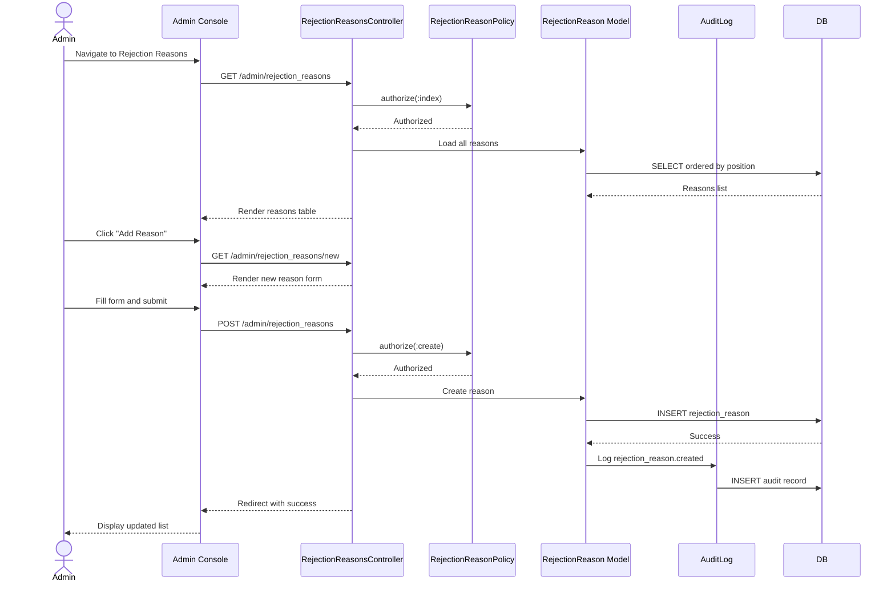

# UC-506: Manage Rejection Reasons

## Metadata

| Attribute | Value |
|-----------|-------|
| **ID** | UC-506 |
| **Name** | Manage Rejection Reasons |
| **Functional Area** | Administration |
| **Primary Actor** | System Administrator (ACT-01) |
| **Priority** | P2 |
| **Complexity** | Low |
| **Status** | Approved |

## Description

Allows a System Administrator to create, edit, and manage the list of rejection reasons available when rejecting candidates. Rejection reasons are categorized (not_qualified, timing, compensation, culture_fit, withdrew, other) and can be configured to require additional notes when selected.

## Actors

| Actor | Role in Use Case |
|-------|------------------|
| System Administrator (ACT-01) | Manages rejection reason configuration |

## Preconditions

- [ ] Administrator is authenticated and has active session
- [ ] Administrator has `rejection_reasons:manage` permission
- [ ] Organization exists with default rejection reasons created

## Postconditions

### Success
- [ ] Rejection reason records created/updated/deactivated
- [ ] Updated reasons available in candidate rejection workflow
- [ ] Audit log entries created for changes
- [ ] Administrator sees confirmation message

### Failure
- [ ] Rejection reasons unchanged
- [ ] Error message displayed to administrator

## Triggers

- Administrator navigates to Admin > Rejection Reasons
- Administrator clicks "Add Reason" or "Edit" on existing reason

## Basic Flow



| Step | Actor | Action | System Response |
|------|-------|--------|-----------------|
| 1 | Administrator | Navigates to Admin > Rejection Reasons | System displays rejection reasons list |
| 2 | Administrator | Clicks "Add Reason" | System displays new reason form |
| 3 | Administrator | Enters name and selects category | Fields validated |
| 4 | Administrator | Optionally checks "Requires notes" | Setting captured |
| 5 | Administrator | Clicks "Create Reason" | System validates and saves |
| 6 | System | Creates RejectionReason record | Reason saved with next position |
| 7 | System | Creates audit log entry | Change recorded |
| 8 | System | Redirects to reason list | Success message displayed |

## Alternative Flows

### AF-1: Edit Rejection Reason

**Trigger:** Administrator clicks "Edit" on existing reason

| Step | Actor | Action | System Response |
|------|-------|--------|-----------------|
| 2.1 | Administrator | Clicks "Edit" on reason | System loads edit form |
| 3.1 | Administrator | Modifies name, category, or settings | Changes tracked |
| 5.1 | Administrator | Clicks "Save Changes" | System validates and updates |

**Resumption:** Returns to step 7 of basic flow

### AF-2: Deactivate Rejection Reason

**Trigger:** Administrator wants to hide a reason without deleting

| Step | Actor | Action | System Response |
|------|-------|--------|-----------------|
| 2.1 | Administrator | Clicks "Deactivate" on reason | Confirmation shown |
| 2.2 | Administrator | Confirms deactivation | Reason marked inactive |
| 2.3 | System | Sets active = false | Reason no longer appears in dropdowns |

**Resumption:** Returns to step 7 of basic flow

### AF-3: Reactivate Rejection Reason

**Trigger:** Administrator wants to restore an inactive reason

| Step | Actor | Action | System Response |
|------|-------|--------|-----------------|
| 1.1 | Administrator | Filters to show inactive reasons | Inactive reasons displayed |
| 2.1 | Administrator | Clicks "Activate" on reason | Confirmation shown |
| 2.2 | Administrator | Confirms activation | Reason marked active |

**Resumption:** Returns to step 7 of basic flow

### AF-4: Reorder Rejection Reasons

**Trigger:** Administrator wants to change display order

| Step | Actor | Action | System Response |
|------|-------|--------|-----------------|
| 1 | Administrator | Drags reason to new position | Visual indicator shown |
| 2 | Administrator | Drops in desired position | Position updated |
| 3 | System | Updates position values | All positions recalculated |

**Resumption:** Ends with updated order

## Exception Flows

### EF-1: Reason In Use - Cannot Delete

**Trigger:** Attempting to delete reason that has been used

| Step | Actor | Action | System Response |
|------|-------|--------|-----------------|
| E.1 | System | Detects reason used in applications | Displays "Cannot delete: used by X applications" |
| E.2 | Administrator | Can deactivate instead | Deactivation option offered |

**Resolution:** Deactivate instead of delete

### EF-2: Duplicate Name

**Trigger:** Reason name already exists in organization

| Step | Actor | Action | System Response |
|------|-------|--------|-----------------|
| E.1 | System | Detects duplicate name | Displays "Reason name already exists" |
| E.2 | Administrator | Enters different name | Validation retried |

**Resolution:** Unique name provided

## Business Rules

| ID | Rule | Description |
|----|------|-------------|
| BR-1 | Categories | Reason must belong to valid category |
| BR-2 | Soft Delete | Reasons with usage history cannot be hard deleted |
| BR-3 | Default Reasons | System default reasons can be deactivated but not deleted |
| BR-4 | Notes Requirement | Some reasons require additional notes when used |
| BR-5 | Position Order | Reasons displayed in position order within category |

## Data Requirements

### Input Data

| Field | Type | Required | Validation |
|-------|------|----------|------------|
| name | string | Yes | Max 255 chars, unique in org |
| category | enum | Yes | One of: not_qualified, timing, compensation, culture_fit, withdrew, other |
| requires_notes | boolean | No | Default false |
| position | integer | No | Auto-assigned if not provided |

### Output Data

| Field | Type | Description |
|-------|------|-------------|
| reason_id | integer | ID of created/updated reason |
| usage_count | integer | Number of times reason used |
| active | boolean | Whether reason is active |

## Database Transactions

### Tables Affected

| Table | Operation | Conditions |
|-------|-----------|------------|
| rejection_reasons | CREATE | New reason |
| rejection_reasons | UPDATE | Edit existing |
| rejection_reasons | UPDATE | Activate/deactivate |
| audit_logs | CREATE | All changes |

### Transaction Detail

```sql
-- Create rejection reason
BEGIN TRANSACTION;

-- Get next position
SELECT COALESCE(MAX(position) + 1, 0) INTO @next_position
FROM rejection_reasons
WHERE organization_id = @organization_id;

-- Operation 1: Create reason
INSERT INTO rejection_reasons (
    organization_id,
    name,
    category,
    requires_notes,
    active,
    position,
    created_at,
    updated_at
)
VALUES (
    @organization_id,
    @name,
    @category,
    @requires_notes,
    true,
    COALESCE(@position, @next_position),
    NOW(),
    NOW()
)
RETURNING id INTO @reason_id;

-- Operation 2: Audit log
INSERT INTO audit_logs (
    organization_id,
    user_id,
    action,
    auditable_type,
    auditable_id,
    metadata,
    created_at
)
VALUES (
    @organization_id,
    @current_user_id,
    'rejection_reason.created',
    'RejectionReason',
    @reason_id,
    '{"name": "@name", "category": "@category"}',
    NOW()
);

COMMIT;
```

### Rollback Scenarios

| Scenario | Rollback Action |
|----------|-----------------|
| Duplicate name | Transaction rolled back |
| Invalid category | Transaction rolled back |

## UI/UX Requirements

### Screen/Component

- **Location:** Admin Console > Rejection Reasons
- **Entry Point:** Settings menu or Admin dashboard
- **Key Elements:**
  - Table listing all rejection reasons
  - Category grouping or filtering
  - Active/Inactive status toggle
  - Drag-and-drop reordering
  - "Add Reason" button
  - Edit/Deactivate actions per row
  - Usage count displayed
  - "Requires notes" indicator

### Wireframe Reference

`/designs/wireframes/UC-506-manage-rejection-reasons.png`

## Non-Functional Requirements

| Requirement | Target |
|-------------|--------|
| Response Time | < 1 second for list load |
| Max Reasons | Support at least 100 reasons per org |
| Availability | 99.9% |

## Security Considerations

- [x] Authentication required
- [x] Authorization check: `rejection_reasons:manage` permission required
- [x] Audit logging: All changes logged
- [x] Input sanitization: Name and category validated

## Related Use Cases

| Use Case | Relationship |
|----------|--------------|
| UC-105 | Reject Candidate - uses rejection reasons |
| UC-505 | Configure Organization Settings - related org config |

---

## Data Model References

> Cross-references to [DATA_MODEL.md](../DATA_MODEL.md) and [CRUD_MATRIX.md](../CRUD_MATRIX.md)

### Subject Areas

| Subject Area | ID | Relationship |
|--------------|-----|--------------|
| Organization Management | SA-02 | Primary |
| Application Pipeline | SA-05 | Secondary (usage context) |

### Entities CRUD

| Entity | C | R | U | D | Notes |
|--------|---|---|---|---|-------|
| RejectionReason | X | X | X | | Create, read, update (soft delete) |
| Application | | X | | | Read for usage count |
| AuditLog | X | | | | Created for changes |

**Legend:** C = Create, R = Read, U = Update, D = Delete

---

## Process Model References

> Cross-references to [PROCESS_MODEL.md](../PROCESS_MODEL.md) and [PROCESS_CRUD_MATRIX.md](../PROCESS_CRUD_MATRIX.md)

| Attribute | Value | Link |
|-----------|-------|------|
| **Elementary Business Process** | EP-1113: Manage Rejection Reasons | [PROCESS_MODEL.md#ep-1113](../PROCESS_MODEL.md#bp-602-organization-configuration) |
| **Business Process** | BP-602: Organization Configuration | [PROCESS_MODEL.md#bp-602](../PROCESS_MODEL.md#bp-602-organization-configuration) |
| **Business Function** | BF-06: System Administration | [PROCESS_MODEL.md#bf-06](../PROCESS_MODEL.md#bf-06-system-administration) |

### EBP Details

| Attribute | Value |
|-----------|-------|
| **Trigger** | Admin action - need to customize rejection reasons |
| **Input** | Reason details (name, category, requires_notes) |
| **Output** | Configured rejection reason list |
| **Business Rules** | BR-1 through BR-5 (valid category, soft delete, notes requirement) |

---

## Traceability Matrix

> Complete artifact mapping for requirements traceability

| Artifact Type | ID | Name | Link |
|---------------|-----|------|------|
| **Use Case** | UC-506 | Manage Rejection Reasons | *(this document)* |
| **Elementary Process** | EP-1113 | Manage Rejection Reasons | [PROCESS_MODEL.md](../PROCESS_MODEL.md#bp-602-organization-configuration) |
| **Business Process** | BP-602 | Organization Configuration | [PROCESS_MODEL.md](../PROCESS_MODEL.md#bp-602-organization-configuration) |
| **Business Function** | BF-06 | System Administration | [PROCESS_MODEL.md](../PROCESS_MODEL.md#bf-06-system-administration) |
| **Primary Actor** | ACT-01 | System Administrator | [ACTORS.md](../ACTORS.md#act-01-system-administrator) |
| **Subject Area (Primary)** | SA-02 | Organization Management | [DATA_MODEL.md](../DATA_MODEL.md#sa-02-organization-management) |
| **CRUD Matrix Row** | UC-506 | - | [CRUD_MATRIX.md](../CRUD_MATRIX.md#uc-506) |
| **Process CRUD Row** | EP-1113 | - | [PROCESS_CRUD_MATRIX.md](../PROCESS_CRUD_MATRIX.md#ep-1113) |

### Implementation Artifacts

| Artifact Type | Path/Reference | Status |
|---------------|----------------|--------|
| Controller | `app/controllers/admin/rejection_reasons_controller.rb` | Planned |
| Model | `app/models/rejection_reason.rb` | Implemented |
| Policy | `app/policies/rejection_reason_policy.rb` | Planned |
| View | `app/views/admin/rejection_reasons/index.html.erb` | Planned |
| Test | `test/models/rejection_reason_test.rb` | Implemented |

---

## Open Questions

1. Should rejection reasons support multiple languages for international teams?
2. Should there be category-level notes requirements?
3. Should rejected candidates see the reason in their portal?

## Change History

| Version | Date | Author | Changes |
|---------|------|--------|---------|
| 0.1 | 2026-01-25 | System | Initial draft |
