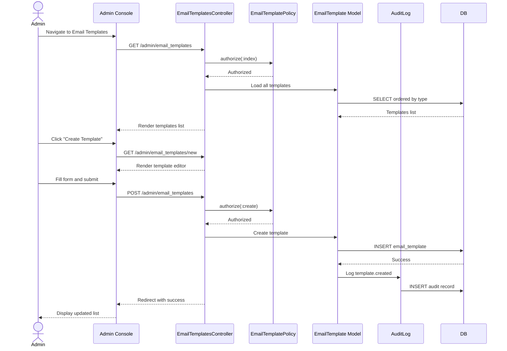

# UC-507: Configure Email Templates

## Metadata

| Attribute | Value |
|-----------|-------|
| **ID** | UC-507 |
| **Name** | Configure Email Templates |
| **Functional Area** | Administration |
| **Primary Actor** | System Administrator (ACT-01) |
| **Priority** | P2 |
| **Complexity** | Medium |
| **Status** | Approved |

## Description

Allows a System Administrator to create and configure email templates used for automated and manual candidate communications. Templates support variable substitution (e.g., candidate name, job title) and can be assigned to specific trigger events in the recruiting workflow.

## Actors

| Actor | Role in Use Case |
|-------|------------------|
| System Administrator (ACT-01) | Creates and manages email templates |
| Recruiter (ACT-02) | Uses templates when sending emails (secondary) |

## Preconditions

- [ ] Administrator is authenticated and has active session
- [ ] Administrator has `email_templates:manage` permission
- [ ] Organization exists and is active

## Postconditions

### Success
- [ ] Email template records created/updated
- [ ] Templates available for use in communications
- [ ] Audit log entries created for changes
- [ ] Administrator sees confirmation message

### Failure
- [ ] Templates unchanged
- [ ] Error message displayed to administrator

## Triggers

- Administrator navigates to Admin > Email Templates
- Administrator clicks "Create Template" or edits existing template

## Basic Flow



| Step | Actor | Action | System Response |
|------|-------|--------|-----------------|
| 1 | Administrator | Navigates to Admin > Email Templates | System displays template list |
| 2 | Administrator | Clicks "Create Template" | System displays template editor |
| 3 | Administrator | Enters template name | Name field validated |
| 4 | Administrator | Selects template type | Type determines available variables |
| 5 | Administrator | Enters email subject | Subject supports variables |
| 6 | Administrator | Enters email body using rich editor | Body supports variables and formatting |
| 7 | Administrator | Reviews available variables panel | Variables shown for selected type |
| 8 | Administrator | Clicks "Preview" (optional) | Preview with sample data shown |
| 9 | Administrator | Clicks "Save Template" | System validates and saves |
| 10 | System | Creates EmailTemplate record | Template saved |
| 11 | System | Creates audit log entry | Change recorded |
| 12 | System | Redirects to template list | Success message displayed |

## Alternative Flows

### AF-1: Edit Existing Template

**Trigger:** Administrator clicks "Edit" on existing template

| Step | Actor | Action | System Response |
|------|-------|--------|-----------------|
| 2.1 | Administrator | Clicks "Edit" on template | System loads template editor |
| 3.1 | Administrator | Modifies fields | Changes tracked |
| 9.1 | Administrator | Clicks "Save Changes" | System validates and updates |

**Resumption:** Returns to step 11 of basic flow

### AF-2: Duplicate Template

**Trigger:** Administrator wants to create a similar template

| Step | Actor | Action | System Response |
|------|-------|--------|-----------------|
| 2.1 | Administrator | Clicks "Duplicate" on template | Copy created with "(Copy)" suffix |
| 2.2 | System | Opens duplicate in editor | All fields pre-filled |
| 3.1 | Administrator | Modifies name and content | Changes as needed |

**Resumption:** Returns to step 9 of basic flow

### AF-3: Test Send Template

**Trigger:** Administrator wants to test template with real email

| Step | Actor | Action | System Response |
|------|-------|--------|-----------------|
| 8.1 | Administrator | Clicks "Send Test Email" | Test dialog opens |
| 8.2 | Administrator | Enters test recipient email | Email validated |
| 8.3 | Administrator | Clicks "Send" | Test email sent with sample data |
| 8.4 | System | Sends test email | Confirmation shown |

**Resumption:** Returns to step 9 of basic flow

### AF-4: Deactivate Template

**Trigger:** Administrator wants to disable a template

| Step | Actor | Action | System Response |
|------|-------|--------|-----------------|
| 2.1 | Administrator | Clicks "Deactivate" on template | Confirmation shown |
| 2.2 | Administrator | Confirms deactivation | Template marked inactive |
| 2.3 | System | Template no longer available for use | Existing automations paused |

**Resumption:** Returns to step 12 of basic flow

## Exception Flows

### EF-1: Invalid Variable Syntax

**Trigger:** Template contains malformed variable

| Step | Actor | Action | System Response |
|------|-------|--------|-----------------|
| E.1 | System | Parses template for variables | Detects syntax error |
| E.2 | System | Highlights error in editor | Shows "Invalid variable: {{name}" |
| E.3 | Administrator | Corrects syntax | System re-validates |

**Resolution:** Valid variable syntax used

### EF-2: System Template Edit

**Trigger:** Attempting to edit a system-required template

| Step | Actor | Action | System Response |
|------|-------|--------|-----------------|
| E.1 | System | Detects system template | Shows warning about required template |
| E.2 | Administrator | Can edit content but not delete | Deletion blocked |

**Resolution:** Template modified but not deleted

## Business Rules

| ID | Rule | Description |
|----|------|-------------|
| BR-1 | Template Types | Each type has specific available variables |
| BR-2 | Variable Syntax | Variables use Liquid syntax: {{variable_name}} |
| BR-3 | Required Templates | Some system templates cannot be deleted |
| BR-4 | Active Flag | Only active templates available for selection |
| BR-5 | Preview Data | Preview uses realistic sample data |

## Data Requirements

### Input Data

| Field | Type | Required | Validation |
|-------|------|----------|------------|
| name | string | Yes | Max 255 chars, unique in org |
| template_type | enum | Yes | application_received, interview_scheduled, offer_sent, rejection, custom |
| subject | string | Yes | Max 500 chars, supports variables |
| body | text | Yes | HTML/text, supports variables |
| active | boolean | No | Default true |

### Template Types and Variables

| Type | Available Variables |
|------|---------------------|
| application_received | candidate_name, job_title, company_name, application_date |
| interview_scheduled | candidate_name, job_title, interview_date, interview_time, interview_type, location, video_link, interviewer_names |
| offer_sent | candidate_name, job_title, salary, start_date, offer_expiration |
| rejection | candidate_name, job_title, company_name |
| custom | All variables based on context |

### Output Data

| Field | Type | Description |
|-------|------|-------------|
| template_id | integer | ID of created/updated template |
| variables | array | Detected variables in template |
| active | boolean | Whether template is active |

## Database Transactions

### Tables Affected

| Table | Operation | Conditions |
|-------|-----------|------------|
| email_templates | CREATE | New template |
| email_templates | UPDATE | Edit existing |
| audit_logs | CREATE | All changes |

### Transaction Detail

```sql
-- Create email template
BEGIN TRANSACTION;

-- Operation 1: Create template
INSERT INTO email_templates (
    organization_id,
    name,
    template_type,
    subject,
    body,
    variables,
    active,
    created_at,
    updated_at
)
VALUES (
    @organization_id,
    @name,
    @template_type,
    @subject,
    @body,
    @detected_variables,
    true,
    NOW(),
    NOW()
)
RETURNING id INTO @template_id;

-- Operation 2: Audit log
INSERT INTO audit_logs (
    organization_id,
    user_id,
    action,
    auditable_type,
    auditable_id,
    metadata,
    created_at
)
VALUES (
    @organization_id,
    @current_user_id,
    'email_template.created',
    'EmailTemplate',
    @template_id,
    '{"name": "@name", "template_type": "@template_type"}',
    NOW()
);

COMMIT;
```

### Rollback Scenarios

| Scenario | Rollback Action |
|----------|-----------------|
| Invalid variable syntax | No commit, errors shown |
| Duplicate name | Transaction rolled back |

## UI/UX Requirements

### Screen/Component

- **Location:** Admin Console > Email Templates
- **Entry Point:** Settings menu or Admin dashboard
- **Key Elements:**
  - Template list grouped by type
  - Rich text editor for body (TinyMCE or similar)
  - Variable insertion toolbar/panel
  - Live preview with sample data
  - Subject line preview
  - "Insert Variable" dropdown
  - Test send button
  - Active/inactive toggle

### Wireframe Reference

`/designs/wireframes/UC-507-configure-email-templates.png`

## Non-Functional Requirements

| Requirement | Target |
|-------------|--------|
| Response Time | < 2 seconds for save |
| Editor Load | < 1 second |
| Preview Generation | < 500ms |
| Max Template Size | 100KB body content |

## Security Considerations

- [x] Authentication required
- [x] Authorization check: `email_templates:manage` permission required
- [x] XSS prevention: HTML sanitization on body content
- [x] Audit logging: All changes logged
- [x] Variable validation: Prevent code injection via variables

## Related Use Cases

| Use Case | Relationship |
|----------|--------------|
| UC-550 | Send Email to Candidate - uses templates |
| UC-505 | Configure Organization Settings - notification settings |
| UC-553 | Create Email Sequence - uses templates |

---

## Data Model References

> Cross-references to [DATA_MODEL.md](../DATA_MODEL.md) and [CRUD_MATRIX.md](../CRUD_MATRIX.md)

### Subject Areas

| Subject Area | ID | Relationship |
|--------------|-----|--------------|
| Communication | SA-10 | Primary |
| Organization Management | SA-02 | Secondary |

### Entities CRUD

| Entity | C | R | U | D | Notes |
|--------|---|---|---|---|-------|
| EmailTemplate | X | X | X | | Full CRUD (soft delete for system templates) |
| AuditLog | X | | | | Created for changes |

**Legend:** C = Create, R = Read, U = Update, D = Delete

---

## Process Model References

> Cross-references to [PROCESS_MODEL.md](../PROCESS_MODEL.md) and [PROCESS_CRUD_MATRIX.md](../PROCESS_CRUD_MATRIX.md)

| Attribute | Value | Link |
|-----------|-------|------|
| **Elementary Business Process** | EP-1114: Configure Email Templates | [PROCESS_MODEL.md#ep-1114](../PROCESS_MODEL.md#bp-602-organization-configuration) |
| **Business Process** | BP-602: Organization Configuration | [PROCESS_MODEL.md#bp-602](../PROCESS_MODEL.md#bp-602-organization-configuration) |
| **Business Function** | BF-06: System Administration | [PROCESS_MODEL.md#bf-06](../PROCESS_MODEL.md#bf-06-system-administration) |

### EBP Details

| Attribute | Value |
|-----------|-------|
| **Trigger** | Admin action - need to customize email communications |
| **Input** | Template details (name, type, subject, body) |
| **Output** | Configured email template |
| **Business Rules** | BR-1 through BR-5 (types, variable syntax, required templates) |

---

## Traceability Matrix

> Complete artifact mapping for requirements traceability

| Artifact Type | ID | Name | Link |
|---------------|-----|------|------|
| **Use Case** | UC-507 | Configure Email Templates | *(this document)* |
| **Elementary Process** | EP-1114 | Configure Email Templates | [PROCESS_MODEL.md](../PROCESS_MODEL.md#bp-602-organization-configuration) |
| **Business Process** | BP-602 | Organization Configuration | [PROCESS_MODEL.md](../PROCESS_MODEL.md#bp-602-organization-configuration) |
| **Business Function** | BF-06 | System Administration | [PROCESS_MODEL.md](../PROCESS_MODEL.md#bf-06-system-administration) |
| **Primary Actor** | ACT-01 | System Administrator | [ACTORS.md](../ACTORS.md#act-01-system-administrator) |
| **Subject Area (Primary)** | SA-10 | Communication | [DATA_MODEL.md](../DATA_MODEL.md#sa-10-communication) |
| **CRUD Matrix Row** | UC-507 | - | [CRUD_MATRIX.md](../CRUD_MATRIX.md#uc-507) |
| **Process CRUD Row** | EP-1114 | - | [PROCESS_CRUD_MATRIX.md](../PROCESS_CRUD_MATRIX.md#ep-1114) |

### Implementation Artifacts

| Artifact Type | Path/Reference | Status |
|---------------|----------------|--------|
| Controller | `app/controllers/admin/email_templates_controller.rb` | Planned |
| Model | `app/models/email_template.rb` | Planned |
| Service | `app/services/email_template_renderer.rb` | Planned |
| Policy | `app/policies/email_template_policy.rb` | Planned |
| View | `app/views/admin/email_templates/index.html.erb` | Planned |
| Test | `test/models/email_template_test.rb` | Planned |

---

## Open Questions

1. Should templates support multiple locales for international candidates?
2. Should there be a template versioning system?
3. Should templates support conditional logic (if/else)?

## Change History

| Version | Date | Author | Changes |
|---------|------|--------|---------|
| 0.1 | 2026-01-25 | System | Initial draft |
