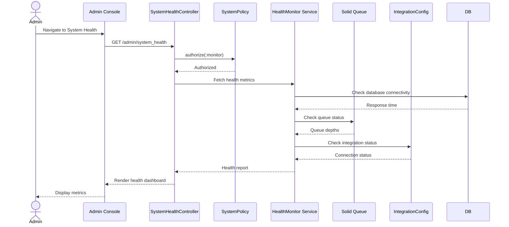

# UC-508: View System Health

## Metadata

| Attribute | Value |
|-----------|-------|
| **ID** | UC-508 |
| **Name** | View System Health |
| **Functional Area** | Administration |
| **Primary Actor** | System Administrator (ACT-01) |
| **Priority** | P2 |
| **Complexity** | Medium |
| **Status** | Approved |

## Description

Allows a System Administrator to monitor the health and status of the Ledgoria ATS system. This includes viewing background job status, integration health, storage usage, API rate limits, and recent error logs. The dashboard provides operational visibility for troubleshooting and capacity planning.

## Actors

| Actor | Role in Use Case |
|-------|------------------|
| System Administrator (ACT-01) | Views system health metrics and status |

## Preconditions

- [ ] Administrator is authenticated and has active session
- [ ] Administrator has `system:monitor` permission
- [ ] System monitoring services are operational

## Postconditions

### Success
- [ ] Current system health metrics displayed
- [ ] Integration status shown for all configured integrations
- [ ] Background job queue status visible
- [ ] Recent errors accessible for review

### Failure
- [ ] Partial or no health data displayed
- [ ] Error message indicating monitoring unavailable

## Triggers

- Administrator navigates to Admin > System Health
- Administrator clicks health status indicator in header
- Scheduled health check alert triggers notification

## Basic Flow



| Step | Actor | Action | System Response |
|------|-------|--------|-----------------|
| 1 | Administrator | Navigates to Admin > System Health | System initiates health check |
| 2 | System | Checks database connectivity | Response time recorded |
| 3 | System | Checks background job queue status | Queue depths retrieved |
| 4 | System | Checks integration health | Connection status for each |
| 5 | System | Retrieves storage usage | Storage metrics calculated |
| 6 | System | Retrieves recent error logs | Last 24h errors fetched |
| 7 | System | Compiles health report | All metrics aggregated |
| 8 | System | Renders health dashboard | Metrics displayed with indicators |

## Alternative Flows

### AF-1: Auto-Refresh Dashboard

**Trigger:** Dashboard configured for auto-refresh

| Step | Actor | Action | System Response |
|------|-------|--------|-----------------|
| 8.1 | System | Sets 30-second refresh interval | Timer started |
| 8.2 | System | Polls for updated metrics | Metrics refreshed |
| 8.3 | UI | Updates dashboard without full reload | Smooth update |

**Resumption:** Continues until user navigates away

### AF-2: View Detailed Job Queue Status

**Trigger:** Administrator clicks on background jobs section

| Step | Actor | Action | System Response |
|------|-------|--------|-----------------|
| 8.1 | Administrator | Clicks "View Details" on Jobs | Detailed queue view shown |
| 8.2 | System | Shows each queue with depth | Individual queue status |
| 8.3 | System | Shows failed jobs list | Retry options available |

**Resumption:** Can return to main dashboard

### AF-3: View Integration Health Details

**Trigger:** Administrator clicks on integration status

| Step | Actor | Action | System Response |
|------|-------|--------|-----------------|
| 8.1 | Administrator | Clicks integration row | Integration detail modal |
| 8.2 | System | Shows last sync time | Sync status details |
| 8.3 | System | Shows recent integration logs | Activity history |

**Resumption:** Can return to main dashboard

### AF-4: Retry Failed Jobs

**Trigger:** Administrator wants to retry failed background jobs

| Step | Actor | Action | System Response |
|------|-------|--------|-----------------|
| 1 | Administrator | Views failed jobs | Failed jobs list shown |
| 2 | Administrator | Clicks "Retry" on job | Job re-queued |
| 3 | System | Re-queues job for processing | Success confirmation |

**Resumption:** Dashboard refreshes with updated status

### AF-5: Export Health Report

**Trigger:** Administrator needs to share health status

| Step | Actor | Action | System Response |
|------|-------|--------|-----------------|
| 1 | Administrator | Clicks "Export Report" | Report generated |
| 2 | System | Generates PDF/JSON report | File downloaded |

**Resumption:** Use case ends with download

## Exception Flows

### EF-1: Monitoring Service Unavailable

**Trigger:** Cannot connect to monitoring backend

| Step | Actor | Action | System Response |
|------|-------|--------|-----------------|
| E.1 | System | Fails to retrieve metrics | Displays "Monitoring temporarily unavailable" |
| E.2 | System | Shows cached last-known values | Stale data indicator shown |

**Resolution:** Retry after monitoring service restored

### EF-2: Database Connectivity Issue

**Trigger:** Database health check fails

| Step | Actor | Action | System Response |
|------|-------|--------|-----------------|
| E.1 | System | Database check times out | Shows critical alert |
| E.2 | System | Marks database status as unhealthy | Red indicator shown |
| E.3 | Administrator | Can view connection details | Error details accessible |

**Resolution:** Database connectivity restored

## Business Rules

| ID | Rule | Description |
|----|------|-------------|
| BR-1 | Real-Time Data | Metrics should be no more than 1 minute old |
| BR-2 | Health Thresholds | Status indicators based on configured thresholds |
| BR-3 | Error Retention | Error logs retained for 7 days |
| BR-4 | Access Control | Only admins can view system health |
| BR-5 | No Data Modification | Health dashboard is read-only (except retry) |

## Data Requirements

### Output Data

#### System Overview

| Metric | Type | Description |
|--------|------|-------------|
| overall_status | enum | healthy, degraded, unhealthy |
| database_status | object | Response time, connection count |
| cache_status | object | Hit rate, memory usage |
| storage_usage | object | Used/available by type |

#### Background Jobs

| Metric | Type | Description |
|--------|------|-------------|
| queue_depths | object | Jobs pending per queue |
| processing_count | integer | Jobs currently processing |
| failed_count | integer | Jobs in failed state |
| scheduled_count | integer | Jobs scheduled for future |

#### Integrations

| Metric | Type | Description |
|--------|------|-------------|
| integration_status | array | Status per integration |
| last_sync_time | datetime | Most recent sync |
| error_rate | decimal | Errors in last 24h |

#### API Usage

| Metric | Type | Description |
|--------|------|-------------|
| api_requests_today | integer | Total API calls |
| rate_limit_remaining | integer | Calls remaining |
| top_consumers | array | API keys with most usage |

#### Errors

| Field | Type | Description |
|-------|------|-------------|
| error_count_24h | integer | Errors in last 24 hours |
| recent_errors | array | Last 20 errors with details |
| error_by_type | object | Breakdown by error category |

## Database Transactions

### Tables Affected

| Table | Operation | Conditions |
|-------|-----------|------------|
| solid_queue_jobs | READ | Queue status |
| integration_configs | READ | Integration health |
| integration_logs | READ | Recent activity |
| api_keys | READ | Rate limit status |
| (error_logs) | READ | Recent errors |

### Query Examples

```sql
-- Get queue depths
SELECT queue_name, COUNT(*) as depth
FROM solid_queue_ready_executions
GROUP BY queue_name;

-- Get failed jobs
SELECT COUNT(*) as failed_count
FROM solid_queue_failed_executions
WHERE organization_id = @organization_id;

-- Get integration status
SELECT ic.id, ic.provider, ic.enabled, ic.last_sync_at, ic.sync_status,
       (SELECT COUNT(*) FROM integration_logs il
        WHERE il.integration_config_id = ic.id
        AND il.status = 'error'
        AND il.created_at > NOW() - INTERVAL '24 hours') as error_count
FROM integration_configs ic
WHERE ic.organization_id = @organization_id;

-- Get API usage
SELECT COUNT(*) as request_count
FROM api_request_logs
WHERE organization_id = @organization_id
AND created_at > CURRENT_DATE;
```

### Rollback Scenarios

| Scenario | Rollback Action |
|----------|-----------------|
| N/A | Read-only dashboard - no modifications |

## UI/UX Requirements

### Screen/Component

- **Location:** Admin Console > System Health
- **Entry Point:** Admin menu or status indicator
- **Key Elements:**
  - Overall health status indicator (green/yellow/red)
  - Database connectivity panel with response time
  - Background job queue visualization
  - Integration status cards with last sync
  - Storage usage gauge/chart
  - API rate limit meter
  - Recent errors table with expandable details
  - Auto-refresh toggle
  - Export report button
  - Retry failed jobs button

### Health Status Indicators

| Status | Color | Condition |
|--------|-------|-----------|
| Healthy | Green | All systems operational |
| Degraded | Yellow | Minor issues, some features affected |
| Unhealthy | Red | Critical issues, action required |

### Wireframe Reference

`/designs/wireframes/UC-508-view-system-health.png`

## Non-Functional Requirements

| Requirement | Target |
|-------------|--------|
| Dashboard Load | < 3 seconds |
| Metric Freshness | < 1 minute old |
| Auto-Refresh Interval | 30 seconds |
| Error Log Retention | 7 days |

## Security Considerations

- [x] Authentication required
- [x] Authorization check: `system:monitor` permission required
- [x] No sensitive data exposure: Sanitize error messages
- [x] Rate limiting: Prevent dashboard overload
- [x] Read-only: Cannot modify system through dashboard

## Related Use Cases

| Use Case | Relationship |
|----------|--------------|
| UC-460 | View Integration Logs - detailed integration info |
| UC-458 | Manage API Keys - API usage context |

---

## Data Model References

> Cross-references to [DATA_MODEL.md](../DATA_MODEL.md) and [CRUD_MATRIX.md](../CRUD_MATRIX.md)

### Subject Areas

| Subject Area | ID | Relationship |
|--------------|-----|--------------|
| Integration | SA-11 | Primary |
| Organization Management | SA-02 | Secondary |

### Entities CRUD

| Entity | C | R | U | D | Notes |
|--------|---|---|---|---|-------|
| IntegrationConfig | | X | | | Read for status |
| IntegrationLog | | X | | | Read for health data |
| ApiKey | | X | | | Read for usage |
| WebhookDelivery | | X | | | Read for delivery status |

**Legend:** C = Create, R = Read, U = Update, D = Delete

---

## Process Model References

> Cross-references to [PROCESS_MODEL.md](../PROCESS_MODEL.md) and [PROCESS_CRUD_MATRIX.md](../PROCESS_CRUD_MATRIX.md)

| Attribute | Value | Link |
|-----------|-------|------|
| **Elementary Business Process** | EP-1115: View System Health | [PROCESS_MODEL.md#ep-1115](../PROCESS_MODEL.md#bp-602-organization-configuration) |
| **Business Process** | BP-602: Organization Configuration | [PROCESS_MODEL.md#bp-602](../PROCESS_MODEL.md#bp-602-organization-configuration) |
| **Business Function** | BF-06: System Administration | [PROCESS_MODEL.md#bf-06](../PROCESS_MODEL.md#bf-06-system-administration) |

### EBP Details

| Attribute | Value |
|-----------|-------|
| **Trigger** | Admin action - need to check system status |
| **Input** | None (read-only) |
| **Output** | System health metrics and status |
| **Business Rules** | BR-1 through BR-5 (real-time data, thresholds, access control) |

---

## Traceability Matrix

> Complete artifact mapping for requirements traceability

| Artifact Type | ID | Name | Link |
|---------------|-----|------|------|
| **Use Case** | UC-508 | View System Health | *(this document)* |
| **Elementary Process** | EP-1115 | View System Health | [PROCESS_MODEL.md](../PROCESS_MODEL.md#bp-602-organization-configuration) |
| **Business Process** | BP-602 | Organization Configuration | [PROCESS_MODEL.md](../PROCESS_MODEL.md#bp-602-organization-configuration) |
| **Business Function** | BF-06 | System Administration | [PROCESS_MODEL.md](../PROCESS_MODEL.md#bf-06-system-administration) |
| **Primary Actor** | ACT-01 | System Administrator | [ACTORS.md](../ACTORS.md#act-01-system-administrator) |
| **Subject Area (Primary)** | SA-11 | Integration | [DATA_MODEL.md](../DATA_MODEL.md#sa-11-integration) |
| **CRUD Matrix Row** | UC-508 | - | [CRUD_MATRIX.md](../CRUD_MATRIX.md#uc-508) |
| **Process CRUD Row** | EP-1115 | - | [PROCESS_CRUD_MATRIX.md](../PROCESS_CRUD_MATRIX.md#ep-1115) |

### Implementation Artifacts

| Artifact Type | Path/Reference | Status |
|---------------|----------------|--------|
| Controller | `app/controllers/admin/system_health_controller.rb` | Planned |
| Service | `app/services/health_monitor_service.rb` | Planned |
| View | `app/views/admin/system_health/index.html.erb` | Planned |
| Stimulus | `app/javascript/controllers/health_dashboard_controller.js` | Planned |
| Test | `test/controllers/admin/system_health_controller_test.rb` | Planned |

---

## Open Questions

1. Should there be email/Slack alerts for health status changes?
2. Should historical health metrics be tracked for trending?
3. Should there be a public status page for external users?

## Change History

| Version | Date | Author | Changes |
|---------|------|--------|---------|
| 0.1 | 2026-01-25 | System | Initial draft |
