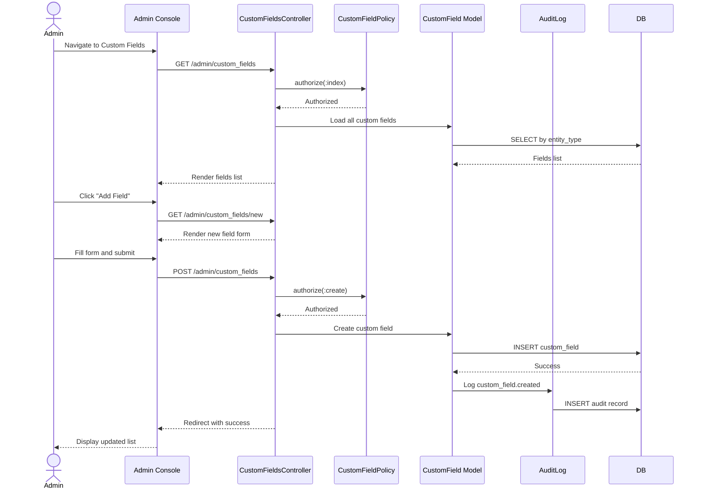

# UC-509: Manage Custom Fields

## Metadata

| Attribute | Value |
|-----------|-------|
| **ID** | UC-509 |
| **Name** | Manage Custom Fields |
| **Functional Area** | Administration |
| **Primary Actor** | System Administrator (ACT-01) |
| **Priority** | P2 |
| **Complexity** | Medium |
| **Status** | Approved |

## Description

Allows a System Administrator to define custom fields that extend the data model for candidates, jobs, and applications. Custom fields enable organizations to capture industry-specific or company-specific data not covered by standard fields. Field types include text, number, date, select, multi-select, and boolean.

## Actors

| Actor | Role in Use Case |
|-------|------------------|
| System Administrator (ACT-01) | Creates and manages custom field definitions |
| Recruiter (ACT-02) | Uses custom fields when entering data (secondary) |

## Preconditions

- [ ] Administrator is authenticated and has active session
- [ ] Administrator has `custom_fields:manage` permission
- [ ] Organization exists and is active

## Postconditions

### Success
- [ ] CustomField records created/updated/deactivated
- [ ] Custom fields appear on relevant forms
- [ ] Existing data preserved when fields modified
- [ ] Audit log entries created for changes

### Failure
- [ ] Custom fields unchanged
- [ ] Error message displayed to administrator

## Triggers

- Administrator navigates to Admin > Custom Fields
- Administrator clicks "Add Field" or edits existing field

## Basic Flow



| Step | Actor | Action | System Response |
|------|-------|--------|-----------------|
| 1 | Administrator | Navigates to Admin > Custom Fields | System displays fields grouped by entity type |
| 2 | Administrator | Clicks "Add Field" | System displays new field form |
| 3 | Administrator | Selects entity type (Candidate, Job, Application) | Entity type determines where field appears |
| 4 | Administrator | Enters field label | User-visible label |
| 5 | Administrator | Enters field key | Internal identifier (auto-generated option) |
| 6 | Administrator | Selects field type | Type determines input control |
| 7 | Administrator | Configures options (if select/multi-select) | Options list defined |
| 8 | Administrator | Sets required flag (optional) | Validation requirement |
| 9 | Administrator | Clicks "Create Field" | System validates and saves |
| 10 | System | Creates CustomField record | Field saved |
| 11 | System | Creates audit log entry | Change recorded |
| 12 | System | Redirects to field list | Success message displayed |

## Alternative Flows

### AF-1: Edit Custom Field

**Trigger:** Administrator clicks "Edit" on existing field

| Step | Actor | Action | System Response |
|------|-------|--------|-----------------|
| 2.1 | Administrator | Clicks "Edit" on field | System loads edit form |
| 3.1 | System | Shows warning about data impact | Label and options can change, key cannot |
| 4.1 | Administrator | Modifies allowed fields | Changes tracked |
| 9.1 | Administrator | Clicks "Save Changes" | System validates and updates |

**Resumption:** Returns to step 11 of basic flow

### AF-2: Configure Select Options

**Trigger:** Field type is select or multi-select

| Step | Actor | Action | System Response |
|------|-------|--------|-----------------|
| 7.1 | Administrator | Clicks "Add Option" | Option row added |
| 7.2 | Administrator | Enters option value | Value captured |
| 7.3 | Administrator | Optionally sets default | Default option marked |
| 7.4 | Administrator | Reorders options via drag-drop | Order updated |

**Resumption:** Returns to step 8 of basic flow

### AF-3: Deactivate Custom Field

**Trigger:** Administrator wants to hide a field without losing data

| Step | Actor | Action | System Response |
|------|-------|--------|-----------------|
| 2.1 | Administrator | Clicks "Deactivate" on field | Confirmation dialog shown |
| 2.2 | System | Warns about form removal | Data preserved message |
| 2.3 | Administrator | Confirms deactivation | Field marked inactive |
| 2.4 | System | Field no longer appears on forms | Existing data preserved |

**Resumption:** Returns to step 12 of basic flow

### AF-4: Reorder Fields

**Trigger:** Administrator wants to change display order

| Step | Actor | Action | System Response |
|------|-------|--------|-----------------|
| 1 | Administrator | Drags field to new position | Visual indicator shown |
| 2 | Administrator | Drops in desired position | Position updated |
| 3 | System | Updates position values | All positions recalculated |

**Resumption:** Fields display in new order

### AF-5: Import Field Definitions

**Trigger:** Administrator wants to bulk create fields

| Step | Actor | Action | System Response |
|------|-------|--------|-----------------|
| 1 | Administrator | Clicks "Import Fields" | Upload dialog shown |
| 2 | Administrator | Uploads JSON/CSV definition | File parsed |
| 3 | System | Validates field definitions | Shows preview with errors |
| 4 | Administrator | Confirms import | Fields created in batch |

**Resumption:** Ends with import summary

## Exception Flows

### EF-1: Duplicate Field Key

**Trigger:** Field key already exists for entity type

| Step | Actor | Action | System Response |
|------|-------|--------|-----------------|
| E.1 | System | Detects duplicate key | Displays "Field key already exists" |
| E.2 | Administrator | Enters different key | Validation retried |

**Resolution:** Unique key provided

### EF-2: Change Field Type with Data

**Trigger:** Attempting to change type when field has values

| Step | Actor | Action | System Response |
|------|-------|--------|-----------------|
| E.1 | System | Detects existing values | Displays "Cannot change type: field has data" |
| E.2 | Administrator | Can create new field instead | Original field deactivated |

**Resolution:** Create new field or keep type

### EF-3: Delete Required Field with Data

**Trigger:** Attempting to delete field with stored values

| Step | Actor | Action | System Response |
|------|-------|--------|-----------------|
| E.1 | System | Detects field has values | Displays "Cannot delete: has stored values" |
| E.2 | Administrator | Can deactivate instead | Deactivation option offered |

**Resolution:** Deactivate instead of delete

## Business Rules

| ID | Rule | Description |
|----|------|-------------|
| BR-1 | Unique Key | Field key must be unique per entity type in org |
| BR-2 | Key Immutable | Field key cannot be changed after creation |
| BR-3 | Type Change | Type cannot change if field has stored values |
| BR-4 | Soft Delete | Fields with data can only be deactivated |
| BR-5 | Options Required | Select/multi-select must have at least one option |
| BR-6 | Position Order | Fields displayed in position order on forms |

## Data Requirements

### Input Data

| Field | Type | Required | Validation |
|-------|------|----------|------------|
| entity_type | enum | Yes | candidate, job, application |
| field_key | string | Yes | Max 50 chars, alphanumeric_underscore, unique per entity |
| label | string | Yes | Max 255 chars |
| field_type | enum | Yes | text, number, date, select, multiselect, boolean |
| options | json | Conditional | Required for select/multiselect |
| required | boolean | No | Default false |
| position | integer | No | Auto-assigned if not provided |

### Field Types

| Type | Control | Stored Value |
|------|---------|--------------|
| text | Text input | String (max 500 chars) |
| number | Number input | Integer or decimal |
| date | Date picker | Date (YYYY-MM-DD) |
| select | Dropdown | Single option value |
| multiselect | Multi-select | Array of option values |
| boolean | Checkbox | true/false |

### Options JSON Structure (for select types)

```json
{
  "options": [
    {"value": "option_1", "label": "Option One", "position": 0},
    {"value": "option_2", "label": "Option Two", "position": 1, "default": true},
    {"value": "option_3", "label": "Option Three", "position": 2}
  ]
}
```

### Output Data

| Field | Type | Description |
|-------|------|-------------|
| field_id | integer | ID of created/updated field |
| usage_count | integer | Number of records with values |
| active | boolean | Whether field is active |

## Database Transactions

### Tables Affected

| Table | Operation | Conditions |
|-------|-----------|------------|
| custom_fields | CREATE | New field |
| custom_fields | UPDATE | Edit existing |
| custom_fields | UPDATE | Activate/deactivate |
| audit_logs | CREATE | All changes |

### Transaction Detail

```sql
-- Create custom field
BEGIN TRANSACTION;

-- Validate unique key per entity type
SELECT COUNT(*) INTO @existing
FROM custom_fields
WHERE organization_id = @organization_id
  AND entity_type = @entity_type
  AND field_key = @field_key;

IF @existing > 0 THEN
    ROLLBACK;
    SIGNAL SQLSTATE '45000' SET MESSAGE_TEXT = 'Field key already exists';
END IF;

-- Get next position
SELECT COALESCE(MAX(position) + 1, 0) INTO @next_position
FROM custom_fields
WHERE organization_id = @organization_id
  AND entity_type = @entity_type;

-- Operation 1: Create field
INSERT INTO custom_fields (
    organization_id,
    entity_type,
    field_key,
    label,
    field_type,
    options,
    required,
    active,
    position,
    created_at,
    updated_at
)
VALUES (
    @organization_id,
    @entity_type,
    @field_key,
    @label,
    @field_type,
    @options,
    @required,
    true,
    COALESCE(@position, @next_position),
    NOW(),
    NOW()
)
RETURNING id INTO @field_id;

-- Operation 2: Audit log
INSERT INTO audit_logs (
    organization_id,
    user_id,
    action,
    auditable_type,
    auditable_id,
    metadata,
    created_at
)
VALUES (
    @organization_id,
    @current_user_id,
    'custom_field.created',
    'CustomField',
    @field_id,
    '{"entity_type": "@entity_type", "field_key": "@field_key", "field_type": "@field_type"}',
    NOW()
);

COMMIT;
```

### Rollback Scenarios

| Scenario | Rollback Action |
|----------|-----------------|
| Duplicate key | Transaction rolled back |
| Invalid field type | Transaction rolled back |
| Invalid options for select | Transaction rolled back |

## UI/UX Requirements

### Screen/Component

- **Location:** Admin Console > Custom Fields
- **Entry Point:** Settings menu or Admin dashboard
- **Key Elements:**
  - Tabs or filters by entity type (Candidate, Job, Application)
  - Field list with drag-drop reordering
  - Field type icons for visual identification
  - "Add Field" button per entity type
  - Edit/Deactivate actions per row
  - Usage count shown per field
  - Options editor for select types
  - Preview of form appearance
  - Import/Export buttons

### Wireframe Reference

`/designs/wireframes/UC-509-manage-custom-fields.png`

## Non-Functional Requirements

| Requirement | Target |
|-------------|--------|
| Response Time | < 1 second for save |
| Max Fields | 50 custom fields per entity type |
| Max Options | 100 options per select field |
| Form Load Impact | < 100ms additional for custom fields |

## Security Considerations

- [x] Authentication required
- [x] Authorization check: `custom_fields:manage` permission required
- [x] Audit logging: All changes logged
- [x] Input validation: Field key format validated
- [x] XSS prevention: Labels and options sanitized

## Related Use Cases

| Use Case | Relationship |
|----------|--------------|
| UC-050 | Add Candidate Manually - uses custom fields |
| UC-001 | Create Job Requisition - uses custom fields |
| UC-100 | Apply for Job - uses application custom fields |

---

## Data Model References

> Cross-references to [DATA_MODEL.md](../DATA_MODEL.md) and [CRUD_MATRIX.md](../CRUD_MATRIX.md)

### Subject Areas

| Subject Area | ID | Relationship |
|--------------|-----|--------------|
| Organization Management | SA-02 | Primary |
| Candidate | SA-04 | Secondary (usage) |
| Job Requisition | SA-03 | Secondary (usage) |
| Application Pipeline | SA-05 | Secondary (usage) |

### Entities CRUD

| Entity | C | R | U | D | Notes |
|--------|---|---|---|---|-------|
| CustomField | X | X | X | | Full CRUD (soft delete) |
| CandidateCustomFieldValue | | X | | | Read for usage count |
| JobCustomFieldValue | | X | | | Read for usage count |
| ApplicationCustomFieldValue | | X | | | Read for usage count |
| AuditLog | X | | | | Created for changes |

**Legend:** C = Create, R = Read, U = Update, D = Delete

---

## Process Model References

> Cross-references to [PROCESS_MODEL.md](../PROCESS_MODEL.md) and [PROCESS_CRUD_MATRIX.md](../PROCESS_CRUD_MATRIX.md)

| Attribute | Value | Link |
|-----------|-------|------|
| **Elementary Business Process** | EP-1116: Manage Custom Fields | [PROCESS_MODEL.md#ep-1116](../PROCESS_MODEL.md#bp-602-organization-configuration) |
| **Business Process** | BP-602: Organization Configuration | [PROCESS_MODEL.md#bp-602](../PROCESS_MODEL.md#bp-602-organization-configuration) |
| **Business Function** | BF-06: System Administration | [PROCESS_MODEL.md#bf-06](../PROCESS_MODEL.md#bf-06-system-administration) |

### EBP Details

| Attribute | Value |
|-----------|-------|
| **Trigger** | Admin action - need to capture custom data |
| **Input** | Field definition (entity type, key, label, type, options) |
| **Output** | Configured custom field |
| **Business Rules** | BR-1 through BR-6 (unique key, immutable key, type restrictions) |

---

## Traceability Matrix

> Complete artifact mapping for requirements traceability

| Artifact Type | ID | Name | Link |
|---------------|-----|------|------|
| **Use Case** | UC-509 | Manage Custom Fields | *(this document)* |
| **Elementary Process** | EP-1116 | Manage Custom Fields | [PROCESS_MODEL.md](../PROCESS_MODEL.md#bp-602-organization-configuration) |
| **Business Process** | BP-602 | Organization Configuration | [PROCESS_MODEL.md](../PROCESS_MODEL.md#bp-602-organization-configuration) |
| **Business Function** | BF-06 | System Administration | [PROCESS_MODEL.md](../PROCESS_MODEL.md#bf-06-system-administration) |
| **Primary Actor** | ACT-01 | System Administrator | [ACTORS.md](../ACTORS.md#act-01-system-administrator) |
| **Subject Area (Primary)** | SA-02 | Organization Management | [DATA_MODEL.md](../DATA_MODEL.md#sa-02-organization-management) |
| **CRUD Matrix Row** | UC-509 | - | [CRUD_MATRIX.md](../CRUD_MATRIX.md#uc-509) |
| **Process CRUD Row** | EP-1116 | - | [PROCESS_CRUD_MATRIX.md](../PROCESS_CRUD_MATRIX.md#ep-1116) |

### Implementation Artifacts

| Artifact Type | Path/Reference | Status |
|---------------|----------------|--------|
| Controller | `app/controllers/admin/custom_fields_controller.rb` | Planned |
| Model | `app/models/custom_field.rb` | Planned |
| Model | `app/models/candidate_custom_field_value.rb` | Planned |
| Model | `app/models/job_custom_field_value.rb` | Planned |
| Model | `app/models/application_custom_field_value.rb` | Planned |
| Policy | `app/policies/custom_field_policy.rb` | Planned |
| View | `app/views/admin/custom_fields/index.html.erb` | Planned |
| Test | `test/models/custom_field_test.rb` | Planned |

---

## Open Questions

1. Should custom fields support conditional visibility based on other field values?
2. Should there be field templates for common industry use cases?
3. Should custom fields be included in API responses by default?
4. Should there be a data migration tool when changing options?

## Change History

| Version | Date | Author | Changes |
|---------|------|--------|---------|
| 0.1 | 2026-01-25 | System | Initial draft |
