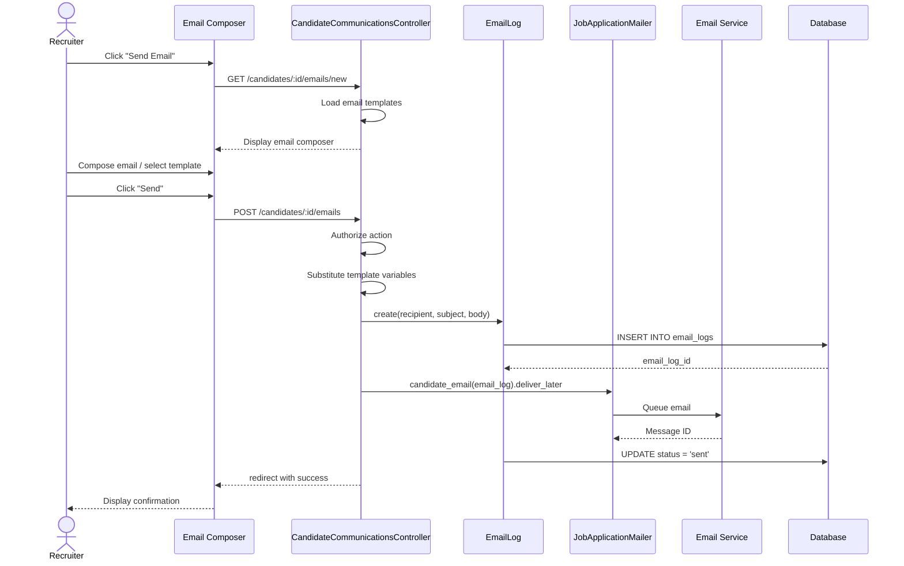

# UC-550: Send Email to Candidate

## Metadata

| Attribute | Value |
|-----------|-------|
| **ID** | UC-550 |
| **Name** | Send Email to Candidate |
| **Functional Area** | Communication & Notifications |
| **Primary Actor** | Recruiter (ACT-02) |
| **Priority** | P1 |
| **Complexity** | Low |
| **Status** | Draft |

## Description

A recruiter composes and sends an individual email to a candidate directly from the ATS. The email can be composed from scratch, use a pre-defined template with variable substitution, or be a reply to a previous conversation. All sent emails are logged for compliance and tracked for engagement metrics.

## Actors

| Actor | Role in Use Case |
|-------|------------------|
| Recruiter (ACT-02) | Composes and sends the email |
| Candidate (ACT-07) | Receives the email |
| Notification Engine (ACT-13) | Processes and delivers the email |

## Preconditions

- [ ] User is authenticated and has Recruiter, Hiring Manager, or Admin role
- [ ] Candidate record exists with a valid email address
- [ ] Organization has email sending enabled (not suspended)
- [ ] User has permission to view the candidate

## Postconditions

### Success
- [ ] EmailLog record created with status = 'queued'
- [ ] Email queued for delivery via email service (SendGrid/SES)
- [ ] Email delivered to candidate's inbox
- [ ] Audit log entry created
- [ ] Engagement tracking pixel embedded (if enabled)

### Failure
- [ ] EmailLog created with status = 'failed' and error details
- [ ] User shown error message
- [ ] Email not delivered

## Triggers

- Recruiter clicks "Send Email" button on candidate profile
- Recruiter clicks "Email" action from candidate list
- Recruiter selects "Email" from candidate quick actions menu
- Recruiter clicks "Reply" on email history item

## Basic Flow



| Step | Actor | Action | System Response |
|------|-------|--------|-----------------|
| 1 | Recruiter | Clicks "Send Email" on candidate | System displays email composer modal |
| 2 | System | Loads available email templates | Template dropdown populated |
| 3 | Recruiter | Selects template (optional) | Subject and body pre-filled with template |
| 4 | System | Substitutes candidate variables | Placeholders replaced with actual values |
| 5 | Recruiter | Edits subject line | Subject field updated |
| 6 | Recruiter | Edits email body | Body content updated |
| 7 | Recruiter | Adds attachments (optional) | Files attached to email |
| 8 | Recruiter | Clicks "Send" | System validates email |
| 9 | System | Creates EmailLog record | Record saved with status='queued' |
| 10 | System | Queues email for delivery | Background job created |
| 11 | System | Sends email via email service | Email dispatched |
| 12 | System | Updates EmailLog with message ID | Status updated to 'sent' |
| 13 | System | Shows success confirmation | Toast notification displayed |

## Alternative Flows

### AF-1: Use Template with Variables

**Trigger:** Recruiter selects a template at step 3

| Step | Actor | Action | System Response |
|------|-------|--------|-----------------|
| 3a | Recruiter | Selects template from dropdown | Template content loaded |
| 4a | System | Identifies template variables | Variables: {{candidate_name}}, {{job_title}}, etc. |
| 5a | System | Substitutes variables | Placeholders replaced with candidate/job data |
| 6a | Recruiter | Reviews and optionally edits | Content displayed for review |

**Resumption:** Returns to step 7 of basic flow

### AF-2: Reply to Previous Email

**Trigger:** Recruiter clicks "Reply" on an email in history

| Step | Actor | Action | System Response |
|------|-------|--------|-----------------|
| 0a | Recruiter | Clicks "Reply" on email | Composer opens with context |
| 1a | System | Pre-fills subject with "Re: [original]" | Subject populated |
| 2a | System | Includes quoted original message | Original email quoted below |
| 3a | Recruiter | Composes reply content | Reply content entered |

**Resumption:** Returns to step 8 of basic flow

### AF-3: Send with CC/BCC

**Trigger:** Recruiter wants to copy other recipients

| Step | Actor | Action | System Response |
|------|-------|--------|-----------------|
| 7a | Recruiter | Clicks "Show CC/BCC" | Additional recipient fields shown |
| 7b | Recruiter | Enters CC recipients | CC addresses captured |
| 7c | Recruiter | Enters BCC recipients | BCC addresses captured |

**Resumption:** Returns to step 8 of basic flow

## Exception Flows

### EF-1: Invalid Email Address

**Trigger:** Candidate email address is invalid or missing

| Step | Actor | Action | System Response |
|------|-------|--------|-----------------|
| E.1 | System | Detects invalid email | Displays error message |
| E.2 | System | Highlights email field | "Valid email required" message |
| E.3 | Recruiter | Updates candidate email | Profile update form shown |
| E.4 | Recruiter | Saves valid email | Email validated |

**Resolution:** Returns to step 1 to retry

### EF-2: Email Service Failure

**Trigger:** Email service returns error at step 11

| Step | Actor | Action | System Response |
|------|-------|--------|-----------------|
| 11.1 | System | Detects delivery failure | EmailLog status = 'failed' |
| 11.2 | System | Records error details | Error stored in metadata |
| 11.3 | System | Schedules retry (up to 3 times) | Retry job queued |
| 11.4 | System | Notifies user if all retries fail | Alert displayed |

**Resolution:** User can retry manually or investigate issue

### EF-3: Candidate Unsubscribed

**Trigger:** Candidate has opted out of emails at step 9

| Step | Actor | Action | System Response |
|------|-------|--------|-----------------|
| 9.1 | System | Checks notification preferences | Unsubscribe flag detected |
| 9.2 | System | Blocks email send | Warning displayed |
| 9.3 | Recruiter | Acknowledges warning | Must contact via other means |

**Resolution:** Email not sent, use case ends

## Business Rules

| ID | Rule | Description |
|----|------|-------------|
| BR-550.1 | Valid Recipient | Candidate must have non-empty, valid email address |
| BR-550.2 | Unsubscribe Respect | Cannot send to candidates who have unsubscribed |
| BR-550.3 | Template Variables | All template variables must be resolvable or show placeholder |
| BR-550.4 | Attachment Limits | Maximum 10MB total attachments per email |
| BR-550.5 | Rate Limiting | Maximum 100 individual emails per user per hour |
| BR-550.6 | Branding Required | Emails must include organization branding if configured |

## Data Requirements

### Input Data

| Field | Type | Required | Validation |
|-------|------|----------|------------|
| candidate_id | integer | Yes | Must exist in organization |
| subject | string | Yes | Max 255 chars, not blank |
| body | text | Yes | Max 100,000 chars, not blank |
| template_id | integer | No | Must exist and be active |
| cc | string[] | No | Valid email addresses |
| bcc | string[] | No | Valid email addresses |
| attachments | file[] | No | Max 10MB total, allowed types |
| reply_to_id | integer | No | Must be existing EmailLog |

### Output Data

| Field | Type | Description |
|-------|------|-------------|
| email_log_id | integer | Unique identifier for sent email |
| status | enum | queued, sent, delivered, failed |
| sent_at | datetime | Timestamp when sent |
| message_id | string | External email service message ID |

## Database Transactions

### Tables Affected

| Table | Operation | Conditions |
|-------|-----------|------------|
| email_logs | CREATE | Always |
| email_logs | UPDATE | When status changes |
| audit_logs | CREATE | Always |
| active_storage_attachments | CREATE | If attachments included |

### Transaction Detail

```sql
-- Send Email Transaction
BEGIN TRANSACTION;

-- Step 1: Create email log record
INSERT INTO email_logs (
    organization_id,
    email_template_id,
    recipient_type,
    recipient_id,
    recipient_email,
    sender_id,
    subject,
    body,
    cc,
    bcc,
    status,
    queued_at,
    reply_to_id,
    metadata,
    created_at,
    updated_at
) VALUES (
    @organization_id,
    @template_id,
    'Candidate',
    @candidate_id,
    @candidate_email,
    @current_user_id,
    @subject,
    @body,
    @cc_addresses,
    @bcc_addresses,
    'queued',
    NOW(),
    @reply_to_id,
    '{"source": "manual"}',
    NOW(),
    NOW()
);

SET @email_log_id = LAST_INSERT_ID();

-- Step 2: Create audit log entry
INSERT INTO audit_logs (
    organization_id,
    user_id,
    action,
    auditable_type,
    auditable_id,
    metadata,
    ip_address,
    user_agent,
    created_at
) VALUES (
    @organization_id,
    @current_user_id,
    'email.sent',
    'EmailLog',
    @email_log_id,
    JSON_OBJECT(
        'recipient_type', 'Candidate',
        'recipient_id', @candidate_id,
        'subject', @subject,
        'template_id', @template_id
    ),
    @ip_address,
    @user_agent,
    NOW()
);

COMMIT;
```

### Post-Transaction: Background Job

```sql
-- After successful delivery by email service
UPDATE email_logs
SET status = 'sent',
    sent_at = NOW(),
    message_id = @external_message_id,
    updated_at = NOW()
WHERE id = @email_log_id;
```

### Rollback Scenarios

| Scenario | Rollback Action |
|----------|-----------------|
| Validation failure | No transaction started, return errors |
| Email service queue failure | Mark as failed, allow retry |
| Attachment upload failure | Full rollback, no email logged |

## UI/UX Requirements

### Screen/Component

- **Location:** Modal overlay from candidate profile or list
- **Entry Point:** "Send Email" button on candidate actions
- **Key Elements:**
  - Template selector dropdown
  - Subject input with character count
  - Rich text editor for body
  - Variable insertion helper
  - CC/BCC expandable fields
  - Attachment upload zone
  - Send and Cancel buttons

### Email Composer Layout

```
┌─────────────────────────────────────────────────────────┐
│ Send Email to John Smith                            [X] │
├─────────────────────────────────────────────────────────┤
│ Template: [Select template...                        ▼] │
│                                                         │
│ From: recruiting@acmecorp.com (verified)               │
│                                                         │
│ To: john.smith@email.com                               │
│ [+ Show CC/BCC]                                        │
│                                                         │
│ Subject:                                                │
│ ┌─────────────────────────────────────────────────────┐ │
│ │ Interview Invitation - Software Engineer            │ │
│ └─────────────────────────────────────────────────────┘ │
│                                                         │
│ Insert: [{{name}}] [{{job}}] [{{company}}] [More... ▼] │
│                                                         │
│ ┌─────────────────────────────────────────────────────┐ │
│ │ [B] [I] [U] [Link] [List] [Attach]                 │ │
│ ├─────────────────────────────────────────────────────┤ │
│ │                                                     │ │
│ │ Dear John,                                          │ │
│ │                                                     │ │
│ │ We are pleased to invite you for an interview...   │ │
│ │                                                     │ │
│ │                                                     │ │
│ └─────────────────────────────────────────────────────┘ │
│                                                         │
│ Attachments: [Drop files here or click to upload]      │
│                                                         │
├─────────────────────────────────────────────────────────┤
│                           [Cancel]  [Save Draft]  [Send]│
└─────────────────────────────────────────────────────────┘
```

### Wireframe Reference

`/designs/wireframes/UC-550-email-composer.png`

## Non-Functional Requirements

| Requirement | Target |
|-------------|--------|
| Response Time | Modal load < 500ms, send < 2s |
| Availability | 99.9% |
| Email Delivery | < 30 seconds to queue |
| Retry Logic | 3 retries with exponential backoff |

## Security Considerations

- [x] Authentication required
- [x] Authorization check: User must have permission to view candidate
- [x] Organization scoping: Can only email candidates in own organization
- [x] Data encryption: Email content encrypted at rest
- [x] Audit logging: All sent emails logged with sender, recipient, timestamp

## Related Use Cases

| Use Case | Relationship |
|----------|--------------|
| UC-551 Send Bulk Email | Alternative for multiple recipients |
| UC-552 Schedule Email | Can schedule instead of immediate send |
| UC-553 Create Email Sequence | Templates used in sequences |
| UC-557 View Email History | View sent email in history |
| UC-558 Track Email Engagement | Monitors opens/clicks on sent email |
| UC-507 Configure Email Templates | Creates templates used here |

---

## Data Model References

> Cross-references to [DATA_MODEL.md](../DATA_MODEL.md) and [CRUD_MATRIX.md](../CRUD_MATRIX.md)

### Subject Areas

| Subject Area | ID | Relationship |
|--------------|-----|--------------|
| Communication | SA-10 | Primary |
| Candidate | SA-04 | Secondary |
| Compliance & Audit | SA-09 | Reference |

### Entities CRUD

| Entity | C | R | U | D | Notes |
|--------|---|---|---|---|-------|
| EmailLog | ✓ | ✓ | ✓ | | Created in step 9, updated on status change |
| EmailTemplate | | ✓ | | | Read when template selected |
| Candidate | | ✓ | | | Read for recipient and variable substitution |
| Application | | ✓ | | | Read for job context in variables |
| Job | | ✓ | | | Read for job title in variables |
| AuditLog | ✓ | | | | Created in step 12 |

**Legend:** C = Create, R = Read, U = Update, D = Delete

---

## Process Model References

> Cross-references to [PROCESS_MODEL.md](../PROCESS_MODEL.md) and [PROCESS_CRUD_MATRIX.md](../PROCESS_CRUD_MATRIX.md)

| Attribute | Value | Link |
|-----------|-------|------|
| **Elementary Business Process** | EP-1001: Send Email to Candidate | [PROCESS_MODEL.md#ep-1001](../PROCESS_MODEL.md#ep-1001-send-email-to-candidate) |
| **Business Process** | BP-501: Candidate Communication | [PROCESS_MODEL.md#bp-501](../PROCESS_MODEL.md#bp-501-candidate-communication) |
| **Business Function** | BF-05: Communication Management | [PROCESS_MODEL.md#bf-05](../PROCESS_MODEL.md#bf-05-communication-management) |

### EBP Details

| Attribute | Value |
|-----------|-------|
| **Trigger** | Recruiter initiates email from candidate profile or list |
| **Input** | Recipient candidate, subject, body, optional template and attachments |
| **Output** | EmailLog record, delivered email to candidate |
| **Business Rules** | BR-550.1 through BR-550.6 (see Business Rules section) |

---

## Traceability Matrix

> Complete artifact mapping for requirements traceability

| Artifact Type | ID | Name | Link |
|---------------|-----|------|------|
| **Use Case** | UC-550 | Send Email to Candidate | *(this document)* |
| **Elementary Process** | EP-1001 | Send Email to Candidate | [PROCESS_MODEL.md](../PROCESS_MODEL.md#ep-1001-send-email-to-candidate) |
| **Business Process** | BP-501 | Candidate Communication | [PROCESS_MODEL.md](../PROCESS_MODEL.md#bp-501-candidate-communication) |
| **Business Function** | BF-05 | Communication Management | [PROCESS_MODEL.md](../PROCESS_MODEL.md#bf-05-communication-management) |
| **Primary Actor** | ACT-02 | Recruiter | [ACTORS.md](../ACTORS.md#act-02-recruiter) |
| **Subject Area (Primary)** | SA-10 | Communication | [DATA_MODEL.md](../DATA_MODEL.md#sa-10-communication) |
| **Subject Area (Secondary)** | SA-04 | Candidate | [DATA_MODEL.md](../DATA_MODEL.md#sa-04-candidate) |
| **CRUD Matrix Row** | UC-550 | - | [CRUD_MATRIX.md](../CRUD_MATRIX.md#uc-550) |
| **Process CRUD Row** | EP-1001 | - | [PROCESS_CRUD_MATRIX.md](../PROCESS_CRUD_MATRIX.md#ep-1001) |

### Implementation Artifacts

| Artifact Type | Path/Reference | Status |
|---------------|----------------|--------|
| Controller | `app/controllers/admin/candidate_emails_controller.rb` | Planned |
| Model | `app/models/email_log.rb` | Planned |
| Mailer | `app/mailers/candidate_mailer.rb` | Planned |
| Service | `app/services/emails/send_candidate_email_service.rb` | Planned |
| Policy | `app/policies/email_log_policy.rb` | Planned |
| View | `app/views/admin/candidate_emails/new.html.erb` | Planned |
| Test | `test/controllers/admin/candidate_emails_controller_test.rb` | Planned |

---

## Open Questions

1. Should we support email signature customization per user?
2. What file types should be allowed for attachments?
3. Should we integrate with the recruiter's personal email client?

## Change History

| Version | Date | Author | Changes |
|---------|------|--------|---------|
| 0.1 | 2026-01-25 | System | Initial draft |
