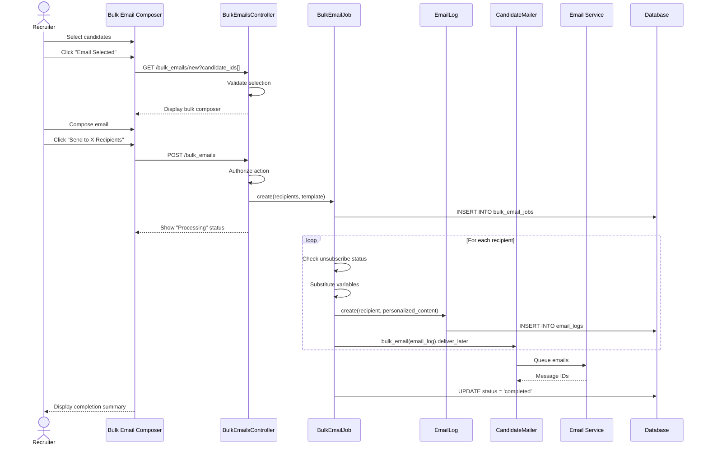

# UC-551: Send Bulk Email

## Metadata

| Attribute | Value |
|-----------|-------|
| **ID** | UC-551 |
| **Name** | Send Bulk Email |
| **Functional Area** | Communication & Notifications |
| **Primary Actor** | Recruiter (ACT-02) |
| **Priority** | P2 |
| **Complexity** | Medium |
| **Status** | Draft |

## Description

A recruiter sends the same email to multiple candidates simultaneously. The system personalizes each email using template variables, respects individual unsubscribe preferences, and tracks delivery and engagement for each recipient separately. Bulk emails are processed asynchronously to handle large recipient lists.

## Actors

| Actor | Role in Use Case |
|-------|------------------|
| Recruiter (ACT-02) | Selects recipients and composes the bulk email |
| Hiring Manager (ACT-03) | May initiate bulk emails for their job's candidates |
| Candidate (ACT-07) | Receives the personalized email |
| Notification Engine (ACT-13) | Processes and delivers emails |
| Scheduler (ACT-11) | Processes bulk email jobs asynchronously |

## Preconditions

- [ ] User is authenticated and has Recruiter, Hiring Manager, or Admin role
- [ ] At least one candidate is selected for emailing
- [ ] Organization has email sending enabled
- [ ] User has permission to view all selected candidates

## Postconditions

### Success
- [ ] BulkEmailJob record created to track the batch
- [ ] Individual EmailLog record created for each recipient
- [ ] Emails personalized and queued for each eligible recipient
- [ ] Skipped recipients logged (unsubscribed, invalid email)
- [ ] Audit log entry created

### Failure
- [ ] BulkEmailJob marked as failed
- [ ] Partial sends tracked (some may succeed, some fail)
- [ ] User notified of failures

## Triggers

- Recruiter selects multiple candidates and clicks "Email Selected"
- Recruiter clicks "Email All" from filtered candidate list
- Recruiter chooses "Send Bulk Email" from pipeline view

## Basic Flow



| Step | Actor | Action | System Response |
|------|-------|--------|-----------------|
| 1 | Recruiter | Selects multiple candidates from list | Candidates marked as selected |
| 2 | Recruiter | Clicks "Email Selected" | System validates selection |
| 3 | System | Counts eligible recipients | Shows count and any exclusions |
| 4 | System | Displays bulk email composer | Form with template selector |
| 5 | Recruiter | Selects email template (optional) | Template content loaded |
| 6 | Recruiter | Edits subject and body | Content updated |
| 7 | Recruiter | Reviews recipient preview | Sample personalization shown |
| 8 | Recruiter | Clicks "Send to X Recipients" | System validates content |
| 9 | System | Creates BulkEmailJob record | Job queued for processing |
| 10 | System | Shows processing indicator | "Sending to X recipients..." |
| 11 | System | Processes each recipient | Individual emails created |
| 12 | System | Sends emails via service | Emails dispatched |
| 13 | System | Updates job status | Status = 'completed' |
| 14 | System | Shows completion summary | "Sent: X, Skipped: Y, Failed: Z" |

## Alternative Flows

### AF-1: Preview Before Send

**Trigger:** Recruiter clicks "Preview" at step 7

| Step | Actor | Action | System Response |
|------|-------|--------|-----------------|
| 7a | Recruiter | Clicks "Preview" | Preview modal opens |
| 7b | System | Shows first recipient's personalized email | Full email rendered |
| 7c | Recruiter | Navigates through recipients | Previous/Next buttons |
| 7d | Recruiter | Confirms preview | Returns to composer |

**Resumption:** Returns to step 8 of basic flow

### AF-2: Schedule Bulk Send

**Trigger:** Recruiter wants to send at a specific time

| Step | Actor | Action | System Response |
|------|-------|--------|-----------------|
| 8a | Recruiter | Clicks "Schedule Send" | Date/time picker shown |
| 8b | Recruiter | Selects send date/time | Time captured |
| 8c | Recruiter | Clicks "Schedule" | BulkEmailJob scheduled |
| 8d | System | Creates job with scheduled_at | Job saved |

**Resumption:** Use case ends; job will execute at scheduled time

### AF-3: Send to Filtered Results

**Trigger:** Recruiter wants to email all candidates matching a filter

| Step | Actor | Action | System Response |
|------|-------|--------|-----------------|
| 1a | Recruiter | Applies filters to candidate list | Filtered list displayed |
| 2a | Recruiter | Clicks "Email All (X matches)" | Selection captured |
| 3a | System | Stores filter criteria with job | For audit trail |

**Resumption:** Returns to step 3 of basic flow

## Exception Flows

### EF-1: Recipient Limit Exceeded

**Trigger:** Selection exceeds maximum recipients at step 3

| Step | Actor | Action | System Response |
|------|-------|--------|-----------------|
| 3.1 | System | Detects selection > limit | Warning displayed |
| 3.2 | System | Shows limit (e.g., 500) | "Maximum 500 recipients per batch" |
| 3.3 | Recruiter | Reduces selection | Updates selection |

**Resolution:** Returns to step 3

### EF-2: All Recipients Ineligible

**Trigger:** All selected candidates are unsubscribed or invalid

| Step | Actor | Action | System Response |
|------|-------|--------|-----------------|
| 3.1 | System | Checks eligibility | All ineligible |
| 3.2 | System | Displays error | "No eligible recipients" |
| 3.3 | System | Shows reasons | Lists why each excluded |

**Resolution:** Use case ends, no email sent

### EF-3: Partial Failure

**Trigger:** Some emails fail to send during processing

| Step | Actor | Action | System Response |
|------|-------|--------|-----------------|
| 12.1 | System | Detects partial failures | Continues processing others |
| 12.2 | System | Logs failures with reasons | Error details stored |
| 14.1 | System | Shows partial success summary | "Sent: X, Failed: Y" |
| 14.2 | System | Offers retry for failures | "Retry Failed" button |

**Resolution:** User can retry failed sends

## Business Rules

| ID | Rule | Description |
|----|------|-------------|
| BR-551.1 | Recipient Limit | Maximum 500 recipients per bulk email batch |
| BR-551.2 | Unsubscribe Check | Skip candidates who have unsubscribed from emails |
| BR-551.3 | Valid Email Required | Skip candidates with invalid or missing email |
| BR-551.4 | Personalization Required | Each email must be personalized with recipient name at minimum |
| BR-551.5 | Rate Limiting | Spread delivery over time if > 100 recipients (anti-spam) |
| BR-551.6 | Duplicate Prevention | Same email cannot be sent to same recipient within 24 hours |
| BR-551.7 | Unsubscribe Link | Must include unsubscribe link in all bulk emails |

## Data Requirements

### Input Data

| Field | Type | Required | Validation |
|-------|------|----------|------------|
| candidate_ids | integer[] | Yes | All must exist in organization |
| subject | string | Yes | Max 255 chars, not blank |
| body | text | Yes | Max 100,000 chars, not blank |
| template_id | integer | No | Must exist and be active |
| scheduled_at | datetime | No | Must be in future |
| filter_criteria | json | No | If using filtered selection |

### Output Data

| Field | Type | Description |
|-------|------|-------------|
| bulk_email_job_id | integer | Unique identifier for batch |
| total_recipients | integer | Number of selected recipients |
| sent_count | integer | Successfully sent |
| skipped_count | integer | Skipped (unsubscribed, invalid) |
| failed_count | integer | Failed to send |
| status | enum | pending, processing, completed, failed |

## Database Transactions

### Tables Affected

| Table | Operation | Conditions |
|-------|-----------|------------|
| bulk_email_jobs | CREATE | Always |
| bulk_email_jobs | UPDATE | Status changes |
| email_logs | CREATE | Per eligible recipient |
| audit_logs | CREATE | Always |

### Transaction Detail

```sql
-- Create Bulk Email Job
BEGIN TRANSACTION;

-- Step 1: Create bulk email job record
INSERT INTO bulk_email_jobs (
    organization_id,
    user_id,
    email_template_id,
    subject,
    body,
    recipient_count,
    status,
    scheduled_at,
    filter_criteria,
    created_at,
    updated_at
) VALUES (
    @organization_id,
    @current_user_id,
    @template_id,
    @subject,
    @body,
    @total_recipients,
    'pending',
    @scheduled_at,
    @filter_criteria,
    NOW(),
    NOW()
);

SET @job_id = LAST_INSERT_ID();

-- Step 2: Store recipient list
INSERT INTO bulk_email_recipients (
    bulk_email_job_id,
    candidate_id,
    status,
    created_at
)
SELECT @job_id, id, 'pending', NOW()
FROM candidates
WHERE id IN (@candidate_ids)
  AND organization_id = @organization_id;

-- Step 3: Create audit log
INSERT INTO audit_logs (
    organization_id,
    user_id,
    action,
    auditable_type,
    auditable_id,
    metadata,
    created_at
) VALUES (
    @organization_id,
    @current_user_id,
    'bulk_email.created',
    'BulkEmailJob',
    @job_id,
    JSON_OBJECT(
        'recipient_count', @total_recipients,
        'template_id', @template_id
    ),
    NOW()
);

COMMIT;
```

### Background Job Processing

```sql
-- For each recipient in the batch
UPDATE bulk_email_recipients
SET status = 'processing'
WHERE bulk_email_job_id = @job_id AND candidate_id = @candidate_id;

-- Create individual email log
INSERT INTO email_logs (
    organization_id,
    bulk_email_job_id,
    recipient_type,
    recipient_id,
    recipient_email,
    subject,
    body,
    status,
    queued_at,
    created_at
) VALUES (
    @organization_id,
    @job_id,
    'Candidate',
    @candidate_id,
    @personalized_email,
    @personalized_subject,
    @personalized_body,
    'queued',
    NOW(),
    NOW()
);

-- Update recipient status
UPDATE bulk_email_recipients
SET status = 'sent', email_log_id = @email_log_id
WHERE bulk_email_job_id = @job_id AND candidate_id = @candidate_id;
```

### Rollback Scenarios

| Scenario | Rollback Action |
|----------|-----------------|
| Job creation failure | Full rollback, no job created |
| Partial send failure | Continue others, mark failures |
| Complete failure | Mark job as failed, allow retry |

## UI/UX Requirements

### Screen/Component

- **Location:** Modal or dedicated page for bulk email
- **Entry Point:** "Email Selected" from candidate list toolbar
- **Key Elements:**
  - Recipient count and eligibility summary
  - Template selector
  - Subject and body editors
  - Preview carousel
  - Send/Schedule toggle
  - Progress indicator during send

### Bulk Email Composer Layout

```
┌─────────────────────────────────────────────────────────┐
│ Send Bulk Email                                     [X] │
├─────────────────────────────────────────────────────────┤
│ Recipients: 45 selected                                 │
│ ├─ Eligible: 42 candidates                             │
│ ├─ Unsubscribed: 2 (will be skipped)                   │
│ └─ Invalid email: 1 (will be skipped)                  │
│                                                         │
│ Template: [Select template...                        ▼] │
│                                                         │
│ Subject:                                                │
│ ┌─────────────────────────────────────────────────────┐ │
│ │ Update on your {{job_title}} application            │ │
│ └─────────────────────────────────────────────────────┘ │
│                                                         │
│ Available variables: {{candidate_name}}, {{job_title}}, │
│ {{company_name}}, {{application_date}}                  │
│                                                         │
│ ┌─────────────────────────────────────────────────────┐ │
│ │ [B] [I] [U] [Link] [List]                          │ │
│ ├─────────────────────────────────────────────────────┤ │
│ │ Dear {{candidate_first_name}},                      │ │
│ │                                                     │ │
│ │ Thank you for your interest in the {{job_title}}   │ │
│ │ position at {{company_name}}...                    │ │
│ │                                                     │ │
│ └─────────────────────────────────────────────────────┘ │
│                                                         │
│ [Preview Email →]                                       │
│                                                         │
│ ○ Send Now    ○ Schedule for: [Date/Time Picker]       │
│                                                         │
├─────────────────────────────────────────────────────────┤
│              [Cancel]    [Send to 42 Recipients]        │
└─────────────────────────────────────────────────────────┘
```

### Progress Display

```
┌─────────────────────────────────────────────────────────┐
│ Sending Bulk Email...                                   │
├─────────────────────────────────────────────────────────┤
│                                                         │
│ ████████████████████░░░░░░░░░░  67%                    │
│                                                         │
│ Sent: 28 of 42                                         │
│ Processing: 3                                           │
│ Remaining: 11                                           │
│                                                         │
│ [Cancel Remaining]                                      │
└─────────────────────────────────────────────────────────┘
```

### Wireframe Reference

`/designs/wireframes/UC-551-bulk-email-composer.png`

## Non-Functional Requirements

| Requirement | Target |
|-------------|--------|
| Response Time | Job creation < 2s |
| Processing Rate | 50 emails per minute |
| Max Recipients | 500 per batch |
| Retry Logic | 3 retries per failed email |

## Security Considerations

- [x] Authentication required
- [x] Authorization check: User must have bulk email permission
- [x] Organization scoping: Can only email candidates in own organization
- [x] Rate limiting: Prevent spam abuse
- [x] Audit logging: All bulk emails logged with sender and recipients

## Related Use Cases

| Use Case | Relationship |
|----------|--------------|
| UC-550 Send Email to Candidate | Individual send alternative |
| UC-552 Schedule Email | Scheduling capability |
| UC-557 View Email History | View bulk email results |
| UC-558 Track Email Engagement | Aggregate engagement metrics |
| UC-507 Configure Email Templates | Templates used in bulk sends |

---

## Data Model References

> Cross-references to [DATA_MODEL.md](../DATA_MODEL.md) and [CRUD_MATRIX.md](../CRUD_MATRIX.md)

### Subject Areas

| Subject Area | ID | Relationship |
|--------------|-----|--------------|
| Communication | SA-10 | Primary |
| Candidate | SA-04 | Secondary |
| Compliance & Audit | SA-09 | Reference |

### Entities CRUD

| Entity | C | R | U | D | Notes |
|--------|---|---|---|---|-------|
| BulkEmailJob | ✓ | ✓ | ✓ | | Created and updated during processing |
| BulkEmailRecipient | ✓ | ✓ | ✓ | | Per-recipient tracking |
| EmailLog | ✓ | | | | Created per sent email |
| EmailTemplate | | ✓ | | | Read when template selected |
| Candidate | | ✓ | | | Read for recipients |
| AuditLog | ✓ | | | | Created for batch |

**Legend:** C = Create, R = Read, U = Update, D = Delete

---

## Process Model References

> Cross-references to [PROCESS_MODEL.md](../PROCESS_MODEL.md) and [PROCESS_CRUD_MATRIX.md](../PROCESS_CRUD_MATRIX.md)

| Attribute | Value | Link |
|-----------|-------|------|
| **Elementary Business Process** | EP-1002: Send Bulk Email | [PROCESS_MODEL.md#ep-1002](../PROCESS_MODEL.md#ep-1002-send-bulk-email) |
| **Business Process** | BP-501: Candidate Communication | [PROCESS_MODEL.md#bp-501](../PROCESS_MODEL.md#bp-501-candidate-communication) |
| **Business Function** | BF-05: Communication Management | [PROCESS_MODEL.md#bf-05](../PROCESS_MODEL.md#bf-05-communication-management) |

### EBP Details

| Attribute | Value |
|-----------|-------|
| **Trigger** | Recruiter selects multiple candidates and initiates bulk email |
| **Input** | Recipient list, subject, body, optional template |
| **Output** | BulkEmailJob record, individual EmailLog records per recipient |
| **Business Rules** | BR-551.1 through BR-551.7 (see Business Rules section) |

---

## Traceability Matrix

> Complete artifact mapping for requirements traceability

| Artifact Type | ID | Name | Link |
|---------------|-----|------|------|
| **Use Case** | UC-551 | Send Bulk Email | *(this document)* |
| **Elementary Process** | EP-1002 | Send Bulk Email | [PROCESS_MODEL.md](../PROCESS_MODEL.md#ep-1002-send-bulk-email) |
| **Business Process** | BP-501 | Candidate Communication | [PROCESS_MODEL.md](../PROCESS_MODEL.md#bp-501-candidate-communication) |
| **Business Function** | BF-05 | Communication Management | [PROCESS_MODEL.md](../PROCESS_MODEL.md#bf-05-communication-management) |
| **Primary Actor** | ACT-02 | Recruiter | [ACTORS.md](../ACTORS.md#act-02-recruiter) |
| **Subject Area (Primary)** | SA-10 | Communication | [DATA_MODEL.md](../DATA_MODEL.md#sa-10-communication) |
| **Subject Area (Secondary)** | SA-04 | Candidate | [DATA_MODEL.md](../DATA_MODEL.md#sa-04-candidate) |
| **CRUD Matrix Row** | UC-551 | - | [CRUD_MATRIX.md](../CRUD_MATRIX.md#uc-551) |
| **Process CRUD Row** | EP-1002 | - | [PROCESS_CRUD_MATRIX.md](../PROCESS_CRUD_MATRIX.md#ep-1002) |

### Implementation Artifacts

| Artifact Type | Path/Reference | Status |
|---------------|----------------|--------|
| Controller | `app/controllers/admin/bulk_emails_controller.rb` | Planned |
| Model | `app/models/bulk_email_job.rb` | Planned |
| Job | `app/jobs/bulk_email_job.rb` | Planned |
| Service | `app/services/emails/send_bulk_email_service.rb` | Planned |
| Policy | `app/policies/bulk_email_job_policy.rb` | Planned |
| View | `app/views/admin/bulk_emails/new.html.erb` | Planned |
| Test | `test/controllers/admin/bulk_emails_controller_test.rb` | Planned |

---

## Open Questions

1. Should we support sending bulk emails across multiple jobs?
2. What is the ideal batch size for processing to balance speed and deliverability?
3. Should we integrate with a dedicated email marketing platform for very large sends?

## Change History

| Version | Date | Author | Changes |
|---------|------|--------|---------|
| 0.1 | 2026-01-25 | System | Initial draft |
