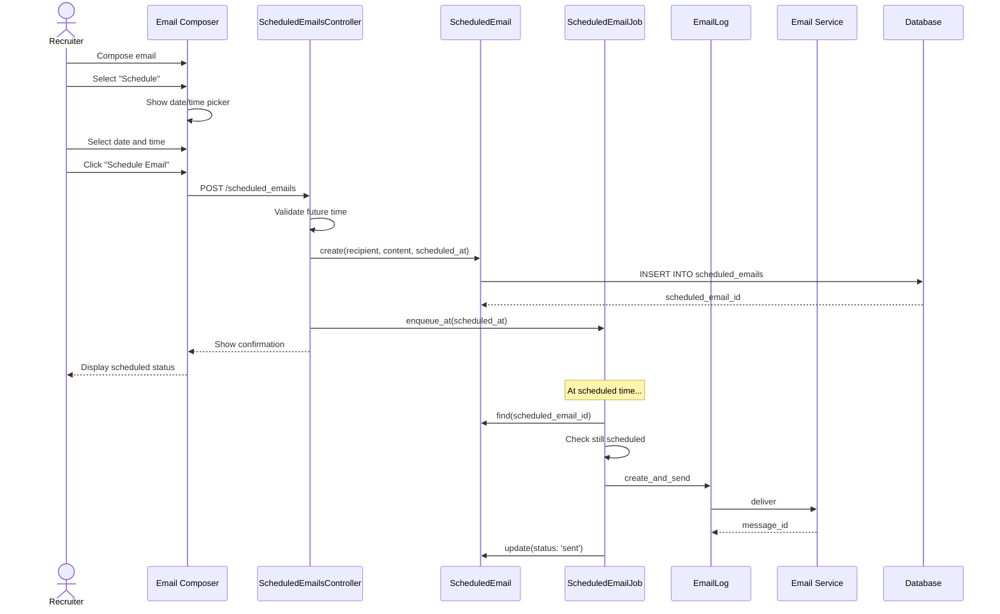

# UC-552: Schedule Email

## Metadata

| Attribute | Value |
|-----------|-------|
| **ID** | UC-552 |
| **Name** | Schedule Email |
| **Functional Area** | Communication & Notifications |
| **Primary Actor** | Recruiter (ACT-02) |
| **Priority** | P2 |
| **Complexity** | Low |
| **Status** | Draft |

## Description

A recruiter composes an email and schedules it for future delivery at a specific date and time. The scheduled email can be edited or cancelled before it sends. The system processes scheduled emails at the designated time, respecting the recipient's timezone and unsubscribe preferences.

## Actors

| Actor | Role in Use Case |
|-------|------------------|
| Recruiter (ACT-02) | Composes and schedules the email |
| Candidate (ACT-07) | Receives the email at scheduled time |
| Scheduler (ACT-11) | Triggers email delivery at scheduled time |
| Notification Engine (ACT-13) | Delivers the email |

## Preconditions

- [ ] User is authenticated and has Recruiter, Hiring Manager, or Admin role
- [ ] Candidate record exists with a valid email address
- [ ] Organization has email sending enabled
- [ ] Scheduled time is in the future

## Postconditions

### Success
- [ ] ScheduledEmail record created with status = 'scheduled'
- [ ] Email delivered at the scheduled time
- [ ] EmailLog record created when sent
- [ ] Audit log entry created

### Failure
- [ ] ScheduledEmail remains in 'scheduled' status (if cancelled)
- [ ] ScheduledEmail marked 'failed' if delivery fails
- [ ] User notified of failure

## Triggers

- Recruiter clicks "Schedule" instead of "Send" in email composer
- Recruiter selects "Schedule for Later" from email options
- Recruiter edits an existing scheduled email

## Basic Flow



| Step | Actor | Action | System Response |
|------|-------|--------|-----------------|
| 1 | Recruiter | Opens email composer | Composer displayed |
| 2 | Recruiter | Composes email (subject, body) | Content captured |
| 3 | Recruiter | Clicks "Schedule" toggle/button | Date/time picker appears |
| 4 | Recruiter | Selects date | Date captured |
| 5 | Recruiter | Selects time | Time captured |
| 6 | Recruiter | Selects timezone (or uses default) | Timezone confirmed |
| 7 | Recruiter | Clicks "Schedule Email" | System validates input |
| 8 | System | Validates scheduled time is in future | Validation passes |
| 9 | System | Creates ScheduledEmail record | Record saved |
| 10 | System | Schedules background job | Job enqueued |
| 11 | System | Shows confirmation | "Email scheduled for [date/time]" |
| 12 | System (later) | Executes job at scheduled time | Email prepared |
| 13 | System | Sends email | Email delivered |
| 14 | System | Updates scheduled email status | Status = 'sent' |

## Alternative Flows

### AF-1: Edit Scheduled Email

**Trigger:** Recruiter wants to modify a scheduled email before it sends

| Step | Actor | Action | System Response |
|------|-------|--------|-----------------|
| 1a | Recruiter | Views scheduled emails list | List displayed |
| 2a | Recruiter | Clicks "Edit" on scheduled email | Editor opens with content |
| 3a | Recruiter | Modifies content or time | Changes captured |
| 4a | Recruiter | Clicks "Update Schedule" | System validates |
| 5a | System | Updates ScheduledEmail record | Changes saved |
| 6a | System | Reschedules background job | New job time set |

**Resumption:** Use case ends

### AF-2: Cancel Scheduled Email

**Trigger:** Recruiter no longer wants to send the email

| Step | Actor | Action | System Response |
|------|-------|--------|-----------------|
| 1b | Recruiter | Views scheduled emails list | List displayed |
| 2b | Recruiter | Clicks "Cancel" on scheduled email | Confirmation dialog |
| 3b | Recruiter | Confirms cancellation | System processes |
| 4b | System | Updates status to 'cancelled' | Record updated |
| 5b | System | Removes scheduled job | Job dequeued |
| 6b | System | Shows confirmation | "Email cancelled" |

**Resumption:** Use case ends

### AF-3: Use Recipient's Timezone

**Trigger:** Organization prefers sending emails in recipient's local time

| Step | Actor | Action | System Response |
|------|-------|--------|-----------------|
| 6a | Recruiter | Selects "Send in recipient's timezone" | Option enabled |
| 7a | System | Calculates actual send time per recipient | For bulk: varies |
| 8a | System | Displays estimated delivery window | Shows range |

**Resumption:** Returns to step 7 of basic flow

### AF-4: Quick Schedule Options

**Trigger:** Recruiter uses a preset scheduling option

| Step | Actor | Action | System Response |
|------|-------|--------|-----------------|
| 4a | Recruiter | Clicks "Tomorrow morning" | Date/time auto-filled |
| 4b | Recruiter | Clicks "Next Monday 9 AM" | Date/time auto-filled |
| 4c | Recruiter | Clicks "In 2 hours" | Date/time auto-filled |

**Resumption:** Returns to step 7 of basic flow

## Exception Flows

### EF-1: Past Time Selected

**Trigger:** Selected schedule time is in the past

| Step | Actor | Action | System Response |
|------|-------|--------|-----------------|
| 8.1 | System | Detects past time | Error displayed |
| 8.2 | System | Highlights time field | "Must be a future time" |
| 8.3 | Recruiter | Selects valid future time | Time updated |

**Resolution:** Returns to step 8

### EF-2: Recipient Unsubscribed Before Send

**Trigger:** Candidate unsubscribes between scheduling and send time

| Step | Actor | Action | System Response |
|------|-------|--------|-----------------|
| 12.1 | System | Checks unsubscribe status at send time | Unsubscribed detected |
| 12.2 | System | Cancels the send | Status = 'cancelled' |
| 12.3 | System | Notifies scheduler | Reason logged |
| 12.4 | System | Notifies recruiter (optional) | Alert displayed |

**Resolution:** Email not sent

### EF-3: Candidate Deleted Before Send

**Trigger:** Candidate record removed between scheduling and send time

| Step | Actor | Action | System Response |
|------|-------|--------|-----------------|
| 12.1 | System | Cannot find recipient | Record not found |
| 12.2 | System | Marks as failed | Status = 'failed' |
| 12.3 | System | Logs error reason | "Recipient not found" |

**Resolution:** Email not sent, logged for review

## Business Rules

| ID | Rule | Description |
|----|------|-------------|
| BR-552.1 | Future Time | Scheduled time must be at least 5 minutes in the future |
| BR-552.2 | Maximum Schedule | Cannot schedule more than 1 year in advance |
| BR-552.3 | Edit Window | Scheduled emails can be edited up to 5 minutes before send time |
| BR-552.4 | Cancel Window | Scheduled emails can be cancelled up to 1 minute before send time |
| BR-552.5 | Timezone Default | Uses organization timezone if recipient timezone unknown |
| BR-552.6 | Revalidation | Recipient eligibility re-checked at send time |
| BR-552.7 | Template Snapshot | Template content is captured at schedule time (not send time) |

## Data Requirements

### Input Data

| Field | Type | Required | Validation |
|-------|------|----------|------------|
| candidate_id | integer | Yes | Must exist in organization |
| subject | string | Yes | Max 255 chars, not blank |
| body | text | Yes | Max 100,000 chars, not blank |
| scheduled_at | datetime | Yes | Must be future, max 1 year |
| timezone | string | No | Valid IANA timezone |
| template_id | integer | No | Must exist and be active |
| use_recipient_timezone | boolean | No | Default false |

### Output Data

| Field | Type | Description |
|-------|------|-------------|
| scheduled_email_id | integer | Unique identifier |
| status | enum | scheduled, sent, cancelled, failed |
| scheduled_at | datetime | When email will be sent |
| sent_at | datetime | When actually sent (after delivery) |

## Database Transactions

### Tables Affected

| Table | Operation | Conditions |
|-------|-----------|------------|
| scheduled_emails | CREATE | When scheduling |
| scheduled_emails | UPDATE | Status changes |
| email_logs | CREATE | When sent |
| audit_logs | CREATE | Always |

### Transaction Detail

```sql
-- Schedule Email Transaction
BEGIN TRANSACTION;

-- Step 1: Create scheduled email record
INSERT INTO scheduled_emails (
    organization_id,
    sender_id,
    recipient_type,
    recipient_id,
    recipient_email,
    email_template_id,
    subject,
    body,
    scheduled_at,
    timezone,
    use_recipient_timezone,
    status,
    created_at,
    updated_at
) VALUES (
    @organization_id,
    @current_user_id,
    'Candidate',
    @candidate_id,
    @candidate_email,
    @template_id,
    @subject,
    @body,
    @scheduled_at,
    @timezone,
    @use_recipient_timezone,
    'scheduled',
    NOW(),
    NOW()
);

SET @scheduled_email_id = LAST_INSERT_ID();

-- Step 2: Create audit log
INSERT INTO audit_logs (
    organization_id,
    user_id,
    action,
    auditable_type,
    auditable_id,
    metadata,
    created_at
) VALUES (
    @organization_id,
    @current_user_id,
    'email.scheduled',
    'ScheduledEmail',
    @scheduled_email_id,
    JSON_OBJECT(
        'recipient_id', @candidate_id,
        'scheduled_at', @scheduled_at
    ),
    NOW()
);

COMMIT;
```

### At Scheduled Time

```sql
-- When the scheduled job executes
BEGIN TRANSACTION;

-- Check status is still scheduled
SELECT * FROM scheduled_emails
WHERE id = @scheduled_email_id AND status = 'scheduled';

-- Create email log
INSERT INTO email_logs (
    organization_id,
    scheduled_email_id,
    recipient_type,
    recipient_id,
    recipient_email,
    subject,
    body,
    status,
    queued_at,
    created_at
) VALUES (
    @organization_id,
    @scheduled_email_id,
    'Candidate',
    @candidate_id,
    @recipient_email,
    @subject,
    @body,
    'queued',
    NOW(),
    NOW()
);

-- Update scheduled email status
UPDATE scheduled_emails
SET status = 'sent', sent_at = NOW(), updated_at = NOW()
WHERE id = @scheduled_email_id;

COMMIT;
```

### Rollback Scenarios

| Scenario | Rollback Action |
|----------|-----------------|
| Validation failure | No record created |
| Job scheduling failure | Rollback, show error |
| Send failure at scheduled time | Mark as failed, allow retry |

## UI/UX Requirements

### Screen/Component

- **Location:** Extension of email composer (UC-550)
- **Entry Point:** "Schedule" button in email composer
- **Key Elements:**
  - Date picker
  - Time picker
  - Timezone selector
  - Quick schedule presets
  - Scheduled emails list view

### Schedule Interface Layout

```
┌─────────────────────────────────────────────────────────┐
│ Schedule Email                                      [X] │
├─────────────────────────────────────────────────────────┤
│ To: john.smith@email.com                               │
│ Subject: Interview Follow-up                           │
│                                                         │
│ When to send:                                          │
│                                                         │
│ Quick options:                                          │
│ [Tomorrow 9 AM] [Tomorrow 2 PM] [Monday 9 AM] [Custom] │
│                                                         │
│ ─────────────── OR ───────────────                     │
│                                                         │
│ Date:           Time:            Timezone:              │
│ ┌───────────┐   ┌───────────┐    ┌─────────────────┐   │
│ │ Jan 28    │   │ 9:00 AM   │    │ America/New_York│   │
│ │    📅     │   │     🕐    │    │        ▼        │   │
│ └───────────┘   └───────────┘    └─────────────────┘   │
│                                                         │
│ ☐ Send in recipient's local timezone                   │
│                                                         │
│ Email will be sent on January 28, 2026 at 9:00 AM EST │
│                                                         │
├─────────────────────────────────────────────────────────┤
│                    [Cancel]    [Schedule Email]         │
└─────────────────────────────────────────────────────────┘
```

### Scheduled Emails List

```
┌─────────────────────────────────────────────────────────┐
│ Scheduled Emails                              [+ New]   │
├─────────────────────────────────────────────────────────┤
│ ┌─────────────────────────────────────────────────────┐ │
│ │ ○ To: John Smith                                    │ │
│ │   Subject: Interview Follow-up                     │ │
│ │   Scheduled: Jan 28, 2026 9:00 AM EST             │ │
│ │   [Edit] [Cancel]                                  │ │
│ └─────────────────────────────────────────────────────┘ │
│                                                         │
│ ┌─────────────────────────────────────────────────────┐ │
│ │ ○ To: Sarah Johnson                                │ │
│ │   Subject: Application Status Update               │ │
│ │   Scheduled: Jan 30, 2026 2:00 PM EST             │ │
│ │   [Edit] [Cancel]                                  │ │
│ └─────────────────────────────────────────────────────┘ │
│                                                         │
│ Showing 2 scheduled emails                              │
└─────────────────────────────────────────────────────────┘
```

### Wireframe Reference

`/designs/wireframes/UC-552-schedule-email.png`

## Non-Functional Requirements

| Requirement | Target |
|-------------|--------|
| Schedule Precision | Within 1 minute of scheduled time |
| Response Time | Schedule creation < 1s |
| Job Reliability | 99.99% scheduled jobs execute |
| Time Sync | Server time synchronized via NTP |

## Security Considerations

- [x] Authentication required
- [x] Authorization check: Only scheduler can edit/cancel their own emails
- [x] Organization scoping: Cannot schedule for candidates in other orgs
- [x] Audit logging: Schedule creation, edits, cancellations logged
- [x] Data integrity: Snapshot content at schedule time

## Related Use Cases

| Use Case | Relationship |
|----------|--------------|
| UC-550 Send Email to Candidate | Immediate send alternative |
| UC-551 Send Bulk Email | Bulk scheduling capability |
| UC-553 Create Email Sequence | Sequences use scheduled emails |
| UC-557 View Email History | View sent scheduled emails |

---

## Data Model References

> Cross-references to [DATA_MODEL.md](../DATA_MODEL.md) and [CRUD_MATRIX.md](../CRUD_MATRIX.md)

### Subject Areas

| Subject Area | ID | Relationship |
|--------------|-----|--------------|
| Communication | SA-10 | Primary |
| Candidate | SA-04 | Secondary |

### Entities CRUD

| Entity | C | R | U | D | Notes |
|--------|---|---|---|---|-------|
| ScheduledEmail | ✓ | ✓ | ✓ | | Created, viewed, edited, status updates |
| EmailLog | ✓ | | | | Created when scheduled email sends |
| EmailTemplate | | ✓ | | | Read for content |
| Candidate | | ✓ | | | Read for recipient info |
| AuditLog | ✓ | | | | Created for all actions |

**Legend:** C = Create, R = Read, U = Update, D = Delete

---

## Process Model References

> Cross-references to [PROCESS_MODEL.md](../PROCESS_MODEL.md) and [PROCESS_CRUD_MATRIX.md](../PROCESS_CRUD_MATRIX.md)

| Attribute | Value | Link |
|-----------|-------|------|
| **Elementary Business Process** | EP-1003: Schedule Email | [PROCESS_MODEL.md#ep-1003](../PROCESS_MODEL.md#ep-1003-schedule-email) |
| **Business Process** | BP-501: Candidate Communication | [PROCESS_MODEL.md#bp-501](../PROCESS_MODEL.md#bp-501-candidate-communication) |
| **Business Function** | BF-05: Communication Management | [PROCESS_MODEL.md#bf-05](../PROCESS_MODEL.md#bf-05-communication-management) |

### EBP Details

| Attribute | Value |
|-----------|-------|
| **Trigger** | Recruiter schedules email for future delivery |
| **Input** | Recipient, content, scheduled date/time, timezone |
| **Output** | ScheduledEmail record, eventual EmailLog when sent |
| **Business Rules** | BR-552.1 through BR-552.7 (see Business Rules section) |

---

## Traceability Matrix

> Complete artifact mapping for requirements traceability

| Artifact Type | ID | Name | Link |
|---------------|-----|------|------|
| **Use Case** | UC-552 | Schedule Email | *(this document)* |
| **Elementary Process** | EP-1003 | Schedule Email | [PROCESS_MODEL.md](../PROCESS_MODEL.md#ep-1003-schedule-email) |
| **Business Process** | BP-501 | Candidate Communication | [PROCESS_MODEL.md](../PROCESS_MODEL.md#bp-501-candidate-communication) |
| **Business Function** | BF-05 | Communication Management | [PROCESS_MODEL.md](../PROCESS_MODEL.md#bf-05-communication-management) |
| **Primary Actor** | ACT-02 | Recruiter | [ACTORS.md](../ACTORS.md#act-02-recruiter) |
| **Subject Area (Primary)** | SA-10 | Communication | [DATA_MODEL.md](../DATA_MODEL.md#sa-10-communication) |
| **Subject Area (Secondary)** | SA-04 | Candidate | [DATA_MODEL.md](../DATA_MODEL.md#sa-04-candidate) |
| **CRUD Matrix Row** | UC-552 | - | [CRUD_MATRIX.md](../CRUD_MATRIX.md#uc-552) |
| **Process CRUD Row** | EP-1003 | - | [PROCESS_CRUD_MATRIX.md](../PROCESS_CRUD_MATRIX.md#ep-1003) |

### Implementation Artifacts

| Artifact Type | Path/Reference | Status |
|---------------|----------------|--------|
| Controller | `app/controllers/admin/scheduled_emails_controller.rb` | Planned |
| Model | `app/models/scheduled_email.rb` | Planned |
| Job | `app/jobs/scheduled_email_job.rb` | Planned |
| Service | `app/services/emails/schedule_email_service.rb` | Planned |
| Policy | `app/policies/scheduled_email_policy.rb` | Planned |
| View | `app/views/admin/scheduled_emails/index.html.erb` | Planned |
| Test | `test/controllers/admin/scheduled_emails_controller_test.rb` | Planned |

---

## Open Questions

1. Should we support recurring scheduled emails (e.g., weekly digest)?
2. How should we handle daylight saving time transitions?
3. Should scheduled emails have an expiration (auto-cancel if not sent within X days)?

## Change History

| Version | Date | Author | Changes |
|---------|------|--------|---------|
| 0.1 | 2026-01-25 | System | Initial draft |
