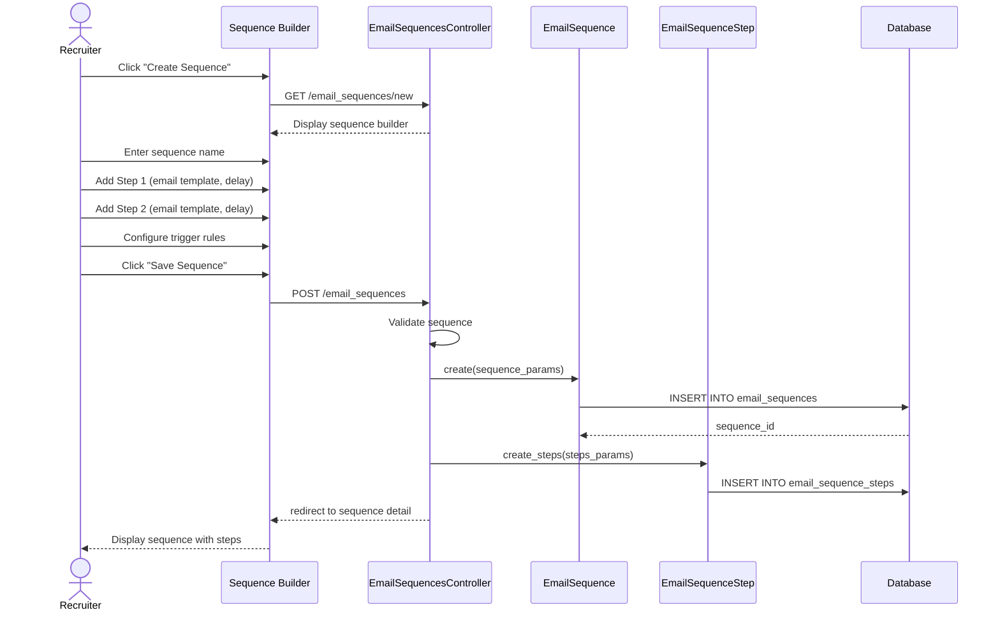

# UC-553: Create Email Sequence

## Metadata

| Attribute | Value |
|-----------|-------|
| **ID** | UC-553 |
| **Name** | Create Email Sequence |
| **Functional Area** | Communication & Notifications |
| **Primary Actor** | Recruiter (ACT-02) |
| **Priority** | P2 |
| **Complexity** | High |
| **Status** | Draft |

## Description

A recruiter creates an automated email sequence (drip campaign) that sends a series of emails to candidates over time. Each step in the sequence has a configurable delay and conditions. Candidates can be enrolled manually or automatically based on triggers like stage changes or application events.

## Actors

| Actor | Role in Use Case |
|-------|------------------|
| Recruiter (ACT-02) | Creates and configures the email sequence |
| System Administrator (ACT-01) | Sets organization-level sequence limits |
| Candidate (ACT-07) | Receives sequence emails |
| Scheduler (ACT-11) | Executes sequence steps at scheduled times |
| Notification Engine (ACT-13) | Delivers sequence emails |

## Preconditions

- [ ] User is authenticated and has Recruiter or Admin role
- [ ] Organization has email automation feature enabled
- [ ] At least one email template exists (optional but typical)

## Postconditions

### Success
- [ ] EmailSequence record created with status = 'draft' or 'active'
- [ ] EmailSequenceStep records created for each step
- [ ] Trigger rules configured (if automatic enrollment)
- [ ] Audit log entry created

### Failure
- [ ] No sequence created
- [ ] User shown validation errors

## Triggers

- Recruiter clicks "Create Sequence" from automation menu
- Recruiter clicks "New Email Sequence" from sequences list
- Recruiter clones an existing sequence

## Basic Flow



| Step | Actor | Action | System Response |
|------|-------|--------|-----------------|
| 1 | Recruiter | Clicks "Create Sequence" | Sequence builder displayed |
| 2 | Recruiter | Enters sequence name | Name field populated |
| 3 | Recruiter | Enters sequence description | Description captured |
| 4 | Recruiter | Clicks "Add Step" | Step editor appears |
| 5 | Recruiter | Selects email template for step | Template content loaded |
| 6 | Recruiter | Sets delay (e.g., "3 days after previous") | Delay configured |
| 7 | Recruiter | Optionally edits step email content | Content customized |
| 8 | Recruiter | Adds additional steps | More steps added |
| 9 | Recruiter | Configures enrollment trigger | Trigger rules set |
| 10 | Recruiter | Sets exit conditions | Exit rules configured |
| 11 | Recruiter | Clicks "Save as Draft" or "Activate" | System validates |
| 12 | System | Validates sequence structure | Validation passes |
| 13 | System | Creates EmailSequence and steps | Records saved |
| 14 | System | Creates audit log entry | Audit recorded |
| 15 | System | Shows sequence detail | Sequence displayed |

## Alternative Flows

### AF-1: Activate Immediately

**Trigger:** Recruiter clicks "Activate" instead of "Save as Draft" at step 11

| Step | Actor | Action | System Response |
|------|-------|--------|-----------------|
| 11a | Recruiter | Clicks "Activate" | System validates sequence |
| 12a | System | Creates sequence with status='active' | Sequence activated |
| 13a | System | Enables trigger processing | Triggers now fire |
| 14a | System | Shows active indicator | Green "Active" badge |

**Resumption:** Use case ends

### AF-2: Clone Existing Sequence

**Trigger:** Recruiter clones an existing sequence

| Step | Actor | Action | System Response |
|------|-------|--------|-----------------|
| 1a | Recruiter | Clicks "Clone" on existing sequence | System copies sequence |
| 2a | System | Creates draft with "(Copy)" appended | Copy created |
| 3a | System | Opens sequence for editing | Builder pre-populated |
| 4a | Recruiter | Modifies as needed | Changes captured |

**Resumption:** Returns to step 11 of basic flow

### AF-3: Add Conditional Step

**Trigger:** Recruiter wants step to only send if condition met

| Step | Actor | Action | System Response |
|------|-------|--------|-----------------|
| 6a | Recruiter | Clicks "Add Condition" on step | Condition builder shown |
| 6b | Recruiter | Selects condition type | Options displayed |
| 6c | Recruiter | Configures condition (e.g., "if no reply") | Condition saved |
| 6d | Recruiter | Optionally adds "else" path | Branch created |

**Resumption:** Returns to step 7 of basic flow

### AF-4: Set Job-Specific Sequence

**Trigger:** Sequence should only apply to specific jobs

| Step | Actor | Action | System Response |
|------|-------|--------|-----------------|
| 9a | Recruiter | Selects "Specific jobs only" | Job selector appears |
| 9b | Recruiter | Selects applicable jobs | Jobs associated |
| 9c | System | Limits trigger to selected jobs | Scope restricted |

**Resumption:** Returns to step 10 of basic flow

## Exception Flows

### EF-1: Empty Sequence

**Trigger:** Recruiter tries to save sequence with no steps

| Step | Actor | Action | System Response |
|------|-------|--------|-----------------|
| 12.1 | System | Detects zero steps | Error displayed |
| 12.2 | System | Shows error message | "At least one step required" |
| 12.3 | Recruiter | Adds step | Step created |

**Resolution:** Returns to step 12

### EF-2: Circular Trigger Detected

**Trigger:** Sequence would trigger itself infinitely

| Step | Actor | Action | System Response |
|------|-------|--------|-----------------|
| 12.1 | System | Detects potential loop | Warning displayed |
| 12.2 | System | Shows explanation | "This could cause infinite loop" |
| 12.3 | Recruiter | Modifies trigger/exit rules | Configuration updated |

**Resolution:** Returns to step 12

### EF-3: Invalid Template Reference

**Trigger:** Referenced template has been deleted or deactivated

| Step | Actor | Action | System Response |
|------|-------|--------|-----------------|
| 12.1 | System | Detects invalid template | Error highlighted |
| 12.2 | System | Shows affected steps | Steps marked |
| 12.3 | Recruiter | Selects different template | Template updated |

**Resolution:** Returns to step 12

## Business Rules

| ID | Rule | Description |
|----|------|-------------|
| BR-553.1 | Minimum Steps | Sequence must have at least one step |
| BR-553.2 | Maximum Steps | Sequence cannot exceed 20 steps |
| BR-553.3 | Delay Minimum | Minimum delay between steps is 1 hour |
| BR-553.4 | Delay Maximum | Maximum delay between steps is 90 days |
| BR-553.5 | Active Limit | Organization can have max 50 active sequences |
| BR-553.6 | Single Enrollment | Candidate can only be in each sequence once (unless re-enrolled) |
| BR-553.7 | Exit on Action | Candidates auto-exit on reply, unsubscribe, or hire |
| BR-553.8 | Business Hours | Option to only send during business hours |

## Data Requirements

### Input Data

| Field | Type | Required | Validation |
|-------|------|----------|------------|
| name | string | Yes | Max 255 chars, unique in org |
| description | text | No | Max 5000 chars |
| status | enum | No | draft, active, paused (default: draft) |
| trigger_type | enum | Yes | manual, stage_change, application_event, scheduled |
| trigger_config | json | Conditional | Required if not manual |
| exit_conditions | json | No | Array of exit conditions |
| job_ids | integer[] | No | Restrict to specific jobs |
| send_window | json | No | Business hours configuration |
| steps | array | Yes | At least one step |

### Step Input Data

| Field | Type | Required | Validation |
|-------|------|----------|------------|
| position | integer | Yes | Order in sequence |
| email_template_id | integer | No | Template to use |
| subject | string | Yes | If no template |
| body | text | Yes | If no template |
| delay_value | integer | Yes | Amount of delay |
| delay_unit | enum | Yes | hours, days, weeks |
| conditions | json | No | Step execution conditions |

### Output Data

| Field | Type | Description |
|-------|------|-------------|
| sequence_id | integer | Unique identifier |
| step_count | integer | Number of steps |
| status | enum | Current status |
| enrolled_count | integer | Active enrollments |

## Database Transactions

### Tables Affected

| Table | Operation | Conditions |
|-------|-----------|------------|
| email_sequences | CREATE | Always |
| email_sequence_steps | CREATE | Per step |
| email_sequence_triggers | CREATE | If auto-trigger |
| email_sequence_jobs | CREATE | If job-specific |
| audit_logs | CREATE | Always |

### Transaction Detail

```sql
-- Create Email Sequence Transaction
BEGIN TRANSACTION;

-- Step 1: Create sequence record
INSERT INTO email_sequences (
    organization_id,
    name,
    description,
    status,
    trigger_type,
    trigger_config,
    exit_conditions,
    send_window,
    created_by_id,
    created_at,
    updated_at
) VALUES (
    @organization_id,
    @name,
    @description,
    @status,
    @trigger_type,
    @trigger_config,
    @exit_conditions,
    @send_window,
    @current_user_id,
    NOW(),
    NOW()
);

SET @sequence_id = LAST_INSERT_ID();

-- Step 2: Create sequence steps
INSERT INTO email_sequence_steps (
    email_sequence_id,
    position,
    email_template_id,
    subject,
    body,
    delay_value,
    delay_unit,
    conditions,
    created_at,
    updated_at
) VALUES
    (@sequence_id, 1, @template_id_1, @subject_1, @body_1, 0, 'hours', NULL, NOW(), NOW()),
    (@sequence_id, 2, @template_id_2, @subject_2, @body_2, 3, 'days', NULL, NOW(), NOW()),
    (@sequence_id, 3, @template_id_3, @subject_3, @body_3, 7, 'days', NULL, NOW(), NOW());

-- Step 3: Associate with specific jobs (if applicable)
INSERT INTO email_sequence_jobs (
    email_sequence_id,
    job_id,
    created_at
)
SELECT @sequence_id, job_id, NOW()
FROM (SELECT @job_id_1 AS job_id UNION SELECT @job_id_2) AS jobs;

-- Step 4: Create audit log
INSERT INTO audit_logs (
    organization_id,
    user_id,
    action,
    auditable_type,
    auditable_id,
    metadata,
    created_at
) VALUES (
    @organization_id,
    @current_user_id,
    'email_sequence.created',
    'EmailSequence',
    @sequence_id,
    JSON_OBJECT(
        'name', @name,
        'status', @status,
        'step_count', 3
    ),
    NOW()
);

COMMIT;
```

### Rollback Scenarios

| Scenario | Rollback Action |
|----------|-----------------|
| Validation failure | No transaction started |
| Step creation failure | Full rollback |
| Duplicate name | Return error, no changes |

## UI/UX Requirements

### Screen/Component

- **Location:** /admin/email_sequences/new
- **Entry Point:** "Create Sequence" from automation menu
- **Key Elements:**
  - Drag-and-drop step ordering
  - Visual timeline of sequence
  - Template selector per step
  - Delay configuration
  - Trigger configuration panel
  - Preview mode

### Sequence Builder Layout

```
┌─────────────────────────────────────────────────────────┐
│ Create Email Sequence                                   │
├─────────────────────────────────────────────────────────┤
│ Name: [Candidate Nurture Sequence                    ]  │
│                                                         │
│ Description:                                            │
│ [Follow-up sequence for candidates after application ]  │
│                                                         │
├─────────────────────────────────────────────────────────┤
│ TRIGGER                                                 │
│ ┌─────────────────────────────────────────────────────┐ │
│ │ When: [Application created              ▼]          │ │
│ │ For jobs: [All jobs] [Specific jobs...]            │ │
│ └─────────────────────────────────────────────────────┘ │
├─────────────────────────────────────────────────────────┤
│ SEQUENCE STEPS                                          │
│                                                         │
│  ●──────────────────────────────────────────────────●   │
│  │                                                   │   │
│  │  ┌──────────────────────────────────────────┐    │   │
│  ├─→│ Step 1: Welcome Email                    │    │   │
│  │  │ Template: Application Received           │    │   │
│  │  │ Send: Immediately                        │    │   │
│  │  │ [Edit] [Delete]                          │    │   │
│  │  └──────────────────────────────────────────┘    │   │
│  │                                                   │   │
│  │  ⏱ Wait 3 days                                   │   │
│  │                                                   │   │
│  │  ┌──────────────────────────────────────────┐    │   │
│  ├─→│ Step 2: Check-in Email                   │    │   │
│  │  │ Template: Application Check-in           │    │   │
│  │  │ Send: 3 days after previous              │    │   │
│  │  │ Condition: If no reply to Step 1         │    │   │
│  │  │ [Edit] [Delete]                          │    │   │
│  │  └──────────────────────────────────────────┘    │   │
│  │                                                   │   │
│  │  ⏱ Wait 7 days                                   │   │
│  │                                                   │   │
│  │  ┌──────────────────────────────────────────┐    │   │
│  └─→│ Step 3: Final Follow-up                  │    │   │
│     │ Template: Still Interested?              │    │   │
│     │ Send: 7 days after previous              │    │   │
│     │ [Edit] [Delete]                          │    │   │
│     └──────────────────────────────────────────┘    │   │
│                                                         │
│  [+ Add Step]                                          │
│                                                         │
├─────────────────────────────────────────────────────────┤
│ EXIT CONDITIONS                                         │
│ ┌─────────────────────────────────────────────────────┐ │
│ │ Exit sequence when:                                 │ │
│ │ ☑ Candidate replies to any email                   │ │
│ │ ☑ Candidate moves to interview stage               │ │
│ │ ☑ Candidate unsubscribes                           │ │
│ │ ☑ Candidate is rejected                            │ │
│ │ ☐ Custom condition: [Configure...]                 │ │
│ └─────────────────────────────────────────────────────┘ │
│                                                         │
├─────────────────────────────────────────────────────────┤
│             [Cancel]   [Save as Draft]   [Activate]     │
└─────────────────────────────────────────────────────────┘
```

### Wireframe Reference

`/designs/wireframes/UC-553-sequence-builder.png`

## Non-Functional Requirements

| Requirement | Target |
|-------------|--------|
| Response Time | Save sequence < 2s |
| Step Processing | Within 5 minutes of scheduled time |
| Concurrent Enrollments | Support 10,000+ active enrollments |
| Builder Performance | Smooth drag-drop with 20 steps |

## Security Considerations

- [x] Authentication required
- [x] Authorization check: Recruiter or Admin role required
- [x] Organization scoping: Sequences isolated to organization
- [x] Template access: Only organization templates available
- [x] Audit logging: All sequence changes logged

## Related Use Cases

| Use Case | Relationship |
|----------|--------------|
| UC-550 Send Email to Candidate | Individual step sends |
| UC-552 Schedule Email | Steps use scheduling |
| UC-557 View Email History | View sequence emails |
| UC-558 Track Email Engagement | Measure sequence performance |
| UC-507 Configure Email Templates | Templates used in steps |
| UC-103 Move Stage | Can trigger enrollment |

---

## Data Model References

> Cross-references to [DATA_MODEL.md](../DATA_MODEL.md) and [CRUD_MATRIX.md](../CRUD_MATRIX.md)

### Subject Areas

| Subject Area | ID | Relationship |
|--------------|-----|--------------|
| Communication | SA-10 | Primary |
| Application Pipeline | SA-05 | Secondary (triggers) |
| Job Requisition | SA-03 | Reference (job scope) |

### Entities CRUD

| Entity | C | R | U | D | Notes |
|--------|---|---|---|---|-------|
| EmailSequence | ✓ | ✓ | ✓ | ✓ | Full CRUD |
| EmailSequenceStep | ✓ | ✓ | ✓ | ✓ | Managed with sequence |
| EmailSequenceEnrollment | | ✓ | | | Read to show stats |
| EmailTemplate | | ✓ | | | Read for step content |
| Job | | ✓ | | | Read for job scoping |
| AuditLog | ✓ | | | | Created on changes |

**Legend:** C = Create, R = Read, U = Update, D = Delete

---

## Process Model References

> Cross-references to [PROCESS_MODEL.md](../PROCESS_MODEL.md) and [PROCESS_CRUD_MATRIX.md](../PROCESS_CRUD_MATRIX.md)

| Attribute | Value | Link |
|-----------|-------|------|
| **Elementary Business Process** | EP-1021: Create Email Sequence | [PROCESS_MODEL.md#ep-1021](../PROCESS_MODEL.md#ep-1021-create-email-sequence) |
| **Business Process** | BP-503: Email Automation | [PROCESS_MODEL.md#bp-503](../PROCESS_MODEL.md#bp-503-email-automation) |
| **Business Function** | BF-05: Communication Management | [PROCESS_MODEL.md#bf-05](../PROCESS_MODEL.md#bf-05-communication-management) |

### EBP Details

| Attribute | Value |
|-----------|-------|
| **Trigger** | Recruiter creates new automation sequence |
| **Input** | Sequence name, steps with templates and delays, trigger rules |
| **Output** | EmailSequence with EmailSequenceSteps, ready for enrollment |
| **Business Rules** | BR-553.1 through BR-553.8 (see Business Rules section) |

---

## Traceability Matrix

> Complete artifact mapping for requirements traceability

| Artifact Type | ID | Name | Link |
|---------------|-----|------|------|
| **Use Case** | UC-553 | Create Email Sequence | *(this document)* |
| **Elementary Process** | EP-1021 | Create Email Sequence | [PROCESS_MODEL.md](../PROCESS_MODEL.md#ep-1021-create-email-sequence) |
| **Business Process** | BP-503 | Email Automation | [PROCESS_MODEL.md](../PROCESS_MODEL.md#bp-503-email-automation) |
| **Business Function** | BF-05 | Communication Management | [PROCESS_MODEL.md](../PROCESS_MODEL.md#bf-05-communication-management) |
| **Primary Actor** | ACT-02 | Recruiter | [ACTORS.md](../ACTORS.md#act-02-recruiter) |
| **Subject Area (Primary)** | SA-10 | Communication | [DATA_MODEL.md](../DATA_MODEL.md#sa-10-communication) |
| **Subject Area (Secondary)** | SA-05 | Application Pipeline | [DATA_MODEL.md](../DATA_MODEL.md#sa-05-application-pipeline) |
| **CRUD Matrix Row** | UC-553 | - | [CRUD_MATRIX.md](../CRUD_MATRIX.md#uc-553) |
| **Process CRUD Row** | EP-1021 | - | [PROCESS_CRUD_MATRIX.md](../PROCESS_CRUD_MATRIX.md#ep-1021) |

### Implementation Artifacts

| Artifact Type | Path/Reference | Status |
|---------------|----------------|--------|
| Controller | `app/controllers/admin/email_sequences_controller.rb` | Planned |
| Model | `app/models/email_sequence.rb` | Planned |
| Model | `app/models/email_sequence_step.rb` | Planned |
| Model | `app/models/email_sequence_enrollment.rb` | Planned |
| Job | `app/jobs/email_sequence_step_job.rb` | Planned |
| Service | `app/services/sequences/create_sequence_service.rb` | Planned |
| Policy | `app/policies/email_sequence_policy.rb` | Planned |
| View | `app/views/admin/email_sequences/new.html.erb` | Planned |
| Test | `test/controllers/admin/email_sequences_controller_test.rb` | Planned |

---

## Open Questions

1. Should sequences support A/B testing of different step variants?
2. How should we handle timezone differences for sequence timing?
3. Should we support branching (if/then/else) in sequences?
4. What metrics should be tracked at sequence vs step level?

## Change History

| Version | Date | Author | Changes |
|---------|------|--------|---------|
| 0.1 | 2026-01-25 | System | Initial draft |
