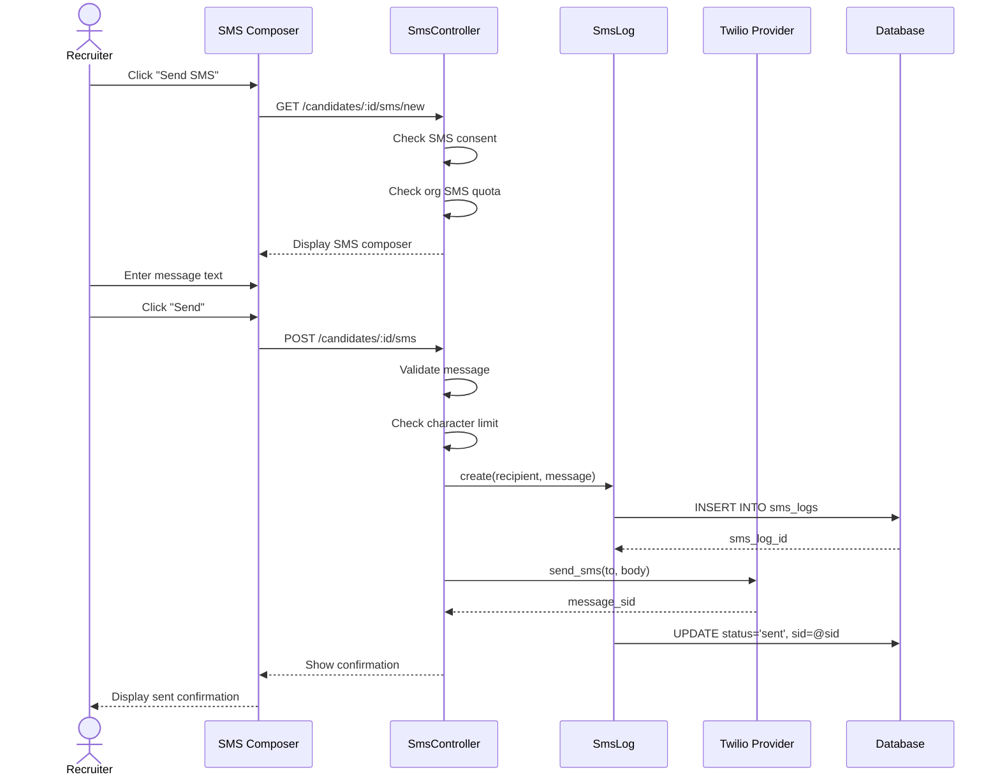

# UC-554: Send SMS

## Metadata

| Attribute | Value |
|-----------|-------|
| **ID** | UC-554 |
| **Name** | Send SMS |
| **Functional Area** | Communication & Notifications |
| **Primary Actor** | Recruiter (ACT-02) |
| **Priority** | P3 |
| **Complexity** | Medium |
| **Status** | Draft |

## Description

A recruiter sends a text message (SMS) to a candidate's mobile phone directly from the ATS. SMS is used for time-sensitive communications such as interview reminders, urgent updates, or quick check-ins. The system tracks delivery status and maintains conversation history for compliance.

## Actors

| Actor | Role in Use Case |
|-------|------------------|
| Recruiter (ACT-02) | Composes and sends the SMS |
| Candidate (ACT-07) | Receives the text message |
| Notification Engine (ACT-13) | Delivers the SMS via provider (Twilio/etc) |

## Preconditions

- [ ] User is authenticated and has Recruiter, Hiring Manager, or Admin role
- [ ] Candidate has a valid mobile phone number on file
- [ ] Candidate has consented to SMS communications
- [ ] Organization has SMS feature enabled with active provider
- [ ] User has SMS send permission

## Postconditions

### Success
- [ ] SmsLog record created with status = 'sent'
- [ ] SMS delivered to candidate's phone
- [ ] Delivery receipt captured
- [ ] Audit log entry created
- [ ] SMS count decremented from organization quota

### Failure
- [ ] SmsLog created with status = 'failed' and error
- [ ] User shown error message
- [ ] SMS not delivered

## Triggers

- Recruiter clicks "Send SMS" button on candidate profile
- Recruiter clicks "Text" action from candidate quick menu
- Recruiter replies to inbound SMS from candidate
- Automated trigger sends SMS (e.g., interview reminder)

## Basic Flow



| Step | Actor | Action | System Response |
|------|-------|--------|-----------------|
| 1 | Recruiter | Clicks "Send SMS" on candidate | System checks eligibility |
| 2 | System | Verifies SMS consent on file | Consent confirmed |
| 3 | System | Checks organization SMS quota | Quota available |
| 4 | System | Displays SMS composer | Composer modal opens |
| 5 | Recruiter | Types message (160 char limit) | Character counter updates |
| 6 | Recruiter | Optionally selects SMS template | Template content loaded |
| 7 | Recruiter | Reviews/edits message | Final content ready |
| 8 | Recruiter | Clicks "Send" | System validates message |
| 9 | System | Creates SmsLog record | Record saved |
| 10 | System | Sends via SMS provider | API call made |
| 11 | System | Receives message SID | Delivery queued |
| 12 | System | Updates SmsLog with SID | Status = 'sent' |
| 13 | System | Shows success message | "SMS sent to [number]" |

## Alternative Flows

### AF-1: Use SMS Template

**Trigger:** Recruiter selects a template at step 6

| Step | Actor | Action | System Response |
|------|-------|--------|-----------------|
| 6a | Recruiter | Clicks template dropdown | Templates listed |
| 6b | Recruiter | Selects template | Content populated |
| 6c | System | Substitutes variables | {{name}} replaced |
| 6d | Recruiter | Optionally edits | Content customized |

**Resumption:** Returns to step 7 of basic flow

### AF-2: Message Exceeds Single SMS

**Trigger:** Message exceeds 160 characters

| Step | Actor | Action | System Response |
|------|-------|--------|-----------------|
| 5a | Recruiter | Types beyond 160 chars | Counter shows segments |
| 5b | System | Displays "2 SMS segments" | Cost warning shown |
| 5c | Recruiter | Confirms multi-segment send | Proceeds with send |

**Resumption:** Returns to step 8 of basic flow

### AF-3: Reply to Inbound SMS

**Trigger:** Candidate has sent an SMS to the organization

| Step | Actor | Action | System Response |
|------|-------|--------|-----------------|
| 1a | Recruiter | Views inbound SMS | Message displayed |
| 2a | Recruiter | Clicks "Reply" | Composer opens in thread |
| 3a | System | Shows conversation history | Previous messages visible |
| 4a | Recruiter | Types reply | Reply composed |

**Resumption:** Returns to step 8 of basic flow

### AF-4: Schedule SMS

**Trigger:** Recruiter wants to send SMS at a specific time

| Step | Actor | Action | System Response |
|------|-------|--------|-----------------|
| 8a | Recruiter | Clicks "Schedule" instead of "Send" | Time picker shown |
| 8b | Recruiter | Selects date and time | Time captured |
| 8c | System | Creates scheduled SMS | Job queued |
| 8d | System | Shows scheduled confirmation | "Scheduled for [time]" |

**Resumption:** Use case ends

## Exception Flows

### EF-1: No SMS Consent

**Trigger:** Candidate has not consented to SMS

| Step | Actor | Action | System Response |
|------|-------|--------|-----------------|
| 2.1 | System | Detects no SMS consent | Warning displayed |
| 2.2 | System | Blocks SMS compose | "SMS consent required" |
| 2.3 | Recruiter | Requests consent via email | Consent email sent |
| 2.4 | System | Awaits consent | Cannot send until granted |

**Resolution:** Must obtain consent first

### EF-2: Invalid Phone Number

**Trigger:** Phone number is not valid for SMS

| Step | Actor | Action | System Response |
|------|-------|--------|-----------------|
| 1.1 | System | Validates phone format | Invalid detected |
| 1.2 | System | Shows error | "Invalid mobile number" |
| 1.3 | Recruiter | Updates phone number | Candidate profile edited |

**Resolution:** Must have valid mobile number

### EF-3: Quota Exceeded

**Trigger:** Organization has used all SMS quota

| Step | Actor | Action | System Response |
|------|-------|--------|-----------------|
| 3.1 | System | Checks quota | Zero remaining |
| 3.2 | System | Blocks send | "SMS quota exceeded" |
| 3.3 | System | Shows upgrade option | Link to billing |

**Resolution:** Admin must purchase more SMS credits

### EF-4: Delivery Failed

**Trigger:** SMS provider reports delivery failure

| Step | Actor | Action | System Response |
|------|-------|--------|-----------------|
| 11.1 | Provider | Returns error | Delivery failed |
| 11.2 | System | Updates SmsLog status | Status = 'failed' |
| 11.3 | System | Records error code | Reason logged |
| 11.4 | System | Notifies recruiter | "SMS could not be delivered" |

**Resolution:** User can retry or use different channel

## Business Rules

| ID | Rule | Description |
|----|------|-------------|
| BR-554.1 | Consent Required | Must have explicit SMS consent before sending |
| BR-554.2 | Valid Mobile | Phone must be a valid mobile number (not landline) |
| BR-554.3 | Character Limit | Single SMS is 160 characters; longer messages split |
| BR-554.4 | Quiet Hours | No SMS between 9 PM - 8 AM recipient local time |
| BR-554.5 | Rate Limit | Maximum 10 SMS per candidate per day |
| BR-554.6 | Opt-Out Handling | Must honor STOP/UNSUBSCRIBE responses immediately |
| BR-554.7 | Sender ID | Must use organization's verified sender number |
| BR-554.8 | Content Restrictions | No promotional content unless marketing consent |

## Data Requirements

### Input Data

| Field | Type | Required | Validation |
|-------|------|----------|------------|
| candidate_id | integer | Yes | Must exist, have consent |
| message | string | Yes | Max 480 chars (3 segments) |
| template_id | integer | No | Must be SMS template |
| scheduled_at | datetime | No | Must be future, respect quiet hours |

### Output Data

| Field | Type | Description |
|-------|------|-------------|
| sms_log_id | integer | Unique identifier |
| status | enum | queued, sent, delivered, failed, undelivered |
| message_sid | string | Provider's message ID |
| segments | integer | Number of SMS segments used |
| cost | decimal | SMS cost in cents |

## Database Transactions

### Tables Affected

| Table | Operation | Conditions |
|-------|-----------|------------|
| sms_logs | CREATE | Always |
| sms_logs | UPDATE | Status changes from webhooks |
| sms_consents | READ | Verify consent exists |
| organization_sms_quotas | UPDATE | Decrement count |
| audit_logs | CREATE | Always |

### Transaction Detail

```sql
-- Send SMS Transaction
BEGIN TRANSACTION;

-- Step 1: Verify consent exists
SELECT id FROM sms_consents
WHERE candidate_id = @candidate_id
  AND organization_id = @organization_id
  AND status = 'granted'
  AND revoked_at IS NULL;

-- Step 2: Check and decrement quota
UPDATE organization_sms_quotas
SET used_count = used_count + @segments,
    updated_at = NOW()
WHERE organization_id = @organization_id
  AND (quota_limit - used_count) >= @segments;

-- Step 3: Create SMS log record
INSERT INTO sms_logs (
    organization_id,
    sender_id,
    candidate_id,
    phone_number,
    message,
    segments,
    status,
    direction,
    template_id,
    created_at,
    updated_at
) VALUES (
    @organization_id,
    @current_user_id,
    @candidate_id,
    @phone_number,
    @message,
    @segments,
    'queued',
    'outbound',
    @template_id,
    NOW(),
    NOW()
);

SET @sms_log_id = LAST_INSERT_ID();

-- Step 4: Create audit log
INSERT INTO audit_logs (
    organization_id,
    user_id,
    action,
    auditable_type,
    auditable_id,
    metadata,
    created_at
) VALUES (
    @organization_id,
    @current_user_id,
    'sms.sent',
    'SmsLog',
    @sms_log_id,
    JSON_OBJECT(
        'candidate_id', @candidate_id,
        'segments', @segments
    ),
    NOW()
);

COMMIT;
```

### Webhook Status Update

```sql
-- When Twilio/provider sends delivery webhook
UPDATE sms_logs
SET status = @status,
    message_sid = @message_sid,
    delivered_at = CASE WHEN @status = 'delivered' THEN NOW() ELSE NULL END,
    error_code = @error_code,
    error_message = @error_message,
    updated_at = NOW()
WHERE id = @sms_log_id;
```

### Rollback Scenarios

| Scenario | Rollback Action |
|----------|-----------------|
| No consent | Return error, no changes |
| Quota exceeded | Return error, no changes |
| Provider API failure | Mark as failed, refund quota |

## UI/UX Requirements

### Screen/Component

- **Location:** Modal overlay from candidate profile
- **Entry Point:** "Send SMS" button in candidate actions
- **Key Elements:**
  - Phone number display
  - Character counter (160 limit)
  - Segment indicator
  - Template selector
  - Conversation history
  - Send/Schedule buttons

### SMS Composer Layout

```
┌─────────────────────────────────────────────────────────┐
│ Send SMS to John Smith                              [X] │
├─────────────────────────────────────────────────────────┤
│ To: +1 (555) 123-4567                                  │
│                                                         │
│ Template: [Select template...                        ▼] │
│                                                         │
│ ┌─────────────────────────────────────────────────────┐ │
│ │                                                     │ │
│ │ Hi John, just a reminder that your interview       │ │
│ │ for the Software Engineer position is tomorrow     │ │
│ │ at 2:00 PM. Reply CONFIRM to confirm or call us   │ │
│ │ at 555-000-1234 to reschedule. - Acme Recruiting  │ │
│ │                                                     │ │
│ └─────────────────────────────────────────────────────┘ │
│                                                         │
│ 152/160 characters | 1 SMS segment                     │
│                                                         │
│ ⚠ Recipient local time: 10:30 AM (within quiet hours) │
│                                                         │
├─────────────────────────────────────────────────────────┤
│ Recent conversation:                                    │
│ ┌─────────────────────────────────────────────────────┐ │
│ │ You (Jan 24, 2:15 PM):                              │ │
│ │ Thanks for applying! We'll be in touch soon.       │ │
│ │                                                     │ │
│ │ John (Jan 24, 2:20 PM):                             │ │
│ │ Thank you! Looking forward to it.                  │ │
│ └─────────────────────────────────────────────────────┘ │
│                                                         │
├─────────────────────────────────────────────────────────┤
│                         [Cancel]   [Schedule]   [Send]  │
└─────────────────────────────────────────────────────────┘
```

### Character Counter States

```
152/160 characters | 1 SMS segment     ← Normal (green)
165/160 characters | 2 SMS segments    ← Over single (yellow)
325/480 characters | 3 SMS segments    ← Approaching max (orange)
```

### Wireframe Reference

`/designs/wireframes/UC-554-sms-composer.png`

## Non-Functional Requirements

| Requirement | Target |
|-------------|--------|
| Response Time | Send confirmation < 2s |
| Delivery Time | SMS delivered < 30s |
| Uptime | SMS service 99.9% |
| Webhook Processing | Status update < 5s |

## Security Considerations

- [x] Authentication required
- [x] Authorization check: SMS permission required
- [x] Consent verification: TCPA/GDPR compliance
- [x] Phone validation: Prevent invalid number charges
- [x] Rate limiting: Prevent SMS abuse
- [x] Audit logging: All SMS logged for compliance
- [x] Data encryption: Phone numbers encrypted at rest

## Related Use Cases

| Use Case | Relationship |
|----------|--------------|
| UC-550 Send Email to Candidate | Alternative communication channel |
| UC-556 Manage Notification Preferences | Consent managed here |
| UC-557 View Email History | View SMS in communication history |
| UC-152 Send Calendar Invite | SMS reminders for interviews |

---

## Data Model References

> Cross-references to [DATA_MODEL.md](../DATA_MODEL.md) and [CRUD_MATRIX.md](../CRUD_MATRIX.md)

### Subject Areas

| Subject Area | ID | Relationship |
|--------------|-----|--------------|
| Communication | SA-10 | Primary |
| Candidate | SA-04 | Secondary |
| Compliance & Audit | SA-09 | Reference (consent) |

### Entities CRUD

| Entity | C | R | U | D | Notes |
|--------|---|---|---|---|-------|
| SmsLog | ✓ | ✓ | ✓ | | Created, status updated via webhook |
| SmsConsent | | ✓ | | | Verified before send |
| SmsTemplate | | ✓ | | | Read when template selected |
| Candidate | | ✓ | | | Read for phone number |
| OrganizationSmsQuota | | ✓ | ✓ | | Checked and decremented |
| AuditLog | ✓ | | | | Created for compliance |

**Legend:** C = Create, R = Read, U = Update, D = Delete

---

## Process Model References

> Cross-references to [PROCESS_MODEL.md](../PROCESS_MODEL.md) and [PROCESS_CRUD_MATRIX.md](../PROCESS_CRUD_MATRIX.md)

| Attribute | Value | Link |
|-----------|-------|------|
| **Elementary Business Process** | EP-1004: Send SMS | [PROCESS_MODEL.md#ep-1004](../PROCESS_MODEL.md#ep-1004-send-sms) |
| **Business Process** | BP-501: Candidate Communication | [PROCESS_MODEL.md#bp-501](../PROCESS_MODEL.md#bp-501-candidate-communication) |
| **Business Function** | BF-05: Communication Management | [PROCESS_MODEL.md#bf-05](../PROCESS_MODEL.md#bf-05-communication-management) |

### EBP Details

| Attribute | Value |
|-----------|-------|
| **Trigger** | Recruiter initiates SMS or automated trigger fires |
| **Input** | Candidate phone number, message content |
| **Output** | SmsLog record, delivered text message |
| **Business Rules** | BR-554.1 through BR-554.8 (see Business Rules section) |

---

## Traceability Matrix

> Complete artifact mapping for requirements traceability

| Artifact Type | ID | Name | Link |
|---------------|-----|------|------|
| **Use Case** | UC-554 | Send SMS | *(this document)* |
| **Elementary Process** | EP-1004 | Send SMS | [PROCESS_MODEL.md](../PROCESS_MODEL.md#ep-1004-send-sms) |
| **Business Process** | BP-501 | Candidate Communication | [PROCESS_MODEL.md](../PROCESS_MODEL.md#bp-501-candidate-communication) |
| **Business Function** | BF-05 | Communication Management | [PROCESS_MODEL.md](../PROCESS_MODEL.md#bf-05-communication-management) |
| **Primary Actor** | ACT-02 | Recruiter | [ACTORS.md](../ACTORS.md#act-02-recruiter) |
| **Subject Area (Primary)** | SA-10 | Communication | [DATA_MODEL.md](../DATA_MODEL.md#sa-10-communication) |
| **Subject Area (Secondary)** | SA-04 | Candidate | [DATA_MODEL.md](../DATA_MODEL.md#sa-04-candidate) |
| **CRUD Matrix Row** | UC-554 | - | [CRUD_MATRIX.md](../CRUD_MATRIX.md#uc-554) |
| **Process CRUD Row** | EP-1004 | - | [PROCESS_CRUD_MATRIX.md](../PROCESS_CRUD_MATRIX.md#ep-1004) |

### Implementation Artifacts

| Artifact Type | Path/Reference | Status |
|---------------|----------------|--------|
| Controller | `app/controllers/admin/sms_messages_controller.rb` | Planned |
| Model | `app/models/sms_log.rb` | Planned |
| Model | `app/models/sms_consent.rb` | Planned |
| Service | `app/services/sms/send_sms_service.rb` | Planned |
| Gateway | `app/gateways/twilio_gateway.rb` | Planned |
| Policy | `app/policies/sms_log_policy.rb` | Planned |
| View | `app/views/admin/sms_messages/new.html.erb` | Planned |
| Test | `test/controllers/admin/sms_messages_controller_test.rb` | Planned |

---

## Open Questions

1. Should we support two-way SMS conversations?
2. What SMS provider(s) should we integrate with?
3. Should we support MMS (picture messaging)?
4. How should we handle international SMS pricing?

## Change History

| Version | Date | Author | Changes |
|---------|------|--------|---------|
| 0.1 | 2026-01-25 | System | Initial draft |
