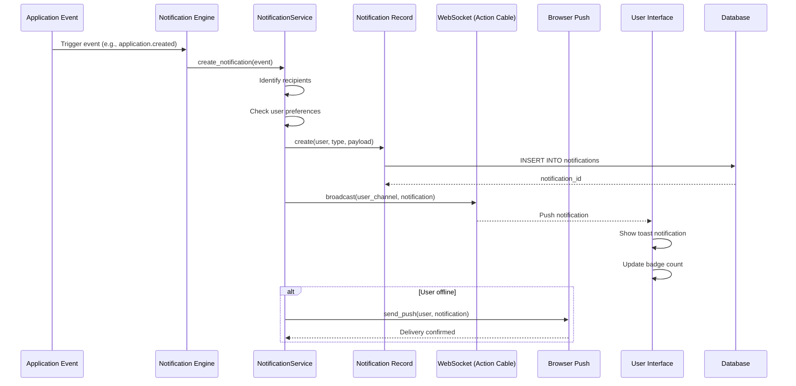

# UC-555: In-App Notification

## Metadata

| Attribute | Value |
|-----------|-------|
| **ID** | UC-555 |
| **Name** | In-App Notification |
| **Functional Area** | Communication & Notifications |
| **Primary Actor** | Notification Engine (ACT-13) |
| **Priority** | P1 |
| **Complexity** | Medium |
| **Status** | Draft |

## Description

The system delivers real-time notifications to users within the application for important events such as new applications, interview feedback, offer updates, and task reminders. Notifications appear in a notification center, as toast messages, and optionally as browser push notifications. Users can mark notifications as read, archive them, and configure their preferences.

## Actors

| Actor | Role in Use Case |
|-------|------------------|
| Notification Engine (ACT-13) | Creates and delivers notifications |
| Recruiter (ACT-02) | Receives and manages notifications |
| Hiring Manager (ACT-03) | Receives and manages notifications |
| Interviewer (ACT-04) | Receives notifications for interviews |
| System (Internal) | Triggers notification events |

## Preconditions

- [ ] User is authenticated in the application
- [ ] User has not disabled notifications for this event type
- [ ] Organization is active
- [ ] Event has occurred that triggers notification

## Postconditions

### Success
- [ ] Notification record created in database
- [ ] Real-time notification pushed via WebSocket
- [ ] Notification badge updated
- [ ] Toast notification displayed (if user online)
- [ ] Browser push sent (if enabled and user offline)

### Failure
- [ ] Notification created but delivery failed
- [ ] Fallback to email notification (if configured)
- [ ] Error logged for debugging

## Triggers

- Application received for recruiter's job
- Interview scheduled or cancelled
- Scorecard submitted for hiring manager's candidate
- Offer response received
- Approval request assigned
- Mention in comment or note
- Task deadline approaching
- Background check completed

## Basic Flow



| Step | Actor | Action | System Response |
|------|-------|--------|-----------------|
| 1 | System | Event occurs (e.g., new application) | Event dispatched |
| 2 | Notification Engine | Receives event | Processes event type |
| 3 | System | Identifies notification recipients | Users determined |
| 4 | System | Checks each user's preferences | Enabled users filtered |
| 5 | System | Creates Notification record per user | Records saved |
| 6 | System | Broadcasts via WebSocket | Real-time push |
| 7 | UI | Receives WebSocket message | Toast appears |
| 8 | UI | Updates notification badge | Badge count increments |
| 9 | User | Sees notification | Notification visible |
| 10 | System | If offline, sends browser push | Push delivered |

## Alternative Flows

### AF-1: User Opens Notification Center

**Trigger:** User clicks notification bell icon

| Step | Actor | Action | System Response |
|------|-------|--------|-----------------|
| 1a | User | Clicks notification icon | Notification panel opens |
| 2a | System | Loads recent notifications | List displayed |
| 3a | System | Marks visible as "seen" | Badge may update |
| 4a | User | Clicks on notification | Navigates to related item |
| 5a | System | Marks notification as "read" | Status updated |

**Resumption:** Use case ends

### AF-2: User Marks All as Read

**Trigger:** User clicks "Mark all as read"

| Step | Actor | Action | System Response |
|------|-------|--------|-----------------|
| 1b | User | Clicks "Mark all as read" | System processes |
| 2b | System | Updates all unread notifications | Status = 'read' |
| 3b | System | Resets badge count to zero | Badge hidden |

**Resumption:** Use case ends

### AF-3: User Archives Notification

**Trigger:** User wants to remove notification from list

| Step | Actor | Action | System Response |
|------|-------|--------|-----------------|
| 1c | User | Clicks archive/dismiss on notification | Confirmation shown |
| 2c | System | Marks notification as archived | Removed from list |
| 3c | System | Notification can be viewed in archive | Available in history |

**Resumption:** Use case ends

### AF-4: Grouped Notifications

**Trigger:** Multiple similar notifications received

| Step | Actor | Action | System Response |
|------|-------|--------|-----------------|
| 5a | System | Detects similar notifications | Groups identified |
| 6a | System | Creates grouped notification | "5 new applications" |
| 7a | UI | Displays grouped notification | Single notification shown |
| 8a | User | Expands group | Individual items shown |

**Resumption:** Returns to step 9 of basic flow

## Exception Flows

### EF-1: WebSocket Disconnected

**Trigger:** User's WebSocket connection is not active

| Step | Actor | Action | System Response |
|------|-------|--------|-----------------|
| 6.1 | System | Detects no WebSocket | Fallback triggered |
| 6.2 | System | Queues for browser push | Push scheduled |
| 6.3 | System | Notification stored for next page load | Will appear on refresh |

**Resolution:** Notification delivered on reconnect or via push

### EF-2: Browser Push Denied

**Trigger:** User has denied push notification permission

| Step | Actor | Action | System Response |
|------|-------|--------|-----------------|
| 10.1 | System | Checks push permission | Permission denied |
| 10.2 | System | Falls back to email (if enabled) | Email queued |
| 10.3 | System | Logs delivery failure | For debugging |

**Resolution:** Notification available in-app on next visit

### EF-3: User Preference Disabled

**Trigger:** User has disabled this notification type

| Step | Actor | Action | System Response |
|------|-------|--------|-----------------|
| 4.1 | System | Checks preferences | Type disabled |
| 4.2 | System | Skips notification creation | No record created |
| 4.3 | System | Logs skip reason | For analytics |

**Resolution:** No notification sent (user preference honored)

## Business Rules

| ID | Rule | Description |
|----|------|-------------|
| BR-555.1 | Preference Respect | Never send notifications user has disabled |
| BR-555.2 | Deduplication | No duplicate notifications within 1 minute |
| BR-555.3 | Retention | Notifications auto-archive after 30 days |
| BR-555.4 | Grouping Threshold | Group after 3+ similar notifications in 10 min |
| BR-555.5 | Priority Levels | High priority bypasses quiet hours |
| BR-555.6 | Read Timeout | Auto-mark as read after 7 days |
| BR-555.7 | Actionable Timeout | Action links expire after 24 hours |
| BR-555.8 | Organization Scope | Users only see notifications for their org |

## Data Requirements

### Input Data

| Field | Type | Required | Validation |
|-------|------|----------|------------|
| user_id | integer | Yes | Must be active user |
| notification_type | enum | Yes | Valid notification type |
| title | string | Yes | Max 100 chars |
| body | string | No | Max 500 chars |
| url | string | No | Valid internal URL |
| priority | enum | No | low, normal, high, urgent |
| metadata | json | No | Additional context |
| group_key | string | No | For grouping similar |

### Notification Types

| Type | Description | Default Enabled |
|------|-------------|-----------------|
| application.new | New application received | Yes |
| application.stage_changed | Candidate moved stages | Yes |
| interview.scheduled | Interview scheduled | Yes |
| interview.reminder | Interview starting soon | Yes |
| scorecard.submitted | Feedback submitted | Yes |
| offer.response | Candidate responded to offer | Yes |
| approval.requested | Action needs your approval | Yes |
| mention | Someone mentioned you | Yes |
| task.due | Task deadline approaching | Yes |
| comment.reply | Reply to your comment | Yes |

### Output Data

| Field | Type | Description |
|-------|------|-------------|
| notification_id | integer | Unique identifier |
| status | enum | unread, read, archived |
| created_at | datetime | When notification created |
| read_at | datetime | When marked as read |

## Database Transactions

### Tables Affected

| Table | Operation | Conditions |
|-------|-----------|------------|
| notifications | CREATE | Per recipient |
| notifications | UPDATE | Status changes |
| notification_preferences | READ | Check user settings |
| users | READ | Get recipients |

### Transaction Detail

```sql
-- Create Notification Transaction
BEGIN TRANSACTION;

-- Step 1: Check user preferences
SELECT enabled FROM notification_preferences
WHERE user_id = @user_id
  AND notification_type = @type;

-- Step 2: Create notification (if enabled)
INSERT INTO notifications (
    organization_id,
    user_id,
    notification_type,
    title,
    body,
    url,
    priority,
    group_key,
    status,
    metadata,
    notifiable_type,
    notifiable_id,
    created_at,
    updated_at
) VALUES (
    @organization_id,
    @user_id,
    @type,
    @title,
    @body,
    @url,
    @priority,
    @group_key,
    'unread',
    @metadata,
    @notifiable_type,
    @notifiable_id,
    NOW(),
    NOW()
);

SET @notification_id = LAST_INSERT_ID();

COMMIT;
```

### Mark as Read

```sql
UPDATE notifications
SET status = 'read',
    read_at = NOW(),
    updated_at = NOW()
WHERE id = @notification_id
  AND user_id = @current_user_id;
```

### Bulk Mark as Read

```sql
UPDATE notifications
SET status = 'read',
    read_at = NOW(),
    updated_at = NOW()
WHERE user_id = @current_user_id
  AND status = 'unread'
  AND organization_id = @organization_id;
```

### Rollback Scenarios

| Scenario | Rollback Action |
|----------|-----------------|
| Preference check fails | Skip notification |
| WebSocket broadcast fails | Log and continue |
| Push notification fails | Fall back to email |

## UI/UX Requirements

### Screen/Component

- **Location:** Header notification bell icon (all pages)
- **Entry Point:** Click notification bell
- **Key Elements:**
  - Bell icon with unread count badge
  - Dropdown notification panel
  - Toast notifications
  - Notification center page

### Notification Bell and Panel

```
┌──────────────────────────────────────────────────────┐
│ [Logo]                            🔔(3) [User Menu] │
└──────────────────────────────────────────────────────┘
                                     │
                                     ▼
┌─────────────────────────────────────────────────────┐
│ Notifications                     [Mark all read]   │
├─────────────────────────────────────────────────────┤
│ ┌─────────────────────────────────────────────────┐ │
│ │ ● New application received                      │ │
│ │   John Smith applied for Software Engineer      │ │
│ │   2 minutes ago                           [→]   │ │
│ └─────────────────────────────────────────────────┘ │
│ ┌─────────────────────────────────────────────────┐ │
│ │ ● Interview feedback submitted                  │ │
│ │   Sarah reviewed Jane Doe for PM role           │ │
│ │   15 minutes ago                          [→]   │ │
│ └─────────────────────────────────────────────────┘ │
│ ┌─────────────────────────────────────────────────┐ │
│ │ ○ Offer accepted                                │ │
│ │   Mike Chen accepted the offer!                 │ │
│ │   1 hour ago                              [→]   │ │
│ └─────────────────────────────────────────────────┘ │
│                                                     │
│              [View all notifications →]             │
└─────────────────────────────────────────────────────┘

● = unread    ○ = read    [→] = navigate to item
```

### Toast Notification

```
┌─────────────────────────────────────────────────────┐
│ 📋 New Application                              [X] │
│ John Smith applied for Software Engineer            │
│                                           [View →]  │
└─────────────────────────────────────────────────────┘
```

### Notification Center (Full Page)

```
┌─────────────────────────────────────────────────────┐
│ Notification Center                                 │
├─────────────────────────────────────────────────────┤
│ Filter: [All ▼] [Unread only ☐]  [Mark all read]   │
├─────────────────────────────────────────────────────┤
│ Today                                               │
│ ┌─────────────────────────────────────────────────┐ │
│ │ ● New application - John Smith                  │ │
│ │   Applied for Software Engineer | 2 min ago     │ │
│ │                              [Archive] [View]   │ │
│ └─────────────────────────────────────────────────┘ │
│ ┌─────────────────────────────────────────────────┐ │
│ │ ● 5 new applications                  [Expand]  │ │
│ │   For various positions | Last hour             │ │
│ └─────────────────────────────────────────────────┘ │
│                                                     │
│ Yesterday                                           │
│ ┌─────────────────────────────────────────────────┐ │
│ │ ○ Offer accepted - Mike Chen                    │ │
│ │   Senior Developer role | Jan 24                │ │
│ └─────────────────────────────────────────────────┘ │
│                                                     │
│ [Load more...]                                      │
└─────────────────────────────────────────────────────┘
```

### Wireframe Reference

`/designs/wireframes/UC-555-notification-center.png`

## Non-Functional Requirements

| Requirement | Target |
|-------------|--------|
| Real-time Latency | < 500ms from event to display |
| Notification Load | < 200ms for notification panel |
| Concurrent Connections | 10,000+ WebSocket connections |
| Push Delivery | < 5 seconds from event |

## Security Considerations

- [x] Authentication required: Only authenticated users receive notifications
- [x] Authorization check: Users only see their own notifications
- [x] Organization scoping: Notifications isolated by organization
- [x] XSS prevention: Notification content sanitized
- [x] Rate limiting: Prevents notification flooding

## Related Use Cases

| Use Case | Relationship |
|----------|--------------|
| UC-556 Manage Notification Preferences | User configures what to receive |
| UC-550 Send Email to Candidate | May trigger email fallback |
| UC-100 Apply for Job | Triggers application.new notification |
| UC-200 Submit Scorecard | Triggers scorecard.submitted notification |
| UC-255 Accept Offer | Triggers offer.response notification |

---

## Data Model References

> Cross-references to [DATA_MODEL.md](../DATA_MODEL.md) and [CRUD_MATRIX.md](../CRUD_MATRIX.md)

### Subject Areas

| Subject Area | ID | Relationship |
|--------------|-----|--------------|
| Communication | SA-10 | Primary |
| Identity & Access | SA-01 | Secondary (users) |

### Entities CRUD

| Entity | C | R | U | D | Notes |
|--------|---|---|---|---|-------|
| Notification | ✓ | ✓ | ✓ | | Created, read/archived, auto-cleanup |
| NotificationPreference | | ✓ | | | Read to check user settings |
| User | | ✓ | | | Read for recipient info |

**Legend:** C = Create, R = Read, U = Update, D = Delete

---

## Process Model References

> Cross-references to [PROCESS_MODEL.md](../PROCESS_MODEL.md) and [PROCESS_CRUD_MATRIX.md](../PROCESS_CRUD_MATRIX.md)

| Attribute | Value | Link |
|-----------|-------|------|
| **Elementary Business Process** | EP-1011: Send In-App Notification | [PROCESS_MODEL.md#ep-1011](../PROCESS_MODEL.md#ep-1011-send-in-app-notification) |
| **Business Process** | BP-502: Internal Notifications | [PROCESS_MODEL.md#bp-502](../PROCESS_MODEL.md#bp-502-internal-notifications) |
| **Business Function** | BF-05: Communication Management | [PROCESS_MODEL.md#bf-05](../PROCESS_MODEL.md#bf-05-communication-management) |

### EBP Details

| Attribute | Value |
|-----------|-------|
| **Trigger** | System event occurs that warrants user notification |
| **Input** | Event type, recipient(s), notification content |
| **Output** | Notification record, real-time delivery to user |
| **Business Rules** | BR-555.1 through BR-555.8 (see Business Rules section) |

---

## Traceability Matrix

> Complete artifact mapping for requirements traceability

| Artifact Type | ID | Name | Link |
|---------------|-----|------|------|
| **Use Case** | UC-555 | In-App Notification | *(this document)* |
| **Elementary Process** | EP-1011 | Send In-App Notification | [PROCESS_MODEL.md](../PROCESS_MODEL.md#ep-1011-send-in-app-notification) |
| **Business Process** | BP-502 | Internal Notifications | [PROCESS_MODEL.md](../PROCESS_MODEL.md#bp-502-internal-notifications) |
| **Business Function** | BF-05 | Communication Management | [PROCESS_MODEL.md](../PROCESS_MODEL.md#bf-05-communication-management) |
| **Primary Actor** | ACT-13 | Notification Engine | [ACTORS.md](../ACTORS.md#act-13-notification-engine) |
| **Subject Area (Primary)** | SA-10 | Communication | [DATA_MODEL.md](../DATA_MODEL.md#sa-10-communication) |
| **Subject Area (Secondary)** | SA-01 | Identity & Access | [DATA_MODEL.md](../DATA_MODEL.md#sa-01-identity--access) |
| **CRUD Matrix Row** | UC-555 | - | [CRUD_MATRIX.md](../CRUD_MATRIX.md#uc-555) |
| **Process CRUD Row** | EP-1011 | - | [PROCESS_CRUD_MATRIX.md](../PROCESS_CRUD_MATRIX.md#ep-1011) |

### Implementation Artifacts

| Artifact Type | Path/Reference | Status |
|---------------|----------------|--------|
| Controller | `app/controllers/notifications_controller.rb` | Planned |
| Model | `app/models/notification.rb` | Planned |
| Channel | `app/channels/notifications_channel.rb` | Planned |
| Service | `app/services/notifications/create_notification_service.rb` | Planned |
| Job | `app/jobs/send_notification_job.rb` | Planned |
| Component | `app/javascript/controllers/notifications_controller.js` | Planned |
| Test | `test/controllers/notifications_controller_test.rb` | Planned |

---

## Open Questions

1. Should we support notification sounds/audio alerts?
2. How long should notifications be retained before auto-deletion?
3. Should we integrate with Slack/Teams for notification delivery?
4. Should we support notification snoozing?

## Change History

| Version | Date | Author | Changes |
|---------|------|--------|---------|
| 0.1 | 2026-01-25 | System | Initial draft |
