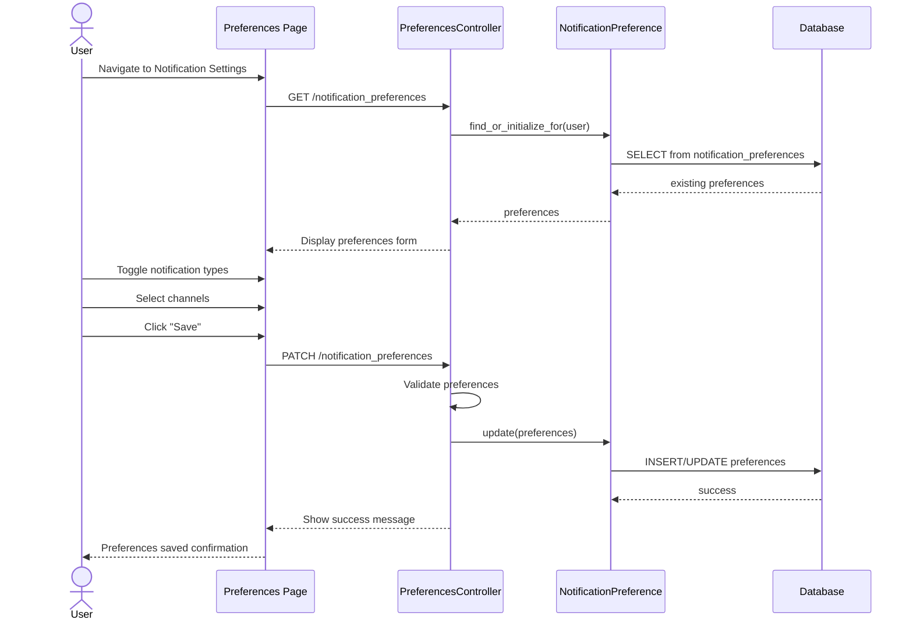

# UC-556: Manage Notification Preferences

## Metadata

| Attribute | Value |
|-----------|-------|
| **ID** | UC-556 |
| **Name** | Manage Notification Preferences |
| **Functional Area** | Communication & Notifications |
| **Primary Actor** | Candidate (ACT-07) |
| **Priority** | P2 |
| **Complexity** | Low |
| **Status** | Draft |

## Description

A user (candidate or internal user) configures their notification preferences to control which types of communications they receive and through which channels (in-app, email, SMS, push). Preferences can be set globally or per notification type. The system respects these preferences for all future communications.

## Actors

| Actor | Role in Use Case |
|-------|------------------|
| Candidate (ACT-07) | Manages their communication preferences |
| Recruiter (ACT-02) | Manages their notification preferences |
| Hiring Manager (ACT-03) | Manages their notification preferences |
| System Administrator (ACT-01) | Sets organization defaults |

## Preconditions

- [ ] User is authenticated (candidate via portal, internal user via admin)
- [ ] User account exists and is active
- [ ] Notification preferences feature is enabled for organization

## Postconditions

### Success
- [ ] NotificationPreference records created/updated
- [ ] Future notifications honor new preferences
- [ ] Audit log entry created (for internal users)
- [ ] Confirmation displayed to user

### Failure
- [ ] Preferences unchanged
- [ ] Error message displayed

## Triggers

- User clicks "Notification Settings" in profile
- User clicks "Manage Preferences" from email footer
- User clicks unsubscribe link in email
- Candidate accesses preferences from portal settings

## Basic Flow



| Step | Actor | Action | System Response |
|------|-------|--------|-----------------|
| 1 | User | Navigates to notification settings | System loads preferences page |
| 2 | System | Fetches current preferences | Existing settings loaded |
| 3 | System | Displays preferences form | Form shown with current values |
| 4 | User | Reviews current settings | Settings visible |
| 5 | User | Toggles notification type on/off | Toggle state updated |
| 6 | User | Selects delivery channels | Channels selected |
| 7 | User | Sets frequency preferences | Frequency configured |
| 8 | User | Clicks "Save Preferences" | System validates |
| 9 | System | Saves preference records | Preferences stored |
| 10 | System | Shows confirmation | "Preferences saved" message |

## Alternative Flows

### AF-1: Unsubscribe via Email Link

**Trigger:** User clicks unsubscribe link in email footer

| Step | Actor | Action | System Response |
|------|-------|--------|-----------------|
| 1a | User | Clicks "Unsubscribe" in email | Token-based page opens |
| 2a | System | Validates unsubscribe token | Token verified |
| 3a | System | Shows unsubscribe options | Type-specific or all |
| 4a | User | Selects unsubscribe scope | Selection captured |
| 5a | User | Clicks "Confirm Unsubscribe" | Preference updated |
| 6a | System | Shows confirmation | "You've been unsubscribed" |

**Resumption:** Use case ends

### AF-2: Set Quiet Hours

**Trigger:** User wants to limit notification times

| Step | Actor | Action | System Response |
|------|-------|--------|-----------------|
| 7a | User | Enables "Quiet Hours" | Time picker appears |
| 7b | User | Sets start and end time | Times captured |
| 7c | User | Selects days | Days selected |
| 7d | System | Validates time range | Range validated |

**Resumption:** Returns to step 8 of basic flow

### AF-3: Digest Mode

**Trigger:** User prefers bundled notifications

| Step | Actor | Action | System Response |
|------|-------|--------|-----------------|
| 7a | User | Selects "Digest mode" | Frequency options appear |
| 7b | User | Chooses frequency (daily/weekly) | Frequency set |
| 7c | User | Sets delivery time | Time captured |
| 7d | System | Bundles future notifications | Digest scheduled |

**Resumption:** Returns to step 8 of basic flow

### AF-4: Admin Sets Organization Defaults

**Trigger:** Admin configures default preferences for new users

| Step | Actor | Action | System Response |
|------|-------|--------|-----------------|
| 1b | Admin | Opens organization settings | Settings page displayed |
| 2b | Admin | Navigates to notification defaults | Defaults form shown |
| 3b | Admin | Configures default preferences | Defaults captured |
| 4b | Admin | Clicks "Save Defaults" | Defaults stored |
| 5b | System | Applies to new users | Future users get defaults |

**Resumption:** Use case ends

## Exception Flows

### EF-1: Invalid Unsubscribe Token

**Trigger:** Unsubscribe link has expired or is invalid

| Step | Actor | Action | System Response |
|------|-------|--------|-----------------|
| 2a.1 | System | Token validation fails | Error detected |
| 2a.2 | System | Shows login prompt | "Please log in to manage" |
| 2a.3 | User | Logs in | Preferences page shown |

**Resolution:** User manages preferences after login

### EF-2: Required Notification Type

**Trigger:** User tries to disable mandatory notifications

| Step | Actor | Action | System Response |
|------|-------|--------|-----------------|
| 5.1 | User | Toggles required notification off | Warning shown |
| 5.2 | System | Explains requirement | "This notification is required for..." |
| 5.3 | System | Prevents disable | Toggle reverts |

**Resolution:** User cannot disable required notifications

## Business Rules

| ID | Rule | Description |
|----|------|-------------|
| BR-556.1 | Mandatory Notifications | Some types cannot be disabled (e.g., security alerts) |
| BR-556.2 | Consent Tracking | All preference changes logged for compliance |
| BR-556.3 | Immediate Effect | Preference changes apply immediately |
| BR-556.4 | Granular Control | Users can configure per notification type |
| BR-556.5 | Channel Options | Each type can have different channels enabled |
| BR-556.6 | Default Inheritance | New users inherit organization defaults |
| BR-556.7 | Unsubscribe Validity | Unsubscribe tokens valid for 30 days |
| BR-556.8 | Resubscribe Allowed | Users can re-enable previously disabled notifications |

## Data Requirements

### Input Data

| Field | Type | Required | Validation |
|-------|------|----------|------------|
| notification_type | enum | Yes | Valid notification type |
| email_enabled | boolean | No | Default true |
| in_app_enabled | boolean | No | Default true |
| push_enabled | boolean | No | Default false |
| sms_enabled | boolean | No | Default false |
| frequency | enum | No | immediate, daily_digest, weekly_digest |
| quiet_hours_start | time | No | Valid time |
| quiet_hours_end | time | No | Valid time |
| quiet_days | string[] | No | Valid day names |

### Notification Types for Users

| Category | Type | Description | Mandatory |
|----------|------|-------------|-----------|
| Applications | application.new | New application received | No |
| Applications | application.stage_changed | Candidate moved | No |
| Interviews | interview.scheduled | Interview booked | No |
| Interviews | interview.reminder | Upcoming interview | No |
| Interviews | interview.cancelled | Interview cancelled | No |
| Feedback | scorecard.submitted | Feedback received | No |
| Offers | offer.response | Offer accepted/declined | No |
| Approvals | approval.requested | Action needs approval | No |
| Security | security.login | New login detected | Yes |
| Security | security.password_changed | Password updated | Yes |

### Notification Types for Candidates

| Category | Type | Description | Mandatory |
|----------|------|-------------|-----------|
| Applications | application.received | Application confirmation | Yes |
| Applications | application.status | Status updates | No |
| Interviews | interview.scheduled | Interview details | No |
| Interviews | interview.reminder | Interview reminder | No |
| Offers | offer.received | Offer sent | No |
| Marketing | job.recommendations | Job suggestions | No |

### Output Data

| Field | Type | Description |
|-------|------|-------------|
| preferences | array | Updated preference records |
| updated_at | datetime | When last changed |

## Database Transactions

### Tables Affected

| Table | Operation | Conditions |
|-------|-----------|------------|
| notification_preferences | CREATE/UPDATE | Per notification type |
| user_consents | CREATE | GDPR/SMS consent records |
| audit_logs | CREATE | For internal users |

### Transaction Detail

```sql
-- Update Notification Preferences Transaction
BEGIN TRANSACTION;

-- Step 1: Upsert preferences for each notification type
INSERT INTO notification_preferences (
    organization_id,
    user_id,
    user_type,
    notification_type,
    email_enabled,
    in_app_enabled,
    push_enabled,
    sms_enabled,
    frequency,
    created_at,
    updated_at
) VALUES (
    @organization_id,
    @user_id,
    @user_type,
    @notification_type,
    @email_enabled,
    @in_app_enabled,
    @push_enabled,
    @sms_enabled,
    @frequency,
    NOW(),
    NOW()
)
ON DUPLICATE KEY UPDATE
    email_enabled = VALUES(email_enabled),
    in_app_enabled = VALUES(in_app_enabled),
    push_enabled = VALUES(push_enabled),
    sms_enabled = VALUES(sms_enabled),
    frequency = VALUES(frequency),
    updated_at = NOW();

-- Step 2: Update quiet hours (global preference)
UPDATE notification_preferences_global
SET quiet_hours_start = @quiet_start,
    quiet_hours_end = @quiet_end,
    quiet_days = @quiet_days,
    updated_at = NOW()
WHERE user_id = @user_id;

-- Step 3: Create audit log (internal users only)
INSERT INTO audit_logs (
    organization_id,
    user_id,
    action,
    auditable_type,
    auditable_id,
    metadata,
    created_at
) VALUES (
    @organization_id,
    @user_id,
    'notification_preferences.updated',
    'User',
    @user_id,
    JSON_OBJECT(
        'changes', @changes_json
    ),
    NOW()
);

COMMIT;
```

### Unsubscribe via Token

```sql
-- Token-based unsubscribe (no auth required)
BEGIN TRANSACTION;

-- Validate token
SELECT user_id, notification_type, expires_at
FROM unsubscribe_tokens
WHERE token = @token AND expires_at > NOW();

-- Update preference
UPDATE notification_preferences
SET email_enabled = FALSE,
    updated_at = NOW()
WHERE user_id = @user_id
  AND notification_type = @notification_type;

-- Mark token as used
UPDATE unsubscribe_tokens
SET used_at = NOW()
WHERE token = @token;

COMMIT;
```

### Rollback Scenarios

| Scenario | Rollback Action |
|----------|-----------------|
| Validation failure | Return errors, no changes |
| Mandatory type disabled | Return error, no changes |
| Token invalid | Prompt for login |

## UI/UX Requirements

### Screen/Component

- **Location:** /settings/notifications (internal), /portal/settings (candidate)
- **Entry Point:** Settings menu, email footer unsubscribe link
- **Key Elements:**
  - Notification type list with toggles
  - Channel selection per type
  - Quiet hours configuration
  - Digest mode options
  - Save button

### Notification Preferences Layout

```
┌─────────────────────────────────────────────────────────┐
│ Notification Preferences                                │
├─────────────────────────────────────────────────────────┤
│ Control how you receive notifications                   │
│                                                         │
│ ┌─────────────────────────────────────────────────────┐ │
│ │ Global Settings                                     │ │
│ ├─────────────────────────────────────────────────────┤ │
│ │ Quiet Hours: [9:00 PM] to [8:00 AM]                │ │
│ │ Days: ☑ Mon ☑ Tue ☑ Wed ☑ Thu ☑ Fri ☐ Sat ☐ Sun   │ │
│ │                                                     │ │
│ │ Digest Mode: ○ Immediate  ● Daily  ○ Weekly        │ │
│ │ Digest Time: [9:00 AM]                             │ │
│ └─────────────────────────────────────────────────────┘ │
│                                                         │
│ ┌─────────────────────────────────────────────────────┐ │
│ │ Application Notifications                           │ │
│ ├─────────────────────────────────────────────────────┤ │
│ │                        In-App  Email  Push   SMS    │ │
│ │ New applications       [✓]     [✓]    [✓]    [ ]    │ │
│ │ Stage changes          [✓]     [✓]    [ ]    [ ]    │ │
│ │ Application withdrawn  [✓]     [✓]    [ ]    [ ]    │ │
│ └─────────────────────────────────────────────────────┘ │
│                                                         │
│ ┌─────────────────────────────────────────────────────┐ │
│ │ Interview Notifications                             │ │
│ ├─────────────────────────────────────────────────────┤ │
│ │                        In-App  Email  Push   SMS    │ │
│ │ Interview scheduled    [✓]     [✓]    [✓]    [✓]    │ │
│ │ Interview reminders    [✓]     [✓]    [✓]    [✓]    │ │
│ │ Interview cancelled    [✓]     [✓]    [✓]    [ ]    │ │
│ │ Feedback requested     [✓]     [✓]    [ ]    [ ]    │ │
│ └─────────────────────────────────────────────────────┘ │
│                                                         │
│ ┌─────────────────────────────────────────────────────┐ │
│ │ Offer Notifications                                 │ │
│ ├─────────────────────────────────────────────────────┤ │
│ │                        In-App  Email  Push   SMS    │ │
│ │ Offer responses        [✓]     [✓]    [✓]    [ ]    │ │
│ │ Offer expiring         [✓]     [✓]    [ ]    [ ]    │ │
│ └─────────────────────────────────────────────────────┘ │
│                                                         │
│ ┌─────────────────────────────────────────────────────┐ │
│ │ Security Notifications (cannot be disabled)         │ │
│ ├─────────────────────────────────────────────────────┤ │
│ │                        In-App  Email  Push   SMS    │ │
│ │ New login detected     [✓]     [✓]    [ ]    [ ]   🔒│ │
│ │ Password changed       [✓]     [✓]    [ ]    [ ]   🔒│ │
│ └─────────────────────────────────────────────────────┘ │
│                                                         │
├─────────────────────────────────────────────────────────┤
│                           [Cancel]   [Save Preferences] │
└─────────────────────────────────────────────────────────┘

🔒 = Mandatory, cannot be disabled
```

### Unsubscribe Page

```
┌─────────────────────────────────────────────────────────┐
│ [Logo]                                                  │
├─────────────────────────────────────────────────────────┤
│                                                         │
│           Unsubscribe from Email Notifications          │
│                                                         │
│  You clicked unsubscribe from: Interview Reminders      │
│                                                         │
│  What would you like to do?                             │
│                                                         │
│  ○ Unsubscribe from Interview Reminders only            │
│  ○ Unsubscribe from all email notifications             │
│  ○ Keep receiving emails (cancel)                       │
│                                                         │
│                   [Confirm Unsubscribe]                 │
│                                                         │
│  ─────────────────────────────────────────────────      │
│                                                         │
│  Want more control? [Manage all preferences →]          │
│                                                         │
└─────────────────────────────────────────────────────────┘
```

### Wireframe Reference

`/designs/wireframes/UC-556-notification-preferences.png`

## Non-Functional Requirements

| Requirement | Target |
|-------------|--------|
| Response Time | Preferences load < 500ms |
| Save Time | Preferences save < 1s |
| Unsubscribe Page | Load < 2s (unauthenticated) |
| Immediate Effect | Changes apply within 1 minute |

## Security Considerations

- [x] Authentication required: For full preferences management
- [x] Token-based unsubscribe: Limited scope, time-expiring tokens
- [x] CSRF protection: On all preference updates
- [x] Audit logging: All changes logged for compliance
- [x] Consent tracking: GDPR/CCPA compliant

## Related Use Cases

| Use Case | Relationship |
|----------|--------------|
| UC-555 In-App Notification | Respects preferences set here |
| UC-550 Send Email to Candidate | Respects email preferences |
| UC-554 Send SMS | Respects SMS preferences |
| UC-301 Record Consent | Consent tracked similarly |

---

## Data Model References

> Cross-references to [DATA_MODEL.md](../DATA_MODEL.md) and [CRUD_MATRIX.md](../CRUD_MATRIX.md)

### Subject Areas

| Subject Area | ID | Relationship |
|--------------|-----|--------------|
| Communication | SA-10 | Primary |
| Identity & Access | SA-01 | Secondary (users) |
| Compliance & Audit | SA-09 | Reference (consent) |

### Entities CRUD

| Entity | C | R | U | D | Notes |
|--------|---|---|---|---|-------|
| NotificationPreference | ✓ | ✓ | ✓ | | Full CRUD for preferences |
| UnsubscribeToken | ✓ | ✓ | ✓ | | Created for emails, used on unsubscribe |
| User | | ✓ | | | Read for user context |
| AuditLog | ✓ | | | | Created for changes |

**Legend:** C = Create, R = Read, U = Update, D = Delete

---

## Process Model References

> Cross-references to [PROCESS_MODEL.md](../PROCESS_MODEL.md) and [PROCESS_CRUD_MATRIX.md](../PROCESS_CRUD_MATRIX.md)

| Attribute | Value | Link |
|-----------|-------|------|
| **Elementary Business Process** | EP-1012: Manage Notification Preferences | [PROCESS_MODEL.md#ep-1012](../PROCESS_MODEL.md#ep-1012-manage-notification-preferences) |
| **Business Process** | BP-502: Internal Notifications | [PROCESS_MODEL.md#bp-502](../PROCESS_MODEL.md#bp-502-internal-notifications) |
| **Business Function** | BF-05: Communication Management | [PROCESS_MODEL.md#bf-05](../PROCESS_MODEL.md#bf-05-communication-management) |

### EBP Details

| Attribute | Value |
|-----------|-------|
| **Trigger** | User accesses notification settings or unsubscribe link |
| **Input** | Preference selections per notification type and channel |
| **Output** | Updated NotificationPreference records |
| **Business Rules** | BR-556.1 through BR-556.8 (see Business Rules section) |

---

## Traceability Matrix

> Complete artifact mapping for requirements traceability

| Artifact Type | ID | Name | Link |
|---------------|-----|------|------|
| **Use Case** | UC-556 | Manage Notification Preferences | *(this document)* |
| **Elementary Process** | EP-1012 | Manage Notification Preferences | [PROCESS_MODEL.md](../PROCESS_MODEL.md#ep-1012-manage-notification-preferences) |
| **Business Process** | BP-502 | Internal Notifications | [PROCESS_MODEL.md](../PROCESS_MODEL.md#bp-502-internal-notifications) |
| **Business Function** | BF-05 | Communication Management | [PROCESS_MODEL.md](../PROCESS_MODEL.md#bf-05-communication-management) |
| **Primary Actor** | ACT-07 | Candidate | [ACTORS.md](../ACTORS.md#act-07-candidate) |
| **Subject Area (Primary)** | SA-10 | Communication | [DATA_MODEL.md](../DATA_MODEL.md#sa-10-communication) |
| **Subject Area (Secondary)** | SA-01 | Identity & Access | [DATA_MODEL.md](../DATA_MODEL.md#sa-01-identity--access) |
| **CRUD Matrix Row** | UC-556 | - | [CRUD_MATRIX.md](../CRUD_MATRIX.md#uc-556) |
| **Process CRUD Row** | EP-1012 | - | [PROCESS_CRUD_MATRIX.md](../PROCESS_CRUD_MATRIX.md#ep-1012) |

### Implementation Artifacts

| Artifact Type | Path/Reference | Status |
|---------------|----------------|--------|
| Controller | `app/controllers/notification_preferences_controller.rb` | Planned |
| Controller | `app/controllers/unsubscribes_controller.rb` | Planned |
| Model | `app/models/notification_preference.rb` | Planned |
| Model | `app/models/unsubscribe_token.rb` | Planned |
| Service | `app/services/notifications/update_preferences_service.rb` | Planned |
| View | `app/views/notification_preferences/edit.html.erb` | Planned |
| View | `app/views/unsubscribes/show.html.erb` | Planned |
| Test | `test/controllers/notification_preferences_controller_test.rb` | Planned |

---

## Open Questions

1. Should we support notification category-level controls (e.g., disable all interview notifications)?
2. How should we handle preference migration when new notification types are added?
3. Should digest emails include all notification types or be type-specific?
4. Should we support push notification permission prompts in-app?

## Change History

| Version | Date | Author | Changes |
|---------|------|--------|---------|
| 0.1 | 2026-01-25 | System | Initial draft |
