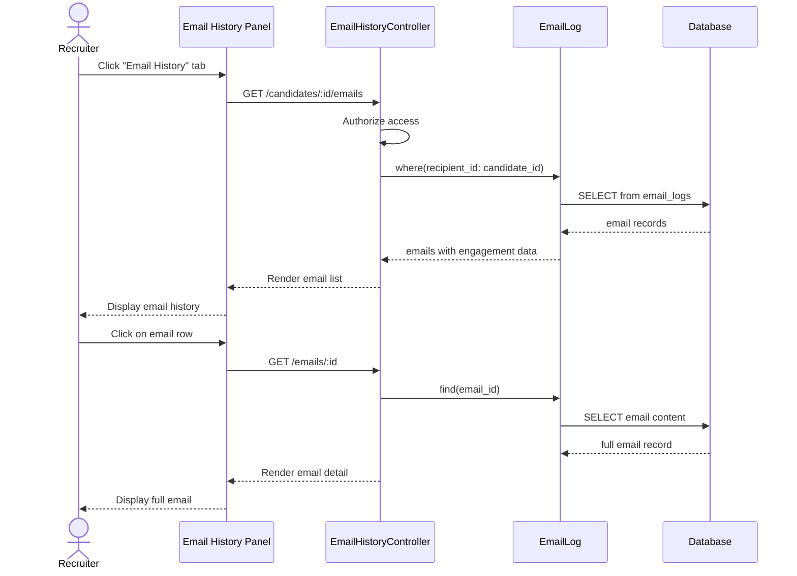

# UC-557: View Email History

## Metadata

| Attribute | Value |
|-----------|-------|
| **ID** | UC-557 |
| **Name** | View Email History |
| **Functional Area** | Communication & Notifications |
| **Primary Actor** | Recruiter (ACT-02) |
| **Priority** | P2 |
| **Complexity** | Low |
| **Status** | Draft |

## Description

A recruiter views the complete history of emails sent to a candidate, including individual emails, bulk emails, and automated sequence emails. The history shows delivery status, engagement metrics (opens, clicks), and allows viewing the full content of each email. This provides context for candidate communications and supports compliance requirements.

## Actors

| Actor | Role in Use Case |
|-------|------------------|
| Recruiter (ACT-02) | Views email history for candidates |
| Hiring Manager (ACT-03) | Views email history for their candidates |
| Compliance Officer (ACT-06) | Reviews email history for audits |

## Preconditions

- [ ] User is authenticated with appropriate role
- [ ] User has permission to view the candidate
- [ ] Candidate record exists
- [ ] Email logging is enabled for organization

## Postconditions

### Success
- [ ] Email history displayed with all sent emails
- [ ] Delivery status and engagement shown
- [ ] Full email content viewable on demand
- [ ] Audit log entry created (for compliance access)

### Failure
- [ ] Empty state shown if no emails
- [ ] Error message if data retrieval fails

## Triggers

- Recruiter clicks "Email History" tab on candidate profile
- Recruiter clicks "View Communication" from candidate actions
- Compliance Officer searches email logs for audit
- Recruiter clicks on a notification about email engagement

## Basic Flow



| Step | Actor | Action | System Response |
|------|-------|--------|-----------------|
| 1 | Recruiter | Opens candidate profile | Profile displayed |
| 2 | Recruiter | Clicks "Email History" tab | Tab activated |
| 3 | System | Fetches email logs for candidate | Query executed |
| 4 | System | Displays email list | List rendered |
| 5 | Recruiter | Views email summary | Sees subject, date, status |
| 6 | Recruiter | Clicks on an email | Email selected |
| 7 | System | Loads full email content | Content retrieved |
| 8 | System | Displays email detail modal | Full email shown |
| 9 | Recruiter | Reviews email content | Content visible |
| 10 | Recruiter | Closes modal | Returns to list |

## Alternative Flows

### AF-1: Filter by Date Range

**Trigger:** Recruiter wants to see emails from specific period

| Step | Actor | Action | System Response |
|------|-------|--------|-----------------|
| 4a | Recruiter | Clicks date filter | Date picker appears |
| 4b | Recruiter | Selects start and end date | Dates captured |
| 4c | System | Filters email list | Filtered results shown |

**Resumption:** Returns to step 5 of basic flow

### AF-2: Filter by Email Type

**Trigger:** Recruiter wants specific email types

| Step | Actor | Action | System Response |
|------|-------|--------|-----------------|
| 4a | Recruiter | Selects type filter | Options: Manual, Automated, Bulk |
| 4b | System | Filters by type | Filtered results shown |

**Resumption:** Returns to step 5 of basic flow

### AF-3: View Engagement Timeline

**Trigger:** Recruiter wants detailed engagement data

| Step | Actor | Action | System Response |
|------|-------|--------|-----------------|
| 8a | Recruiter | Clicks "View Engagement" | Timeline expands |
| 8b | System | Shows engagement events | Opens, clicks with timestamps |
| 8c | Recruiter | Sees which links clicked | Link URLs displayed |

**Resumption:** Returns to step 9 of basic flow

### AF-4: Export Email History

**Trigger:** Compliance officer needs email records

| Step | Actor | Action | System Response |
|------|-------|--------|-----------------|
| 4a | User | Clicks "Export" button | Export options shown |
| 4b | User | Selects format (CSV/PDF) | Format chosen |
| 4c | System | Generates export file | File prepared |
| 4d | System | Downloads file | File downloaded |

**Resumption:** Use case ends

### AF-5: Search Emails

**Trigger:** Recruiter looking for specific email

| Step | Actor | Action | System Response |
|------|-------|--------|-----------------|
| 4a | Recruiter | Enters search term | Search field accepts input |
| 4b | System | Searches subject and body | Matches found |
| 4c | System | Highlights matches | Results displayed |

**Resumption:** Returns to step 5 of basic flow

## Exception Flows

### EF-1: No Emails Found

**Trigger:** Candidate has no email history

| Step | Actor | Action | System Response |
|------|-------|--------|-----------------|
| 4.1 | System | Detects empty result | No records found |
| 4.2 | System | Shows empty state | "No emails sent yet" |
| 4.3 | System | Offers action | "Send first email" button |

**Resolution:** User can send email or return

### EF-2: Email Content Unavailable

**Trigger:** Email body was not stored (e.g., external system)

| Step | Actor | Action | System Response |
|------|-------|--------|-----------------|
| 7.1 | System | Detects missing content | Content null |
| 7.2 | System | Shows metadata only | Subject, date, status shown |
| 7.3 | System | Explains limitation | "Content not available" |

**Resolution:** Limited view displayed

## Business Rules

| ID | Rule | Description |
|----|------|-------------|
| BR-557.1 | Organization Scope | Only show emails from user's organization |
| BR-557.2 | Access Control | Users can only view emails to candidates they can access |
| BR-557.3 | Content Retention | Email content retained for 2 years by default |
| BR-557.4 | Engagement Tracking | Open/click tracking must be enabled per email |
| BR-557.5 | Audit for Compliance | Compliance access creates audit log entry |
| BR-557.6 | PII Protection | Candidate email addresses shown only to authorized users |
| BR-557.7 | Pagination | Maximum 50 emails per page |

## Data Requirements

### Input Data

| Field | Type | Required | Validation |
|-------|------|----------|------------|
| candidate_id | integer | Yes | Must exist in organization |
| start_date | date | No | Valid date |
| end_date | date | No | >= start_date |
| email_type | enum | No | manual, automated, bulk |
| search_query | string | No | Max 100 chars |
| page | integer | No | >= 1 |

### Output Data

| Field | Type | Description |
|-------|------|-------------|
| emails | array | List of email records |
| total_count | integer | Total emails matching filter |
| page_count | integer | Total pages |

### Email Record Fields

| Field | Type | Description |
|-------|------|-------------|
| id | integer | Email log ID |
| subject | string | Email subject line |
| sent_at | datetime | When email was sent |
| sender_name | string | Recruiter who sent |
| status | enum | sent, delivered, bounced, failed |
| source | enum | manual, bulk, sequence, system |
| template_name | string | Template used (if any) |
| opened | boolean | Was email opened |
| opened_at | datetime | First open timestamp |
| open_count | integer | Number of opens |
| clicked | boolean | Were any links clicked |
| clicked_at | datetime | First click timestamp |
| click_count | integer | Number of clicks |

## Database Transactions

### Tables Affected

| Table | Operation | Conditions |
|-------|-----------|------------|
| email_logs | READ | Filter by candidate |
| email_engagement_events | READ | Join for metrics |
| users | READ | For sender names |
| email_templates | READ | For template names |
| audit_logs | CREATE | Compliance access only |

### Query Detail

```sql
-- Fetch email history for candidate
SELECT
    el.id,
    el.subject,
    el.sent_at,
    el.status,
    el.source,
    u.full_name as sender_name,
    et.name as template_name,
    el.opened_at IS NOT NULL as opened,
    el.opened_at,
    el.open_count,
    el.clicked_at IS NOT NULL as clicked,
    el.clicked_at,
    el.click_count
FROM email_logs el
LEFT JOIN users u ON el.sender_id = u.id
LEFT JOIN email_templates et ON el.email_template_id = et.id
WHERE el.recipient_type = 'Candidate'
  AND el.recipient_id = @candidate_id
  AND el.organization_id = @organization_id
  AND (@start_date IS NULL OR el.sent_at >= @start_date)
  AND (@end_date IS NULL OR el.sent_at <= @end_date)
  AND (@source IS NULL OR el.source = @source)
ORDER BY el.sent_at DESC
LIMIT 50 OFFSET @offset;
```

### View Full Email Content

```sql
-- Fetch full email content
SELECT
    el.*,
    (SELECT JSON_ARRAYAGG(
        JSON_OBJECT(
            'event_type', ee.event_type,
            'occurred_at', ee.occurred_at,
            'metadata', ee.metadata
        )
    )
    FROM email_engagement_events ee
    WHERE ee.email_log_id = el.id
    ORDER BY ee.occurred_at
    ) as engagement_events
FROM email_logs el
WHERE el.id = @email_id
  AND el.organization_id = @organization_id;
```

### Rollback Scenarios

| Scenario | Rollback Action |
|----------|-----------------|
| Read-only operations | N/A - no rollback needed |
| Audit log failure | Log error, continue with response |

## UI/UX Requirements

### Screen/Component

- **Location:** Tab within candidate profile
- **Entry Point:** "Email History" tab on candidate detail
- **Key Elements:**
  - Email list with status indicators
  - Filter controls (date, type, search)
  - Email detail modal
  - Engagement metrics display
  - Export button

### Email History List Layout

```
┌─────────────────────────────────────────────────────────┐
│ Email History - John Smith                              │
├─────────────────────────────────────────────────────────┤
│ Filters:                                                │
│ Date: [Last 30 days ▼]  Type: [All ▼]  [🔍 Search...]  │
│                                          [Export ▼]    │
├─────────────────────────────────────────────────────────┤
│                                                         │
│ ┌─────────────────────────────────────────────────────┐ │
│ │ ✓ Interview Invitation - Software Engineer          │ │
│ │   Sent by Sarah Connor • Jan 24, 2026 2:30 PM      │ │
│ │   📬 Delivered  👁 Opened (2x)  🔗 Clicked (1x)     │ │
│ │   Template: Interview Invite                        │ │
│ └─────────────────────────────────────────────────────┘ │
│                                                         │
│ ┌─────────────────────────────────────────────────────┐ │
│ │ ✓ Application Received                              │ │
│ │   System • Jan 23, 2026 10:15 AM                   │ │
│ │   📬 Delivered  👁 Opened (1x)                      │ │
│ │   Template: Application Confirmation                │ │
│ └─────────────────────────────────────────────────────┘ │
│                                                         │
│ ┌─────────────────────────────────────────────────────┐ │
│ │ ⚠ Follow-up Email                                   │ │
│ │   Sent by Sarah Connor • Jan 20, 2026 3:00 PM      │ │
│ │   📬 Delivered  —                                   │ │
│ │   Manual email                                      │ │
│ └─────────────────────────────────────────────────────┘ │
│                                                         │
│ Showing 3 of 15 emails              [< 1 2 3 4 5 >]    │
└─────────────────────────────────────────────────────────┘

Status Icons:
✓ = Delivered    ⚠ = Sent (not confirmed)    ✗ = Failed/Bounced
👁 = Opened      🔗 = Link clicked           📬 = Delivered
```

### Email Detail Modal

```
┌─────────────────────────────────────────────────────────┐
│ Email Details                                       [X] │
├─────────────────────────────────────────────────────────┤
│                                                         │
│ Subject: Interview Invitation - Software Engineer       │
│                                                         │
│ From: Sarah Connor <recruiting@acme.com>               │
│ To: john.smith@email.com                               │
│ Date: January 24, 2026 at 2:30 PM EST                  │
│ Template: Interview Invite                              │
│                                                         │
│ Status: ✓ Delivered                                    │
│                                                         │
│ ─────────────────────────────────────────────────────  │
│                                                         │
│ Dear John,                                              │
│                                                         │
│ We are pleased to invite you for an interview for the  │
│ Software Engineer position at Acme Corp.               │
│                                                         │
│ Interview Details:                                      │
│ - Date: January 28, 2026                               │
│ - Time: 2:00 PM EST                                    │
│ - Location: Video call (link below)                    │
│                                                         │
│ [Join Video Call]                                       │
│                                                         │
│ Please confirm your attendance by replying to this     │
│ email or clicking the confirmation link below.         │
│                                                         │
│ Best regards,                                           │
│ Sarah Connor                                            │
│                                                         │
│ ─────────────────────────────────────────────────────  │
│                                                         │
│ Engagement Timeline                                     │
│ ┌─────────────────────────────────────────────────────┐ │
│ │ 📤 Sent        Jan 24, 2:30 PM                      │ │
│ │ 📬 Delivered   Jan 24, 2:30 PM                      │ │
│ │ 👁 Opened      Jan 24, 3:15 PM (45 min later)       │ │
│ │ 🔗 Clicked     Jan 24, 3:16 PM - "Join Video Call"  │ │
│ │ 👁 Opened      Jan 25, 9:00 AM (re-opened)          │ │
│ └─────────────────────────────────────────────────────┘ │
│                                                         │
├─────────────────────────────────────────────────────────┤
│                             [Reply]   [Forward]  [Close]│
└─────────────────────────────────────────────────────────┘
```

### Wireframe Reference

`/designs/wireframes/UC-557-email-history.png`

## Non-Functional Requirements

| Requirement | Target |
|-------------|--------|
| Response Time | List load < 500ms |
| Email Detail Load | < 300ms |
| Pagination | Efficient for 1000+ emails |
| Search | Results < 1 second |

## Security Considerations

- [x] Authentication required
- [x] Authorization check: User must have access to candidate
- [x] Organization scoping: Only show organization's emails
- [x] PII protection: Email addresses shown to authorized users only
- [x] Audit logging: Compliance access creates audit trail

## Related Use Cases

| Use Case | Relationship |
|----------|--------------|
| UC-550 Send Email to Candidate | Emails appear in history |
| UC-551 Send Bulk Email | Bulk emails appear in history |
| UC-553 Create Email Sequence | Sequence emails appear in history |
| UC-558 Track Email Engagement | Engagement data displayed here |

---

## Data Model References

> Cross-references to [DATA_MODEL.md](../DATA_MODEL.md) and [CRUD_MATRIX.md](../CRUD_MATRIX.md)

### Subject Areas

| Subject Area | ID | Relationship |
|--------------|-----|--------------|
| Communication | SA-10 | Primary |
| Candidate | SA-04 | Secondary |
| Compliance & Audit | SA-09 | Reference |

### Entities CRUD

| Entity | C | R | U | D | Notes |
|--------|---|---|---|---|-------|
| EmailLog | | ✓ | | | Read for history display |
| EmailEngagementEvent | | ✓ | | | Read for engagement timeline |
| EmailTemplate | | ✓ | | | Read for template names |
| Candidate | | ✓ | | | Read for context |
| User | | ✓ | | | Read for sender names |
| AuditLog | ✓ | | | | Created for compliance access |

**Legend:** C = Create, R = Read, U = Update, D = Delete

---

## Process Model References

> Cross-references to [PROCESS_MODEL.md](../PROCESS_MODEL.md) and [PROCESS_CRUD_MATRIX.md](../PROCESS_CRUD_MATRIX.md)

| Attribute | Value | Link |
|-----------|-------|------|
| **Elementary Business Process** | EP-1005: View Email History | [PROCESS_MODEL.md#ep-1005](../PROCESS_MODEL.md#ep-1005-view-email-history) |
| **Business Process** | BP-501: Candidate Communication | [PROCESS_MODEL.md#bp-501](../PROCESS_MODEL.md#bp-501-candidate-communication) |
| **Business Function** | BF-05: Communication Management | [PROCESS_MODEL.md#bf-05](../PROCESS_MODEL.md#bf-05-communication-management) |

### EBP Details

| Attribute | Value |
|-----------|-------|
| **Trigger** | User navigates to email history for candidate |
| **Input** | Candidate ID, optional filters |
| **Output** | List of emails with status and engagement data |
| **Business Rules** | BR-557.1 through BR-557.7 (see Business Rules section) |

---

## Traceability Matrix

> Complete artifact mapping for requirements traceability

| Artifact Type | ID | Name | Link |
|---------------|-----|------|------|
| **Use Case** | UC-557 | View Email History | *(this document)* |
| **Elementary Process** | EP-1005 | View Email History | [PROCESS_MODEL.md](../PROCESS_MODEL.md#ep-1005-view-email-history) |
| **Business Process** | BP-501 | Candidate Communication | [PROCESS_MODEL.md](../PROCESS_MODEL.md#bp-501-candidate-communication) |
| **Business Function** | BF-05 | Communication Management | [PROCESS_MODEL.md](../PROCESS_MODEL.md#bf-05-communication-management) |
| **Primary Actor** | ACT-02 | Recruiter | [ACTORS.md](../ACTORS.md#act-02-recruiter) |
| **Subject Area (Primary)** | SA-10 | Communication | [DATA_MODEL.md](../DATA_MODEL.md#sa-10-communication) |
| **Subject Area (Secondary)** | SA-04 | Candidate | [DATA_MODEL.md](../DATA_MODEL.md#sa-04-candidate) |
| **CRUD Matrix Row** | UC-557 | - | [CRUD_MATRIX.md](../CRUD_MATRIX.md#uc-557) |
| **Process CRUD Row** | EP-1005 | - | [PROCESS_CRUD_MATRIX.md](../PROCESS_CRUD_MATRIX.md#ep-1005) |

### Implementation Artifacts

| Artifact Type | Path/Reference | Status |
|---------------|----------------|--------|
| Controller | `app/controllers/admin/candidate_emails_controller.rb` | Planned |
| Query | `app/queries/email_history_query.rb` | Planned |
| View | `app/views/admin/candidates/_email_history.html.erb` | Planned |
| Component | `app/javascript/controllers/email_history_controller.js` | Planned |
| Test | `test/queries/email_history_query_test.rb` | Planned |

---

## Open Questions

1. How long should email content be retained before deletion?
2. Should we support viewing email attachments in history?
3. Should we show reply/thread context for email conversations?
4. Should we support full-text search across all candidate emails?

## Change History

| Version | Date | Author | Changes |
|---------|------|--------|---------|
| 0.1 | 2026-01-25 | System | Initial draft |
