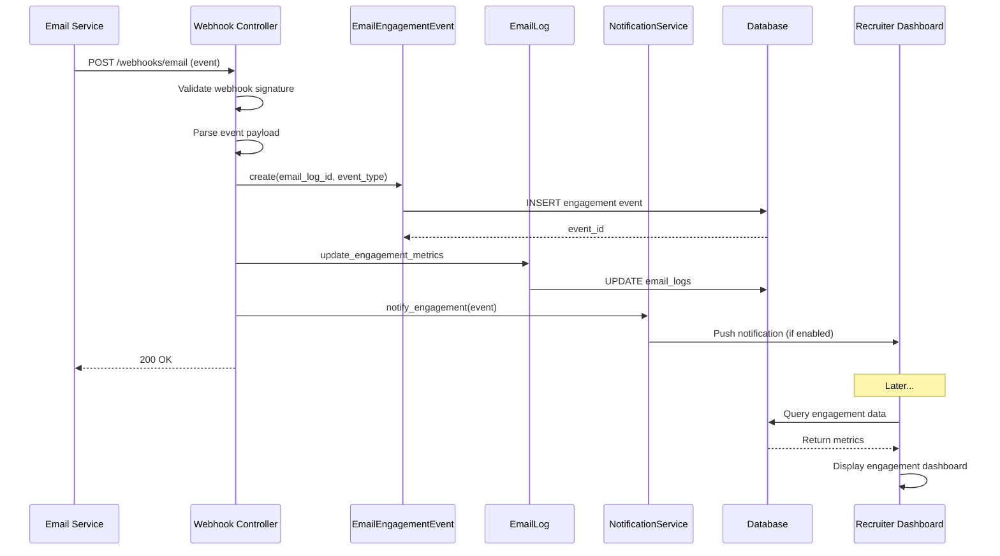

# UC-558: Track Email Engagement

## Metadata

| Attribute | Value |
|-----------|-------|
| **ID** | UC-558 |
| **Name** | Track Email Engagement |
| **Functional Area** | Communication & Notifications |
| **Primary Actor** | Recruiter (ACT-02) |
| **Priority** | P2 |
| **Complexity** | Medium |
| **Status** | Draft |

## Description

The system tracks candidate engagement with sent emails including opens, link clicks, and replies. This data helps recruiters understand candidate interest levels, optimize email content, and prioritize follow-up activities. Engagement metrics are displayed at individual email, candidate, and campaign levels.

## Actors

| Actor | Role in Use Case |
|-------|------------------|
| Recruiter (ACT-02) | Views and acts on engagement data |
| Hiring Manager (ACT-03) | Reviews engagement for their candidates |
| Notification Engine (ACT-13) | Records engagement events |
| Integration Gateway (ACT-12) | Receives webhooks from email service |

## Preconditions

- [ ] Email tracking is enabled for organization
- [ ] Email was sent with tracking pixel/links enabled
- [ ] Candidate has not opted out of tracking (if supported)
- [ ] Email service (SendGrid/SES) is configured with webhooks

## Postconditions

### Success
- [ ] EmailEngagementEvent records created for each action
- [ ] EmailLog record updated with aggregate metrics
- [ ] Real-time notification sent to recruiter (if enabled)
- [ ] Engagement data visible in UI

### Failure
- [ ] Webhook processing logged for retry
- [ ] Missing events tracked for debugging

## Triggers

- Candidate opens an email (tracking pixel loaded)
- Candidate clicks a link in email
- Candidate replies to email
- Candidate unsubscribes via email link
- Email bounces or is marked as spam
- Email service sends delivery webhook

## Basic Flow



| Step | Actor | Action | System Response |
|------|-------|--------|-----------------|
| 1 | Email Service | Sends webhook for email event | Webhook received |
| 2 | System | Validates webhook signature | Signature verified |
| 3 | System | Parses event payload | Event type identified |
| 4 | System | Finds associated EmailLog | Record located |
| 5 | System | Creates EmailEngagementEvent | Event recorded |
| 6 | System | Updates EmailLog metrics | Aggregate updated |
| 7 | System | Checks notification preferences | Preferences loaded |
| 8 | System | Sends real-time notification | If enabled for user |
| 9 | System | Returns success to webhook | 200 OK |

## Alternative Flows

### AF-1: View Engagement Dashboard

**Trigger:** Recruiter wants to see overall engagement metrics

| Step | Actor | Action | System Response |
|------|-------|--------|-----------------|
| 1a | Recruiter | Opens engagement dashboard | Dashboard displayed |
| 2a | System | Aggregates engagement metrics | Data calculated |
| 3a | System | Displays charts and metrics | Visualizations shown |
| 4a | Recruiter | Filters by date range | Results filtered |
| 5a | Recruiter | Drills into specific campaign | Details shown |

**Resumption:** Use case ends

### AF-2: View Candidate Engagement Score

**Trigger:** Recruiter views candidate's engagement level

| Step | Actor | Action | System Response |
|------|-------|--------|-----------------|
| 1b | Recruiter | Opens candidate profile | Profile displayed |
| 2b | System | Calculates engagement score | Score computed |
| 3b | System | Displays engagement indicator | Hot/warm/cold badge |
| 4b | Recruiter | Views engagement history | Timeline shown |

**Resumption:** Use case ends

### AF-3: Real-Time Open Notification

**Trigger:** Candidate opens email while recruiter is online

| Step | Actor | Action | System Response |
|------|-------|--------|-----------------|
| 7a | System | Detects recruiter is online | Session active |
| 8a | System | Sends real-time notification | Toast appears |
| 9a | Recruiter | Clicks notification | Opens candidate profile |

**Resumption:** Use case ends

### AF-4: Link Click Attribution

**Trigger:** System tracks which specific link was clicked

| Step | Actor | Action | System Response |
|------|-------|--------|-----------------|
| 3a | System | Parses link URL from event | Link identified |
| 3b | System | Records link metadata | URL, position stored |
| 3c | System | Updates click statistics | Per-link stats updated |

**Resumption:** Returns to step 5 of basic flow

## Exception Flows

### EF-1: Invalid Webhook Signature

**Trigger:** Webhook signature validation fails

| Step | Actor | Action | System Response |
|------|-------|--------|-----------------|
| 2.1 | System | Signature mismatch detected | Validation fails |
| 2.2 | System | Logs security warning | Alert recorded |
| 2.3 | System | Returns 401 Unauthorized | Webhook rejected |

**Resolution:** Email service may retry; investigate if persistent

### EF-2: Email Log Not Found

**Trigger:** Cannot find associated email record

| Step | Actor | Action | System Response |
|------|-------|--------|-----------------|
| 4.1 | System | No matching email_log found | Lookup fails |
| 4.2 | System | Logs orphaned event | For debugging |
| 4.3 | System | Returns 200 OK | Prevent retries |

**Resolution:** Log for investigation, don't fail webhook

### EF-3: Duplicate Event

**Trigger:** Same event received multiple times

| Step | Actor | Action | System Response |
|------|-------|--------|-----------------|
| 5.1 | System | Checks for existing event | Duplicate found |
| 5.2 | System | Ignores duplicate | No new record |
| 5.3 | System | Returns 200 OK | Acknowledge receipt |

**Resolution:** Idempotent handling prevents duplicates

## Business Rules

| ID | Rule | Description |
|----|------|-------------|
| BR-558.1 | Tracking Consent | Tracking enabled only if recipient hasn't opted out |
| BR-558.2 | First Open Only | Only first open counts for "opened" flag |
| BR-558.3 | Unique Clicks | Each unique link counts as one click |
| BR-558.4 | Engagement Score | Calculated from opens, clicks, replies, recency |
| BR-558.5 | Webhook Idempotency | Same event processed only once |
| BR-558.6 | Data Retention | Engagement events retained for 2 years |
| BR-558.7 | Bot Detection | Exclude known email security scanners |
| BR-558.8 | Privacy Mode | Some orgs may disable detailed tracking |

## Data Requirements

### Input Data (Webhook Payload)

| Field | Type | Required | Description |
|-------|------|----------|-------------|
| event_type | enum | Yes | open, click, bounce, spam, unsubscribe |
| message_id | string | Yes | Email service message ID |
| timestamp | datetime | Yes | When event occurred |
| recipient | string | Yes | Email address |
| url | string | No | Clicked URL (for click events) |
| ip_address | string | No | Client IP (for geolocation) |
| user_agent | string | No | Email client information |

### Output Data

| Field | Type | Description |
|-------|------|-------------|
| engagement_event_id | integer | Unique event identifier |
| email_log_id | integer | Associated email |
| event_type | enum | Type of engagement |
| occurred_at | datetime | When event happened |

### Engagement Metrics

| Metric | Type | Description |
|--------|------|-------------|
| open_rate | decimal | % of emails opened |
| click_rate | decimal | % of emails with clicks |
| click_to_open_rate | decimal | % of opens that clicked |
| bounce_rate | decimal | % of bounced emails |
| unsubscribe_rate | decimal | % that unsubscribed |
| avg_time_to_open | interval | Average time to first open |

## Database Transactions

### Tables Affected

| Table | Operation | Conditions |
|-------|-----------|------------|
| email_engagement_events | CREATE | Per webhook event |
| email_logs | UPDATE | Aggregate metrics |
| notifications | CREATE | If real-time enabled |

### Transaction Detail

```sql
-- Process Email Engagement Event
BEGIN TRANSACTION;

-- Step 1: Find email log by message_id
SELECT id, organization_id, sender_id, recipient_id
FROM email_logs
WHERE message_id = @message_id;

SET @email_log_id = @result_id;

-- Step 2: Check for duplicate event
SELECT id FROM email_engagement_events
WHERE email_log_id = @email_log_id
  AND event_type = @event_type
  AND occurred_at = @timestamp;

-- Step 3: Create engagement event (if not duplicate)
INSERT INTO email_engagement_events (
    email_log_id,
    event_type,
    occurred_at,
    url,
    ip_address,
    user_agent,
    metadata,
    created_at
) VALUES (
    @email_log_id,
    @event_type,
    @timestamp,
    @url,
    @ip_address,
    @user_agent,
    @metadata,
    NOW()
);

-- Step 4: Update email log aggregate metrics
UPDATE email_logs
SET
    opened_at = CASE
        WHEN @event_type = 'open' AND opened_at IS NULL
        THEN @timestamp ELSE opened_at END,
    open_count = CASE
        WHEN @event_type = 'open'
        THEN open_count + 1 ELSE open_count END,
    clicked_at = CASE
        WHEN @event_type = 'click' AND clicked_at IS NULL
        THEN @timestamp ELSE clicked_at END,
    click_count = CASE
        WHEN @event_type = 'click'
        THEN click_count + 1 ELSE click_count END,
    bounced_at = CASE
        WHEN @event_type = 'bounce'
        THEN @timestamp ELSE bounced_at END,
    unsubscribed_at = CASE
        WHEN @event_type = 'unsubscribe'
        THEN @timestamp ELSE unsubscribed_at END,
    updated_at = NOW()
WHERE id = @email_log_id;

COMMIT;
```

### Engagement Score Calculation

```sql
-- Calculate candidate engagement score (0-100)
SELECT
    candidate_id,
    (
        -- Recency factor (max 30 points)
        CASE
            WHEN MAX(ee.occurred_at) > NOW() - INTERVAL '24 hours' THEN 30
            WHEN MAX(ee.occurred_at) > NOW() - INTERVAL '7 days' THEN 20
            WHEN MAX(ee.occurred_at) > NOW() - INTERVAL '30 days' THEN 10
            ELSE 0
        END
        +
        -- Open rate factor (max 30 points)
        ROUND(
            (COUNT(DISTINCT CASE WHEN ee.event_type = 'open' THEN el.id END)::decimal /
             NULLIF(COUNT(DISTINCT el.id), 0)) * 30
        )
        +
        -- Click rate factor (max 40 points)
        ROUND(
            (COUNT(DISTINCT CASE WHEN ee.event_type = 'click' THEN el.id END)::decimal /
             NULLIF(COUNT(DISTINCT el.id), 0)) * 40
        )
    ) as engagement_score
FROM email_logs el
LEFT JOIN email_engagement_events ee ON el.id = ee.email_log_id
WHERE el.recipient_type = 'Candidate'
  AND el.recipient_id = @candidate_id
  AND el.sent_at > NOW() - INTERVAL '90 days'
GROUP BY candidate_id;
```

### Rollback Scenarios

| Scenario | Rollback Action |
|----------|-----------------|
| Invalid signature | Reject webhook, no transaction |
| Email not found | Log error, return 200 OK |
| Duplicate event | Skip insert, return 200 OK |
| Database error | Rollback, return 500 for retry |

## UI/UX Requirements

### Screen/Component

- **Location:** Multiple (dashboard, candidate profile, email history)
- **Entry Point:** Various navigation paths
- **Key Elements:**
  - Engagement dashboard with charts
  - Per-candidate engagement score
  - Email-level engagement details
  - Real-time engagement notifications

### Engagement Dashboard Layout

```
┌─────────────────────────────────────────────────────────┐
│ Email Engagement Dashboard                              │
├─────────────────────────────────────────────────────────┤
│ Date Range: [Last 30 days ▼]    Job: [All Jobs ▼]     │
├─────────────────────────────────────────────────────────┤
│                                                         │
│ ┌─────────────┐ ┌─────────────┐ ┌─────────────┐        │
│ │   42.5%     │ │   12.8%     │ │   30.1%     │        │
│ │  Open Rate  │ │ Click Rate  │ │   CTOR      │        │
│ │  ▲ 3.2%     │ │  ▲ 1.1%     │ │  ▼ 0.5%     │        │
│ └─────────────┘ └─────────────┘ └─────────────┘        │
│                                                         │
│ Engagement Over Time                                    │
│ ┌─────────────────────────────────────────────────────┐ │
│ │     📊 Line chart showing opens/clicks over time   │ │
│ │                                                     │ │
│ │  50% ─────────────────                             │ │
│ │      ──────────────────────────── Opens           │ │
│ │  25% ─────────────────                             │ │
│ │      ─ ─ ─ ─ ─ ─ ─ ─ ─ ─ ─ ─ ─ ─ Clicks          │ │
│ │   0% ─────────────────────────────────────────     │ │
│ │      Jan 1    Jan 8    Jan 15   Jan 22   Jan 29   │ │
│ └─────────────────────────────────────────────────────┘ │
│                                                         │
│ Top Performing Emails                                   │
│ ┌─────────────────────────────────────────────────────┐ │
│ │ 1. Interview Invitation       | 68% open | 24% click│ │
│ │ 2. Application Received       | 55% open | 8% click │ │
│ │ 3. Job Opportunity Alert      | 45% open | 15% click│ │
│ └─────────────────────────────────────────────────────┘ │
│                                                         │
│ Engagement by Template                    [View All →] │
│ ┌─────────────────────────────────────────────────────┐ │
│ │ Template                  Sent   Opens  Clicks Rate │ │
│ │ Interview Invite          245    167    59    24%   │ │
│ │ Application Confirm       512    282    41    8%    │ │
│ │ Follow-up Nurture         189    85     28    15%   │ │
│ └─────────────────────────────────────────────────────┘ │
└─────────────────────────────────────────────────────────┘
```

### Candidate Engagement Indicator

```
┌─────────────────────────────────────────────────────────┐
│ John Smith                                              │
│ Software Engineer Candidate                             │
├─────────────────────────────────────────────────────────┤
│                                                         │
│ Engagement: 🔥 Hot (Score: 85)                         │
│ ┌─────────────────────────────────────────────────────┐ │
│ │ ████████████████████░░░░                  85/100   │ │
│ └─────────────────────────────────────────────────────┘ │
│                                                         │
│ Recent Activity:                                        │
│ • Opened "Interview Invitation" 2 hours ago            │
│ • Clicked scheduling link 2 hours ago                  │
│ • Opened "Application Received" 3 days ago             │
│                                                         │
│ Email Stats: 4 sent | 3 opened (75%) | 2 clicked (50%) │
└─────────────────────────────────────────────────────────┘

Engagement Levels:
🔥 Hot (75-100): Highly engaged, prioritize follow-up
🌡️ Warm (40-74): Moderately engaged
❄️ Cold (0-39): Low engagement, may need different approach
```

### Real-Time Engagement Toast

```
┌─────────────────────────────────────────────────────────┐
│ 👁 Email Opened                                     [X] │
│ John Smith just opened your email                       │
│ "Interview Invitation - Software Engineer"              │
│                                            [View →]     │
└─────────────────────────────────────────────────────────┘
```

### Wireframe Reference

`/designs/wireframes/UC-558-engagement-dashboard.png`

## Non-Functional Requirements

| Requirement | Target |
|-------------|--------|
| Webhook Processing | < 500ms per event |
| Dashboard Load | < 1s with 30 days data |
| Event Storage | 10M+ events supported |
| Real-time Latency | < 2s from event to notification |

## Security Considerations

- [x] Webhook signature validation required
- [x] IP whitelist for email service webhooks
- [x] Rate limiting on webhook endpoint
- [x] No PII in tracking pixels (use tokens)
- [x] Encryption of IP addresses (optional)
- [x] Compliance with email tracking laws

## Related Use Cases

| Use Case | Relationship |
|----------|--------------|
| UC-550 Send Email to Candidate | Source of tracked emails |
| UC-551 Send Bulk Email | Source of bulk email tracking |
| UC-553 Create Email Sequence | Sequence email tracking |
| UC-557 View Email History | Engagement displayed in history |

---

## Data Model References

> Cross-references to [DATA_MODEL.md](../DATA_MODEL.md) and [CRUD_MATRIX.md](../CRUD_MATRIX.md)

### Subject Areas

| Subject Area | ID | Relationship |
|--------------|-----|--------------|
| Communication | SA-10 | Primary |
| Candidate | SA-04 | Secondary |
| Analytics & Reporting | SA-13 | Reference |

### Entities CRUD

| Entity | C | R | U | D | Notes |
|--------|---|---|---|---|-------|
| EmailEngagementEvent | ✓ | ✓ | | | Created per event, read for display |
| EmailLog | | ✓ | ✓ | | Read for lookup, update for aggregates |
| Candidate | | ✓ | | | Read for context |
| Notification | ✓ | | | | Created for real-time alerts |

**Legend:** C = Create, R = Read, U = Update, D = Delete

---

## Process Model References

> Cross-references to [PROCESS_MODEL.md](../PROCESS_MODEL.md) and [PROCESS_CRUD_MATRIX.md](../PROCESS_CRUD_MATRIX.md)

| Attribute | Value | Link |
|-----------|-------|------|
| **Elementary Business Process** | EP-1022: Track Email Engagement | [PROCESS_MODEL.md#ep-1022](../PROCESS_MODEL.md#ep-1022-track-email-engagement) |
| **Business Process** | BP-503: Email Automation | [PROCESS_MODEL.md#bp-503](../PROCESS_MODEL.md#bp-503-email-automation) |
| **Business Function** | BF-05: Communication Management | [PROCESS_MODEL.md#bf-05](../PROCESS_MODEL.md#bf-05-communication-management) |

### EBP Details

| Attribute | Value |
|-----------|-------|
| **Trigger** | Email service sends webhook event (open, click, etc.) |
| **Input** | Webhook payload with event type and message ID |
| **Output** | EmailEngagementEvent record, updated EmailLog metrics |
| **Business Rules** | BR-558.1 through BR-558.8 (see Business Rules section) |

---

## Traceability Matrix

> Complete artifact mapping for requirements traceability

| Artifact Type | ID | Name | Link |
|---------------|-----|------|------|
| **Use Case** | UC-558 | Track Email Engagement | *(this document)* |
| **Elementary Process** | EP-1022 | Track Email Engagement | [PROCESS_MODEL.md](../PROCESS_MODEL.md#ep-1022-track-email-engagement) |
| **Business Process** | BP-503 | Email Automation | [PROCESS_MODEL.md](../PROCESS_MODEL.md#bp-503-email-automation) |
| **Business Function** | BF-05 | Communication Management | [PROCESS_MODEL.md](../PROCESS_MODEL.md#bf-05-communication-management) |
| **Primary Actor** | ACT-02 | Recruiter | [ACTORS.md](../ACTORS.md#act-02-recruiter) |
| **Subject Area (Primary)** | SA-10 | Communication | [DATA_MODEL.md](../DATA_MODEL.md#sa-10-communication) |
| **Subject Area (Secondary)** | SA-04 | Candidate | [DATA_MODEL.md](../DATA_MODEL.md#sa-04-candidate) |
| **CRUD Matrix Row** | UC-558 | - | [CRUD_MATRIX.md](../CRUD_MATRIX.md#uc-558) |
| **Process CRUD Row** | EP-1022 | - | [PROCESS_CRUD_MATRIX.md](../PROCESS_CRUD_MATRIX.md#ep-1022) |

### Implementation Artifacts

| Artifact Type | Path/Reference | Status |
|---------------|----------------|--------|
| Controller | `app/controllers/webhooks/email_events_controller.rb` | Planned |
| Model | `app/models/email_engagement_event.rb` | Planned |
| Service | `app/services/emails/process_engagement_event_service.rb` | Planned |
| Query | `app/queries/email_engagement_query.rb` | Planned |
| Job | `app/jobs/process_email_webhook_job.rb` | Planned |
| View | `app/views/admin/reports/email_engagement.html.erb` | Planned |
| Test | `test/controllers/webhooks/email_events_controller_test.rb` | Planned |

---

## Open Questions

1. Should we support engagement tracking for emails sent through external systems?
2. How should we handle bot/security scanner clicks that inflate metrics?
3. Should we implement predictive engagement scoring?
4. Should we support A/B testing of email content with engagement-based winner selection?

## Change History

| Version | Date | Author | Changes |
|---------|------|--------|---------|
| 0.1 | 2026-01-25 | System | Initial draft |
