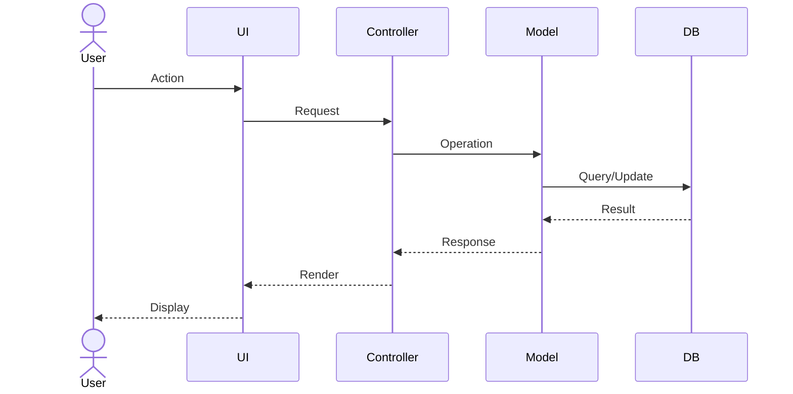

# UC-XXX: Use Case Title

## Metadata

| Attribute | Value |
|-----------|-------|
| **ID** | UC-XXX |
| **Name** | Use Case Title |
| **Functional Area** | Area Name |
| **Primary Actor** | Actor Name (ACT-XX) |
| **Priority** | P1 / P2 / P3 |
| **Complexity** | Low / Medium / High |
| **Status** | Draft / Review / Approved |

## Description

Brief description of what this use case accomplishes and why it exists.

## Actors

| Actor | Role in Use Case |
|-------|------------------|
| Primary Actor (ACT-XX) | Description of their role |
| Secondary Actor (ACT-XX) | Description of their role |

## Preconditions

- [ ] Precondition 1
- [ ] Precondition 2

## Postconditions

### Success
- [ ] Postcondition on success 1
- [ ] Postcondition on success 2

### Failure
- [ ] System state if use case fails

## Triggers

- How is this use case initiated?
- What event or action starts it?

## Basic Flow



| Step | Actor | Action | System Response |
|------|-------|--------|-----------------|
| 1 | Actor | Does something | System responds |
| 2 | Actor | Does something else | System responds |
| 3 | System | Performs validation | - |
| 4 | System | Saves data | - |
| 5 | System | Displays confirmation | - |

## Alternative Flows

### AF-1: Alternative Flow Name

**Trigger:** When condition X occurs at step Y

| Step | Actor | Action | System Response |
|------|-------|--------|-----------------|
| Y.1 | Actor | Alternative action | System responds |
| Y.2 | System | Alternative processing | - |

**Resumption:** Returns to step Z of basic flow

### AF-2: Another Alternative Flow

...

## Exception Flows

### EF-1: Exception Flow Name

**Trigger:** Error condition description

| Step | Actor | Action | System Response |
|------|-------|--------|-----------------|
| E.1 | System | Detects error | Displays error message |
| E.2 | Actor | Corrective action | System re-validates |

**Resolution:** How the exception is resolved

## Business Rules

| ID | Rule | Description |
|----|------|-------------|
| BR-1 | Rule Name | Rule description |
| BR-2 | Rule Name | Rule description |

## Data Requirements

### Input Data

| Field | Type | Required | Validation |
|-------|------|----------|------------|
| field_name | string | Yes | Max 255 chars |
| field_name | integer | No | Range 0-100 |

### Output Data

| Field | Type | Description |
|-------|------|-------------|
| field_name | type | What it represents |

## Database Transactions

### Tables Affected

| Table | Operation | Conditions |
|-------|-----------|------------|
| table_name | CREATE | When new record needed |
| table_name | READ | To fetch existing data |
| table_name | UPDATE | When modifying record |
| table_name | DELETE | When removing record |

### Transaction Detail

```sql
-- Step X: Description of database operation
BEGIN TRANSACTION;

-- Operation 1: Description
INSERT INTO table_name (column1, column2)
VALUES (value1, value2);

-- Operation 2: Description
UPDATE another_table
SET column = value
WHERE condition;

-- Operation 3: Audit log entry
INSERT INTO audit_logs (action, auditable_type, auditable_id, metadata)
VALUES ('action_name', 'ModelName', @new_id, '{"key": "value"}');

COMMIT;
```

### Rollback Scenarios

| Scenario | Rollback Action |
|----------|-----------------|
| Validation failure at step X | No commit, return error |
| External service failure | Rollback transaction, queue for retry |

## UI/UX Requirements

### Screen/Component

- **Location:** Where in the app this appears
- **Entry Point:** How user gets here
- **Key Elements:**
  - Element 1
  - Element 2

### Wireframe Reference

`/designs/wireframes/UC-XXX-screen-name.png`

## Non-Functional Requirements

| Requirement | Target |
|-------------|--------|
| Response Time | < 2 seconds |
| Availability | 99.9% |
| Concurrent Users | 100 |

## Security Considerations

- [ ] Authentication required
- [ ] Authorization check: [describe permission]
- [ ] Data encryption: [describe what's encrypted]
- [ ] Audit logging: [describe what's logged]

## Related Use Cases

| Use Case | Relationship |
|----------|--------------|
| UC-XXX | Precedes this use case |
| UC-XXX | Follows this use case |
| UC-XXX | Can be invoked during this use case |

---

## Data Model References

> Cross-references to [DATA_MODEL.md](../DATA_MODEL.md) and [CRUD_MATRIX.md](../CRUD_MATRIX.md)

### Subject Areas

| Subject Area | ID | Relationship |
|--------------|-----|--------------|
| Subject Area Name | SA-XX | Primary / Secondary / Reference |
| Subject Area Name | SA-XX | Primary / Secondary / Reference |

### Entities CRUD

| Entity | C | R | U | D | Notes |
|--------|---|---|---|---|-------|
| EntityName | ✓ | ✓ | | | Created during basic flow step X |
| EntityName | | ✓ | ✓ | | Updated in step Y |
| EntityName | | ✓ | | | Read for validation |

**Legend:** C = Create, R = Read, U = Update, D = Delete

---

## Process Model References

> Cross-references to [PROCESS_MODEL.md](../PROCESS_MODEL.md) and [PROCESS_CRUD_MATRIX.md](../PROCESS_CRUD_MATRIX.md)

| Attribute | Value | Link |
|-----------|-------|------|
| **Elementary Business Process** | EP-XXXX: EBP Name | [PROCESS_MODEL.md#ep-xxxx](../PROCESS_MODEL.md#ep-xxxx-ebp-name) |
| **Business Process** | BP-XXX: BP Name | [PROCESS_MODEL.md#bp-xxx](../PROCESS_MODEL.md#bp-xxx-bp-name) |
| **Business Function** | BF-XX: BF Name | [PROCESS_MODEL.md#bf-xx](../PROCESS_MODEL.md#bf-xx-bf-name) |

### EBP Details

| Attribute | Value |
|-----------|-------|
| **Trigger** | Event that initiates this process |
| **Input** | Data/documents required to start |
| **Output** | Deliverables produced by this process |
| **Business Rules** | Key rules enforced (BR-X references) |

---

## Traceability Matrix

> Complete artifact mapping for requirements traceability

| Artifact Type | ID | Name | Link |
|---------------|-----|------|------|
| **Use Case** | UC-XXX | Use Case Title | *(this document)* |
| **Elementary Process** | EP-XXXX | EBP Name | [PROCESS_MODEL.md](../PROCESS_MODEL.md#ep-xxxx-ebp-name) |
| **Business Process** | BP-XXX | BP Name | [PROCESS_MODEL.md](../PROCESS_MODEL.md#bp-xxx-bp-name) |
| **Business Function** | BF-XX | BF Name | [PROCESS_MODEL.md](../PROCESS_MODEL.md#bf-xx-bf-name) |
| **Primary Actor** | ACT-XX | Actor Name | [ACTORS.md](../ACTORS.md#act-xx-actor-name) |
| **Subject Area (Primary)** | SA-XX | SA Name | [DATA_MODEL.md](../DATA_MODEL.md#sa-xx-sa-name) |
| **Subject Area (Secondary)** | SA-XX | SA Name | [DATA_MODEL.md](../DATA_MODEL.md#sa-xx-sa-name) |
| **CRUD Matrix Row** | UC-XXX | - | [CRUD_MATRIX.md](../CRUD_MATRIX.md#uc-xxx) |
| **Process CRUD Row** | EP-XXXX | - | [PROCESS_CRUD_MATRIX.md](../PROCESS_CRUD_MATRIX.md#ep-xxxx) |

### Implementation Artifacts

| Artifact Type | Path/Reference | Status |
|---------------|----------------|--------|
| Controller | `app/controllers/xxx_controller.rb` | Planned / Implemented |
| Model | `app/models/xxx.rb` | Planned / Implemented |
| Service | `app/services/xxx_service.rb` | Planned / Implemented |
| Policy | `app/policies/xxx_policy.rb` | Planned / Implemented |
| View | `app/views/xxx/action.html.erb` | Planned / Implemented |
| Test | `test/xxx/xxx_test.rb` | Planned / Implemented |

---

## Open Questions

1. Question that needs clarification?
2. Another open question?

## Change History

| Version | Date | Author | Changes |
|---------|------|--------|---------|
| 0.1 | YYYY-MM-DD | Name | Initial draft |
